[toc]
# 物联网亿万级通信一站式解决方案EMQ


## 1. MQTT

### 1.1 MQTT简介

#### 1.1.1 什么是MQTT

​	MQTT（Message Queuing Telemetry  Transport，消息队列遥测传输协议），是一种基于发布/订阅（publish/subscribe）模式的"轻量级"通讯协议，该协议构建于TCP/IP协议上，由IBM在1999年发布。MQTT最大优点在于 ，可以以极少的代码和有限的带宽，为连接远程设备提供实时可靠的消息服务。作为一种低开销、低带宽占用的即时通讯协议，使其在物联网、小型设备、移动应用等方面有较广泛的应用。

 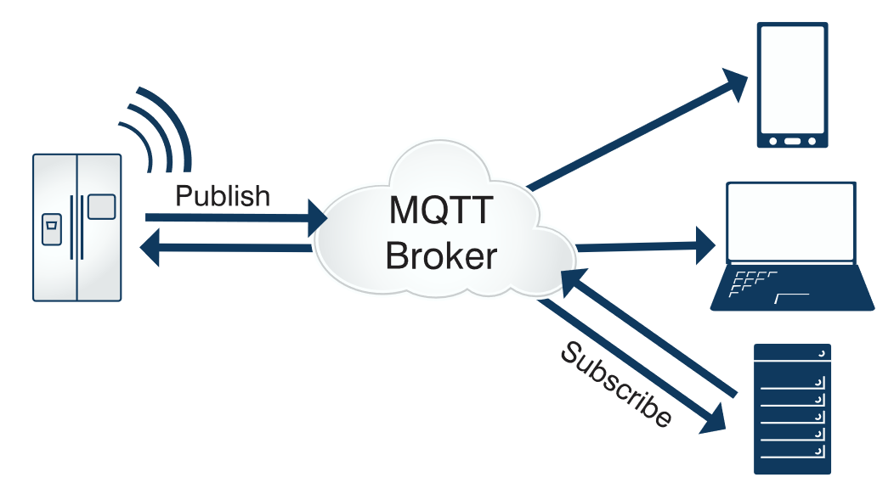 

一个使用MQTT协议的应用程序或者设备，它总是建立到服务器的网络连接。客户端可以：

- （1）发布其他客户端可能会订阅的信息； 
- （2）订阅其它客户端发布的消息； 
- （3）退订或删除应用程序的消息； 
- （4）断开与服务器连接。 

MQTT服务器以称为"消息代理"（Broker），可以是一个应用程序或一台设备。它是位于消息发布者和订阅者之间，它可以：

- （1）接受来自客户的网络连接； 
- （2）接受客户发布的应用信息； 
- （3）处理来自客户端的订阅和退订请求； 
- （4）向订阅的客户转发应用程序消息。 

#### 1.1.2 设计原则

由于物联网的环境是非常特别的，所以MQTT遵循以下设计原则： 

- （1）精简，不添加可有可无的功能； 
- （2）发布/订阅（Pub/Sub）模式，方便消息在传感器之间传递，解耦Client/Server模式，带来的好处在于不必预先知道对方的存在（ip/port），不必同时运行；
- （3）允许用户动态创建主题（不需要预先创建主题），零运维成本； 
- （4）把传输量降到最低以提高传输效率； 
- （5）把低带宽、高延迟、不稳定的网络等因素考虑在内； 
- （6）支持连续的会话保持和控制（心跳）； 
- （7）理解客户端计算能力可能很低； 
- （8）提供服务质量（ *quality of service level*：QoS）管理


- （9）不强求传输数据的类型与格式，保持灵活性（指的是应用层业务数据）。

#### 1.1.3 应用领域

MQTT协议广泛应用于物联网、移动互联网、智能硬件、车联网、电力能源等领域。

- 物联网M2M通信，物联网大数据采集
- Android消息推送，WEB消息推送
- 移动即时消息，例如Facebook Messenger
- 智能硬件、智能家居、智能电器
- 车联网通信，电动车站桩采集
- 智慧城市、远程医疗、远程教育
- 电力、石油与能源等行业市场

### 1.2 MQTT协议相关概念

#### 1.2.1 MQTT协议实现方式   

实现MQTT协议需要客户端和服务器端通讯完成，在通讯过程中，MQTT协议中有三种身份：发布者（Publisher）、代理（Broker）（服务器）、订阅者（Subscriber）。其中，消息的发布者和订阅者都是客户端，消息代理是服务器，消息发布者可以同时是订阅者。

MQTT传输的消息分为：主题（Topic）和负载（payload）两部分：

-  （1）Topic，可以理解为消息的类型，订阅者订阅（Subscribe）后，就会收到该主题的消息内容（payload）； 
-  （2）payload，可以理解为消息的内容，是指订阅者具体要使用的内容。 

#### 1.2.2 MQTT协议中的方法  

MQTT协议中定义了一些方法（也被称为动作），来于表示对确定资源所进行操作。这个资源可以代表预先存在的数据或动态生成数据，这取决于服务器的实现。通常来说，资源指服务器上的文件或输出。主要方法有：

-  （1）**CONNECT**：客户端连接到服务器
-  （2）CONNACK：连接确认
-  （3）**PUBLISH**：发布消息
-  （4）PUBACK：发布确认
-  （5）PUBREC：发布的消息已接收
-  （6）PUBREL：发布的消息已释放
-  （7）PUBCOMP：发布完成
-  （8）**SUBSCRIBE**：订阅请求
-  （9）SUBACK：订阅确认
-  （10）UNSUBSCRIBE：取消订阅
-  （11）UNSUBACK：取消订阅确认
-  （12）PINGREQ：客户端发送心跳
-  （13）PINGRESP：服务端心跳响应
-  （14）**DISCONNECT**：断开连接
-  （15）AUTH：认证


### 1.3 消息服务质量QoS

MQTT 协议中规定了消息服务质量（Quality of Service），它保证了在不同的网络环境下消息传递的可靠性，QoS 的设计是 MQTT 协议里的重点。作为专为物联网场景设计的协议，MQTT 的运行场景不仅仅是 PC，而是更广泛的窄带宽网络和低功耗设备，如果能在协议层解决传输质量的问题，将为物联网应用的开发提供极大便利。

#### 1.3.1 消息服务质量QoS三个等级 

MQTT 设计了 3 个 QoS 等级。

- QoS 0：消息最多传递一次，如果当时客户端不可用，则会丢失该消息。
- QoS 1：消息传递至少 1 次。
- QoS 2：消息仅传送一次。

   QoS0："至多一次"，消息发布完全依赖底层TCP/IP网络。会发生消息丢失或重复。这一级别可用于如下情况，环境传感器数据，丢失一次读记录无所谓，因为不久后还会有第二次发送。这一种方式主要普通APP的推送，倘若你的智能设备在消息推送时未联网，推送过去没收到，再次联网也就收不到了。

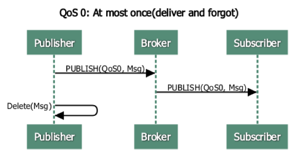


   QoS1："至少一次"，确保消息到达，但消息重复可能会发生。

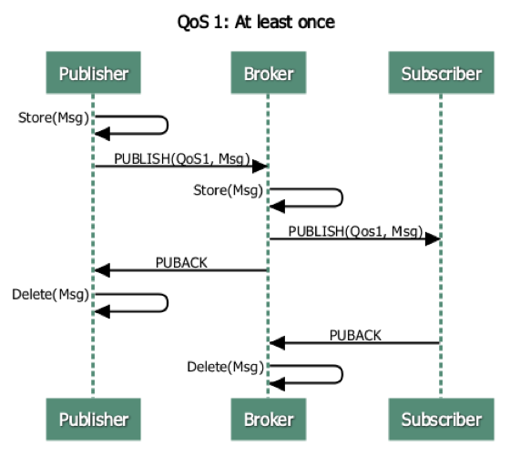


   QoS2："只有一次"，确保消息到达一次。在一些要求比较严格的计费系统中，可以使用此级别。在计费系统中，消息重复或丢失会导致不正确的结果。这种最高质量的消息发布服务还可以用于即时通讯类的APP的推送，确保用户收到且只会收到一次。

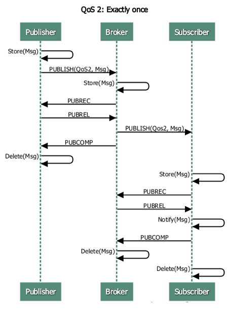

#### 1.3.2 发布与订阅QoS 

MQTT 发布与订阅操作中的 QoS 代表了不同的含义，发布时的 QoS 表示消息发送到服务端时使用的 QoS，订阅时的 QoS 表示服务端向自己转发消息时可以使用的最大 QoS。

- 当客户端 A 的发布 QoS 大于客户端 B 的订阅 QoS 时，服务端向客户端 B 转发消息时使用的 QoS 为客户端 B 的订阅 QoS。
- 当客户端 A 的发布 QoS 小于客户端 B 的订阅 QoS 时，服务端向客户端 B 转发消息时使用的 QoS 为客户端 A 的发布 QoS。

不同情况下客户端收到的消息 QoS 可参考下表：

| 发布消息的 QoS | 主题订阅的 QoS | 接收消息的 QoS |
| --------- | --------- | --------- |
| 0         | 0         | 0         |
| 0         | 1         | 0         |
| 0         | 2         | 0         |
| 1         | 0         | 0         |
| 1         | 1         | 1         |
| 1         | 2         | 1         |
| 2         | 0         | 0         |
| 2         | 1         | 1         |
| 2         | 2         | 2         |

### 1.4 Topic通配符匹配规则

层级分隔符：/

> **/ 用来分割主题树的每一层，并给主题空间提供分等级的结构。当两个通配符在一个主题中出现的时候，主题层次分隔符的使用是很重要的。**

```
示例：
love/you/with/all/my/heart
```

多层通配符：#

> **多层通配符有可以表示大于等于0的层次。因此，love/#也可匹配到单独的love，此时#代表0层。**


> **多层通配符一定要是主题树的最后一个字符。比如说，love/#是有效的，但是love/#/with是无效的。**

```
love/you/#	可匹配如下内容（包括但不限于）

love/you
love/you/with
love/you/with/all
love/you/with/all/my/heart
love/you/with/all/my/hearts
```

单层通配符：+

> **只匹配主题的一层。**

```
1. love/you/+  :匹配love/you/with和love/you/and，但是不匹配love/you/with/all/my/heart。
2. 单层通配符只匹配1层，love/+不匹配love。
3. 单层通配符可以被用于主题树的任意层级，连带多层通配符。它必须被用在主题层级分隔符/的右边，除非它是指定自己。因此，+和love/+都是有效的，但是love+无效。单层通配符可以用在主题树的末端，也可以用在中间。比如说，love/+和love/+/with都是有效。
```

注意事项

```
1.主题层次分隔符被用来在主题中引入层次。多层的通配符和单层通配符可以被使用，但他们不能被使用来做发布者的消息。
2.Topic命名尽量见名知意，符合规范，主题名字是大小写敏感的。比如说，love和LOVE是两个不同的主题。
3.以/开头会产生一个不同的主题。比如说，/love与love不同。/love匹配"+/+"和/+,但不匹配+
4.不要在任何主题中包含null（Unicode \x0000）字符。
5.在主题树中，长度被限制于64k内但是在这以内没有限制层级的数目 。
6.可以有任意数目的根节点；也就是说，可以有任意数目的主题树。
```


## 2. EMQX

### 2.1 EMQ X简介 

EMQ X 是开源社区中最流行的 MQTT 消息服务器。

EMQ官网：https://www.emqx.cn/

EMQ X 公司主要提供三个版本：开源版、企业版、平台版  可在官网首页产品导航查看每一种产品；主要体现在支持的连接数量、产品功能和商业服务等方面的区别。

**为什么选择EMQ X ?**从支持 MQTT5.0、稳定性、扩展性、集群能力等方面考虑，EMQX 的表现应该是最好的。

EMQ X 是开源百万级分布式 MQTT 消息服务器（MQTT Messaging Broker），用于支持各种接入标准 MQTT 协议的设备，实现从设备端到服务器端的消息传递，以及从服务器端到设备端的设备控制消息转发。从而实现物联网设备的数据采集，和对设备的操作和控制。

与别的MQTT服务器相比**EMQ X 主要有以下的特点：**

- 经过100+版本的迭代，EMQ X 目前为开源社区中最流行的 MQTT 消息中间件，在各种客户严格的生产环境上经受了严苛的考验；
- EMQ X 支持丰富的物联网协议，包括 MQTT、MQTT-SN、CoAP、 LwM2M、LoRaWAN 和 WebSocket 等；
- 优化的架构设计，支持超大规模的设备连接。企业版单机能支持百万的 MQTT 连接；集群能支持千万级别的 MQTT 连接；
- 易于安装和使用；
- 灵活的扩展性，支持企业的一些定制场景；
- 中国本地的技术支持服务，通过微信、QQ等线上渠道快速响应客户需求；

- 基于 Apache 2.0 协议许可，完全开源。EMQ X 的代码都放在 [Github](https://github.com/emqx/emqx) 中，用户可以查看所有源代码。

- EMQ X 3.0 支持 MQTT 5.0 协议，是开源社区中第一个支持 5.0协议规范的消息服务器，并且完全兼容 MQTT V3.1 和 V3.1.1 协议。除了 MQTT 协议之外，EMQ X 还支持别的一些物联网协议

- 单机支持百万连接，集群支持千万级连接；毫秒级消息转发。EMQ X 中应用了多种技术以实现上述功能，
  - 利用 Erlang/OTP 平台的软实时、高并发和容错（电信领域久经考验的语言）
  - 全异步架构
  - 连接、会话、路由、集群的分层设计
  - 消息平面和控制平面的分离等

- 扩展模块和插件，EMQ X 提供了灵活的扩展机制，可以实现私有协议、认证鉴权、数据持久化、桥接转发和管理控制台等的扩展

- 桥接：EMQ X 可以跟别的消息系统进行对接，比如 EMQ X Enterprise 版本中可以支持将消息转发到 Kafka、RabbitMQ 或者别的 EMQ 节点等

- 共享订阅：共享订阅支持通过负载均衡的方式在多个订阅者之间来分发 MQTT 消息。比如针对物联网等数据采集场景，会有比较多的设备在发送数据，通过共享订阅的方式可以在订阅端设置多个订阅者来实现这几个订阅者之间的工作负载均衡


### 2.2 环境搭建与配置 

#### 2.2.1 安装  

安装的方式有很多种，可供自由选择：

Shell脚本安装、包管理器安装、二进制包安装、ZIP压缩包安装、Homebrew安装、Docker运行安装、Helm安装、源码编译安装

**Docker运行安装**

在EMQ X Broker下载页面直接提供的有基于docker的安装命令

1：首先拉取emqx的镜像

```shell
[root@docker emqx]# docker pull emqx/emqx:v4.1.0
```

2：使用docker命令运行得到docker容器

```shell
[root@docker emqx]# docker run -tid --name emqx -p 1883:1883 -p 8083:8083 -p 8081:8081 -p 8883:8883 -p 8084:8084 -p 18083:18083  emqx/emqx:v4.1.0
```

EMQ X broker提供了Dashboard 以方便用户管理设备与监控相关指标，启动后我们通过访问服务端18083端口

地址：http://192.168.200.128:18083

访问Dashboard 查看启动效果!

* 账号：admin， 密码：public
* 
* 进入docker容器的目录中去（docker exec -it emqx /bin/sh）
* 2、运行docker容器（docker run -tid --name emqx -p 1883:1883 -p 8083:8083 -p 8081:8081 -p 8883:8883 -p 8084:8084 -p 18083:18083 emqx/emqx:v4.1.0）

#### 2.2.2 目录结构  

 不同安装方式得到的 EMQ X 其目录结构会有所不同，具体如下: 

| 描述                | 使用 ZIP 压缩包安装(同docker) | 使用二进制包安装               |
| ----------------- | --------------------- | ---------------------- |
| 可执行文件目录           | ./bin                 | /usr/lib/emqx/bin      |
| 数据文件              | ./data                | /var/lib/emqx/data     |
| Erlang 虚拟机文件      | ./erts-*              | /usr/lib/emqx/erts-*   |
| 配置文件目录            | ./etc                 | /etc/emqx              |
| 依赖项目录             | ./lib                 | /usr/lib/emqx/lib      |
| 日志文件              | ./log                 | /var/log/emqx          |
| 启动相关的脚本、schema 文件 | ./releases            | /usr/lib/emqx/releases |

以上目录中，用户经常接触与使用的是 `bin`、`etc`、`data`、`log` 目录。

**bin 目录**

*emqx、emqx.cmd*：EMQ X 的可执行文件

*emqx_ctl、emqx_ctl.cmd*：EMQ X 管理命令的可执行文件

**etc 目录**

EMQ X 通过 `etc` 目录下配置文件进行设置，主要配置文件包括:

| 配置文件           | 说明                            |
| -------------- | ----------------------------- |
| emqx.conf      | EMQ X 配置文件                    |
| acl.conf       | EMQ X 默认 ACL 规则配置文件           |
| plugins/*.conf | EMQ X 各类插件配置文件                |
| certs/*        | EMQ X SSL 证书文件                |
| emqx.lic       | License 文件仅限 EMQ X Enterprise |

**data 目录**

EMQ X 将运行数据存储在 `data` 目录下，主要的文件包括:

*configs/app.\*.config*

EMQ X 读取 `etc/emqx.conf` 和 `etc/plugins/*.conf` 中的配置后，转换为 Erlang 原生配置文件格式，并在运行时读取其中的配置。

*loaded_plugins*

`loaded_plugins` 文件记录了 EMQ X 默认启动的插件列表，可以修改此文件以增删默认启动的插件。

```properties
$ cat loaded_plugins
emqx_management.
emqx_recon.
emqx_retainer.
emqx_dashboard.
emqx_rule_engine.
emqx_web_hook.
```

*mnesia*

Mnesia 数据库是 Erlang 内置的一个分布式 DBMS，可以直接存储 Erlang 的各种数据结构。

EMQ X 使用 Mnesia 数据库存储自身运行数据，例如告警记录、规则引擎已创建的资源和规则、Dashbaord 用户信息等数据，这些数据都将被存储在 `mnesia` 目录下，因此一旦删除该目录，将导致 EMQ X 丢失所有业务数据。

### 2.3 Dashboard

#### 2.3.1 功能简介

 EMQ X 提供了 Dashboard 以方便用户管理设备与监控相关指标。通过  Dashboard可以查看服务器基本信息、负载情况和统计数据，可以查看某个客户端的连接状态等信息甚至断开其连接，也可以动态加载和卸载指定插件。除此之外，EMQ X Dashboard 还提供了规则引擎的可视化操作界面，同时集成了一个简易的 MQTT 客户端工具供用户测试使用。 

EMQ X Dashboard 是一个 Web 应用程序，你可以直接通过浏览器来访问它，无需安装任何其他软件。

当 EMQ X 成功运行在你的本地计算机上且 EMQ X Dashboard 被默认启用时，

* 通过访问 http://localhost:18083 来查看Dashboard，默认用户名是 `admin`，密码是 `public`。

为了使用户在操作和浏览中可以快速地定位和切换当前位置，EMQ X Dashboard 采用了侧边导航的模式，默认情况下 Dashboard 包含以下一级导航项目：  

> 最新版本EMQ X Broker的Dashboard界面布局略有不同，增加了些导航，但基本都差不多

| 导航项目        | 说明                                  |
| ----------- | ----------------------------------- |
| Monitor     | 提供了服务端与客户端监控信息的展示页面                 |
| RULE ENGINE | 提供了规则引擎的可视化操作页面                     |
| MANAGEMENT  | 提供了扩展插件与应用的管理页面                     |
| TOOLS       | 提供了 WebSocket 客户端工具以及 HTTP API 速查页面 |
| ADMIN       | 提供了 Dashboard 用户管理和显示设置等页面          |

#### 2.3.2 Websocket发布订阅测试


### 2.4 客户端调试工具MQTTX

[MQTT X](https://mqttx.app/cn) 是 [EMQ](http://emqx.cn/) 开源的一款优雅的跨平台 MQTT 5.0 桌面客户端，它支持 macOS, Linux, Windows。

[MQTT X](https://mqttx.app/cn) 的 `UI` 采用了聊天界面形式，简化了页面操作逻辑，用户可以快速创建连接，允许保存多个客户端，方便用户快速测试 `MQTT/MQTTS` 连接，及 `MQTT` 消息的订阅和发布。

* 发布者、订阅者、代理人。

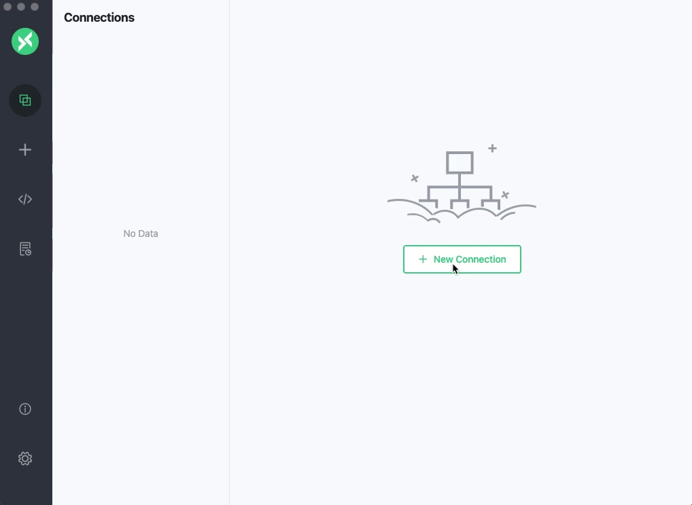

https://mqttx.app/cn

## 3.延迟发布 

### 3.1 简介 

EMQ X 的延迟发布功能可以实现按照用户配置的时间间隔延迟发布 PUBLISH 报文的功能。当客户端使用特殊主题前缀 `$delayed/{DelayInteval}` 发布消息到 EMQ X 时，将触发延迟发布功能。延迟发布的功能是针对消息发布者而言的，订阅方只需要按照正常的主题订阅即可。

> 应用场景举例说明：
>
> 某智能售货机平台在双十一当天要对设备中所有商品做5折销售，双十一过去之后要立马恢复原价，为了满足这样的场景，我们可以在双十一0点给所有设备发送两条消息，一条消息是通过正常的主题发送，消息内容打5折；第二条消息延迟消息，延迟24小时，消息内容是恢复原价。这样在一个实现中可以完成两个业务场景。

延迟发布主题的具体格式如下：

```properties
$delayed/{DelayInterval}/{TopicName}
```

- `$delayed`: 使用 `$delayed` 作为主题前缀的消息都将被视为需要延迟发布的消息。延迟间隔由下一主题层级中的内容决定。
- `{DelayInterval}`: 指定该 MQTT 消息延迟发布的时间间隔，单位是秒，允许的最大间隔是 4294967 秒。如果 `{DelayInterval}` 无法被解析为一个整型数字，EMQ X 将丢弃该消息，客户端不会收到任何信息。
- `{TopicName}`: MQTT 消息的主题名称。

> 例如:
>
> `$delayed/15/x/y`: 15 秒后将 MQTT 消息发布到主题 `x/y`。
>
> `$delayed/60/a/b`: 1 分钟后将 MQTT 消息发布到 `a/b`。
>
> `$delayed/3600/mytopic`: 1 小时后将 MQTT 消息发布到 `mytopic`。

 **此功能由 `emqx_mod_delayed` 模块提供，需要开启模块后才能使用此功能。**

### 3.2 演示   

1：直接在Dashboard上订阅主题：`t2/a`

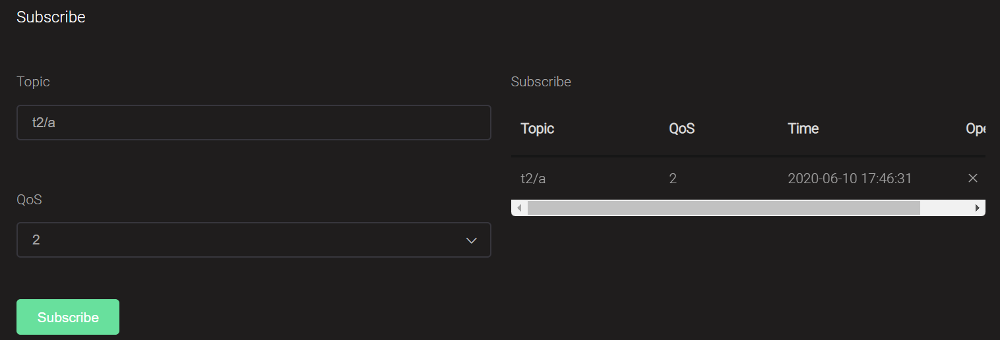

然后在Dashboard上向主题：`$delayed/10/t2/a`发送消息

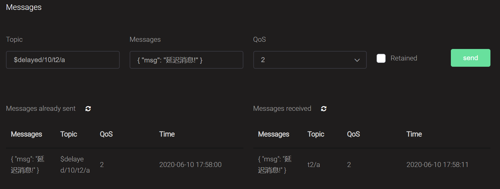

## 4.共享订阅 

共享订阅是在多个订阅者之间实现负载均衡的订阅方式：

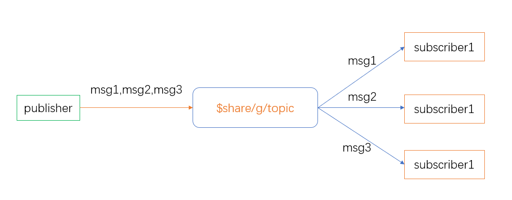

上图中，3 个 subscriber 用共享订阅的方式订阅了同一个主题 `$share/g/topic`，其中`topic` 才是它们订阅的真实主题名，而  `$share/g/` 只是共享订阅前缀。 

 EMQ X 支持两种格式的共享订阅前缀： 

| 示例           | 前缀                         | 真实主题名 |
| -------------- | ---------------------------- | ---------- |
| $queue/t/1     | $queue/       （非群组方式） | t/1        |
| $share/abc/t/1 | $share/abc     （群组方式）  | t/1        |

注意：共享订阅的主题格式是针对订阅端来指定的，例如：`$share/g/t/a`；而消息的发布方是向主题：`t/a`发布消息。这样在订阅方才能达到负载均衡的效果。

**应用场景举例说明：**

某智能售货机平台下在全国有50万台售货机设备，在实际运营过程中平均每秒中会收到5万台设备上报过来的出货结果数据，假如用普通主题订阅来处理的话，消息的消费节点会有5万的并发，极有可能会导致该节点宕机，造成出货数据的丢失，对后续结算等业务操作造成极大困扰；如果只是简单增加消费节点的话也无法解决该问题，因为每个节点都会收到所有同样的数据，在这种业务场景下我们，我们希望通过增加消费节点并且节点之间是分摊消息的消费，以此来增强整个系统的负载能力和可用性，那我们就可以通过共享订阅来满足这种业务场景。

### 4.1 不带群组的共享订阅   

 **以 `$queue/` 为前缀的共享订阅是不带群组的共享订阅** 

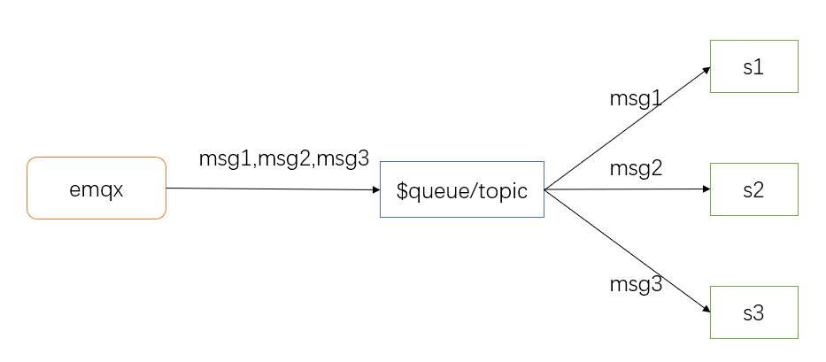

**演示：**


我们还是在Dashboard的Websocket工具里发布消息：          （创建三个客户端，用来订阅$queue/t1/a）

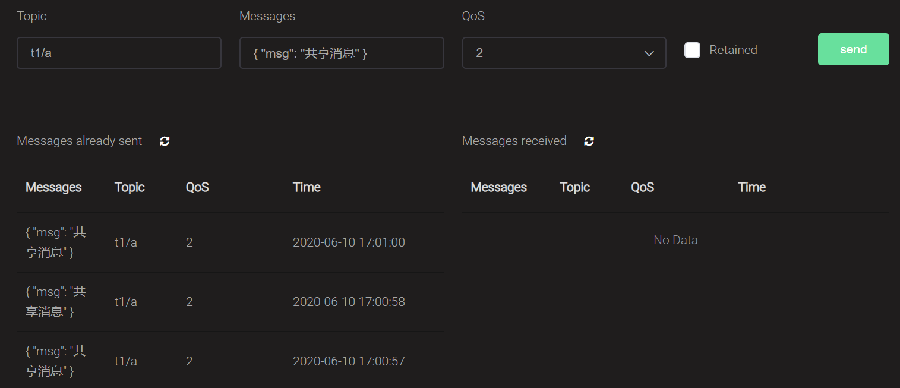

查看客户端消息的接收情况 

EMQ X 的共享订阅支持均衡策略配置：etc/emqx.conf 

```properties
# 均衡策略
## Dispatch strategy for shared subscription
##                   
## Value: Enum
## - random                                
## - round_robin
## - sticky   
## - hash                                                             
broker.shared_subscription_strategy = random             -- 在所有订阅者中，随机选择一个发送。  默认值改成轮训的。

//  设置完成后，进入bin目录下面         执行emqx restart    重启一下这个broker程序。。
```

| 均衡策略    | 描述                                |
| :---------- | :---------------------------------- |
| random      | 在所有订阅者中随机选择              |
| round_robin | 按照订阅顺序轮询-------------轮训。 |
| sticky      | 一直发往上次选取的订阅者            |
| hash        | 按照发布者 ClientID 的哈希值        |

### 4.2 带群组的共享订阅  

 **以 `$share/<group-name>` 为前缀的共享订阅是带群组的共享订阅** 

group-name 可以为任意字符串，属于同一个群组内部的订阅者将以负载均衡接收消息，但 EMQ X 会向不同群组广播消息。

例如，假设订阅者 s1，s2，s3 属于群组 g1，订阅者 s4，s5 属于群组 g2。那么当 EMQ X 向这个主题发布消息 msg1 的时候：

- EMQ X 会向两个群组 g1 和 g2 同时发送 msg1
- s1，s2，s3 中只有一个会收到 msg1
- s4，s5 中只有一个会收到 msg1 

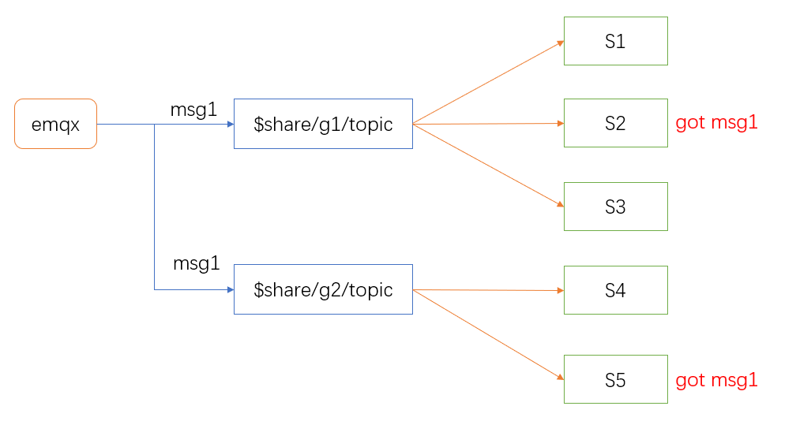

**案例演示：**

通过MQTTX 客户端工具新增五个连接，分别是s1、s2、s3、s4、s5  

s1、s2、s3 以群组方式订阅主题  $share/g1/topic 

s4、s5  以群组方式订阅主题  $share/g2/topic 

通过emq的websocket工具发送消息到主题  topic，此时g1和g2分别会有一个订阅者会收到消息。（g1和g2就是两个组了。）


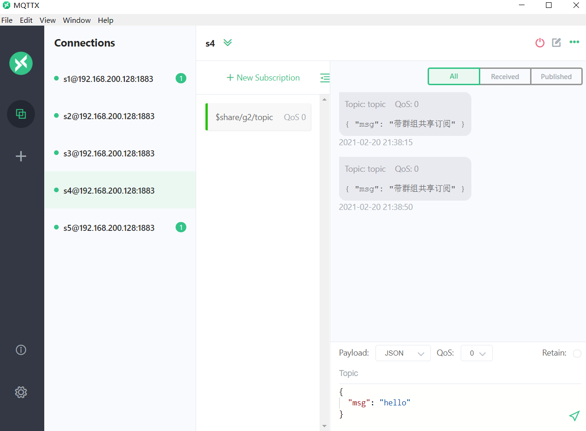


## 5.代理订阅

### 5.1 代理订阅应用场景

**EMQ X 的代理订阅功能使得客户端在连接建立时，不需要发送额外的 SUBSCRIBE 报文，便能自动建立用户预设的订阅关系。** 

> 应用场景举例说明：
>
> 某冷链平台下有大量的冷链运输车，前期车上只配备了温度传感器，将车内的温度数据通过物联网终端经过EMQ定期上报给指标采集系统，由该系统将相关数据透传到一个大数据分析平台，用来分析这些温度数据，后来车上又配置了湿度传感器，这些湿度信息也会上报到EMQ，大数据平台也需要分析这些湿度信息，此时我们的指标采集系统就需要再单独开发一套订阅湿度信息的代码，如果我们采用代理订阅的话就无需再开发这块代码，只需经过简单的配置就可以增加这个功能了。

### 5.2 代理订阅配置

EMQ X 通过内置代理订阅模块就可以通过配置文件来指定代理订阅规则从而实现代理订阅，适用于有规律可循的静态的代理订阅需求。

默认是关闭的，我们需要开启该模块

* 命令开启：etc/emqx.conf 文件中module.subscription配置项：
* module.subscription = off     将off开启为on 。

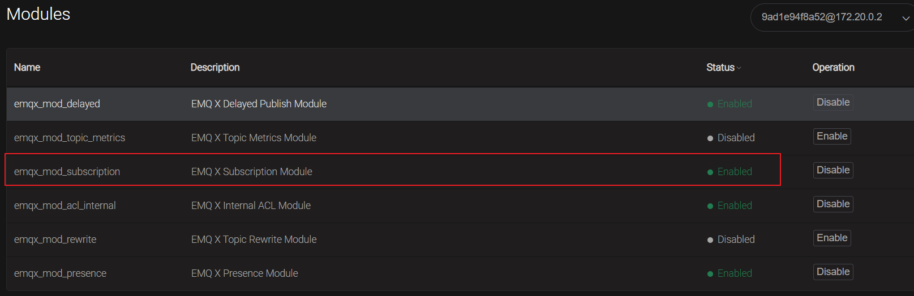

仅仅开启并不意味代理订阅已经工作，你还需要配置相应的规则，EMQ X 的代理订阅规则支持用户自行配置，用户可以自行添加多条代理订阅规则，每条代理订阅规则都需要指定 Topic 和 QoS，规则的数量没有限制，在 `etc/emqx.conf` 文件中添代理订阅规则的格式如下： 

```properties
module.subscription.<number>.topic = <topic>
module.subscription.<number>.qos = <qos>
```

在配置代理订阅的主题时，EMQ X 提供了 `%c` 和 `%u` 两个占位符供用户使用，EMQ X 会在执行代理订阅时将配置中的 `%c` 和 `%u` 分别替换为客户端的 `Client ID` 和 `Username`，需要注意的是，`%c` 和 `%u` 必须占用一整个主题层级。

例如，在 `etc/emqx.conf` 文件中添加以下代理订阅规则：

* 这个规则添加到哪里呢？？？添加到文件哪里呢？emqx.conf

* 1、打开etc/emqx.conf 这个配置文件后； 在vi里面 /module.subscription搜索到这里。

* 2、添加下面的配置。

* 3、client/%c      会自动的将%c替换为客户端的Client ID       、 消息的发送端主题（Topic）必须是client/   clientID ，  相应的客户端client才能接受到广播发来的信息。。client/mqttjs_7b6be8c116

  

```properties
module.subscription.1.topic = client/%c    
module.subscription.1.qos = 1

module.subscription.2.topic = user/%u    
module.subscription.2.qos = 2

module.subscription.3.topic = testtopic/#
module.subscription.3.qos = 2

module.subscription.4.topic = abc
module.subscription.4.qos = 2
```

 当一个客户端连接 EMQ X 的时候，假设客户端的 `Client ID` 为 `testclient`，`Username` 为 `tester`，根据上文的配置规则，代理订阅功能会主动帮客户端订阅 QoS 为 1 的 `client/testclient` 和 QoS 为 2 的 `user/tester` 这两个主题。 

* 自己理解，终端通上电后，自动连接主题（Topic），  发布者通过预先分配的Client ID，可以给指定ID或者分类的发送消息。。

* 修改配置文件后：cd ../bin         emqx   restart   重启。    然后mqtt才能生效。

！ 这些配置都是基于配置文件实现的**静态代理订阅**，开源版本的EMQ X目前只支持这种静态代理订阅，收费的 EMQ X Enterprise 版本中支持**动态代理订阅**，通过外部数据库设置主题列表在设备连接时读取列表实现代理订阅。 

## 6. 保留消息 

### 6.1 保留消息应用场景

服务端收到 Retain 标志为 1 的 PUBLISH 报文时，会将该报文视为保留消息，除了被正常转发以外，保留消息会被存储在服务端，每个主题下只能存在一份保留消息，因此如果已经存在相同主题的保留消息，则该保留消息被替换。

当客户端建立订阅时，如果服务端存在主题匹配的保留消息，则这些保留消息将被立即发送给该客户端（上一次发送但没有被接收的消息Messages，如果想接收多个messages呢？多个的话前面覆盖后面的messages！！！）。借助保留消息，新的订阅者能够立即获取最近的状态，而不需要等待无法预期的时间，这在很多场景下非常重要的。

EMQ X 默认开启保留消息的功能，可以在 `etc/emqx.conf` 中修改 `mqtt.retain_available` 为 `false` 以禁用保留消息功能。如果 EMQ X 在保留消息功能被禁用的情况下依然收到了保留消息，那么将返回原因码为 0x9A（不支持保留消息）的 DISCONNECT 报文。

**应用场景举例：**

某车联网项目，车辆出租公司会实时监控所有车辆的GPS地理位置信息，这些信息是通过每个车辆每10分钟定时上报的GPS信息，这些信息需要展示在某调度系统的大屏上，该调度系统因为其他模块升级需要重新部署，升级后也需要去订阅获取所有车辆的GPS信息，上线完成后刚好错过了车辆最近一次上报的GPS信息，如果这些消息不是保留消息，该调度系统大屏上是空白的，必须等10分钟后才能调度这些车辆，10分钟内无法做出任何操作，用户体验非常差，但是如果这些信息是保留消息，该系统上线后立即就会收到最近所有车辆的位置信息，立即就可以展示然后进行调度。

### 6.2 保留消息配置 

EMQ X 的保留消息功能是由 `emqx_retainer` 插件实现，该插件默认开启，通过修改 `emqx_retainer` 插件的配置，可以调整 EMQ X 储存保留消息的位置，限制接收保留消息数量和 Payload 最大长度，以及调整保留消息的过期时间。

* Retainer  保留消息的意思。

`emqx_retainer` 插件默认开启，插件的配置路径为 `etc/plugins/emqx_retainer.conf`。

* emqx_retainer.conf该文件中的几个配置项。
* 

| 配置项                         | 类型     | 可取值                     | 默认值 | 说明                                                         |
| ------------------------------ | -------- | -------------------------- | ------ | ------------------------------------------------------------ |
| retainer.storage_type          | enum     | `ram`, `disc`, `disc_only` | ram    | ram：仅储存在内存中；disc：储存在内存和硬盘中；disc_only：仅储存在硬盘中。 |
| retainer.max_retained_messages | integer  | >= 0                       | 0      | 保留消息的最大数量（限制了有多少个主题可以保留消息。），0 表示没有限制。保留消息数量超出最大值限制后，可以替换已存在的保留消息，但不能为新的主题储存保留消息。 |
| retainer.max_payload_size      | bytesize |                            | 1MB    | 保留消息的最大 Payload 值。Payload 大小超出最大值后 EMQ Ｘ 消息服务器会把收到的保留消息作为普通消息处理。（消息的容量。） |
| retainer.expiry_interval       | duration |                            | ０     | 保留消息的过期时间，0 表示永不过期。如果 PUBLISH 报文中设置了消息过期间隔，那么以 PUBLISH 报文中的消息过期间隔为准。单位：毫秒（！！！） |

EMQ X Enterprise 中可将保留消息存储到多种外部数据库。

## 7.认证

### 7.1 认证简介

​	身份认证是大多数应用的重要组成部分，MQTT 协议支持用户名密码认证，启用身份认证能有效阻止非法客户端的连接。EMQ X 中的认证指的是当一个客户端连接到 EMQ X 的时候，通过服务器端的配置来控制客户端连接服务器的权限。

​	EMQ X 支持使用内置数据源（文件、内置数据库）、JWT、外部主流数据库和自定义 HTTP API 作为身份认证数据源。连接数据源、进行认证逻辑通过插件实现的，每个插件对应一种认证方式，使用前需要启用相应的插件。

​	客户端连接时插件通过检查其 username/clientid 和 password 是否与指定数据源的信息一致来实现对客户端的身份认证。

#### 7.1.1 认证方式

EMQ X 支持的认证方式：

*内置数据源*

- Username 认证（即将废弃）
- Cliend ID 认证（即将废弃）

使用配置文件与 EMQ X 内置数据库提供认证数据源，通过 HTTP API 进行管理，足够简单轻量。

*外部数据库*

- LDAP 认证
- MySQL 认证
- PostgreSQL 认证
- Redis 认证
- MongoDB 认证

外部数据库可以存储大量数据，同时方便与外部设备管理系统集成。

*其他*

- HTTP 认证
- JWT 认证

JWT 认证可以批量签发认证信息，HTTP 认证能够实现复杂的认证鉴权逻辑。

更改插件配置后需要重启插件才能生效，部分认证鉴权插件包含 ACL 功能

#### 7.1.2 认证结果与匿名认证

**认证结果**

任何一种认证方式最终都会返回一个结果：

- 认证成功：经过比对客户端认证成功
- 认证失败：经过比对客户端认证失败，数据源中密码与当前密码不一致
- 忽略认证（ignore）：当前认证方式中未查找到认证数据，无法显式判断结果是成功还是失败，交由认证链下一认证方式或匿名认证来判断

**匿名认证**

EMQ X 默认配置中启用了匿名认证，任何客户端都能接入 EMQ X。没有启用认证插件或认证插件没有显式允许/拒绝（ignore）连接请求时，EMQ X 将根据匿名认证启用情况决定是否允许客户端连接。

配置匿名认证开关：

```properties
# etc/emqx.conf

## Value: true | false
allow_anonymous = true
```

生产环境中请禁用匿名认证。！！！！！！！！！！！！

注意：我们需要进入到容器内部修改该配置，然后重启EMQ X服务

### 7.2 HTTP认证

HTTP 认证使用外部自建 HTTP 应用认证数据源，根据 HTTP API 返回的数据判定认证结果，能够实现复杂的认证鉴权逻辑。启用该功能需要将`emqx_auth_http`插件启用，并且修改该插件的配置文件，在里面指定HTTP认证接口的url。`emqx_auth_http`插件同时还包含了ACL的功能。

EMQ X 在设备连接事件中使用当前客户端相关信息作为参数，向用户自定义的认证服务发起请求查询权限，通过返回的 HTTP **响应状态码** (HTTP statusCode) 来处理认证请求。

- 认证失败：API 返回 4xx 状态码
- 认证成功：API 返回 200 状态码
- 忽略认证：API 返回 200 状态码且消息体 ignore

#### 7.2.1 认证请求配置

进行身份认证时，EMQ X 将使用当前客户端信息填充并发起用户配置的认证查询请求，查询出该客户端在 HTTP 服务器端的认证数据。

打开etc/plugins/emqx_auth_http.conf-------------配置文件，通过修改如下内容：修改完成后需要重启EMQX服务

```properties
# etc/plugins/emqx_auth_http.conf

## 请求地址
auth.http.auth_req = http://192.168.200.0:8991/mqtt/auth

## HTTP 请求方法
## Value: post | get | put
auth.http.auth_req.method = post

## 请求参数
auth.http.auth_req.params = clientid=%c,username=%u,password=%P
```

HTTP 请求方法为 GET 时，请求参数将以 URL 查询字符串的形式传递；POST、PUT 请求则将请求参数以普通表单形式提交（content-type 为 x-www-form-urlencoded）。

你可以在认证请求中使用以下占位符，请求时 EMQ X 将自动填充为客户端信息：

- %u：用户名
- %c：Client ID
- %a：客户端 IP 地址
- %r：客户端接入协议
- %P：明文密码
- %p：客户端端口
- %C：TLS 证书公用名（证书的域名或子域名），仅当 TLS 连接时有效
- %d：TLS 证书 subject，仅当 TLS 连接时有效

推荐使用 POST 与 PUT 方法，使用 GET 方法时明文密码可能会随 URL 被记录到传输过程中的服务器日志中。

#### 7.2.2 认证服务开发

创建基于springboot的应用程序：`emq-demo`

1：相关坐标如下：

```xml
<parent>
    <groupId>org.springframework.boot</groupId>
    <artifactId>spring-boot-starter-parent</artifactId>
    <version>2.3.0.RELEASE</version>
    <relativePath/> <!-- lookup parent from repository -->
</parent>
<groupId>com.itheima</groupId>
<artifactId>emq-demo</artifactId>
<version>0.0.1-SNAPSHOT</version>
<name>emq-demo</name>
<description>emq demo演示</description>

<properties>
    <java.version>1.8</java.version>
</properties>

<dependencies>
    <dependency>
        <groupId>org.springframework.boot</groupId>
        <artifactId>spring-boot-starter-web</artifactId>
    </dependency>

    <dependency>
        <groupId>org.springframework.boot</groupId>
        <artifactId>spring-boot-devtools</artifactId>
        <scope>runtime</scope>
        <optional>true</optional>
    </dependency>
    <dependency>
        <groupId>org.springframework.boot</groupId>
        <artifactId>spring-boot-configuration-processor</artifactId>
        <optional>true</optional>
    </dependency>
    <dependency>
        <groupId>org.springframework.boot</groupId>
        <artifactId>spring-boot-starter-test</artifactId>
        <scope>test</scope>
        <exclusions>
            <exclusion>
                <groupId>org.junit.vintage</groupId>
                <artifactId>junit-vintage-engine</artifactId>
            </exclusion>
        </exclusions>
    </dependency>
</dependencies>

<build>
    <plugins>
        <plugin>
            <groupId>org.springframework.boot</groupId>
            <artifactId>spring-boot-maven-plugin</artifactId>
        </plugin>
    </plugins>
</build>
```

2：创建application.yml配置文件并配置

```yaml
server:
  port: 8991
spring:
  application:
    name: emq-demo 
```

3：创建Controller：com.itheima.controller.mqtt.AuthController；编写如下

```java
/**
 * Created by 传智播客*黑马程序员.
 */
@RestController
@RequestMapping("/mqtt")
public class AuthController {
    
    private Logger log = LoggerFactory.getLogger(AuthController.class);
    
    private Map<String,String> users;
    
    @PostConstruct
    public void init(){
        users = new HashMap<>();
        users.put("user","123456");//实际的密码应该是密文,mqtt的http认证组件传输过来的密码是明文，我们需要自己进行加密验证
        users.put("emq-client2","123456");
        users.put("emq-client3","123456");
    }
    
    @PostMapping("/auth")
    public ResponseEntity<?> auth(@RequestParam("clientid") String clientid, 
                                  @RequestParam("username") String username, 
                                  @RequestParam("password") String password){
        log.info("emqx认证组件调用自定义的认证服务开始认证,clientid={},username={},password={}",clientid,username,password);
        //在此处可以进行复杂也的认证逻辑,但是我们为了演示方便做一个固定操作
        String value = users.get(username);
        if(StringUtils.isEmpty(value)){
            return new ResponseEntity<Object>(HttpStatus.UNAUTHORIZED);
        }
        if(!value.equals(password)){
            return new ResponseEntity<Object>(HttpStatus.UNAUTHORIZED);
        }
        return new ResponseEntity<Object>(HttpStatus.OK);
    }
}
```

## 8.ACL

### 8.1 ACL简介

ACL是指对发布(publish)/订阅(subscribe)操作的权限控制。例如拒绝用户`emq-demo`向`testTopic/a`主题发布消息。 EMQ X 支持通过客户端发布订阅 ACL 进行客户端权限的管理。

#### 8.1.1 ACL 插件

 EMQ X 支持使用配置文件、外部主流数据库和自定义 HTTP API 作为 ACL 数据源。

连接数据源、进行访问控制功能是通过插件实现的，使用前需要启用相应的插件。

客户端订阅主题、发布消息时插件通过检查目标主题（Topic）是否在指定数据源允许/禁止列表内来实现对客户端的发布、订阅权限管理。

**配置文件**

- 内置 ACL

使用配置文件提供认证数据源，适用于变动较小的 ACL 管理。

**外部数据库**

- MySQL ACL
- PostgreSQL ACL
- Redis ACL
- MongoDB ACL

外部数据库可以存储大量数据、动态管理 ACL，方便与外部设备管理系统集成。

**其他**

- HTTP ACL

HTTP ACL 能够实现复杂的 ACL 管理。

> ACL 功能包含在认证鉴权插件中，更改插件配置后需要**重启插件**才能生效，

#### 8.1.2 授权结果与全局配置

任何一次 ACL 授权最终都会返回一个结果：

- 允许：经过检查允许客户端进行操作
- 禁止：经过检查禁止客户端操作
- 忽略（ignore）：未查找到 ACL 权限信息（no match），无法显式判断结果是允许还是禁止，交由下一 ACL 插件或默认 ACL 规则来判断

默认配置中 ACL 是开放授权的，即授权结果为**忽略（ignore）**时**允许**客户端通过授权。

通过 `etc/emqx.conf` 中的 ACL 配置可以更改该属性：

```properties
# etc/emqx.conf

## ACL 未匹配时默认授权
## Value: allow | deny
acl_nomatch = allow
```

在生产环境我们需要修改全局配置文件中关于acl的配置，将`acl_nomatch`配置项的值改为：`deny`

完成配置后使用`emqx restart`重启emqx broker服务

#### 8.1.3 ACL 鉴权链 

当同时启用多个 ACL 插件时，EMQ X 将按照插件开启先后顺序进行链式鉴权：

- 一通过授权，终止链并允许客户端通过验证

- 一旦授权失败，终止链并禁止客户端通过验证

- 直到最后一个 ACL 插件仍未通过，根据

  默认授权

  配置判定

  - 默认授权为允许时，允许客户端通过验证
  - 默认授权为禁止时，禁止客户端通过验证

同时只启用一个 ACL 插件可以提高客户端 ACL 检查性能。

#### 8.1.4 超级用户

 客户端在进行认证的时候客户端可拥有“超级用户”身份，超级用户拥有最高权限不受 ACL 限制。 

- 认证鉴权插件启用超级用户功能后，发布订阅时 EMQ X 将优先检查客户端超级用户身份
- 客户端为超级用户时，通过授权并跳过后续 ACL 检查

### 8.2 HTTP ACL

HTTP 认证使用外部自建 HTTP 应用认证授权数据源，根据 HTTP API 返回的数据判定授权结果，能够实现复杂的 ACL 校验逻辑。

插件：

```properties
emqx_auth_http
```

> 注意：emqx_auth_http 插件同时包含认证功能，可通过注释禁用。

EMQ X 在设备发布、订阅事件中使用当前客户端相关信息作为参数，向用户自定义的认证服务发起请求权限，通过返回的 HTTP **响应状态码** (HTTP statusCode) 来处理 ACL 授权请求。

- 无权限：API 返回 4xx 状态码
- 授权成功：API 返回 200 状态码
- 忽略授权：API 返回 200 状态码且消息体 ignore

#### 8.2.1 ACL配置 

首先查询客户端是否为超级用户，客户端为超级用户时将跳过 ACL 查询。

```properties
# etc/plugins/emqx_auth_http.conf
####使用vi编辑该配置，修改URL请求地址

##--------------------------------------------------------------------
## Superuser request.
##
## Variables:
##  - %u: username
##  - %c: clientid
##  - %a: ipaddress
##  - %r: protocol
##  - %P: password
##  - %p: sockport of server accepted
##  - %C: common name of client TLS cert
##  - %d: subject of client TLS cert
##
## Value: URL 请求地址
auth.http.super_req = http://192.168.200.1:8991/mqtt/superuser
## Value: post | get | put 请求方法
auth.http.super_req.method = post
## Value: Params 请求参数
auth.http.super_req.params = clientid=%c,username=%u
```

ACL请求的配置

```properties
# etc/plugins/emqx_auth_http.conf
####使用vi编辑该配置，修改URL请求地址以及请求方式

##--------------------------------------------------------------------
## ACL request.
##
## Variables:
##  - %A: 1 | 2, 1 = sub, 2 = pub
##  - %u: username
##  - %c: clientid
##  - %a: ipaddress
##  - %r: protocol
##  - %m: mountpoint
##  - %t: topic
##
## Value: URL
auth.http.acl_req = http://192.168.200.1:8991/mqtt/acl
## Value: post | get | put
auth.http.acl_req.method = post
## Value: Params
auth.http.acl_req.params = access=%A,username=%u,clientid=%c,ipaddr=%a,topic=%t,mountpoint=%m
```

**请求说明**

HTTP 请求方法为 GET 时，请求参数将以 URL 查询字符串的形式传递；POST、PUT 请求则将请求参数以普通表单形式提交（content-type 为 x-www-form-urlencoded）。

你可以在认证请求中使用以下占位符，请求时 EMQ X 将自动填充为客户端信息：

- %u：用户名
- %c：Client ID
- %a：客户端 IP 地址
- %r：客户端接入协议
- %P：明文密码
- %p：客户端端口
- %C：TLS 证书公用名（证书的域名或子域名），仅当 TLS 连接时有效
- %d：TLS 证书 subject，仅当 TLS 连接时有效
- %m：topic的安装点，是桥接的连接属性

推荐使用 POST 与 PUT 方法，使用 GET 方法时明文密码可能会随 URL 被记录到传输过程中的服务器日志中。

#### 8.2.2 HTTP ACL接口开发  

在原有的项目`emq-demo`中我们已经开发了基于HTTP API的认证Controller：`AuthController`，按照我们的请求URL配置，我们需要在该Controller中添加两个接口方法，一个是用于查询superuser的，一个是用于进行ACL授权查询的，这两个方法分别如下：

1：查询客户端是否为超级用户，

```java
@PostMapping("/superuser")
public ResponseEntity<?> superUser(@RequestParam("clientid") String clientid,
                                   @RequestParam("username") String username){
    log.info("emqx 查询是否是超级用户,clientid={},username={}",clientid,username);
    if(clientid.contains("admin") || username.contains("admin")){
        log.info("用户{}是超级用户",username);
        //是超级用户
        return new ResponseEntity<Object>(HttpStatus.OK);
    }else {
         log.info("用户{}不是超级用户",username);
        //不是超级用户
        return new ResponseEntity<Object>(HttpStatus.UNAUTHORIZED);
    }
}
```

注意，我们在初始化方法init中添加一个超级用户：admin/admin

```java
@PostConstruct
public void init(){
    users = new HashMap<>();
    users.put("user","123456");
    users.put("emq-client2","123456");
    users.put("emq-client3","123456");
    users.put("admin","admin");
}
```

同理：API返回200状态码代表是超级用户，API返回4XX状态码则不是超级用户

2：ACL 授权查询请求

```java
@PostMapping("/acl")
public ResponseEntity acl(@RequestParam("access")int access,
                          @RequestParam("username")String username,
                          @RequestParam("clientid")String clientid,
                          @RequestParam("ipaddr")String ipaddr,
                          @RequestParam("topic")String topic,
                          @RequestParam("mountpoint")String mountpoint){

    log.info("EMQX发起客户端操作授权查询请求,access={},username={},clientid={},ipaddr={},topic={},mountpoint={}",
             access,username,clientid,ipaddr,topic,mountpoint);

    if(username.equals("emq-client2") && topic.equals("testtopic/#") && access == 1){
        log.info("客户端{}有权限订阅{}",username,topic);
        return new ResponseEntity<>(HttpStatus.OK);
    }

    if(username.equals("emq-client3") && topic.equals("testtopic/123") && access == 2){
        log.info("客户端{}有权限向{}发布消息",username,topic);
        return new ResponseEntity<>(null, HttpStatus.OK);
    }

    log.info("客户端{},username={},没有权限对主题{}进行{}操作",clientid,username,topic,access==1?"订阅":"发布");
    return new ResponseEntity(HttpStatus.UNAUTHORIZED);//无权限
}
```

在这个方法中我们设置了：

只有用户名为`emq-client2`的客户端能够去订阅`testtopic/#`的权限其他客户端都不可以

只有用户名为`emq-client3`的客户端能够向`testtopic/123`发布消息的权限其他都没有

