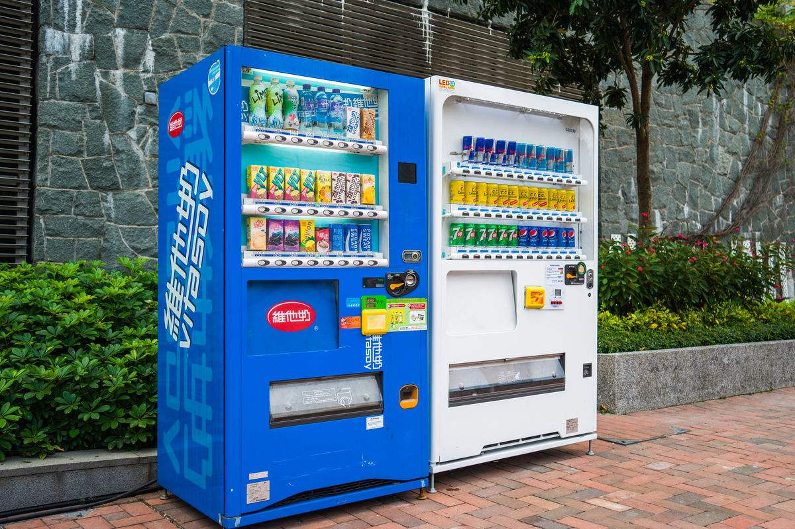
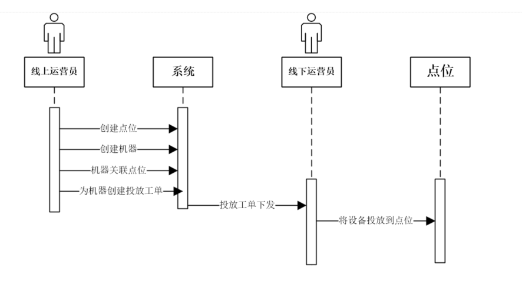
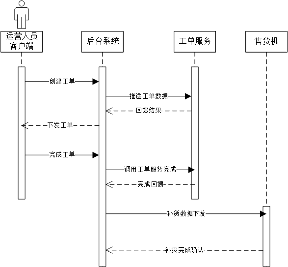
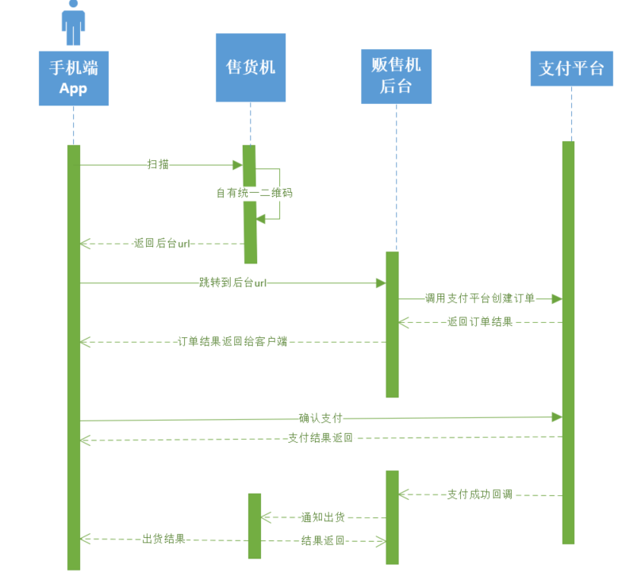
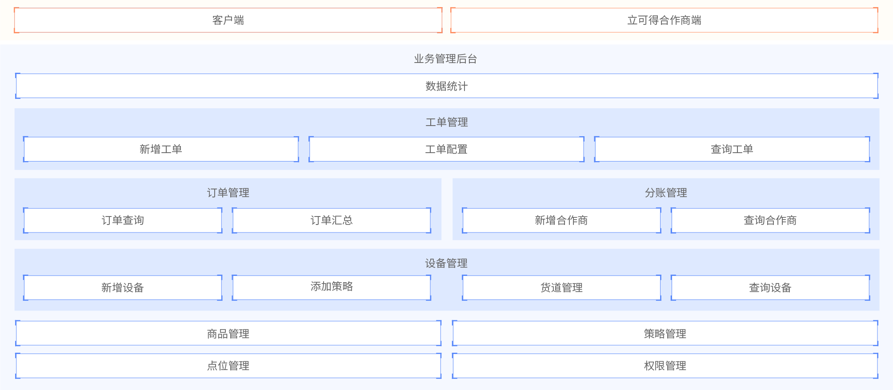
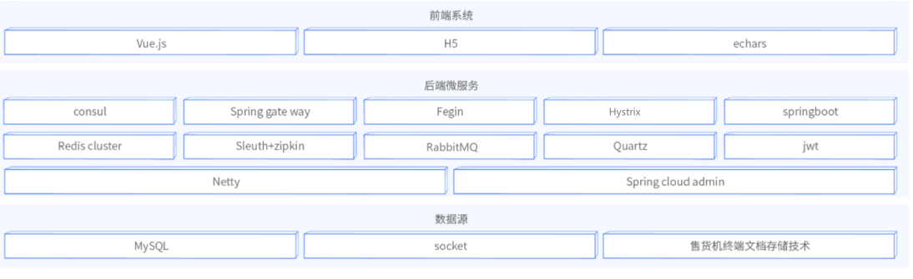
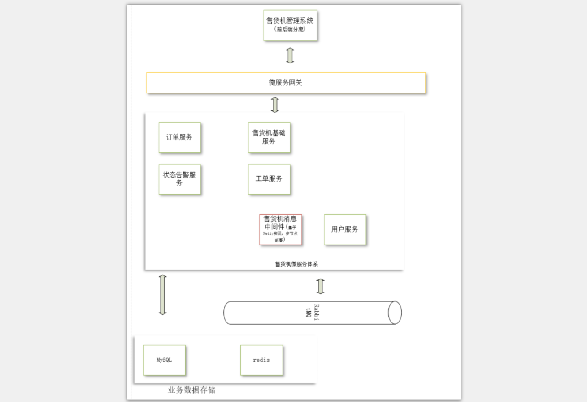

[toc]

# 第1章 新零售-重构“人、货、场”

## 1.智能售货机需求分析

### 1.1 概念介绍

#### 1.1.1 新零售

新零售是2016 年阿里巴巴董事局主席马云提出的概念。其实在这之前已经有相关新零售业务发展的初具规模了。为什么马云提出这一概念？因为纯电商的零售时代已经过去，未来的零售是线上和线下双向结合，双向引流，单独一方的获客成本都已经非常高了，并且线上流量的入口都基本已经关闭。

	新零售是利用互联网的新思维、新技术，对传统的零售方式进行改良和创新，将服务或者产品出售给最终消费者的一系列活动。新零售不仅仅是线上线下与物流的简单结合，同时还融入了大数据、云计算以及其他创新技术，打破了原有的销售边界，以一种全新的面貌接触消费者。传统线上互联网公司推出了各种线下门店，传统线下门店大力发展线上商城和APP，采用这种线上线下一体式双向绑定来不断将自己的触手延申，将线上的流量往线下导流，将线下的用户往线上引导。利用各种互联网技术来分析用户的行为习惯，提高广告的精准定位、推荐的精准定位，多方面提高营业收入，降低成本。
典型的应用：无人货架、无人零售店、智能售货机。

#### 1.1.2 O2O

O2O即Online To Offline（在线离线/线上到线下），是指将线下的商务机会与互联网结合，让互联网成为线下交易的平台，这个概念最早来源于美国。O2O的概念非常广泛，既可涉及到线上，又可涉及到线下,可以通称为O2O。主流商业管理课程均对O2O这种新型的商业模式有所介绍及关注。。。

案例：美团、饿了吗

#### 1.1.3 物联网

**物联网**（英文：*Internet of Things*，缩写：*IoT*）起源于[传媒](https://baike.baidu.com/item/%E4%BC%A0%E5%AA%92/890707)领域，是信息科技产业的第三次革命。物联网是指通过信息传感设备，按约定的协议，将任何物体与网络相连接，物体通过信息传播媒介进行信息交换和通信，以实现智能化识别、定位、跟踪、监管等功能。

### 1.2 智能售货机业务概述

#### 1.2.1 智能售货机业务介绍

​	智能售货机属于新零售领域的一个细分领域。区别于传统售货机的是，机器能自我管理，通过物联网的技术将分散的设备在一套平台集中管理，智能化的数据采集和分析，设备状态主动上报，设备的远程管理，设备和人员绑定，运营维护人员的工作管理，移动支付的支持等一系列手段来降低运营和运维成本快速实现盈利。这也是一种线上线下的融合模式(Online Merge Offline 线上线下全面融合)。

#### 1.2.2 系统构成

运营后台：管理所有运营售货机的数据。

手机端：用户扫码选购商品

售货机：保存商品库存，记录出货日志

#### 1.2.3 相关术语

**点位：**

点位就是机器摆放的具体地点，点位和机器的关系是一对多的关系，点位下包含一些机器，数量不会很大。例如：北京市海淀区西三旗建材城西路金燕龙写字楼二层东侧茶水间、地铁8号线育新站A出站口、地铁8号线育新站B出站口。

点位的地址尽量详尽，因为这会涉及到后续的运营和运维工作，并且通过点位可以快速定位到机器。点位天然具有一些地域属性和区域属性，通过区域与地域对点位进行管理，点位的作用是呈上启下，每台机器直接和点位关联。

**售货机：**

售货机摆放在点位上。智能售货机从表面上理解其实就是货柜，一件件的商品摆放在机器中，是商品的前置仓；除了具有摆放商品的能力之外，还要对内部的商品进行售卖，所以里面具有一定的传感设备和复杂的机械结构、4G物联网通信模块、工业控制主机(简称工控机，可以理解为一台精简版的PC，主要和我们的后台系统通信及单片机通信完成整个出货及相关信息的交互，完成一些边缘计算)、单片机程序(控制机械设备完成出货，接收传感器信号检测设备状态，和PC通信接收出货指令及状态上报)、制冷/加热装置、触摸屏幕(和用户交互以完成购物操作及广告播放等)、各种外接刷卡器扣款设备和摄像头设备。

机器主要的作用是出货，附加作用是广告播放和交互探测。通过加装工控机+物联网通信模块变成了一台可以远程管理的智能设备。

**货道：**

货道就是用来摆放商品的，售货机里的货道有点像是超市里的货架，层列式结构，每台设备有多层货道，每层货道有多列，每列货道里可以摆放一件或多件商品。有的机器是根据货道的层高和宽窄不同可容纳的商品品类就不同，当然这是一些传统常见的货道结构，也有些异型的货道结构，比如直列式货道(商品是从上到下一个压一个的垂直摆放，方便通过重力检测是否售空)、蛇形货道(专门为卖饮料设计的货道，方便饮料瓶的填装和售空检测)等。

货道和机器是多对一的结构，一台机器拥有多个货道，货道的基本属性有层、列、商品、最大容量、当前容量(可以是计算值)、是否故障(需要相关传感器支持)。

**策略：**

打折的方案，可以捆绑到售货机上，这样售货机出售的商品的价格就会自动计算折扣。

**工单：**

工作流”单子“。有投放工单、维修工单、撤机工单和补货工单。

### 1.3 智能售货机核心业务流程

#### 1.3.1 投放流程

从上图可以看到，线上的运营员在系统里创建点位、创建机器，然后将机器和点位关联，之后创建一个投放工单，将工单下发给线下负责投放的运营人员，之后负责投放的人员将设备投放到点位之后完成该工单。

#### 1.3.2 补货流程 

从上图大家可以了解到具体补货流程，相关具备权限的用户可以在系统中为每台机器创建补货工单任务，并且将任务下发到运营补货人员手里，这样运营人员可以根据工单要求的数量在线下完成相应补货任务，然后在系统中确认完成工单，之后系统将补货消息推送到机器端，机器上的货道商品数量发生变更，这样可以支撑后续的售卖业务。

#### 1.3.3 用户购买流程 

​	整个售卖流程涉及到多方交互，包括用户、售货机、售货机平台、第三方支付平台。主要流程是：用户在设备上选择商品，然后使用微信/支付宝扫描机器上的商品二维码(二维码的信息包含售货机平台的url和机器及商品信息)；售货机平台根据用户请求的信息计算得出商品的价格后向第三方支付平台(微信或支付宝)发起扣款请求；支付平台扣款成功后会回调售货机平台，将结果传回；售货机平台根据扣款结果组装出货请求消息，然后将该消息下发到相应售货机完成出货；支付平台同时将扣款结果返回到用户客户端；机器出货完成后将结果返回给后台。

### 1.4 立可得1.0体验

立可得后台地址：http://lkd-java.itheima.net

支付宝体验二维码：

### 1.5 立可得1.0功能架构图

## 2.立可得1.0版本系统设计

### 2.1 技术架构图

### 2.2 系统架构图 

大家可以看到1.0版本的系统采用的是基于Spring Cloud的微服务架构，Consul作为微服务的注册中心和配置中心，微服务间的调用采用的是Fegin的http通信方式来实现的，服务器端的消息通知采用的是RabbitMQ消息队列来实现的；服务器端和客户端的消息中心是我们基于Netty自研的一套分布式消息组件；商品图片资源集成了阿里云OSS来存储和查看，微服务网关采用了Spring cloud gateway做了集中封装，并且集成了JWT对服务访问做了认证限制；所有的数据存入到了mysql数据库中，每个微服务有自己单独的数据库，做了垂直的切分，降低了各微服务之间的耦合度；用户支付购物流程是通过对接支付宝平台来实现的基于扫码后跳转到H5页面来实现的；一些简单的任务调度采用的是Spring Task来实现的。

### 2.3 工程架构设计 

立可得1.0工程结构如下：

### 2.4 库表设计 

数据库分库设计：

**（1）售货机数据库：lkd_vms**

| 表含义      | 表名称                |
| -------- | ------------------ |
| 区域       | tb_area            |
| 点位       | tb_node            |
| 售货机      | tb_vending_machine |
| 售货机类型    | tb_vm_type         |
| 货道       | tb_channel         |
| 策略       | tb_policy          |
| 售货机策略关联表 | tb_vm_policy       |
| 商品类型     | tb_sku_class       |
| 商品       | tb_sku             |
| 售货机出货日志  | tb_vendout_running |

**（2）工单数据库：lkd_production**

| 表含义        | 表名称                 |
| ---------- | ------------------- |
| 工单类型       | tb_task_type        |
| 工单         | tb_task             |
| 工单详情（补货工单） | tb_task_details     |
| 工单状态       | tb_task_status_type |

**（3）订单数据库：lkd_order**

| 表含义   | 表名称                    |
| ----- | ---------------------- |
| 订单    | tb_order               |
| 订单汇总  | tb_order_collect       |
| 订单月汇总 | tb_order_month_collect |

**（4）用户数据库：lkd_user**

| 表含义      | 表名称        |
| -------- | ---------- |
| 用户表      | tb_user    |
| 角色表      | tb_role    |
| 用户售货机关联表 | tb_user_vm |

**（5）状态数据库：lkd_status**

| 表含义  | 表名称               |
| ---- | ----------------- |
| 状态类型 | tb_status_type    |
| 状态信息 | tb_vm_status_info |

## 3.立可得1.0微服务API设计

### 3.1 售货机微服务

售货机服务是基础业务封装的微服务，主要是对区域、点位、售货机、货道、策略等进行管理。

#### 3.1.1 区域

区域指的是行政区域   

tb_area  表

| 字段名称       | 字段含义 | 字段类型    | 字段长度 | 备注                               |
| ---------- | ---- | ------- | ---- | -------------------------------- |
| id         | id   | INT     |      |                                  |
| parent_id  | 父Id  | INT     |      |                                  |
| area_name  | 区域名称 | VARCHAR |      |                                  |
| ad_code    | 地区编码 | VARCHAR |      |                                  |
| city_code  | 城市区号 | VARCHAR |      |                                  |
| area_level | 地区级别 | VARCHAR |      | province :省  city：市  district：区县 |

API设计：

- 获取所有根区域
- 获取下一级子区域

详见API文档

#### 3.1.2 点位管理

点位是指存放售货机的具体位置，一个区域可以包含多个点位

tb_node  表

| 字段名称           | 字段含义   | 字段类型     | 字段长度 | 备注   |
| -------------- | ------ | -------- | ---- | ---- |
| id             | id     | BIGINT   |      |      |
| name           | 点位名称   | VARCHAR  |      |      |
| addr           | 点位详细地址 | VARCHAR  |      |      |
| longitudes     | 经度     | DOUBLE   |      |      |
| latitude       | 维度     | DOUBLE   |      |      |
| area_id        | 所在区域Id | INT      |      |      |
| ctime          | 创建时间   | DATETIME |      |      |
| utime          | 更改时间   | DATETIME |      |      |
| create_user_id | 创建人id  | BIGINT   |      |      |

API设计：

- 分页查询
- 查询指定节点下的售货机
- 检索点位
- 点位新增

#### 3.1.3 售货机管理

一个点位可以有多个售货机

售货机表： tb_vending_machine  表

| 字段名称             | 字段含义                  | 字段类型     | 字段长度 | 备注   |
| ---------------- | --------------------- | -------- | ---- | ---- |
| id               | id                    | BIGINT   |      |      |
| vm_type          | 售货机类型                 | INT      |      |      |
| inner_code       | 售货机软编号                | VARCHAR  |      |      |
| node_id          | 点位Id                  | BIGINT   |      |      |
| ctime            | 创建时间                  | DATETIME |      |      |
| utime            | 修改时间                  | DATETIME |      |      |
| vm_status        | 售货机状态，0:未投放;1-运营;3-撤机 | INT      |      |      |
| last_supply_time | 上次补货时间                | DATETIME |      |      |
| city_code        | 所在城市ID                | VARCHAR  |      |      |
| area_id          | 区域id                  | INT      |      |      |
| company_id       | 所属合作商                 | INT      |      |      |
| create_user_id   | 创建人id                 | BIGINT   |      |      |

售货机可以有很多类型，饮料机是最为常见的一种，当然还有零食机、口红机等。我们这里也需要对售货机类型进行管理和维护。

售货机类型表  tb_vm_type  表

| 字段名称                 | 字段含义    | 字段类型    | 字段长度 | 备注   |
| -------------------- | ------- | ------- | ---- | ---- |
| type_id              | type_id | INT     |      |      |
| vm_row               | 行数      | INT     |      |      |
| vm_col               | 列数      | INT     |      |      |
| name                 | 类型名     | VARCHAR |      |      |
| channel_max_capacity | 货道最大容量  | INT     |      |      |

API设计：

- 分页查询
- 指定状态的售货机
- 指定售货机信息
- 售货机新增
- 更新机器所在点位
- 售货机运用策略
- 售货机取消策略
- 售货机类型列表
- 指定售货机商品列表（H5页面使用）

#### 3.1.4 货道 

一个售货机由若干个货道组成。

tb_channel  表

| 字段名称             | 字段含义   | 字段类型     | 字段长度 | 备注   |
| ---------------- | ------ | -------- | ---- | ---- |
| channel_id       | 货道Id   | BIGINT   |      |      |
| channel_code     | 货道编号   | VARCHAR  |      |      |
| sku_id           | 商品Id   | BIGINT   |      |      |
| vm_id            | 售货机Id  | BIGINT   |      |      |
| inner_code       | 售货机软编号 | VARCHAR  |      |      |
| ctime            | 创建时间   | DATETIME |      |      |
| utime            | 修改时间   | DATETIME |      |      |
| max_capacity     | 货道最大容量 | INT      |      |      |
| current_capacity | 货道当前容量 | INT      |      |      |
| last_supply_time | 上次补货时间 | DATETIME |      |      |

API设计：

- 货道列表
- 关联商品

#### 3.1.5 策略管理 

策略设置表：tb_policy  表

| 字段名称        | 字段含义        | 字段类型     | 字段长度 | 备注   |
| ----------- | ----------- | -------- | ---- | ---- |
| policy_id   | 策略id        | INT      |      |      |
| policy_name | 策略名称        | VARCHAR  |      |      |
| discount    | 折扣，如：80代表8折 | INT      |      |      |
| ctime       | 创建时间        | DATETIME |      |      |
| utime       | 修改时间        | DATETIME |      |      |

售货机策略设置表  tb_vm_policy  表

| 字段名称        | 字段含义  | 字段类型    | 字段长度 | 备注   |
| ----------- | ----- | ------- | ---- | ---- |
| id          | id    | BIGINT  |      |      |
| vm_id       | 售货机id | BIGINT  |      |      |
| inner_code  | 售货机编号 | VARCHAR |      |      |
| policy_id   | 策略id  | INT     |      |      |
| policy_name | 策略名称  | VARCHAR |      |      |
| discount    | 折扣    | INT     |      |      |

API设计：

- 分页查询
- 检索策略
- 策略新增
- 查询指定售货机的策略

#### 3.1.6 商品管理

商品类型表  tb_sku_class  表

| 字段名称       | 字段含义 | 字段类型    | 字段长度 | 备注   |
| ---------- | ---- | ------- | ---- | ---- |
| class_id   | id   | INT     |      |      |
| class_name | 类别名称 | VARCHAR |      |      |
| parent_id  | 上级id | INT     |      |      |

商品表  tb_sku  表

| 字段名称        | 字段含义   | 字段类型     | 字段长度 | 备注   |
| ----------- | ------ | -------- | ---- | ---- |
| sku_id      | sku_id | BIGINT   |      |      |
| sku_name    | 商品名称   | VARCHAR  |      |      |
| sku_image   | 商品图片   | VARCHAR  |      |      |
| price       | 基础价格   | INT      |      |      |
| real_price  | 真实价格   | INT      |      |      |
| ctime       | 创建时间   | DATETIME |      |      |
| utime       | 修改时间   | DATETIME |      |      |
| class_id    | 商品类别Id | INT      |      |      |
| is_discount | 是否打折促销 | BIT      |      |      |
| unit        | 净含量    | VARCHAR  |      |      |

API设计：

- 商品列表
- 检索商品
- 商品新增
- 商品修改
- 商品图片上传
- 商品类别

### 3.2 工单微服务

工单类型： tb_task_type  表

| 字段名称      | 字段含义 | 字段类型    | 字段长度 | 备注   |
| --------- | ---- | ------- | ---- | ---- |
| type_id   | 类型id | INT     |      |      |
| type_name | 类型名称 | VARCHAR |      |      |

工单：tb_task  表

| 字段名称            | 字段含义           | 字段类型     | 字段长度 | 备注   |
| --------------- | -------------- | -------- | ---- | ---- |
| task_id         | 工单编号           | BIGINT   |      |      |
| task_name       | 工单名称           | VARCHAR  |      |      |
| task_status     | 工单状态           | INT      |      |      |
| create_type     | 创建类型 0：自动 1：手动 | INT      |      |      |
| inner_code      | 售货机编码          | VARCHAR  |      |      |
| user_id         | 执行人id          | BIGINT   |      |      |
| user_name       | 执行人名称          | VARCHAR  |      |      |
| desc            | 描述             | VARCHAR  |      |      |
| ctime           | 创建时间           | DATETIME |      |      |
| utime           | 更新时间           | DATETIME |      |      |
| product_type_id | 工单类型id         | INT      |      |      |
| expect          | 计划完成时间         | DATETIME |      |      |
| assignor_id     | 指派人Id          | BIGINT   |      |      |

对于补货工单，还需要记录需要补货的货道以及补货后期望的容量

工单详情：tb_task_details  表

| 字段名称            | 字段含义       | 字段类型    | 字段长度 | 备注   |
| --------------- | ---------- | ------- | ---- | ---- |
| details_id      | details_id | BIGINT  |      |      |
| task_id         | 工单Id       | BIGINT  |      |      |
| channel_code    | 货道编号       | VARCHAR |      |      |
| expect_capacity | 期望补货量      | INT     |      |      |

工单状态类型：tb_task_status_type  表

| 字段名称        | 字段含义        | 字段类型    | 字段长度 | 备注   |
| ----------- | ----------- | ------- | ---- | ---- |
| status_id   | status_id   | INT     |      |      |
| status_name | status_name | VARCHAR |      |      |

数据：(0,'创建'),(1,'进行'),(2,'取消'),(3,'完成')

API设计：

- 检索工单

- 工单新增
- 工单配置
- 完成工单
- 取消工单
- 工单类型列表
- 工单状态列表

### 3.3 订单微服务

#### 3.3.1 订单

tb_order  表

| 字段名称       | 字段含义                            | 字段类型     | 字段长度 | 备注   |
| ---------- | ------------------------------- | -------- | ---- | ---- |
| id         | id                              | BIGINT   |      |      |
| order_no   | 订单编号                            | VARCHAR  |      |      |
| third_no   | 支付流水号                           | VARCHAR  |      |      |
| inner_code | 机器编号                            | VARCHAR  |      |      |
| sku_id     | skuId                           | BIGINT   |      |      |
| sku_name   | 商品名称                            | VARCHAR  |      |      |
| status     | 订单状态:0-创建;1-支付完成;2-出货成功;3-出货失败; | INT      |      |      |
| ctime      | 创建时间                            | DATETIME |      |      |
| utime      | 更新时间                            | DATETIME |      |      |
| amount     | 支付金额                            | INT      |      |      |
| price      | 商品金额                            | INT      |      |      |
| pay_type   | 支付类型，1支付宝 2微信                   | VARCHAR  |      |      |
| pay_status | 支付状态，0-未支付;1-支付完成;2-退款中;3-退款完成  | INT      |      |      |

API设计：

- 分页查询
- 按订单号查询
- 按订单ID查询

#### 3.3.2 订单统计

API设计：

- 所有公司（合作商）的销售额排名
- 一定日期之内的销售汇总
- 某一区域的一定日期内的销售趋势数据
- 销量前15的商品

### 3.4 用户微服务

这里的用户不是指C端用户，而是指B端用户：管理员、配送员、维修员

用户表  tb_user  表

| 字段名称       | 字段含义 | 字段类型    | 字段长度 | 备注   |
| ---------- | ---- | ------- | ---- | ---- |
| id         | id   | INT     |      |      |
| role_id    | 角色Id | INT     |      |      |
| user_name  | 用户名称 | VARCHAR |      |      |
| login_name | 登录名  | VARCHAR |      |      |
| password   | 密码   | VARCHAR |      |      |
| area_id    | 区域id | INT     |      |      |
| secret     | 私钥   | VARCHAR |      |      |
| role_code  | 角色编号 | VARCHAR |      |      |
| mobile     | 手机号  | VARCHAR |      |      |
| company_id | 公司Id | INT     |      |      |

角色表  tb_role  表

| 字段名称      | 字段含义 | 字段类型    | 字段长度 | 备注   |
| --------- | ---- | ------- | ---- | ---- |
| role_id   | id   | INT     |      |      |
| role_code | 角色编号 | VARCHAR |      |      |
| role_name | 角色名称 | VARCHAR |      |      |

公司表：tb_company  表

| 字段名称          | 字段含义         | 字段类型    | 字段长度 | 备注   |
| ------------- | ------------ | ------- | ---- | ---- |
| id            | id           | INT     |      |      |
| business_type | 0:平台方;1:加盟客户 | INT     |      |      |
| name          | 合作商名称        | VARCHAR |      |      |

用户API设计：

- 登录
- 维修员列表
- 配送员列表

公司API设计：

- 全部合作商
- 分页查询
- 合作商修改
- 合作商新增
- 检索合作商

