[toc]


# 第2章 立可得2.0之前世今生

## 1.立可得2.0需求分析

### 1.1 背景介绍 

​	随着立可得公司运营规模的扩大， 设备数量及点位数量迅速增长，合作点位主数量不断增加，原有的单一的管理后台已经无法满足日常管理的需要。 为此立可得公司决定对平台进行一次大版本的升级：主要是将系统做了切分，整体系统分成六大块：

（1）运营管理后台：管理人员使用

（2）合作商后台：为合作的商家（点位主）提供数据查询

（3）运营管理APP：运营人员使用，主要功能是处理运营工单

（4）运维管理APP：运维人员使用，主要功能是处理运维工单

（5）用户小程序：C端用户使用的微信小程序，废除原有的h5移动端。

（6）设备端：封装售货机逻辑

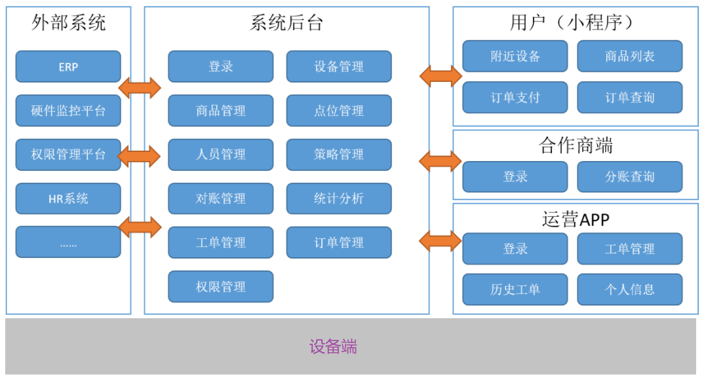

另外将设备监控部分从原有系统中抽离，使用开源项目亿可控来实现对设备的监控，并与立可得进行对接。

### 1.2 产品原型&设计稿

产品原型：

https://app.mockplus.cn/run/prototype/tPerX4XrY4/BSJNfay9MlZ/oA1CE0pr_?dt=iPhone&ha=1&la=1&ps=1

设计稿：

https://app.mockplus.cn/run/design/WWk4pKFL3gM?dt=iPhone&ha=1&la=1&ps=1 

### 1.3 产品需求对比分析

#### 1.3.1 运营管理后台【升级】

##### （1）点位管理

​	同一个城市中会部署和运营大量的售货机，单一的区域难以管理和运营相当多数量的设备，所以将设备按照区域进行了分组，抽象出了区域的概念，区域下包含点位，点位上部署着机器。这里的区域不是v1.0中所说的行政区域，而是指根据运营需要划分的区域。

​	同时原来运维人员和运营人员和售货机关联的关系取消，将这些人员直接和区域做关联，该区域下的这些运维和运营人员负责该区域下所有设备的运营和运维工作。		

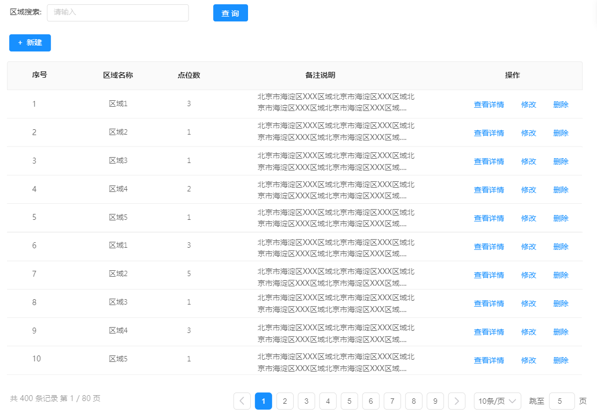

​	点位新增了商圈的属性，这样之后可以根据商圈进行商品设置的智能推荐。


另外增加了合作商（点为主）增删改查功能。合作商和点位属于1对多关系，也就是一个合作商可以拥有多个点位。

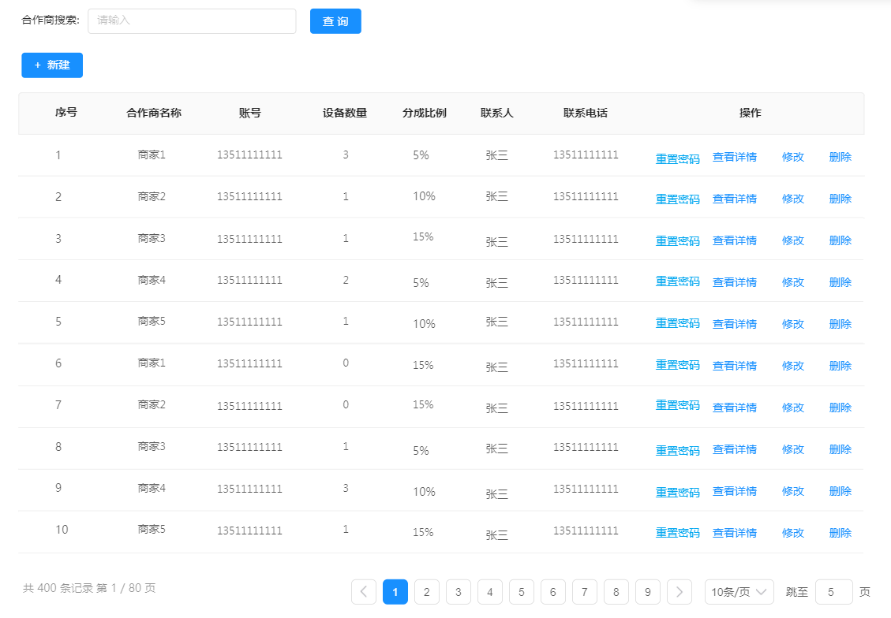	

通过下面的图，我们可以清晰的理解区域、点位、设备、人员之间的关系

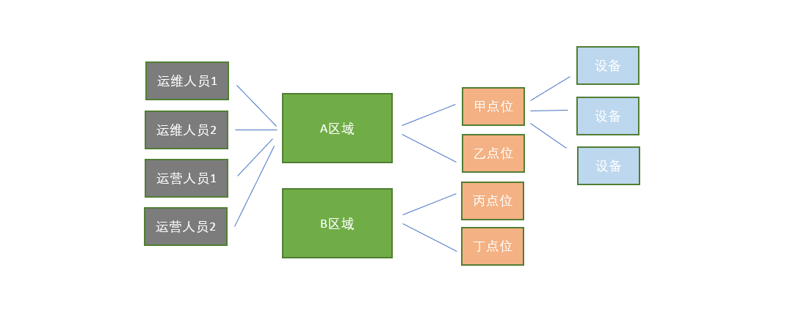

##### （2）设备管理

​	售货机种类多种多样，设备类型管理为设备进行分类，主要对设备货道数量、货道容量进行设置。

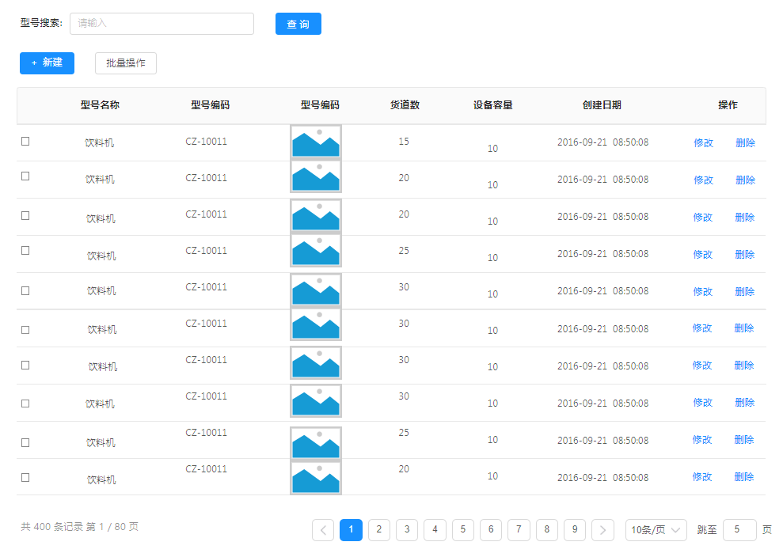

设备管理新增“智能排货”

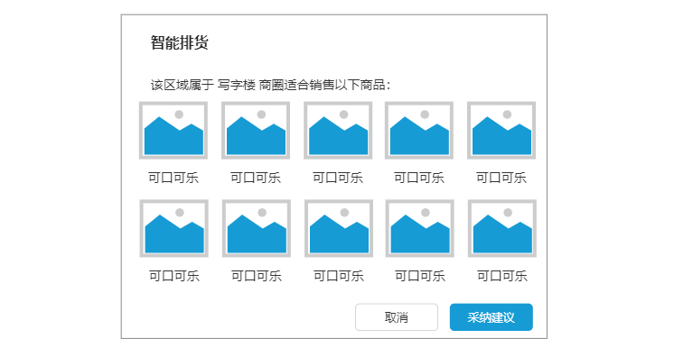

##### （3）人员管理

增加了人员管理

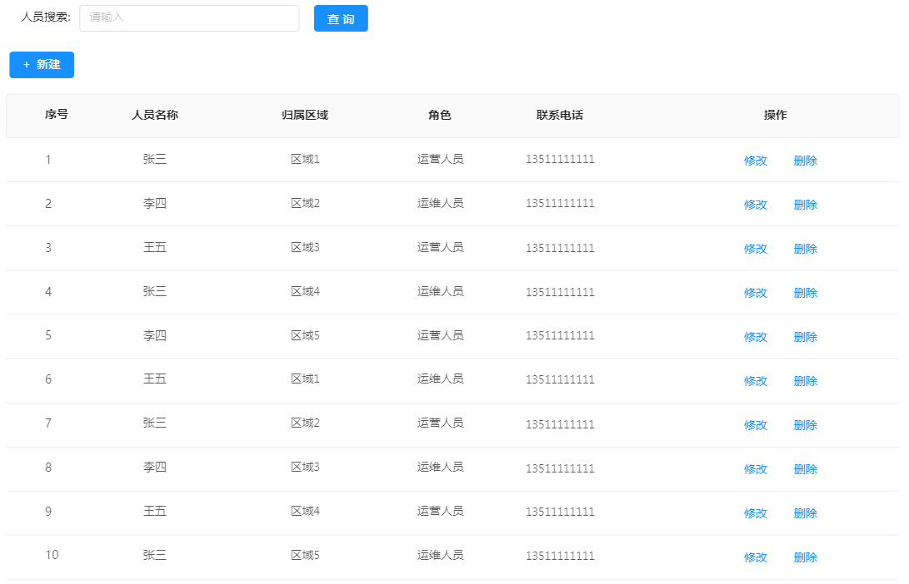

人效统计、人效排名，正向激励制度让公司良性发展。

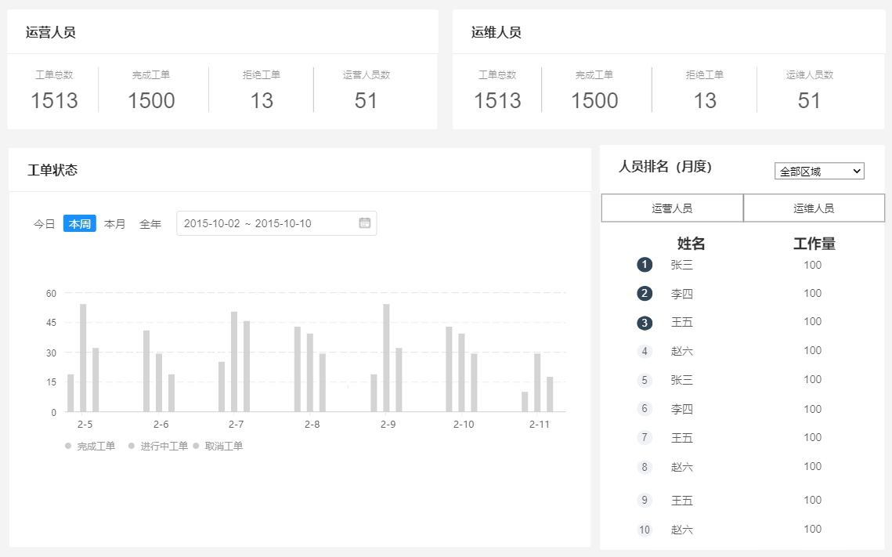

通过工作量列表，可以看到每个人的完成工单数、进行中工单以及拒绝工单。

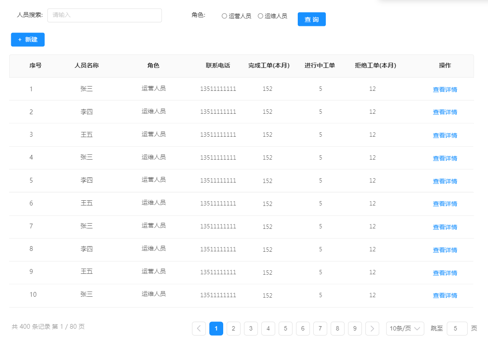


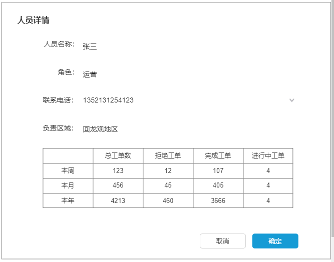

##### （4）对账管理

优化分账管理功能，可以查看合作商分成数据以及具体分成详情。

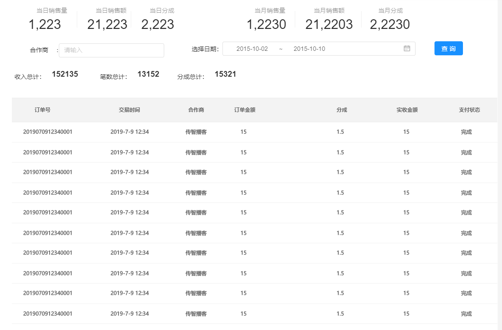

##### （5）统计分析

工作台聚合了销售数据统计、工单数据统计、销售数据趋势分析、商品销量排行榜、用户访问统计和异常设备监控。

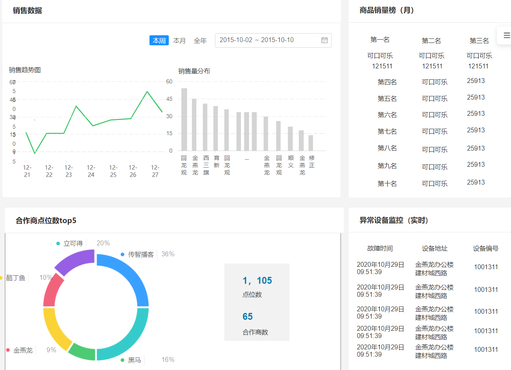


##### （6）工单

优化工单管理，将工单拆分为运营工单、运维工单，对工单进行细化管理。运营工单为补货工单；运维工单为装机工单、维修工单、撤机工单。

实现智能补货工单、自动维修工单。

#### 1.3.2 合作商后台【新增】

新增合作商后台，用于合作商查看收益，合作商可以查看每日收益，具体点位收益，收益数据导出。

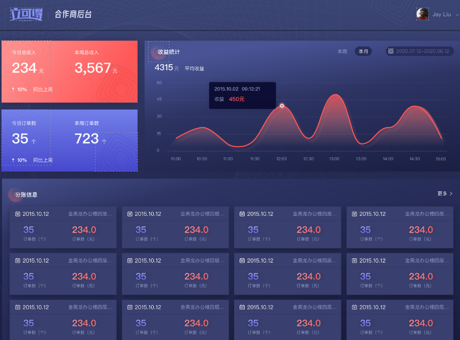

合作商可以在对账管理页面查询每个点位收益，可以根据时间筛选对账单区间，可以导出对账详情。

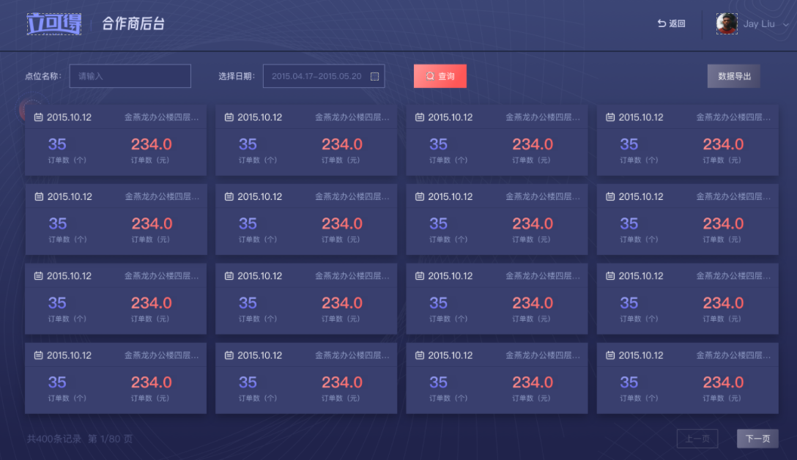


#### 1.3.3 运营&运维管理APP【新增】

新增运营APP，增加运营人员与运维人员执行工单入口，真正实现工单处理数字化。可以实时跟进工单实施进度，查看历史工单情况，便于平台整体调度与货品调配。

工作台主要是用户查看自己待办工单任务，显示工作排名。系统会根据运营/运维人员接受工单情况来只能派发待办工单，用户可以直接查看工单详情，对工单进行接受与拒绝操作。

##### （1）待办工单

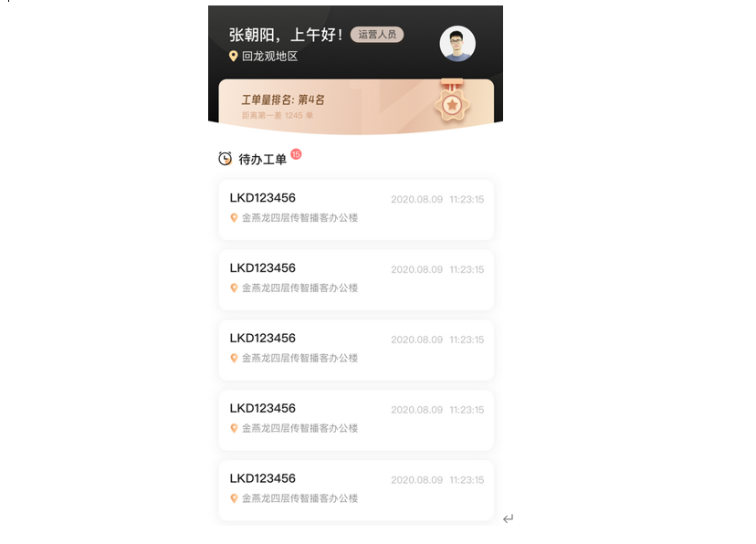

##### （2）历史工单&进行工单

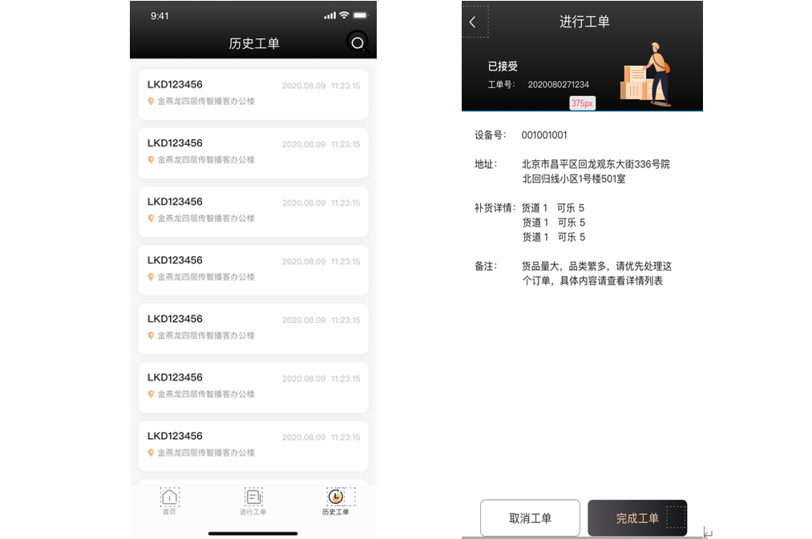


#### 1.3.4 用户小程序【新增】 

由原有的h5工程更换为用户小程序，可以为之后实现线下向线上导流提供基础。3.0版本计划在小程序中添加电商入口。

##### （1）地图导航

用户可以通过小程序进行地图搜索，查看附近售货机设备，之后通过导航指引到售货机处购买商品。这就是从线上向线下导流的具体实现。

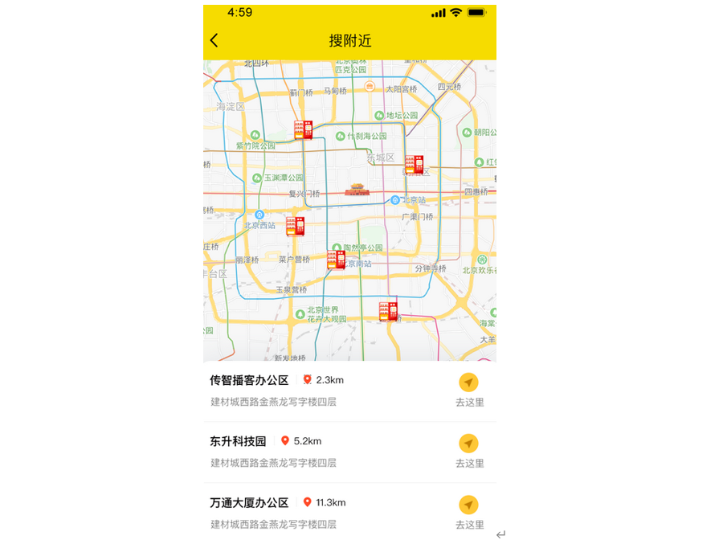

##### （2）下单支付

由原来的支付宝支付，更改为微信小程序微信支付。

##### （3）查看订单

可以在小程序中查看订单记录。

## 2.立可得2.0系统设计

### 2.1 技术升级对比分析 


### 2.2 系统架构图v2.0  

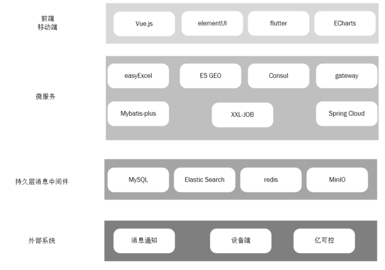

可以看到由于2.0系统伴随着业务的增长，原有的Spring Task已经遇到了瓶颈，不能满足同时处理大量售货机相关的定时任务了，这里我们引入了XXL-JOB来实现任务的分布式集群分片调度；随着订单量的增长，MySQL数据库的查询效率逐渐出现了比较慢的情况，而且扩容变得相对越来越困难，此时我们引入了ElasticSearch来实现订单的存储和搜索，因为订单数据一旦完成就基本不会再变更了，所以使用ElasticSearch能显著提高查询效率，而且为了增加购物体验，售货机上增加了地理位置的信息，将这些信息同步到ES中可以轻松的实现基于地理位置的范围搜索；我们将服务器端的各微服务之间的消息通知和售货机客户端的数据通信都统一替换成了EMQ，降低了后期维护成本的同事用一套消息系统打通了所有端点；用MinIO替换了阿里云收费的OSS，搭建了自己的轻量级OSS文件系统；对接微信小程序实现用户一站式购物体验，等等更多的业务和技术上的升级。

### 2.3 库表设计v2.0

#### 2.3.1 售货机库

| 新增表                |                 |                    |
| ------------------ | --------------- | ------------------ |
| tb_business        | 商圈表             |                    |
| tb_region          | 区域表             |                    |
| **变化表**            |                 |                    |
| tb_channel         | 货道表             |                    |
|                    | 新增price价格字段     | 为了实现同一商品在不同售货机价格不同 |
| tb_node            | 点位表             |                    |
|                    | 新增region_id区域Id | 新增区域业务             |
|                    | business_id商圈id | 新增商圈业务             |
|                    | owner_id合作商Id   | 新增合作商业务            |
|                    | owner_name合作商名称 | 新增合作商业务            |
| tb_sku             | 商品表             |                    |
|                    | 新增brand_name    | 新增商品品牌             |
| tb_vending_machine | 售货机表            |                    |
|                    | business_id商圈id | 新增商圈业务             |
|                    | 新增region_id区域Id | 新增区域业务             |
|                    | owner_id合作商Id   | 新增合作商业务            |
|                    | owner_name合作商名称 | 新增合作商业务            |
|                    | longitudes      | 经度                 |
|                    | latitude        | 纬度                 |
| tb_vm_type         | 售货机类型表          |                    |
|                    | 新增model         | 类型编码               |
|                    | Image           | 图片                 |

#### 2.3.2 工单库

| 新增表             |                 |              |
| --------------- | --------------- | ------------ |
| tb_task_collect | 工单统计表           | 为了实现工单统计     |
| 变化表             |                 |              |
| tb_job          | 任务表             |              |
|                 | 删除原来里面的执行时间列    | 改到XXL-JOB中配置 |
| tb_task         | 工单表             |              |
|                 | 添加区域字段region_id | 新增区域相关逻辑     |
| tb_task_details |                 |              |
|                 | 新增sku_id        |              |
|                 | 新增sku_name      |              |

#### 2.3.3 用户库

| 新增表        |               |             |
| ---------- | ------------- | ----------- |
| tb_partner | 合作商表          | 新增合作商业务     |
| 变化表        |               |             |
| tb_user    | 用户表           |             |
|            | 新增mobile      | 手机号，接受登录验证码 |
|            | 新增region_id   | 区域逻辑        |
|            | 新增region_name | 区域逻辑        |
|            | 新增image       | 新增用户头像      |

### 2.4 工程结构调整

将我们项目提供的配套资料代码(第2天资料/代码)导入到工程中：

立可得2.0的工程结构如下

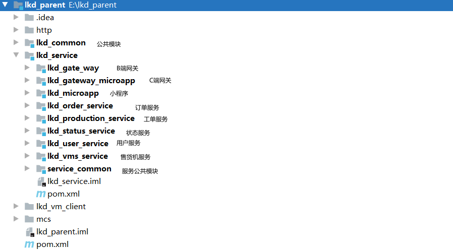

对比立可得1.0，结构有如下变化

（1）新增小程序端服务

（2）新增C端网关，针对用户小程序端的专用网关

（3）新增服务公共模块

（4）将所有微服务整理到lkd_service模块下，结构更加清晰

### 2.5 环境准备

为了让大家快速上手，我们给大家提供了配套的vm镜像文件（第2天资料），我们直接将镜像挂载到VMware Workstation 中，使用NAT方式连接。

镜像的ip地址为192.168.200.128  ，系统的登录名是root ，密码是123456 

进入系统后，我们可以看到里面已经安装好我们必须的各种软件环境

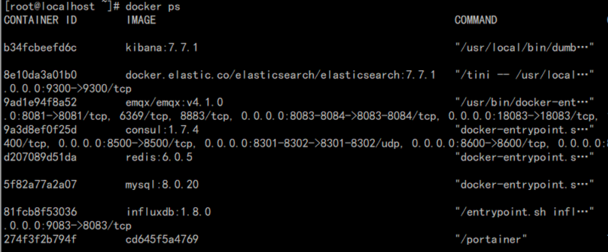

consul的控制台地址： http://192.168.200.128:8500/

mysql数据库的用户名与密码：root/root123  

* 少一个组件没安装kibana :7.7.1     / （Redis也没有安装。）

## 3.集成SpringCloudAlibaba短信服务

### 3.1 SpringCloudAlibaba短信服务简介

**短信服务（Short Message Service）是阿里云为用户提供的一种通信服务的能力。**

- 产品优势：覆盖全面、高并发处理、消息堆积处理、开发管理简单、智能监控调度
- 产品功能：短信通知、短信验证码、推广短信、异步通知、数据统计
- 应用场景：短信验证码、系统信息推送、推广短信等

SpringCloudAlibaba提供的短信服务，集成更加方便，代码更加简洁。

### 3.2 代码解析

#### 3.2.1 基本配置与工具类封装

（1）我们这里使用了SpringCloudAlibaba中提供的短信服务

工程引入依赖

```xml
<dependency>
    <groupId>com.alibaba.cloud</groupId>
    <artifactId>spring-cloud-alicloud-sms</artifactId>
    <version>2.2.0.RELEASE</version>
</dependency>
```

（2）配置文件添加短信相关的配置，密钥的配置

```yaml
spring:
  cloud:
    alicloud:
      access-key: XXX
      secret-key: XXX
```

以及签名和模板号的配置（自定义）

```yaml
sms:
  operator:
    signName: 立可得
    templateCode: SMS_202816312
```

（3）SmsConfig用于读取配置文件中的签名和模板编号

```java
package com.lkd.sms;

import org.springframework.beans.factory.annotation.Value;
import org.springframework.context.annotation.Configuration;

@Configuration
public class SmsConfig {
    @Value("${sms.operator.signName}")
    private String signName;
    @Value("${sms.operator.templateCode}")
    private String templateCode;

    public String getSignName() {
        return signName;
    }

    public String getTemplateCode() {
        return templateCode;
    }
}
```

（4）SmsSender用于封装发送短信的方法

```java
package com.lkd.sms;

import com.alibaba.alicloud.sms.ISmsService;
import com.aliyuncs.dysmsapi.model.v20170525.SendSmsRequest;
import com.fasterxml.jackson.databind.JsonNode;
import com.fasterxml.jackson.databind.ObjectMapper;
import com.fasterxml.jackson.databind.node.ObjectNode;
import lombok.extern.slf4j.Slf4j;
import org.springframework.beans.factory.annotation.Autowired;
import org.springframework.stereotype.Component;

@Component
@Slf4j
public class SmsSender {
    @Autowired
    private SmsConfig smsConfig;
    @Autowired
    private ISmsService smsService;

    /**
     *  发送验证码短信
     * @param telphone 手机号
     * @param code 手机验证码
     */
    public void sendMsg(String telphone,String code){
        // 组装请求对象-具体描述见控制台-文档部分内容
        SendSmsRequest request = new SendSmsRequest();

        // 必填:待发送手机号
        request.setPhoneNumbers(telphone);
        // 必填:短信签名-可在短信控制台中找到
        request.setSignName(smsConfig.getSignName());
        // 必填:短信模板-可在短信控制台中找到
        request.setTemplateCode(smsConfig.getTemplateCode());
        // 可选:模板中的变量替换JSON串,如模板内容为"【企业级分布式应用服务】,您的验证码为${code}"时,此处的值为
        ObjectMapper mapper = new ObjectMapper();
        JsonNode rootNode = mapper.createObjectNode();
        ((ObjectNode)rootNode).put("code",code);
        try {
 request.setTemplateParam(mapper.writeValueAsString(rootNode));//{"code":code}
            smsService.sendSmsRequest(request);
        }
        catch (Exception e) {
            log.error("send sms error.",e);
        }
    }
}
```

在需要发送短信的地方，直接引入SmsSender即可

#### 3.2.2 发送短信验证码

（1）发送短信验证码， UserService定义方法

```java
/**
 * 发送验证码
 * @param mobile
 */
void sendCode(String mobile);
```

UserServiceImpl实现方法

```java
@Autowired
private SmsSender smsSender;

@Override
public void sendCode(String mobile){
    if(Strings.isNullOrEmpty(mobile)) return;
    LambdaQueryWrapper<UserEntity> wrapper = new LambdaQueryWrapper<>();
    wrapper
            .eq(UserEntity::getMobile,mobile);
    if(this.count(wrapper)<=0) return;
    
    if(redisTemplate.opsForValue().get(mobile) != null) return;
    //生成5位验证码
    StringBuilder sbCode = new StringBuilder();
    Stream
            .generate( ()-> new Random().nextInt(10))
            .limit(5)
            .forEach(x-> sbCode.append(x));
    redisTemplate.opsForValue().set(mobile,sbCode.toString(), Duration.ofMinutes(5));
    smsSender.sendMsg(mobile,sbCode.toString());
}
```

（2）UserController新增方法

```java
/**
 * 生成登录手机验证码
 * @param mobile
 */
@GetMapping("/code/{mobile}")
public void generateCode(@PathVariable String mobile){
    userService.sendCode(mobile);
}
```

## 4.多端登录与网关鉴权 

### 4.1 需求分析 

由于面向企业运营和运维平台的端分为：系统平台后端、合作商后台、运营/运维客户端。这三个端的登录方式不一样，系统平台后端是管理员登录，需要输入账号和密码+图形验证码；合作商后台是通过手机号和密码+图形验证码登录；运营运维客户端是通过手机号及短信验证码登录。

管理员登录：

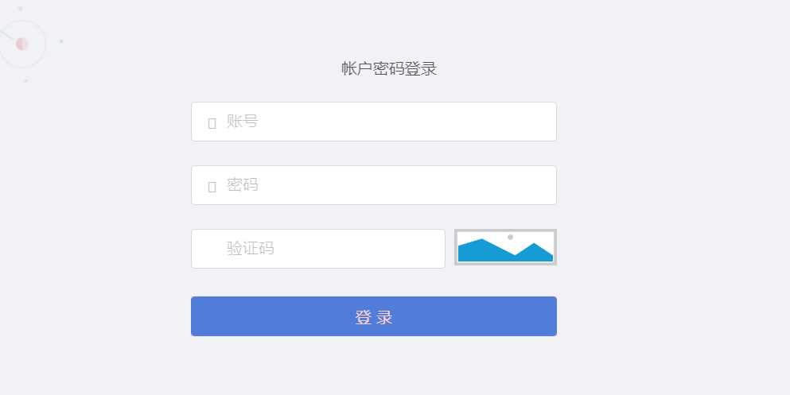

合作商登录：

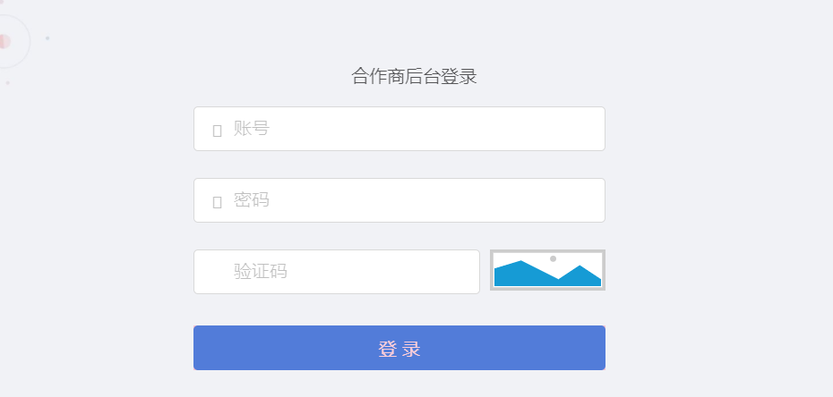

运维运营客户端（APP）登录

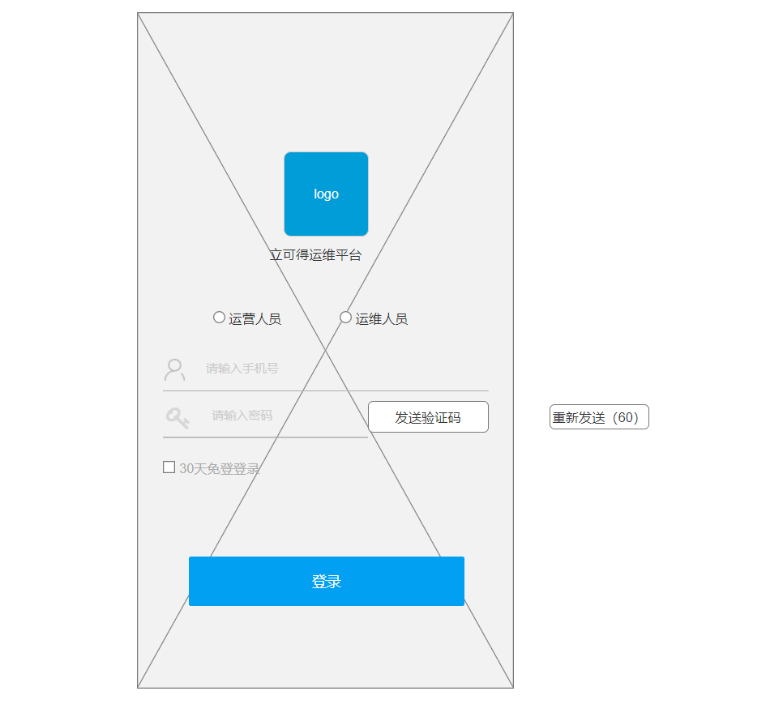

在网关服务里会拦截访问请求，通过取出token中的登录类型及用户Id，根据用户数据进行校验，只有校验通过的用户才有权限访问后台的接口。

### 4.2 思路分析 

对于多端登录和鉴权，我们有两种方案可以选择：

（1）隔离模式：分别针对不同端，开放不同的登录入口；针对不同端，开发不同的网关

（2）整合模式：所有的同类型的端，登录入口整合在一起；同类型的端，通过同一个网关进入

我们选择的方案是第2种，原因是第2种代码量比第1种要少很多。

### 4.3 代码解析 

#### 4.3.1 图形验证码

管理员登录和合作商，需要使用账号、密码和图形验证码登录.

Kaptcha（卡普查）来完成验证码的生成。 Kaptcha是一个非常实用的验证码生成工具

```xml
<dependency>
    <groupId>com.github.penggle</groupId>
    <artifactId>kaptcha</artifactId>
    <version>2.3.2</version>
</dependency>
```

在用户微服务的UserController编写获取图形验证码的方法，这里使用

```java

private final DefaultKaptcha kaptcha;
/**
 * 获取图片验证码
 * @param httpServletRequest
 * @param httpServletResponse
 */
@GetMapping("/imageCode/{clientToken}")
public void getImageCode(HttpServletRequest httpServletRequest, HttpServletResponse httpServletResponse,@PathVariable String clientToken) throws IOException {
    ByteArrayOutputStream jpegOutputStream = new ByteArrayOutputStream();
    String createText = kaptcha.createText();
    BufferedImage challenge = kaptcha.createImage(createText);
    ImageIO.write(challenge, "jpg", jpegOutputStream);
    byte[] captchaChallengeAsJpeg  = jpegOutputStream.toByteArray();
    httpServletResponse.setContentType("image/jpeg");
    ServletOutputStream responseOutputStream =
            httpServletResponse.getOutputStream();
    responseOutputStream.write(captchaChallengeAsJpeg);
    responseOutputStream.flush();
    responseOutputStream.close();
    //将验证码存入redis  2分钟超时
    redisTemplate.boundValueOps(clientToken).set(createText,120, TimeUnit.SECONDS);
}
```

测试：启动用户微服务， 打开地址输入地址http://localhost:9006/user/imageCode/xxx  

#### 4.3.2 管理员登录（*）  

（1）用户微服务`lkd_user_service`项目中定义通用的登录请求类：

```java
package com.lkd.http.viewModel;
import lombok.Data;
@Data
public class LoginReq{
    /**
     * 账号(后台用)
     */
    private String loginName;
    /**
     * 密码
     */
    private String password;
    /**
     * 手机号(运维运营平台使用)
     */
    private String mobile;
    /**
     * 合作商账号(手机号)
     */
    private String account;
    /**
     *  验证码
     */
    private String code;
    /**
     * 客户端请求验证码的token
     */
    private String clientToken;
    /**
     * 登录类型 0：后台；1：运营运维端；2：合作商后台
     */
    private Integer loginType;
}
```

（2）用户微服务`lkd_user_service`项目中定义通用的登录响应类：

```java
package com.lkd.http.viewModel;

import lombok.Data;

@Data
public class LoginResp{
    private long userId;
    private String userName;
    private String roleCode;
    private String token; //jwt令牌
    private boolean success;
    private String regionId;
    private String msg;
    /**
     * 是否是运维人员
     */
    private boolean isRepair;
}
```

（3）在用户服务接口`UserService`中定义登录的方法：

```java
/**
     * 后台登录
     * @param req
     * @return
     */
LoginResp login(LoginReq req) throws IOException;
```

在实现类中实现该方法：

```java
@Override
public LoginResp login(LoginReq req) throws IOException {
    if(req.getLoginType() == VMSystem.LOGIN_ADMIN){
        return this.adminLogin(req);//管理员登录
    }else if(req.getLoginType() == VMSystem.LOGIN_EMP){
        return this.empLogin(req);//运营运维人员登录
    }else if(req.getLoginType() == VMSystem.LOGIN_PARTNER){
        return partnerService.login(req);//合作商登录
    }
    LoginResp resp = new LoginResp();
    resp.setSuccess(false);
    resp.setMsg("不存在该账户");
    return resp;
}
```

管理员登录的逻辑方法

```java
/**
 * 管理员登录
 * @param req
 * @return
 * @throws IOException
 */
private LoginResp adminLogin(LoginReq req) throws IOException {
    LoginResp resp = new LoginResp();
    resp.setSuccess(false);
    String code =redisTemplate.boundValueOps(req.getClientToken()).get();
    if(Strings.isNullOrEmpty(code)){
        resp.setMsg("验证码错误");
        return resp;
    }
    if(!req.getCode().equals(code)){
        resp.setMsg("验证码错误");
        return resp;
    }
    QueryWrapper<UserEntity> qw = new QueryWrapper<>();
    qw.lambda()
            .eq(UserEntity::getLoginName,req.getLoginName());
    UserEntity userEntity = this.getOne(qw);
    if(userEntity == null){
        resp.setMsg("账户名或密码错误");
        return resp;
    }
    boolean loginSuccess = BCrypt.checkpw(req.getPassword(),userEntity.getPassword());
    if(!loginSuccess){
        resp.setMsg("账户名或密码错误");
        return resp;
    }
    return okResp(userEntity,VMSystem.LOGIN_ADMIN);
}
```

私有方法okResp用于封装

```java
/**
 * 登录成功签发token
 * @param userEntity
 * @param loginType
 * @return
 */
private LoginResp okResp(UserEntity userEntity,Integer loginType ) throws IOException {
    LoginResp resp = new LoginResp();
    resp.setSuccess(true);
    resp.setRoleCode(userEntity.getRoleCode());
    resp.setUserName(userEntity.getUserName());
    resp.setUserId(userEntity.getId());
    resp.setRegionId(userEntity.getRegionId()+"");
    resp.setMsg("登录成功");
    TokenObject tokenObject = new TokenObject();
    tokenObject.setUserId(userEntity.getId());
    tokenObject.setMobile(userEntity.getMobile());
    tokenObject.setLoginType(loginType);
    String token = JWTUtil.createJWTByObj(tokenObject,userEntity.getMobile() + VMSystem.JWT_SECRET);
    resp.setToken(token);
    return resp;
}
```

TokenObject类用户封装令牌对象，包含用户id、用户名称、手机号和登录类型

```java
package com.lkd.http.view;

import lombok.Data;

/**
 * JWT令牌包装对象
 */
@Data
public class TokenObject{
    /**
     * 手机号
     */
    private String mobile;

    /**
     * 用户id
     */
    private Integer userId;

    /**
     * 登录类型 0：后台；1：运营运维端；2：合作商后台
     */
    private Integer loginType;
}
```

（4）UserController登录方法

```java
/**
 * 登录
 * @param req
 * @return
 * @throws IOException
 */
@PostMapping("/login")
public LoginResp login(@RequestBody LoginReq req) throws IOException {
    return userService.login(req);
}
```

我们推荐使用vscode的REST Client插件来进行接口的测试。我们也提供了配套的测试脚本，可以直接使用。

#### 4.3.3 运营运维人员登录

运营和运维人员，是通过手机号和短信验证码来登录APP的。

运维运营人员登录的逻辑

```java
/**
 * 运维运营人员登录
 * @param req
 * @return
 * @throws IOException
 */
private LoginResp empLogin(LoginReq req) throws IOException {
    LoginResp resp = new LoginResp();
    resp.setSuccess(false);
    String code =redisTemplate.boundValueOps(req.getMobile()).get();
    if(Strings.isNullOrEmpty(code)){
        resp.setMsg("验证码错误");
        return resp;
    }
    if(!req.getCode().equals(code)){
        resp.setMsg("验证码错误");
        return resp;
    }

    QueryWrapper<UserEntity> qw = new QueryWrapper<>();
    qw.lambda()
            .eq(UserEntity::getMobile, req.getMobile());
    UserEntity userEntity = this.getOne(qw);
    if (userEntity == null){
        resp.setMsg("不存在该账户");
        return resp;
    }
    return okResp( userEntity,VMSystem.LOGIN_EMP );
}
```

#### 4.3.4 合作商登录 

合作商采用的是手机号+图形验证码的方式登录

在合作商接口`PartnerService`中定义合作商登录的方法，并在实现类`PartnerServiceImpl`中实现该方法：

```java
/**
     * 登录
     * @param req
     * @return
     * @throws IOException
     */
LoginResp login(LoginReq req) throws IOException;
```

方法实现：

```java
@Override
public LoginResp login(LoginReq req) throws IOException {
    LoginResp resp = new LoginResp();
    resp.setSuccess(false);        
    String code = redisTemplate.opsForValue().get(req.getClientToken());
    if(Strings.isNullOrEmpty(code)){
        resp.setMsg("验证码错误");
        return resp;
    }
    if(!req.getCode().equals(code)){
        resp.setMsg("验证码错误");
        return resp;
    }
    QueryWrapper<PartnerEntity> qw = new QueryWrapper<>();
    qw.lambda()
            .eq(PartnerEntity::getAccount,req.getAccount());
    PartnerEntity partnerEntity = this.getOne(qw);
    
    if(partnerEntity == null){
        resp.setMsg("不存在该账户");
        return resp;
    }
        
    if(!BCrypt.checkpw(req.getPassword(),partnerEntity.getPassword())){
        resp.setMsg("账号或密码错误");
        return resp;
    }

    resp.setSuccess(true);
    resp.setUserName(partnerEntity.getName());
    resp.setUserId(partnerEntity.getId());
    resp.setMsg("登录成功");

    TokenObject tokenObject = new TokenObject();
    tokenObject.setUserId(partnerEntity.getId());
    tokenObject.setUserName(partnerEntity.getName());
    tokenObject.setLoginType(VMSystem.LOGIN_PARTNER);
    tokenObject.setMobile(partnerEntity.getMobile());
    String token = JWTUtil.createJWTByObj(tokenObject,partnerEntity.getMobile() + VMSystem.JWT_SECRET);
    resp.setToken(token);
    return resp;
}
```

#### 4.3.5 网关鉴权 （*） 

在网关服务`lkd_gate_way`项目中编写`JwtTokenFilter`用来统一拦截后端微服务的访问

```java
package com.lkd.filter;

import com.google.common.base.Strings;
import com.lkd.common.VMSystem;
import com.lkd.config.GatewayConfig;
import com.lkd.http.view.TokenObject;
import com.lkd.service.UserService;
import com.lkd.utils.JWTUtil;
import com.lkd.utils.JsonUtil;
import lombok.extern.slf4j.Slf4j;
import org.springframework.beans.factory.annotation.Autowired;
import org.springframework.cloud.gateway.filter.GatewayFilterChain;
import org.springframework.cloud.gateway.filter.GlobalFilter;
import org.springframework.core.Ordered;
import org.springframework.core.io.buffer.DataBuffer;
import org.springframework.http.HttpStatus;
import org.springframework.http.server.reactive.ServerHttpRequest;
import org.springframework.http.server.reactive.ServerHttpResponse;
import org.springframework.stereotype.Component;
import org.springframework.web.server.ServerWebExchange;
import reactor.core.publisher.Flux;
import reactor.core.publisher.Mono;

import java.io.IOException;
import java.nio.charset.StandardCharsets;
import java.util.Arrays;

/**
 * JWT filter
 */
@Component
@Slf4j
public class JwtTokenFilter implements GlobalFilter, Ordered{

    @Autowired
    private GatewayConfig gatewayConfig;

    @Override
    public Mono<Void> filter(ServerWebExchange exchange, GatewayFilterChain chain) {
        String url = exchange.getRequest().getURI().getPath();
        //跳过不需要验证的路径
        boolean matchUrl = Arrays.stream(gatewayConfig.getUrls())
                .anyMatch(url::contains);
        if(matchUrl){
            return chain.filter(exchange);
        }
        if(null != gatewayConfig.getUrls()&& Arrays.asList(gatewayConfig.getUrls()).contains(url)){
            return chain.filter(exchange);
        }
        String token = exchange.getRequest().getHeaders().getFirst("Authorization");
        ServerHttpResponse resp = exchange.getResponse();
        if(Strings.isNullOrEmpty(token)) return authError(resp);

        try {
            //提取对象
            TokenObject tokenObject = JWTUtil.decode(token);
            JWTUtil.VerifyResult verifyResult = JWTUtil.verifyJwt(token,tokenObject.getMobile()+VMSystem.JWT_SECRET);
            if(!verifyResult.isValidate()) return authError(resp);
            //向headers中放用户id和登录类型
            ServerHttpRequest request = exchange.getRequest().mutate()
                    .header("userId", tokenObject.getUserId()+"")
                    .header("loginType", tokenObject.getLoginType()+"")
                    .build();
            return chain.filter(exchange.mutate().request(request).build());
        } catch (IOException e) {
            return authError(resp);
        }
    }

    @Override
    public int getOrder() {
        return -100;
    }

    /**
     * 认证错误输出
     * @param resp 响应对象
     * @return
     */
    private Mono<Void> authError(ServerHttpResponse resp) {
        resp.setStatusCode(HttpStatus.UNAUTHORIZED);
        resp.getHeaders().add("Content-Type","application/json;charset=UTF-8");
        String returnStr = "token校验失败";
        DataBuffer buffer = resp.bufferFactory().wrap(returnStr.getBytes(StandardCharsets.UTF_8));
        return resp.writeWith(Flux.just(buffer));
    }
}
```

我们可以在controller中提取header中的用户id和登录类型，为了方便我们的开发，我们可以创建一个BaseController，将用户id和登录类型的获取进行封装。

```java
package com.lkd.http.controller;
import com.google.common.base.Strings;
import org.springframework.beans.factory.annotation.Autowired;
import javax.servlet.http.HttpServletRequest;
/**
 * controller父类
 */
public class BaseController {

    @Autowired
    private HttpServletRequest request; //自动注入request

    /**
     * 返回用户ID
     * @return
     */
    public Integer getUserId(){
        String userId = request.getHeader("userId");
        if(Strings.isNullOrEmpty(userId)){
            return null;
        }else {
            return Integer.parseInt(userId);
        }
    }

    /**
     * 返回用户名称
     * @return
     */
    public String getUserName(){
        return request.getHeader("userName");
    }

    /**
     * 返回登录类型
     * @return
     */
    public Integer getLoginType(){
        String loginType = request.getHeader("loginType");
        if(Strings.isNullOrEmpty(loginType)){
            return null;
        }else {
            return Integer.parseInt(loginType);
        }
    }
}
```


## 5. 对象存储服务MinIO 

### 5.1 MinIO简介   

MinIO基于Apache License v2.0开源协议的对象存储服务，可以做为云存储的解决方案用来保存海量的图片，视频，文档。由于采用Golang实现，服务端可以工作在Windows,Linux, OS X和FreeBSD上。配置简单，基本是复制可执行程序，单行命令可以运行起来。

MinIO兼容亚马逊S3云存储服务接口，非常适合于存储大容量非结构化的数据，例如图片、视频、日志文件、备份数据和容器/虚拟机镜像等，而一个对象文件可以是任意大小，从几kb到最大5T不等。

**S3 （ Simple Storage Service简单存储服务）**

基本概念

- bucket – 类比于文件系统的目录
- Object – 类比文件系统的文件
- Keys – 类比文件名

官网文档：http://docs.minio.org.cn/docs/

### 5.2 MinIO特点 

- 数据保护

  Minio使用Minio Erasure Code（纠删码）来防止硬件故障。即便损坏一半以上的driver，但是仍然可以从中恢复。

- 高性能

  作为高性能对象存储，在标准硬件条件下它能达到55GB/s的读、35GB/s的写速率

- 可扩容

  不同MinIO集群可以组成联邦，并形成一个全局的命名空间，并跨越多个数据中心

- SDK支持

  基于Minio轻量的特点，它得到类似Java、Python或Go等语言的sdk支持

- 有操作页面

  面向用户友好的简单操作界面，非常方便的管理Bucket及里面的文件资源

- 功能简单

  这一设计原则让MinIO不容易出错、更快启动

- 丰富的API

  支持文件资源的分享连接及分享链接的过期策略、存储桶操作、文件列表访问及文件上传下载的基本功能等。

- 文件变化主动通知

  存储桶（Bucket）如果发生改变,比如上传对象和删除对象，可以使用存储桶事件通知机制进行监控，并通过以下方式发布出去:AMQP、MQTT、Elasticsearch、Redis、NATS、MySQL、Kafka、Webhooks等。


### 5.3 开箱使用 

#### 5.3.1 安装启动   

我们提供的镜像中已经有minio的环境，并自动启动。

我们可以使用docker-compose进行环境部署和启动，docker-compose.yml文件内容如下：

```yaml
version: "3"
services:
  minio:
    image: minio/minio:RELEASE.2020-08-26T00-00-49Z
    container_name: minio
    privileged: true
    volumes:
      - /root/common/data/minio/data:/data
    ports:
      - "9001:9000"
    environment:
      MINIO_ACCESS_KEY: minio
      MINIO_SECRET_KEY: minio123
    command: server /data
    healthcheck:
      test: ["CMD", "curl", "-f", "http://localhost:9000/minio/health/live"]
      interval: 30s
      timeout: 20s
      retries: 3
```

在docker-compose.yml所在目录下执行命令

```
docker-compose up
```

#### 5.3.2 管理控制台   

假设我们的服务器地址为192.168.200.128，我们在地址栏输入：http://192.168.200.128:9001/ 即可进入登录界面。


Access Key为minio   Secret_key 为minio123    进入系统后可以看到主界面

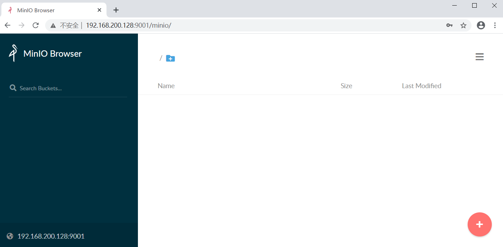

点击右下角的“+”号 ，点击下面的图标，创建一个桶

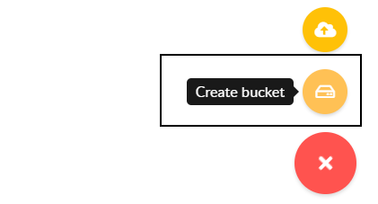

输入桶名称

### 5.4 代码解析    

以下代码来自lkd_vms_service（售货机微服务）

（1）在该项目中pom.xml添加以下依赖：

```xml
<dependency>
    <groupId>io.minio</groupId>
    <artifactId>minio</artifactId>
    <version>7.1.0</version>
</dependency>
```

（2）在售货机服务配置里添加MinIO配置节如下内容：

```yaml
minio:
  accessKey: minio
  secretKey: minio123
  bucket: lkd
  endpoint: http://192.168.200.128:9001
  readPath: http://192.168.200.128:9001
```

（3）配置映射类MinIOConfig

```java
package com.lkd.config;
import lombok.Data;
import org.springframework.boot.context.properties.ConfigurationProperties;
import org.springframework.context.annotation.Configuration;
@Configuration
@ConfigurationProperties("minio")
@Data
public class MinIOConfig {
    private String accessKey;
    private String secretKey;
    private String bucket;
    private String endpoint;
    private String readPath;
}
```

（4）在`lkd_vms_service`项目中新增包名`com.lkd.file`，在该包下创建文件管理类，用来接受并存储文件：

```java
package com.lkd.file;
import com.lkd.config.MinIOConfig;
import com.lkd.exception.LogicException;
import io.minio.*;
import lombok.extern.slf4j.Slf4j;
import org.springframework.beans.factory.annotation.Autowired;
import org.springframework.stereotype.Component;
import org.springframework.web.multipart.MultipartFile;

import java.io.IOException;
import java.security.InvalidKeyException;
import java.security.NoSuchAlgorithmException;

@Slf4j
@Component
public class FileManager {
    @Autowired
    private MinIOConfig minIOConfig;

    /**
     * 上传文件到MinIO
     * @param file
     * @throws NoSuchAlgorithmException
     * @throws IOException
     * @throws InvalidKeyException
     */
    public String uploadFile(MultipartFile file) {
        try {
            MinioClient minioClient = buildMinioClient();
            PutObjectArgs putObjectArgs = PutObjectArgs.builder()
                    .object(file.getOriginalFilename())
                    .contentType(file.getContentType())
                    .stream(file.getInputStream(),file.getSize(),-1)  // partSize -1表示整体(不分片)上传
                    .bucket(minIOConfig.getBucket())
                    .build();
            minioClient.putObject(putObjectArgs);
            StringBuilder sbPhotoPath = new StringBuilder(minIOConfig.getReadPath());
            sbPhotoPath.append(file.getOriginalFilename());
            return sbPhotoPath.toString();
        }catch (Exception ex){
            log.error("minio put file error.",ex);
            throw new LogicException("上传文件失败");
        }
    }

    private MinioClient buildMinioClient(){
        return MinioClient
                .builder()
                .credentials(minIOConfig.getAccessKey(),minIOConfig.getSecretKey())
                .endpoint(minIOConfig.getEndpoint())
                .build();
    }
}
```

（5）修改原来`SkuController`中的文件上传的方法`uploadSkuImage`，调用`FileManager`的方法如下：

```java
/**
     * 文件上传
     * @param file
     * @return
     */
@PostMapping(value = "/fileUpload")
@ResponseBody
public String uploadSkuImage(@RequestParam("fileName") MultipartFile file){
    return fileManager.uploadFile(file);
}
```

### 5.5 测试

#### 5.5.1 postman测试文件上传

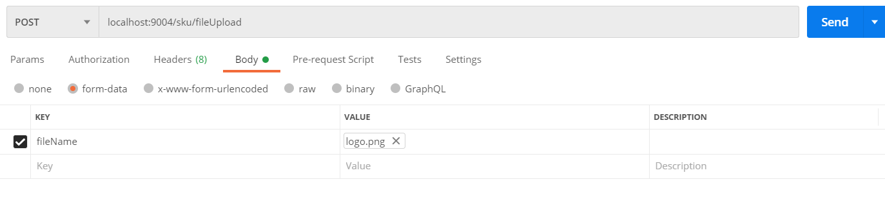

#### 5.5.2 常见错误

如果上传失败，显示的错误是

> io.minio.errors.ErrorResponseException: The difference between the request time and the server's time is too large.（请求时间和当前时间之间的差异太大）

那是由于当前的服务器时间不同步的问题，具体解决方法：

时间服务器上的时间同步的方法
（1）安装ntpdate工具

```
# yum -y install ntp ntpdate
```

（2）设置系统时间与网络时间同步

```
# ntpdate cn.pool.ntp.org
```

（3）将系统时间写入硬件时间

```
# hwclock --systohc
```

## 6. mybatisPlus让你专注业务开发

### 6.1 IService接口-代码清爽之美

在一个系统中，都有很多基本表只需要提供增删改查功能，以商品分类为例，我们在立可得1.0版本中业务逻辑层接口中对增删改查方法进行了定义

```java
package com.lkd.service;

import com.lkd.entity.SkuClassEntity;
import com.lkd.viewmodel.Page;

import java.util.List;
import java.util.Map;

public interface SkuClassService{
    /**
     * 根据id查询
     * @param id
     * @return
     */
    SkuClassEntity findById(Integer id);

    /**
     * 新增
     * @param skuClass
     * @return
     */
    boolean add(SkuClassEntity skuClass);

    /**
     * 修改
     * @param skuClassEntity
     * @return
     */
    boolean update(SkuClassEntity skuClassEntity);

    /**
     * 删除
     * @param id
     * @return
     */
    boolean delete(Integer id);

    /**
     * 条件查询
     * @param searchMap
     * @return
     */
    List<SkuClassEntity> findList(Map searchMap);

    /**
     * 分页查询
     * @param pageIndex
     * @param pageSize
     * @param searchMap
     * @return
     */
    Page<SkuClassEntity> findPage(long pageIndex, long pageSize, Map searchMap);
}
```

实现类SkuClassServiceImpl对方法进行了实现

```java
package com.lkd.service.impl;
import com.baomidou.mybatisplus.core.conditions.query.QueryWrapper;
import com.lkd.dao.SkuClassDao;
import com.lkd.entity.SkuClassEntity;
import com.lkd.service.SkuClassService;
import com.lkd.viewmodel.Page;
import org.springframework.beans.factory.annotation.Autowired;
import org.springframework.stereotype.Service;

import java.util.List;
import java.util.Map;

@Service
public class SkuClassServiceImpl implements SkuClassService{
    @Autowired
    private SkuClassDao skuClassDao;

    @Override
    public SkuClassEntity findById(Integer id) {
        return skuClassDao.selectById(id);
    }

    @Override
    public boolean add(SkuClassEntity skuClass) {
        return skuClassDao.insert(skuClass)>0;
    }

    @Override
    public boolean update(SkuClassEntity skuClassEntity) {
        return skuClassDao.updateById(skuClassEntity)>0;
    }

    @Override
    public boolean delete(Integer id) {
        return skuClassDao.deleteById(id)>0;
    }

    @Override
    public Page<SkuClassEntity> findPage(long pageIndex, long pageSize, Map searchMap) {
        com.baomidou.mybatisplus.extension.plugins.pagination.Page<SkuClassEntity> page =
                new com.baomidou.mybatisplus.extension.plugins.pagination.Page<>(pageIndex,pageSize);

        QueryWrapper queryWrapper = createQueryWrapper( searchMap );
        skuClassDao.selectPage( page,queryWrapper );

        Page<SkuClassEntity> pageResult = new Page<>();
        pageResult.setCurrentPageRecords(page.getRecords());
        pageResult.setPageIndex(page.getCurrent());
        pageResult.setPageSize(page.getSize());
        pageResult.setTotalCount(page.getTotal());
        return pageResult;
    }

    @Override
    public List<SkuClassEntity> findList(Map searchMap) {
        QueryWrapper queryWrapper = createQueryWrapper( searchMap );
        return skuClassDao.selectList( queryWrapper );
    }

    /**
     * 条件构建
     * @param searchMap
     * @return
     */
    private QueryWrapper createQueryWrapper(Map searchMap){
        QueryWrapper queryWrapper=new QueryWrapper(  );
        if(searchMap!=null){
            queryWrapper.allEq(searchMap);
        }
        return queryWrapper;
    }
}
```

上述代码是我们之前经常写的代码，看似好像没什么问题。但是当这样的功能比较多，你在写这样代码时是否感觉到很无聊呢？2.0中对这部分代码进行了改良。

业务接口：SkuClassService

```java
package com.lkd.service;

import com.baomidou.mybatisplus.extension.service.IService;
import com.lkd.entity.SkuClassEntity;
import com.lkd.viewmodel.Pager;

public interface SkuClassService extends IService<SkuClassEntity> {
    /**
     * 分页查询
     * @param pageIndex
     * @param pageSize
     * @param className
     * @return
     */
    Pager<SkuClassEntity> findPage(long pageIndex, long pageSize, String className);
}
```

只需要集成IService，那些基本的增删改查方法再也不用写了，只需要写特殊的业务方法即可。

业务实现类  SkuClassServiceImpl

```java
package com.lkd.service.impl;

import com.baomidou.mybatisplus.core.conditions.query.LambdaQueryWrapper;
import com.baomidou.mybatisplus.extension.plugins.pagination.Page;
import com.baomidou.mybatisplus.extension.service.impl.ServiceImpl;
import com.lkd.dao.SkuClassDao;
import com.lkd.entity.SkuClassEntity;
import com.lkd.service.SkuClassService;
import com.lkd.viewmodel.Pager;
import org.elasticsearch.common.Strings;
import org.springframework.stereotype.Service;

@Service
public class SkuClassServiceImpl extends ServiceImpl<SkuClassDao,SkuClassEntity> implements SkuClassService{
    @Override
    public Pager<SkuClassEntity> findPage(long pageIndex, long pageSize, String className) {
        var page = new Page<SkuClassEntity>(pageIndex,pageSize);
        if(Strings.isNullOrEmpty(className)){
            this.page(page);
        }else {
            var qw = new LambdaQueryWrapper<SkuClassEntity>();
            qw.like(SkuClassEntity::getClassName,className);

            this.page(page,qw);
        }
        return Pager.build(page);
    }
}
```

继承ServiceImpl并实现业务接口，只需要实现扩展的业务方法。

### 6.2 优雅的自动填充【*】

在一个工程中，有很多表有着相同的字段和相同的逻辑，比如数据创建时间和修改时间字段，都是取当前日期，这样我们每次写业务都要写相同的代码，比较麻烦。

mybatisPlus给我们提供了MetaObjectHandler用于自动填充字段值的功能。

service_common工程模块下GeneralMetaObjectHandler用于实现字段填充。

```java
package com.lkd.mybatis;
import com.baomidou.mybatisplus.core.handlers.MetaObjectHandler;
import lombok.extern.slf4j.Slf4j;
import org.apache.ibatis.reflection.MetaObject;
import org.springframework.stereotype.Component;
import java.time.LocalDateTime;
/**
 * mybatis自动填充字段
 */
@Slf4j
@Component
public class GeneralMetaObjectHandler implements MetaObjectHandler {
    @Override
    public void insertFill(MetaObject metaObject) {
        try {
            setFieldValByName("createTime", LocalDateTime.now(), metaObject);
            updateFill(metaObject);
        } catch (Exception e) {
            log.error("GeneralMetaObjectHandler error",e);
        }
    }

    @Override
    public void updateFill(MetaObject metaObject) {
        try {
            setFieldValByName("updateTime", LocalDateTime.now(), metaObject);
        } catch (Exception e) {
            log.error("GeneralMetaObjectHandler error",e);
        }
    }
}
```

实体类属性设置  @TableField(value = "create_time", fill = FieldFill.INSERT)   即可。

因为很多实体类都有createTime和updateTime这两个属性，所以我们创建一个父类，定义这两个属性

```java
package com.lkd.entity;

import com.baomidou.mybatisplus.annotation.FieldFill;
import com.baomidou.mybatisplus.annotation.TableField;
import lombok.Data;

import java.io.Serializable;
import java.time.LocalDateTime;

@Data
public class AbstractEntity implements Serializable {
    @TableField(value = "create_time", fill = FieldFill.INSERT)
    protected LocalDateTime createTime;
    @TableField(value = "update_time", fill = FieldFill.INSERT_UPDATE)
    protected LocalDateTime updateTime;
}
```

具体的实体类继承该类即可

```java
public class TaskEntity extends AbstractEntity implements Serializable{
}
```