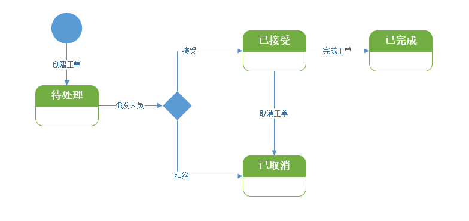
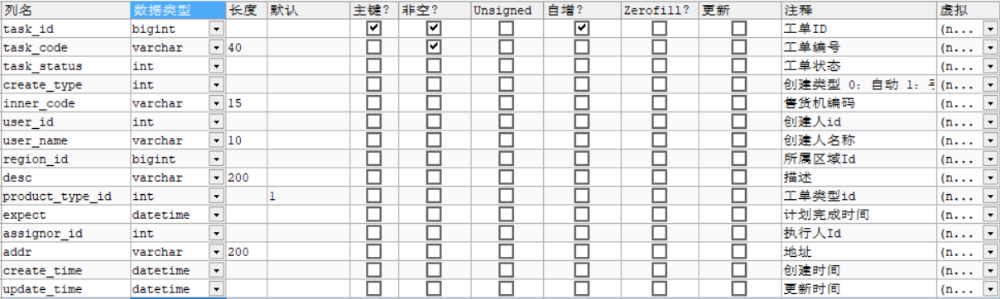
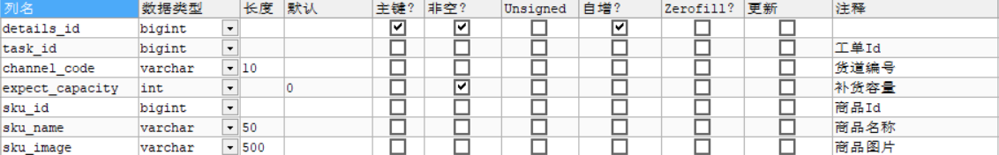
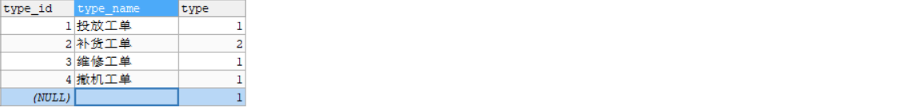
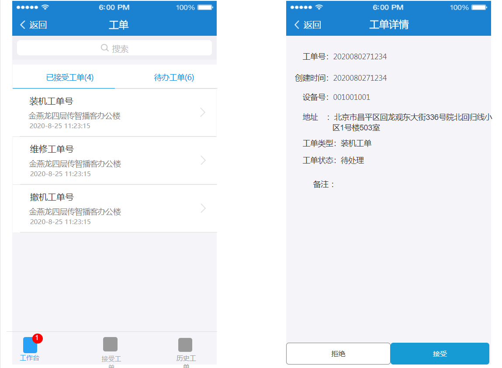
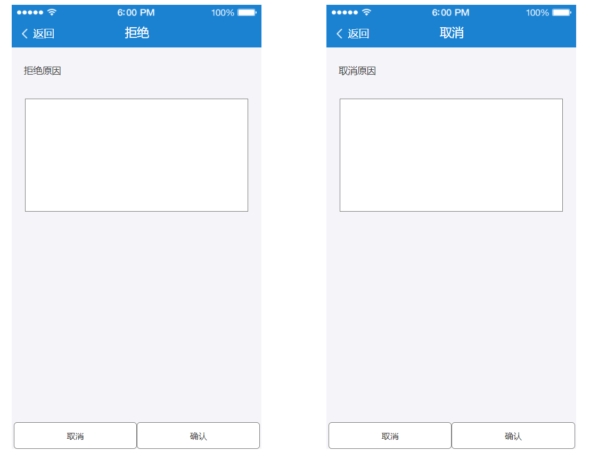
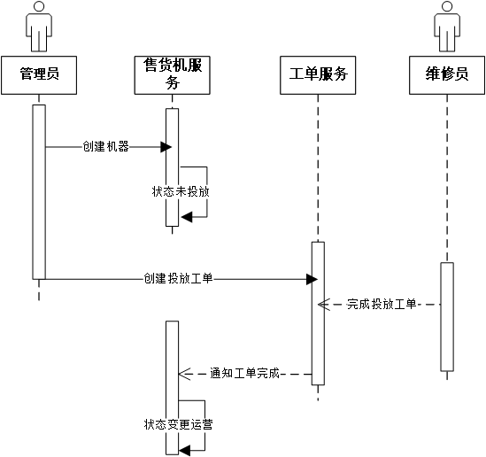
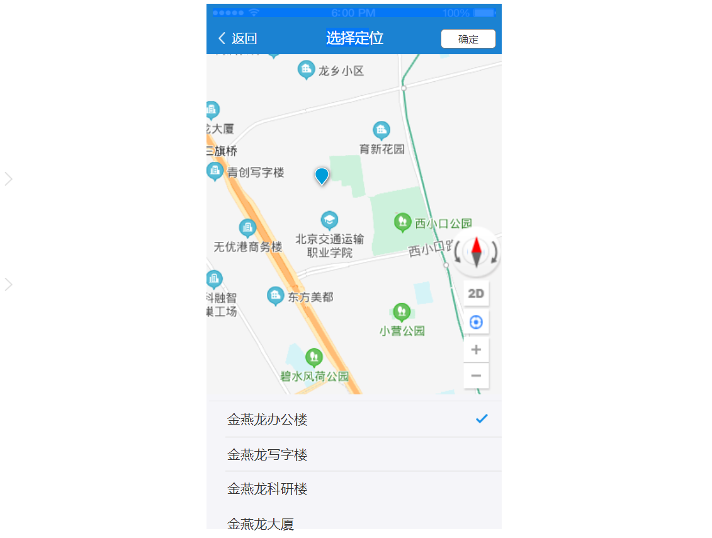
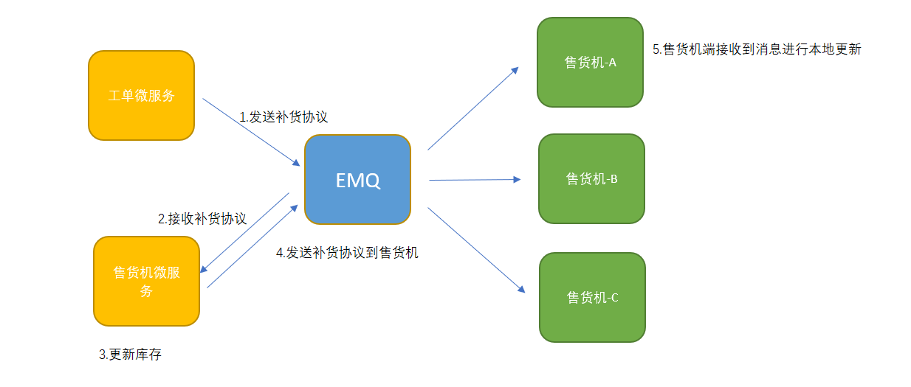

[toc]


# 第3章 工单核心业务开发

## 1. 微服务集成EMQ 

### 1.1 MQTT客户端- Paho 

Paho Java客户端是用Java编写的MQTT客户端库，用于开发在JVM或其他Java兼容平台（例如Android）上运行的应用程序。

Paho不仅可以对接EMQ X Broker，还可以对接满足符合MQTT协议规范的消息代理服务端。

### 1.2 基于Paho的代码实现 

#### 1.2.1 消息发布到EMQ  

（1）在项目`service_common`中，添加坐标依赖

```xml
<dependency>
    <groupId>org.eclipse.paho</groupId>
    <artifactId>org.eclipse.paho.client.mqttv3</artifactId>
    <version>1.2.5</version>
</dependency>
```

（2）配置文件中添加配置

```yaml
mqtt:
  client:
    username: admin
    password: public
    serverURI: tcp://192.168.200.128:1883
    clientId: monitor.task.${random.int[1000,9999]}
    keepAliveInterval: 10 #连接保持检查周期
    connectionTimeout: 30 #连接超时时间
  producer:
    defaultQos: 2 #消息质量
    defaultRetained: false #是否是保留消息
    defaultTopic: topic/test1 #默认主题
```

（3）在`service_common`项目中新建`emq`包，添加EMQ客户端配置类，该类里面封装了EMQ的连接配置和客户端对象：

```java
package com.lkd.emq;

import lombok.Data;
import org.eclipse.paho.client.mqttv3.*;
import org.eclipse.paho.client.mqttv3.persist.MemoryPersistence;
import org.springframework.beans.factory.annotation.Autowired;
import org.springframework.beans.factory.annotation.Value;
import org.springframework.boot.context.properties.ConfigurationProperties;
import org.springframework.context.annotation.Bean;
import org.springframework.context.annotation.Configuration;
import org.springframework.stereotype.Component;

import java.util.List;

@Configuration
@Component
@Data
@Slf4j
public class MqttConfig {
    @Value("${mqtt.client.username}")
    private String username;
    @Value("${mqtt.client.password}")
    private String password;
    @Value("${mqtt.client.serverURI}")
    private String serverURI;
    @Value("${mqtt.client.clientId}")
    private String clientId;
    @Value("${mqtt.client.keepAliveInterval}")
    private int keepAliveInterval;
    @Value("${mqtt.client.connectionTimeout}")
    private int connectionTimeout;

    @Bean
    public MqttClient mqttClient() {
        try {
            MqttClientPersistence persistence = mqttClientPersistence();
            MqttClient client = new MqttClient(serverURI, clientId, persistence);
            client.setManualAcks(true);
            client.connect(mqttConnectOptions());
            return client;
        } catch (MqttException e) {
            log.error("emq connect error",e);
            return null;
        }
    }

    @Bean
    public MqttConnectOptions mqttConnectOptions() {
        MqttConnectOptions options = new MqttConnectOptions();
        options.setUserName(username);
        options.setPassword(password.toCharArray());
        options.setCleanSession(true);
        options.setAutomaticReconnect(true);
        options.setConnectionTimeout(connectionTimeout);
        options.setKeepAliveInterval(keepAliveInterval);
        options.setMqttVersion(MqttConnectOptions.MQTT_VERSION_3_1_1);

        return options;
    }

    public MqttClientPersistence mqttClientPersistence() {
        return new MemoryPersistence();
    }
}
```

（4）service_common工程下新建emq包，包下创建mqtt生产者类

```java
package com.lkd.emq;

import com.fasterxml.jackson.core.JsonProcessingException;
import com.lkd.utils.JsonUtil;
import lombok.extern.slf4j.Slf4j;
import org.eclipse.paho.client.mqttv3.MqttClient;
import org.eclipse.paho.client.mqttv3.MqttException;
import org.springframework.beans.factory.annotation.Autowired;
import org.springframework.beans.factory.annotation.Value;
import org.springframework.stereotype.Component;

@Component
@Slf4j
public class MqttProducer {

    @Value("${mqtt.producer.defaultQos}")
    private int defaultProducerQos;
    @Value("${mqtt.producer.defaultRetained}")
    private boolean defaultRetained;
    @Value("${mqtt.producer.defaultTopic}")
    private String defaultTopic;

    @Autowired
    private MqttClient mqttClient;

    public void send(String payload) {
        this.send(defaultTopic, payload);
    }

    public void send(String topic, String payload) {
        this.send(topic, defaultProducerQos, payload);
    }

    public void send(String topic, int qos, String payload) {
        this.send(topic, qos, defaultRetained, payload);
    }

    public void send(String topic, int qos, boolean retained, String payload) {
        try {
            mqttClient.publish(topic, payload.getBytes(), qos, retained);
        } catch (MqttException e) {
            log.error("publish msg error.",e);
        }
    }

    public <T extends Object> void send(String topic, int qos, T msg) throws JsonProcessingException {
        String payload = JsonUtil.serialize(msg);
        this.send(topic,qos,payload);
    }
}
```

（5）编写单元测试代码 

```java
@RunWith(SpringRunner.class)
@SpringBootTest
public class TestEMQ {
    @Autowired
    private MqttProducer mqttProducer;

    @Test
    public void publish(){
        mqttProducer.send("lkdtest","{'name':'abc'}");
    }
}
```

#### 1.2.2 EMQ消息订阅 

（1）修改配置文件，添加订阅主题的配置

```yaml
mqtt:
  client:
    username: admin
    password: public
    serverURI: tcp://192.168.200.128:1883
    clientId: monitor.vms.${random.int[1000,9999]}
    keepAliveInterval: 10 #连接保持检查周期
    connectionTimeout: 30 #连接超时时间
  producer:
    defaultQos: 2 #消息质量
    defaultRetained: false #非保留消息
    defaultTopic: topic/test1
  consumer:
    consumerTopics: $queue/server/task/supply,$share/task/server/status
```

（2）在相同包下MQTT消息回调类，用来解析处理收到的mqtt消息和根据配置订阅关心的主题：

```java
package com.lkd.emq;

import lombok.extern.slf4j.Slf4j;
import org.eclipse.paho.client.mqttv3.*;
import org.springframework.beans.factory.annotation.Autowired;
import org.springframework.beans.factory.annotation.Value;
import org.springframework.stereotype.Component;

import java.util.List;

@Component
@Slf4j
public class MqttCallback implements MqttCallbackExtended {
    //需要订阅的topic配置
    @Value("${mqtt.consumer.consumerTopics}")
    private List<String> consumerTopics;

    @Autowired
    private MqttService mqttService;

    @Autowired
    private MqttClient mqttClient;

    @Override
    public void connectionLost(Throwable throwable) {
        log.error("emq error.",throwable);
    }

    @Override
    public void messageArrived(String topic, MqttMessage message) throws Exception {
        //处理消息
        mqttService.processMessage(topic, message);
        //处理成功后确认消息
        mqttClient.messageArrivedComplete(message.getId(),message.getQos());
    }

    @Override
    public void deliveryComplete(IMqttDeliveryToken iMqttDeliveryToken) {
        log.info("deliveryComplete---------" + iMqttDeliveryToken.isComplete());
    }


    @Override
    public void connectComplete(boolean b, String s) {
        //和EMQ连接成功后根据配置自动订阅topic
        if(consumerTopics != null && consumerTopics.size() > 0){
            consumerTopics.forEach(t->{
                try {
                        log.info(">>>>>>>>>>>>>>subscribe topic:"+t);
                        mqttClient.subscribe(t, 2);
                    } catch (MqttException e) {
                        log.error("emq connect error", e);
                    }
            });
        }
    }

    public void setMqttClient(MqttClient mqttClient) {
        this.mqttClient = mqttClient;
    }
}
```

（3）修改MqttConfig类，添加回调类

```java
    @Autowired
    private MqttCallback mqttCallback;//添加这句

    @Bean
    public MqttClient mqttClient() {
        try {
            MqttClientPersistence persistence = mqttClientPersistence();
            MqttClient client = new MqttClient(serverURI, clientId, persistence);
            client.setManualAcks(true);
            mqttCallback.setMqttClient(client);//添加这句
            client.setCallback(mqttCallback);//添加这句
            client.connect(mqttConnectOptions());
            return client;
        } catch (MqttException e) {
            log.error("emq connect error",e);
            return null;
        }
    }
```

### 1.3 消息分发处理架构

基于我们现有的架构 ，每一个需要处理消息的类只需要添加@ProcessType注解，并实现MsgHandler接口即可。@ProcessType是一个自定义注解，用于指定消息协议名称（关于消息协议我们在第1章有讲解）

```java
/**
 * 处理商品配置请求
 */
@Component
@ProcessType(value = "skuCfgReq")
public class SkuCfgMsgHandler implements MsgHandler{

    @Override
    public void process(String jsonMsg) throws IOException {
        //.......
    }
}
```

@ProcessType注解和消息处理接口MsgHandler在立可得1.0版本就已经存在，这里做到了兼容。

原理解析：

消息处理接口MsgHandler

```java
/**
 * 消息处理接口
 */
public interface MsgHandler{
    void process(String jsonMsg) throws IOException;
}
```

自定义注解ProcessType用于指定消息处理类协议名称

```java
package com.lkd.annotations;
import java.lang.annotation.*;
/**
 * 协议处理类型注解
 */
@Documented
@Retention(RetentionPolicy.RUNTIME)
@Target({ElementType.TYPE})
public @interface ProcessType{
    String value();
}
```

MsgHandlerContextImp实现了ApplicationContextAware接口，在微服务启动的时候扫描所有MsgHandler接口的实现类，并提取其ProcessType注解中定义的值（协议名称），将这些类加载到map集合中，以协议名称作为key，以类的对象作为值。

```java
private ApplicationContext ctx;
private Map<String, MsgHandler> handlerMap = Maps.newHashMap();

@Override
public void setApplicationContext(ApplicationContext applicationContext) throws BeansException {
    ctx = applicationContext;
    Map<String,MsgHandler> map = ctx.getBeansOfType(MsgHandler.class);
    map.values().stream().forEach(v->{
        String msgType = v.getClass().getAnnotation(ProcessType.class).value();
        handlerMap.put(msgType,v);
    });
}
```

这样我们就可以通过getMsgHandler方法，根据协议找到MsgHandler的实现类。getMsgHandler方法是MsgHandlerContext接口定义的

```java
public MsgHandler getMsgHandler(String msgType){
    return handlerMap.get(msgType);
}
```

在`emq`包下添加具体的消息处理接口定义：

```java
package com.lkd.emq;

import org.eclipse.paho.client.mqttv3.MqttMessage;

public interface MqttService {
    void processMessage(String topic, MqttMessage message);
}
```

同时添加接口实现类：

```java
package com.lkd.emq;

import com.google.common.base.Strings;
import com.lkd.business.MsgHandler;
import com.lkd.business.MsgHandlerContext;
import com.lkd.utils.JsonUtil;
import lombok.extern.slf4j.Slf4j;
import org.eclipse.paho.client.mqttv3.MqttMessage;
import org.springframework.beans.factory.annotation.Autowired;
import org.springframework.stereotype.Component;

import java.io.IOException;

@Component
@Slf4j
public class MqttServiceImpl implements MqttService{
    @Autowired
    private MsgHandlerContext msgHandlerContext;

    /**
     * mqtt消息处理
     * @param topic
     * @param message
     */
    @Override
    public void processMessage(String topic, MqttMessage message) {
        String msgContent = new String(message.getPayload());
        log.info("接收到消息:"+msgContent);
        try {
            String msgType = JsonUtil.getValueByNodeName("msgType",msgContent);
            if(Strings.isNullOrEmpty(msgType)) return;
            MsgHandler msgHandler = msgHandlerContext.getMsgHandler(msgType);
            if(msgHandler == null)return;
            msgHandler.process(msgContent);
        } catch (IOException e) {
            log.error("process msg error,msg is: "+msgContent,e);
        }
    }
}
```

在该实现类中调用了`MsgHandlerContext`将消息转发具体的消息处理实现类中，具体的消息实现类分布在各个微服务项目中，每一个具体的消息处理类就是一个`MsgHandler`接口的实现，该架构方式沿用了立可得1.0里的架构设计。

## 2. 工单业务流  

### 2.1 工单业务流分析  

立可得2.0对工单的业务流程进行了升级，添加了接受和拒绝工单的操作。

（1）管理人员登陆系统选择创建工单，在工单类型里选择合适的工单类型，在设备编号里输入正确的设备编号。

（2）运维人员在运维客户端里可以看到分配给自己的工单，根据实际情况选择接收工单并完成，或者拒绝/取消工单。



我们可以结合产品原型和设计稿来更深入理解工单业务。

产品原型：

https://app.mockplus.cn/run/prototype/tPerX4XrY4/BSJNfay9MlZ/oA1CE0pr_?dt=iPhone&ha=1&la=1&ps=1

设计稿：

https://app.mockplus.cn/run/design/WWk4pKFL3gM?dt=iPhone&ha=1&la=1&ps=1 

### 2.2 工单相关表结构分析

**数据库：lkd_production**

工单表 tb_task



补货工单明细表 tb_task_details  



工单类型表数据  tb_task_type



工单状态表  tb_task_status_type


### 2.3 代码实现   

#### 2.3.1 创建工单     

##### 2.3.1.1 视图模型废弃属性处理

工单的视图模型对象：

```java
package com.lkd.http.viewModel;

import lombok.Data;

import java.io.Serializable;
import java.util.List;

@Data
public class TaskViewModel implements Serializable{
    /**
     * 工单名称
     */
    private String taskName;
  
    /**
     * 工单类型
     */
    private int createType;
  
    /**
     * 关联设备编号
     */
    private String innerCode;
  
    /**
     * 用户创建人id
     */
    private Integer userId;

    /**
     * 任务分配人Id
     */
    private Integer assignorId;

    /**
     * 工单类型
     */
    private int productType;
  
    /**
     * 描述信息
     */
    private String desc;
  
    /**
     * 期望完成时间
     */
    private String expect;
  
    /**
     * 工单详情(只有补货工单才涉及)
     */
    private List<TaskDetailsViewModel> details;
}
```

taskName和expect两个属性在2.0已经废弃，我们需要添加@Deprecated标注。

注解 @Deprecated 可以标记 Java API 状态，可以是以下几种：

- 使用它存在风险，可能导致错误
- 可能在未来版本中不兼容
- 可能在未来版本中删除
- 一个更好和更高效的方案已经取代它。

工单详情视图模型 TaskDetailsViewModel

```java
package com.lkd.http.viewModel;

import lombok.Data;

@Data
public class TaskDetailsViewModel{
    /**
     * 货道编号
     */
    private String channelCode;
    /**
     * 补货数量
     */
    private int expectCapacity;
    /**
     * 商品Id
     */
    private Long skuId;
    /**
     * 商品名称
     */
    private String skuName;
    /**
     * 商品图片
     */
    private String skuImage;
}
```

##### 2.3.1.2 验证工单逻辑分析

checkCreateTask方法用于工单状态的校验

```java
private void checkCreateTask(String innerCode,int productType) throws LogicException {
    VendingMachineViewModel vmInfo = vmService.getVMInfo(innerCode);
    if(vmInfo == null) throw new LogicException("设备校验失败");
    if(productType == VMSystem.TASK_TYPE_DEPLOY  && vmInfo.getVmStatus() == VMSystem.VM_STATUS_RUNNING){
        throw new LogicException("该设备已在运营");
    }

    if(productType == VMSystem.TASK_TYPE_SUPPLY  && vmInfo.getVmStatus() != VMSystem.VM_STATUS_RUNNING){
        throw new LogicException("该设备不在运营状态");
    }

    if(productType == VMSystem.TASK_TYPE_REVOKE  && vmInfo.getVmStatus() != VMSystem.VM_STATUS_RUNNING){
        throw new LogicException("该设备不在运营状态");
    }
}
```

##### 2.3.1.3 复制属性代码优化

如果是运维（投放、维修、撤机）工单，只需要在工单表新增一条记录即可

如果是运营（补货）工单，则需要在工单表新增一条记录，并在工单明细表新增多条记录。

在工单服务接口的实现类创建工单的方法`createTask`

```java
@Override
@Transactional(rollbackFor = {Exception.class},noRollbackFor = {LogicException.class})
public boolean createTask(TaskViewModel taskViewModel) throws LogicException {
    checkCreateTask(taskViewModel.getInnerCode(),taskViewModel.getProductType());//验证
    if(hasTask(taskViewModel.getInnerCode(),taskViewModel.getProductType())) {
        throw new LogicException("该机器有未完成的同类型工单");
    }

    //新增工单表记录
    TaskEntity taskEntity = new TaskEntity();
    taskEntity.setTaskStatus(VMSystem.TASK_STATUS_CREATE);
    taskEntity.setCreateType(taskViewModel.getCreateType());
    taskEntity.setDesc(taskViewModel.getDesc());
    taskEntity.setProductTypeId(taskViewModel.getProductType());

    String userName = userService.getUser(taskViewModel.getAssignorId()).getUserName();
    taskEntity.setUserName(userName);
    taskEntity.setInnerCode(taskViewModel.getInnerCode());
    taskEntity.setAssignorId(taskViewModel.getAssignorId());

    DateTimeFormatter df = DateTimeFormatter.ofPattern("yyyy-MM-dd");
    LocalDate date = LocalDate.parse(taskViewModel.getExpect(),df);
    LocalDateTime dateTime = date.atStartOfDay();
    taskEntity.setExpect(dateTime);

    taskEntity.setUserId(taskViewModel.getUserId());
    taskEntity.setAddr(vmService.getVMInfo(taskViewModel.getInnerCode()).getNodeAddr());

    this.save(taskEntity);

    //如果是补货工单，向 工单明细表插入记录
    if(taskEntity.getProductTypeId() == VMSystem.TASK_TYPE_SUPPLY){
        taskViewModel.getDetails().forEach(d->{
            TaskDetailsEntity detailsEntity = new TaskDetailsEntity();
            detailsEntity.setChannelCode(d.getChannelCode());
            detailsEntity.setExpectCapacity(d.getExpectCapacity());
            detailsEntity.setTaskId(taskEntity.getTaskId());
            detailsEntity.setSkuId(d.getSkuId());
            detailsEntity.setSkuName(d.getSkuName());
            detailsEntity.setSkuImage(d.getSkuImage());
            taskDetailsService.save(detailsEntity);
        });
    }

    return true;
}
```

改造后的代码如下：

```java
@Override
@Transactional(rollbackFor = {Exception.class},noRollbackFor = {LogicException.class})
public boolean createTask(TaskViewModel taskViewModel) throws LogicException {
    checkCreateTask(taskViewModel.getInnerCode(),taskViewModel.getProductType());//验证
    if(hasTask(taskViewModel.getInnerCode(),taskViewModel.getProductType())) {
        throw new LogicException("该机器有未完成的同类型工单");
    }
    //新增工单表记录
    TaskEntity taskEntity = new TaskEntity();
    BeanUtils.copyProperties(taskViewModel,taskEntity);//复制属性
    taskEntity.setTaskStatus(VMSystem.TASK_STATUS_CREATE);
    taskEntity.setProductTypeId(taskViewModel.getProductType());
    String userName = userService.getUser(taskViewModel.getUserId()).getUserName();
    taskEntity.setUserName(userName);
    taskEntity.setAddr(vmService.getVMInfo(taskViewModel.getInnerCode()).getNodeAddr());
    this.save(taskEntity);

    //如果是补货工单，向 工单明细表插入记录
    if(taskEntity.getProductTypeId() == VMSystem.TASK_TYPE_SUPPLY){
        taskViewModel.getDetails().forEach(d->{
            TaskDetailsEntity detailsEntity = new TaskDetailsEntity();
            BeanUtils.copyProperties( d,detailsEntity );
            detailsEntity.setTaskId(taskEntity.getTaskId());
            taskDetailsService.save(detailsEntity);
        });
    }
    return true;
}
```

##### 2.3.1.4 工单编号生成逻辑

工单编号为12位，由8位日期+4位当日工单序号组成。

创建generateTaskCode方法用于生成工单的编号

```java
/**
 * 生成工单编号
 * @return
 */
private String generateTaskCode(){
    //日期+序号
    String date = LocalDate.now().format(DateTimeFormatter.ofPattern("yyyyMMdd"));  //日期字符串
    String key= "lkd.task.code."+date; //redis key
    Object obj = redisTemplate.opsForValue().get(key);
    if(obj==null){
        redisTemplate.opsForValue().set(key,1L, Duration.ofDays(1) );
        return date+"0001";
    }
    return date+  Strings.padStart( redisTemplate.opsForValue().increment(key,1).toString(),4,'0');
}
```

Strings.padStart()方法用于补字符占位。

```
taskEntity.setTaskCode(this.generateTaskCode());
```


##### 2.3.1.5 获取当前登录用户ID

TaskController继承BaseController，所以可以使用getUserId() 方法获取当前登录用户。

TaskController的create方法用于创建工单

```java
/**
 * 创建工单
 * @param task
 * @return
 */
@PostMapping("/create")
public boolean create(@RequestBody TaskViewModel task) throws LogicException {
    task.setUserId( getUserId() );
    return taskService.createTask(task);
}
```

userId为创建工单的用户，无论前端传递的值是什么，在controller都会被覆盖为当前登录用户。

##### 2.3.1.6 获取当前登录用户名称

（1）TaskViewModel新增属性

```java
/**
 * 用户名称
 */
private String userName;
```

（2）修改TaskController的create方法，添加用户名称的设置

```java
/**
 * 创建工单
 * @param task
 * @return
 */
@PostMapping("/create")
public boolean create(@RequestBody TaskViewModel task) throws LogicException {
    task.setUserId( getUserId() );//设置当前登录用户id
    task.setUserName(getUserName());//设置当前登录用户名称
    return taskService.createTask(task);
}
```

（3）删减或注释TaskServiceImpl的createTask方法中设置用户名称的两行代码

```java
//String userName = userService.getUser(taskViewModel.getUserId()).getUserName();
//taskEntity.setUserName(userName);
```

#### 2.3.2 接受工单   




（1）逻辑开发。接受工单逻辑比较简单，按ID查询工单，修改工单状态为“已接受”。

TaskService新增方法定义

```java
/**
 * 接受工单
 * @param id
 * @return
 */
Boolean accept(Long id);
```

TaskServiceImpl实现此方法

```java
@Override
public boolean accept(Long id) {
    TaskEntity task = this.getById(id);  //查询工单
    if(task.getTaskStatus()!= VMSystem.TASK_STATUS_CREATE ){
        throw new LogicException("工单状态不是待处理");
    }
    task.setTaskStatus( VMSystem.TASK_STATUS_PROGRESS );//修改工单状态为进行
    return this.updateById(task);
}
```

（2）TaskController新增方法

```java
/**
 * 接受工单
 * @param taskId
 * @return
 */
@GetMapping("/accept/{taskId}")
public boolean accept( @PathVariable  String taskId){
    Long id = Long.valueOf(taskId);
    //判断工单执行人是否为当前登录用户
    TaskEntity task = taskService.getById(id);
    if(task.getAssignorId().intValue()!=getUserId().intValue() ){
        throw new LogicException("操作非法");
    }
    return taskService.accept( id );
}
```

注意：我们一定要判断当前的登录人是否为该工单的执行人，屏蔽掉非法操作。

#### 2.3.3 取消工单    



（1）新建类CancelTaskViewModel

```java
package com.lkd.http.viewModel;

import lombok.Data;

import java.io.Serializable;

@Data
public class CancelTaskViewModel implements Serializable {
    /**
     * 拒绝理由
     */
    private String desc;
}
```

（2）TaskService新增方法定义

```java
/**
 * 取消工单
 * @param id
 * @return
*/
boolean cancelTask(long id, CancelTaskViewModel cancelVM);
```

 TaskServiceImpl实现该方法

```java
@Override
public boolean cancelTask(long id, CancelTaskViewModel cancelVM) {
    TaskEntity task = this.getById(id);
    if(task.getTaskStatus() == VMSystem.TASK_STATUS_FINISH || task.getTaskStatus() == VMSystem.TASK_STATUS_CANCEL){
        throw new LogicException("该工单已经结束");
    }
    task.setTaskStatus(VMSystem.TASK_STATUS_CANCEL);
    task.setDesc(cancelVM.getDesc());

    return this.updateById(task);
}
```

（3）TaskController新增方法

```java
/**
 * 取消工单
 * @param taskId
 * @return
 */
@PostMapping("/cancel/{taskId}")
public boolean cancel(@PathVariable String taskId,@RequestBody CancelTaskViewModel cancelVM){
    return taskService.cancelTask(Long.valueOf(taskId),cancelVM);
}
```


## 3.完成运维工单   

### 3.1 通知售货机状态变更   

#### 3.1.1 需求分析   

如果是投放工单：维修人员将设备投放到点位后完成工单，工单服务通过EMQ通知售货机服务；如果是撤机工单：维修人员将该设备撤机完成后，工单服务会通过EMQ通知售货机服务。售货机服务接收到EMQ的消息通知根据工单的类型来修改售货机的状态。

工单的具体业务流程如下：



#### 3.1.2 实现思路    

（1）定义好消息主题与协议体。

（2）工单完成后，工单微服务向EMQ发送消息。

（3）售货机微服务订阅EMQ消息，更改售货机完成状态。

#### 3.1.3 代码实现   

##### 3.1.3.1 消息主题与协议设计

消息主题：server/task/completed  （在TopicConfig类中有各种消息主题的定义）

完成工单协议 taskCompleted

```json
//传输方向：server->server
{
"msgType":"taskCompleted",
"innerCode":"112221112",
"taskType":1
}
```

公共服务模块com.lkd.contract包下的TaskCompleteContract用于封装协议内容

```java
/**
 * 完成工单协议
 */
@Data
public class TaskCompleteContract extends BaseContract{
    public TaskCompleteContract() {
        this.setMsgType("taskCompleted");
    }
    private int taskType;
}
```

父类BaseContract内容

```java
@Data
public abstract class BaseContract extends AbstractContract implements Serializable{
    /**
     * 协议通信匹配码
     */
    private long sn;
    /**
     * InnerCode售货机编号
     */
    private String innerCode;
    /**
     * 是否需要回馈
     */
    private boolean needResp;
}
```

祖父类AbstractContract

```java
@Data
public abstract class AbstractContract implements Serializable {
    /**
     * 消息类型
     */
    protected String msgType;
}
```

##### 3.1.3.2 工单微服务发送消息

TaskServiceImpl完成工单的方法

```java
@Override
public boolean completeTask(long id) {
    TaskEntity taskEntity = this.getById(id);
    if(taskEntity.getTaskStatus()== VMSystem.TASK_STATUS_FINISH  || taskEntity.getTaskStatus()== VMSystem.TASK_STATUS_CANCEL ){
        throw new LogicException("工单已经结束");
    }
    taskEntity.setTaskStatus(VMSystem.TASK_STATUS_FINISH);
    this.updateById(taskEntity);
    //todo: 向消息队列发送消息，通知售货机更改状态
    return true;
}
```

TaskServiceImpl注入消息生产者

```java
@Autowired
private MqttProducer mqttProducer;
```

修改完成工单的方法，添加根据工单的类型构建相应的完成工单的消息发送到EMQ：

```java
//向消息队列发送消息，通知售货机更改状态
//封装协议
TaskCompleteContract taskCompleteContract=new TaskCompleteContract();
taskCompleteContract.setInnerCode(taskEntity.getInnerCode());//售货机编号
taskCompleteContract.setTaskType( taskEntity.getProductTypeId() );//工单类型
//发送到emq
try {
    mqttProducer.send( TopicConfig.COMPLETED_TASK_TOPIC,2, taskCompleteContract );
} catch (Exception e) {
    log.error("发送工单完成协议出错");
    throw new LogicException("发送工单完成协议出错");
}
```

##### 3.1.3.3 售货机服务接收消息

（1）在售货机服务的配置里添加订阅完成工单消息主题的配置，并编写接收工单完成消息的处理逻辑：

主要需要修改mqtt配置节如下：

```yaml
mqtt:
  client:
    username: admin1
    password: public1
    serverURI: tcp://172.17.0.231:1883
    clientId: monitor.vms.${random.int[1000,9999]}
    keepAliveInterval: 10
    connectionTimeout: 30
  producer:
    defaultQos: 2
    defaultRetained: false
    defaultTopic: topic/test1
  consumer:
    consumerTopics: $share/vms/server/#,$queue/server/task/completed
```

（2）在售货机服务里项目`lkd_vms_service`中编写工单完成的处理逻辑，只需要实现一个消息处理的Handler即可，com.lkd.business.msgHandler包下创建TaskCompletedMsgHandler

```java
/**
 * 工单完成处理
 */
@Component
@ProcessType("taskCompleted")
public class TaskCompletedMsgHandler implements MsgHandler {

    @Autowired
    private VendingMachineService vmService;//售货机服务


    @Override
    public void process(String jsonMsg) throws IOException {
        TaskCompleteContract taskCompleteContract= JsonUtil.getByJson(jsonMsg, TaskCompleteContract.class );
        if(taskCompleteContract==null || Strings.isNullOrEmpty(taskCompleteContract.getInnerCode())  ) return;

        //如果是投放工单，将售货机修改为运营状态
        if( taskCompleteContract.getTaskType()== VMSystem.TASK_TYPE_DEPLOY){
            vmService.updateStatus(  taskCompleteContract.getInnerCode(), VMSystem.VM_STATUS_RUNNING   );
        }

        //如果是撤机工单，将售货机修改为撤机状态
        if( taskCompleteContract.getTaskType()== VMSystem.TASK_TYPE_REVOKE){
            vmService.updateStatus(  taskCompleteContract.getInnerCode(), VMSystem.VM_STATUS_REVOKE  );
        }                
    }
}
```

### 3.2 采集设备坐标与地址   

#### 3.2.1 需求分析   

在运维人员完成投放工单的时候需要将设备的地理坐标位置信息采集回来存储到系统中，这样做的目的是为了用户在立可得小程序中购物时，点击搜索附近售货机时，根据用户的坐标信息搜索他周围附近范围内是否存在售货机。



#### 3.2.2 实现思路   

（1）修改原有的完成工单协议，增加经度和纬度。

（2）重载完成工单的接口，添加经纬度和地址。

（3）在运维人员完成工单时需要客户端程序采集gps坐标点信息，然后将这些信息传入到完成工单接口里

（4）工单服务将这些信息通过完成工单的消息同步到售货机服务中。

（5）售货机服务将坐标信息同时保存到数据库和ElasticSearch中，方便其他业务根据地理位置进行查询搜索

#### 3.2.3 代码实现   

##### 3.2.3.1 工单微服务采集坐标信息

（1） 修改完成工单的协议对象添加用来传递经纬度数据的字段：

```java
    /**
     * 纬度
     */
    private Double lat;
    /**
     * 经度
     */
    private Double lon;
```

（2）在工单服务里修改原有工单服务接口完成工单方法、接口实现类完成工单方法

工单服务接口`TaskService`重载方法completeTask

```java
/**
 * 完成工单
 * @param id
 * @param lat 纬度
 * @param lon 经度
 * @return
 */
boolean completeTask(long id,Double lat,Double lon,String addr);
```

同时修改接口实现类`TaskServiceImpl`，重载completeTask方法

```java
@Override
@Transactional
public boolean completeTask(long id) {
    return  completeTask(id,0d,0d,"");
}

@Override
public boolean completeTask(long id, Double lat, Double lon, String addr) {
    TaskEntity taskEntity = this.getById(id);
    if(taskEntity.getTaskStatus()== VMSystem.TASK_STATUS_FINISH  || taskEntity.getTaskStatus()== VMSystem.TASK_STATUS_CANCEL ){
        throw new LogicException("工单已经结束");
    }
    taskEntity.setTaskStatus(VMSystem.TASK_STATUS_FINISH);
    taskEntity.setAddr(addr);
    this.updateById(taskEntity);
  
	//封装协议
    TaskCompleteContract taskCompleteContract=new TaskCompleteContract();
    taskCompleteContract.setInnerCode(taskEntity.getInnerCode());//售货机编号
    taskCompleteContract.setTaskType( taskEntity.getProductTypeId() );//工单类型
    taskCompleteContract.setLat(lat);//纬度
    taskCompleteContract.setLon(lon);//经度
    //发送到emq
    try {
        mqttProducer.send( TopicConfig.COMPLETED_TASK_TOPIC,2, taskCompleteContract );
    } catch (Exception e) {
        log.error("发送工单完成协议出错");
        throw new LogicException("发送工单完成协议出错");
    }

    return true;
}
```

（3）修改TaskController添加接收经纬度信息的参数，并将接收到的参数传入服务方法里：

```java
/**
 * 完成工单
 * @param taskId
 * @return
 */
@GetMapping("/complete/{taskId}")
public boolean complete(
        @PathVariable("taskId") String taskId,
        @RequestParam(value = "lat",required = false,defaultValue = "0") Double lat,
        @RequestParam(value = "lon",required = false,defaultValue = "0") Double lon,
        @RequestParam(value = "addr",required = false,defaultValue = "")String addr){
    return taskService.completeTask(Long.valueOf(taskId),lat,lon,addr);
}
```

##### 3.2.3.2 售货机服务接收坐标信息

修改TaskCompletedMsgHandler的process方法，如果是投放工单，需要保存设备的坐标到数据库和es

```java
//如果是投放工单，将售货机修改为运营状态
if( taskCompleteContract.getTaskType()== VMSystem.TASK_TYPE_DEPLOY){
    vmService.updateStatus(  taskCompleteContract.getInnerCode(), VMSystem.VM_STATUS_RUNNING   );
    //TODO: 保存设备的坐标（数据库+es）
}
```

具体保存坐标的代码，我们在本章节不实现。后续章节中会专门讲解。

## 4. 完成补货工单 

### 4.1 需求分析 

运营人员能够在客户端上完成和取消补货工单。

在实际业务中，补货人员在将售货机补完商品之后，会在运营客户端中进入工单详情里，点击完成按钮完成该工单，工单完成之后，需要通知到售货机服务去更新库存，售货机服务要将设备的商品信息、货道配置信息及补货完成后的容量下发到售货机。

### 4.2 实现思路 

（1）在完成工单接口中根据传入的工单Id取出工单数据，判断是否是补货工单。如果是补货工单，构建补货工单完成消息，并将消息通过EMQ发送出去

（2）售货机服务订阅补货工单消息，收到消息后更新售货机库存并将售货机的数据同步到售货机端

（3）售货机端收到消息进行本地更新



### 4.3 代码实现 

#### 4.3.1 补货协议与封装类

该协议消息是在服务端完成补货时将协议内容下发到客户端，客户端处理完成后将结果回馈

```json
//传输方向：server->client
{
"msgType":"supplyReq",
"sn":342424343,
"vmId":"01012121",//售货机编号
"needResp":true,
"versionId":1,//版本号
"supplyData":
			[{
				"channelId":"1-1",//货道编号
				"capacity":5,//补货数量
			},...]
}
```

客户端回馈:

```json
//传输方向：client->server
{
	"msgType":"ack",
	"sn":111111,
	"vmId":"01012121",
    "needResp":false,
}
```

定义补货配置消息对象，用来将补货完成的发送到售货机服务

```java
package com.lkd.contract;

import lombok.Data;

import java.io.Serializable;

/**
 * 补货货道数据
 */
@Data
public class SupplyChannel implements Serializable{
    /**
     * 货道编号
     */
    private String channelId;
    /**
     * 补货容量
     */
    private int capacity;
}
```

```java
package com.lkd.contract;

import lombok.Data;

import java.util.List;

/**
 * 补货
 */
@Data
public class SupplyCfg extends BaseContract{
    private static final long serialVersionUID = -204540876123335095L;
    /**
     * 补货版本号
     */
    private long versionId;
  
  
    /**
     * 补货数据
     */
    private List<SupplyChannel> supplyData;

    public SupplyCfg() {
        this.setMsgType("supplyResp");
    }
}
```

#### 4.3.2 发送补货信息

修改工单服务实现类`TaskServiceImpl`中的完成工单方法`completeTask`加入判断是补货工单的逻辑，如果是补货工单，构建通知消息对象，并将该消息发送到EMQ:

修改`TaskServiceImpl`中noticeVMServiceSupply方法，添加发送协议代码

```java
/**
 * 补货协议封装与下发
 * @param taskEntity
 */
private void noticeVMServiceSupply(TaskEntity taskEntity){

    //协议内容封装
    //1.根据工单id查询工单明细表
    QueryWrapper<TaskDetailsEntity> qw = new QueryWrapper<>();
    qw.lambda()
            .eq(TaskDetailsEntity::getTaskId,taskEntity.getTaskId());
    List<TaskDetailsEntity> details = taskDetailsService.list(qw);
    //2.构建协议内容
    SupplyCfg supplyCfg = new SupplyCfg();
    supplyCfg.setInnerCode(taskEntity.getInnerCode());//售货机编号
    List<SupplyChannel> supplyChannels = Lists.newArrayList();//补货数据
    //从工单明细表提取数据加到补货数据中
    details.forEach(d->{
        SupplyChannel channel = new SupplyChannel();
        channel.setChannelId(d.getChannelCode());
        channel.setCapacity(d.getExpectCapacity());
        supplyChannels.add(channel);
    });
    supplyCfg.setSupplyData(supplyChannels);

    //2.下发补货协议
    //发送到emq
    try {
        mqttProducer.send( TopicConfig.COMPLETED_TASK_TOPIC,2, supplyCfg );
    } catch (Exception e) {
        log.error("发送工单完成协议出错");
        throw new LogicException("发送工单完成协议出错");
    }
}
```

我们也将运维工单的协议封装为一个私有方法

```java
/**
 * 运维工单封装与下发
 * @param taskEntity
 */
private void noticeVMServiceStatus(TaskEntity taskEntity,Double lat,Double lon){
    //向消息队列发送消息，通知售货机更改状态
    //封装协议
    TaskCompleteContract taskCompleteContract=new TaskCompleteContract();
    taskCompleteContract.setInnerCode(taskEntity.getInnerCode());//售货机编号
    taskCompleteContract.setTaskType( taskEntity.getProductTypeId() );//工单类型
    taskCompleteContract.setLat(lat);//纬度
    taskCompleteContract.setLon(lon);//经度
    //发送到emq
    try {
        mqttProducer.send( TopicConfig.COMPLETED_TASK_TOPIC,2, taskCompleteContract );
    } catch (Exception e) {
        log.error("发送工单完成协议出错");
        throw new LogicException("发送工单完成协议出错");
    }
}
```

修改完成工单的方法`completeTask`，进行工单类型的判断，如果是补货工单，则调用`noticeVMServiceSupply`方法，如果是投放或撤机则调用

```java
@Override
public boolean completeTask(long id, Double lat, Double lon, String addr) {
    TaskEntity taskEntity = this.getById(id);
    if(taskEntity.getTaskStatus()== VMSystem.TASK_STATUS_FINISH  || taskEntity.getTaskStatus()== VMSystem.TASK_STATUS_CANCEL ){
        throw new LogicException("工单已经结束");
    }
    taskEntity.setTaskStatus(VMSystem.TASK_STATUS_FINISH);
    taskEntity.setAddr(addr);
    this.updateById(taskEntity);

    //如果是补货工单
    if(taskEntity.getProductTypeId()==VMSystem.TASK_TYPE_SUPPLY){
        noticeVMServiceSupply(taskEntity);
    }

    //如果是投放工单或撤机工单
    if(taskEntity.getProductTypeId()==VMSystem.TASK_TYPE_DEPLOY
            || taskEntity.getProductTypeId()==VMSystem.TASK_TYPE_REVOKE){
        noticeVMServiceStatus(taskEntity,lat,lon);
    }
    return true;
}
```

#### 4.3.3 售货机服务补货消息处理

修改lkd_vms_service的补货消息处理类SupplyCfgMsgHandler，完成todo部分代码

```java
/**
 * 补货消息处理
 */
@Component
@ProcessType(value = "supplyResp")
@Slf4j
public class SupplyCfgMsgHandler implements MsgHandler {
    @Autowired
    private VendingMachineService vmService;
    @Autowired
    private VmCfgVersionService versionService;

    @Autowired
    private VmCfgService vmCfgService;

    @Autowired
    private MqttProducer  mqttProducer;

    @Override
    public void process(String jsonMsg) throws IOException {
        //解析补货协议
        SupplyCfg supplyCfg = JsonUtil.getByJson(jsonMsg, SupplyCfg.class);
        //更新售货机库存
        vmService.supply(supplyCfg);

        String innerCode = supplyCfg.getInnerCode();//获取售货机编号
        VmCfgVersionEntity vsersion = versionService.getVmVersion(innerCode);//获取版本

        //主题
        String topic = TopicConfig.TO_VM_TOPIC + innerCode;

        //下发商品配置
        SkuCfg skuCfg = vmCfgService.getSkuCfg(innerCode);
        skuCfg.setSn(System.nanoTime());//纳秒
        skuCfg.setVersionId(vsersion.getSkuCfgVersion());
        //将商品配置发送到售货机
        mqttProducer.send(topic,2,skuCfg);


        //下发价格配置
        SkuPriceCfg skuPriceCfg = vmCfgService.getSkuPriceCfg(innerCode);
        skuPriceCfg.setSn(System.nanoTime());
        skuPriceCfg.setVersionId(vsersion.getPriceCfgVersion());
        //将价格配置发送到售货机
        mqttProducer.send(topic,2,skuPriceCfg);

        //下发货道配置
        ChannelCfg channelCfg = vmCfgService.getChannelCfg(innerCode);
        channelCfg.setSn(System.nanoTime());
        channelCfg.setVersionId(vsersion.getChannelCfgVersion());
        //将货道配置发送到售货机
        mqttProducer.send(topic,2,channelCfg);

        //下发补货信息
        supplyCfg.setVersionId(vsersion.getSupplyVersion());
        supplyCfg.setNeedResp(true);
        supplyCfg.setSn(System.nanoTime());
        supplyCfg.setVersionId(vsersion.getSupplyVersion());
        //将补货信息发送到售货机
        mqttProducer.send(topic,2,supplyCfg);

    }
}
```

