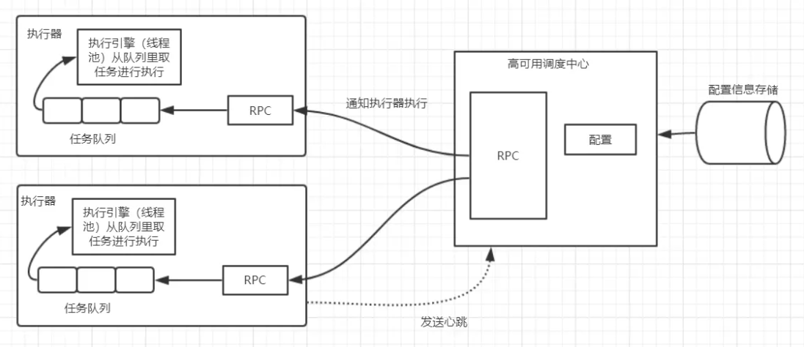
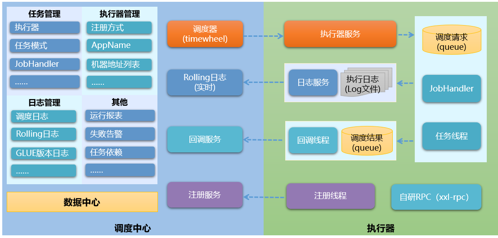
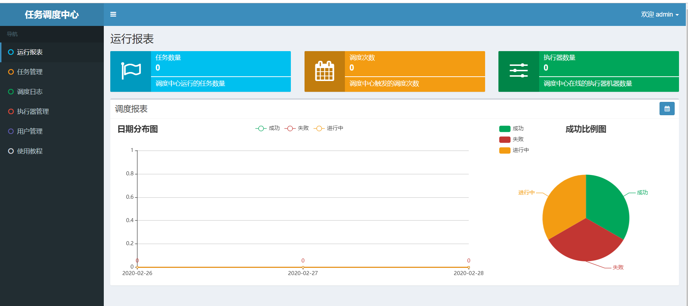

[toc]


# 第4章 自动化运营与运维解决方案

## 1.分布式任务调度-XXL-JOB 

### 1.1 分布式任务调度

在实际的开发中，定时执行某任务是非常常见的需求。首先我们先回顾一下，spring框架内置的定时任务框架（SpringTask），代码如下：

```java
@Slf4j
@Component //使spring管理
@EnableScheduling //定时任务注解
public class Timer {
    @Scheduled(cron = "0/10 * * * * ?")
    public void notifyOrder(){
        log.info("timer notifyOrder ....");     
        //todo: some logic
    }
}
```

Spring定时任务存在的问题：

- 不支持集群部署：比如你启动三个实例，每个实例都会去触发执行器去执行“优惠券要过期给用户发送一个提醒”这个任务，这时候就产生了重复执行的问题。
- 通常是单机部署的，单机就存在挂掉的风险。
- 不支持失败重试:   出现异常后任务终结，不能根据执行状态，控制任务重新执行
- 不支持动态管理：不重启任务情况下，关闭和启动任务，修改cron表达式等。
- 无报警：任务失败后不能发送报警通知
- 不支持分片任务

因为Spring定时任务存在这些“硬伤”，所以我们需要一个更专业的分布式任务调度平台来解决开发中的问题。

分布式定时任务框架的实现思路：



分布式任务调度比较常见的有elastic-Job（当当网开源） 、XXL-job（美团点评）、TBSchedule（阿里早期开源项目）。

### 1.2 XXL-JOB简介 


​	XXL-JOB是美团点评中间件研发工程师许雪里开发的一个分布式任务调度平台，其核心设计目标是开发迅速、学习简单、轻量级、易扩展。目前已有多家公司接入xxl-job，包括比较知名的大众点评，京东，优信二手车，北京尚德，360金融 (360)，联想集团 (联想)，易信 (网易)等等....

官网地址：https://github.com/xuxueli/xxl-job

XXL-JOB架构图如下：



### 1.3 开箱使用 

#### 1.3.1 安装启动

我们提供的镜像已经安装好了xxl-job。

如果你想在自己的服务器上安装xxl-job。可以按照以下步骤按照xxl-job

（1）连接mysql，执行xxl-job的建库建表脚本。

 https://github.com/xuxueli/xxl-job/blob/2.2.0/doc/db/tables_xxl_job.sql

执行后数据库表


（2）在服务器建立docker-compose.yml，内容如下

```yaml
version: "3"
services:
  minio:
    image: xuxueli/xxl-job-admin:2.2.0
    container_name: xxl-job-admin
    privileged: true
    volumes:
      - /opt/middleware/xxljob/applogs:/data/applogs
    ports:
      - "8080:8080"
    environment:
      TZ: Asia/Shanghai
      PARAMS: '--spring.datasource.url=jdbc:mysql://192.168.200.128:3306/xxl_job?Unicode=true&characterEncoding=UTF-8 --spring.datasource.username=root --spring.datasource.password=root123
```

（3）执行命令：

```
docker-compose up
```

即可启动xxl-job


#### 1.3.2 管理控制台

访问管理台：http://192.168.200.128:8080/xxl-job-admin/     默认帐号/密码：admin/123456



#### 1.3.3 快速入门

在资料第4章提供了XXL-job2.2.0的源码，同学们也可以到 https://github.com/xuxueli/xxl-job/tree/2.2.0  下载

（1）打开XXL-job源码包中xxl-job-executor-samples下xxl-job-executor-sample-springboot

（2）修改application.properties，修改调度中心的Ip地址。

```
###  xxl.job.admin.addresses=http://127.0.0.1:8080/xxl-job-admin
xxl.job.admin.addresses=http://192.128.200.128:8080/xxl-job-admin
```

**要点：**

配置文件xxl.job.executor.appname执行的名字和调度中心-执行器管理列表中的AppName相同


如果没有，需要在执行器管理中新增。如果注册方式为自动注册，online地址无需添加，执行器启动后，会自动注册。

### 1.4 阻塞处理策略

在我们在任务管理中新增任务窗口，会看到一个较阻塞处理策略的设置


**阻塞处理策略：调度过于密集执行器来不及处理时的处理策略。**

- 单机串行（默认）：调度请求进入单机执行器后，调度请求进入FIFO队列并以串行方式运行；
- 丢弃后续调度：调度请求进入单机执行器后，发现执行器存在运行的调度任务，本次请求将会被丢弃并标记为失败；
- 覆盖之前调度：调度请求进入单机执行器后，发现执行器存在运行的调度任务，将会终止运行中的调度任务并清空队列，然后运行本地调度任务；

**阻塞测试：**

将cron表达式设置为`0/5 * * * * ?`  即每5秒执行一次，而任务的执行时间要大于10秒

- 如果选择单机串行，所有任务最终都会成功执行，但是会产生大量的任务积压


- 如果选择丢弃后续调度，当没有执行完成当前的任务，会把后续的调度丢弃


- 如果选择丢弃后续调度，所有任务都会调度成功，但是会执行失败。


### 1.5 立可得集成XXL-job  

（1）在lkd_user_service项目中添加xxl-job的引用

```xml
<dependency>
    <groupId>com.xuxueli</groupId>
    <artifactId>xxl-job-core</artifactId>
    <version>2.2.0</version>
</dependency>
```

（2）更新核心配置文件，添加xxl-job的相关配置如下：

```yaml
xxl:
  job:
    accessToken:
    admin:
      addresses: http://192.168.200.128:8080/xxl-job-admin
    executor:
      appname: user-service
      address:
      ip:
      port: 9981
      logretentiondays: 30
```

（3）在lkd_user_service创建com.lkd.job包，添加xxl-job的配置类：

```java
package com.lkd.job;

import com.xxl.job.core.executor.impl.XxlJobSpringExecutor;
import lombok.extern.slf4j.Slf4j;
import org.springframework.beans.factory.annotation.Value;
import org.springframework.context.annotation.Bean;
import org.springframework.context.annotation.Configuration;

/**
 * xxl-job config
 *
 * @author xuxueli 2017-04-28
 */
@Configuration
@Slf4j
public class XxlJobConfig {


    @Value("${xxl.job.admin.addresses}")
    private String adminAddresses;

    @Value("${xxl.job.accessToken}")
    private String accessToken;

    @Value("${xxl.job.executor.appname}")
    private String appname;

    @Value("${xxl.job.executor.address}")
    private String address;

    @Value("${xxl.job.executor.ip}")
    private String ip;

    @Value("${xxl.job.executor.port}")
    private int port;

    //@Value("${xxl.job.executor.logpath}")
    //private String logPath;

    @Value("${xxl.job.executor.logretentiondays}")
    private int logRetentionDays;


    @Bean
    public XxlJobSpringExecutor xxlJobExecutor() {
        log.info(">>>>>>>>>>> xxl-job config init.");
        XxlJobSpringExecutor xxlJobSpringExecutor = new XxlJobSpringExecutor();
        xxlJobSpringExecutor.setAdminAddresses(adminAddresses);
        xxlJobSpringExecutor.setAppname(appname);
        xxlJobSpringExecutor.setAddress(address);
        xxlJobSpringExecutor.setIp(ip);
        xxlJobSpringExecutor.setPort(port);
        xxlJobSpringExecutor.setAccessToken(accessToken);
        //xxlJobSpringExecutor.setLogPath(logPath);
        xxlJobSpringExecutor.setLogRetentionDays(logRetentionDays);

        return xxlJobSpringExecutor;
    }

}
```

以上配置类，可以从xxl-job提供的源码中拷贝，稍作修改即可。

（4）新建一个job

```java
package com.lkd.job;

import com.xxl.job.core.biz.model.ReturnT;
import com.xxl.job.core.handler.annotation.XxlJob;
import lombok.extern.slf4j.Slf4j;
import org.springframework.stereotype.Component;

@Component
@Slf4j
public class UserJob {

    @XxlJob("testHandler")
    public ReturnT<String> testHandler(String param) throws Exception {
        log.info("立可得集成xxl-job");
        return ReturnT.SUCCESS;
    }
}
```

（5）在xxl-job-admin里新建执行器user-service


（6）在xxl-job-admin里配置任务


测试步骤：

（1）启动用户微服务

（2）启动任务，观察控制台和日志输出


## 2.自动维修工单 

### 2.1 需求分析 

​	当**售货机上报设备故障状态**信息时，工单服务要根据上报上来的设备编号自动从售货机所在区域内找到**当天该区域内分配工单最少的维修员**，为该维修员创建一个待处理的自动维修工单，并且当设备没有待处理或进行中的维修工单时才能创建成功，这样可以方式设备在未维修之前重复上报故障状态从而创建过多重复工单。


### 2.2 实现思路

（1）工单服务通过负载均衡的策略订阅EMQ中的售货机状态消息，当设备上报故障状态时自动为该设备创建一个维修工单。

（2）创建工单的过程中需要根据售货机所在区域内的所有维修员当日分配最少的规则为维修员来创建。如果得到所在区域内的所有维修员当日分配最少的那个人呢？  之前有个程序员是这样实现的：

```java
   /**
     * 获取同一天内分配的工单最少的人
     * @param innerCode
     * @param isRepair 是否是维修工单
     * @return
     */
    @Override
    public Integer getLeastUser(String innerCode,Boolean isRepair){
        //1.根据售货机编号查询所在区域的用户列表
        List<UserViewModel> userList = null;
        if(isRepair){
            userList = userService.getRepairerListByInnerCode(innerCode);
        }else {
            userList = userService.getOperatorListByInnerCode(innerCode);
        }
        if(userList == null) return null;
      
        //2.按人分组统计工单表，取工作量
        QueryWrapper<TaskEntity> qw = new QueryWrapper<>();        
        qw.select("assignor_id,count(1) as user_id");
        if(isRepair){//如果是运维
            qw.lambda().ne(TaskEntity::getProductTypeId, VMSystem.TASK_TYPE_SUPPLY);
        }else {//如果是运营
            qw.lambda().eq(TaskEntity::getProductTypeId,VMSystem.TASK_TYPE_SUPPLY);
        }
        qw
                .lambda()
                .ne(TaskEntity::getTaskStatus,VMSystem.TASK_STATUS_CANCEL) //根据所有未被取消的工单做统计
                .ge(TaskEntity::getCreateTime,LocalDate.now())
                .in(TaskEntity::getAssignorId,userList.stream().map(UserViewModel::getUserId).collect(Collectors.toList()))
                .groupBy(TaskEntity::getAssignorId)
                .orderByAsc(TaskEntity::getUserId);
        List<TaskEntity> result = this.list(qw);

        //3.循环用户列表，找出没有工单的用户
        List<TaskEntity> taskList = Lists.newArrayList();
        Integer userId = 0;
        for (UserViewModel user:userList) {
            Optional<TaskEntity> taskEntity = result.stream().filter(r->r.getAssignorId() == user.getUserId()).findFirst();

            //当前人员今日没有分配工单
            if(taskEntity.isEmpty()){
                return user.getUserId();
            }
            TaskEntity item = new TaskEntity();
            item.setAssignorId(user.getUserId());
            item.setUserId(taskEntity.get().getUserId());
            taskList.add(item);
        }
        //4.对列表排序取最少工单的人
        taskList.stream().sorted(Comparator.comparing(TaskEntity::getUserId));
        return taskList.get(0).getAssignorId();
    }
```

以上代码虽然能够实现对每日最低工单人员的查询，但是运行效率及其低下，查询逻辑复杂（至少三次数据库查询）。我们这里有一个更优的方案：

（1）使用redis来保存每个人的工单数据，每次创建工单在redis里使用原子增，不用考虑锁。这样得到每日最低工单人员的查询可以做到对数据库零查询。

（2）使用redis的ZSet可以实现数据的自动排序，无需手动排序，再次提升了程序的运行效率，降低了代码的复杂度。

（3）key的规则，以固定字符串（前缀）+时间+区域+工单类别（运营/运维）为大key，以人员id做小key，过期时间为2天。

（4）redis工单数列表初始化，由xxl-job负责处理，每日下午生成第2天的工单数列表。

### 2.3 代码实现 

#### 2.3.1 工单量列表初始化（ZSet存储）

（1）VMSystem类中定义常量（区域工单统计前缀）

```java
/**
 *  区域工单统计前缀
 */
public static final String REGION_TASK_KEY_PREF = "region.task.";
```

（2）在lkd_user_service的UserJob类中新建方法，用于初始化每日工单量列表

```java

@Autowired
private UserService userService;

@Autowired
private RedisTemplate<String,Object> redisTemplate;

/**
 * 每日工单量列表初始化
 * @param param
 * @return
 * @throws Exception
 */
@XxlJob("workCountInitJobHandler")
public ReturnT<String> workCountInitJobHandler(String param) throws Exception{
    //查询用户列表
    List<UserEntity> userList = userService.list();

    //构建数据（zset）
    userList.forEach(user -> {
        if(user.getRoleId().intValue()!=0){ //只考虑非管理员
            String key= VMSystem.REGION_TASK_KEY_PREF
                    + LocalDate.now().plusDays(1).format(DateTimeFormatter.ofPattern("yyyyMMdd"))
                    +"."+ user.getRegionId()+"."+user.getRoleCode();
            redisTemplate.opsForZSet().add(key,user.getId(),0 ) ;
            redisTemplate.expire(key, Duration.ofDays(2));
        }
    });
    return ReturnT.SUCCESS;
}
```

（3）XXL-JOB 中配置，每日执行一次，用于生成第2天的数据


#### 2.3.2 工单量列表更新

（1）工单微服务 TaskServiceImpl类新增私有方法，用于更新工单量列表

```java
/**
 * 更新工单量列表
 * @param taskEntity
 * @param score 
 */
private void  updateTaskZSet(TaskEntity taskEntity,int score){
    String roleCode="1003";//运维员
    if(taskEntity.getProductTypeId().intValue()==2){//如果是补货工单
        roleCode="1002";//运营员
    }
    String key= VMSystem.REGION_TASK_KEY_PREF
            + LocalDate.now().format(DateTimeFormatter.ofPattern("yyyyMMdd"))
            +"."+ taskEntity.getRegionId()+"."+roleCode;
    redisTemplate.opsForZSet().incrementScore(key,taskEntity.getAssignorId(),score);    
}
```

incrementScore方法属于原子增，不需要考虑锁。

（2）createTask（创建工单）方法添加以下代码：

```java
updateTaskZSet(taskEntity,1);
```

（3）cancelTask（取消工单）方法添加以下代码：

```
updateTaskZSet(taskEntity,-1);
```

#### 2.3.3 最少工单量查询  

产品需求：获取同一天内分配的工单最少的人

 TaskService新增方法定义

```java
/**
 * 获取同一天内分配的工单最少的人
 * @param innerCode
 * @param isRepair 是否是维修工单
 * @return
 */
Integer getLeastUser(String innerCode,Boolean isRepair);
```

TaskServiceImpl实现该方法

```java
@Override
public Integer getLeastUser(Integer regionId, Boolean isRepair) {
    String roleCode="1002";
    if(isRepair){ //如果是维修工单
        roleCode="1003";
    }
    String key= VMSystem.REGION_TASK_KEY_PREF
            + LocalDate.now().format(DateTimeFormatter.ofPattern("yyyyMMdd"))
            +"."+ regionId+"."+roleCode;
    Set<Object> set = redisTemplate.opsForZSet().range(key, 0, 1);
    if(set==null || set.isEmpty()){
        throw  new LogicException("该区域暂时没有相关人员");
    }
    return (Integer) set.stream().collect( Collectors.toList()).get(0);
}
```

#### 2.3.4 自动创建维修工单  

##### 2.3.4.1 状态协议与封装类

售货机部件发生变化之后状态主动上报:

```json
//传输方向：client->server
{
"msgType":"vmStatus",
"sn":342424343,
"vmId":"01012121",
"statusInfo":
			[{
				"statusCode":"1001",//状态码
				"status":true,//是否正常
			}...]
}
```

上报的诸多状态中，只要有一个是false就表示设备出现故障。

协议封装类

```java
/**
 * 状态信息
 */
@Data
public class StatusInfo implements Serializable{
    /**
     * 状态码
     */
    private String statusCode;
    /**
     * 是否正常
     */
    private boolean status;
}
```

```java
/**
 * 售货机状态
 */
@Data
public class VmStatusContract extends BaseContract{
    private List<StatusInfo> statusInfo;

    public VmStatusContract() {
        this.setMsgType("vmStatus");
    }
}
```

##### 2.3.4.2 带群组方式的共享订阅

设备发生故障，会上报到主题server/status。

在工单服务的配置项里EMQ相关配置，用来接收售货机上报的状态消息的配置如下：

```yaml
  consumer:
    consumerTopics: $share/task/server/status ##售货机状态消息上报主题
```

这里通过`$share`带群组的方式来实现共享订阅，工单服务都在群组`task`下通过负载均衡的方式来接收售货机上报的状态消息。那么什么是带群组方式的共享订阅呢？看下面这张图


我们向server/status主题发送消息，三个群组都会收到消息，每个群组只有一个节点会收到消息。

这样做的目的是：

- 系统中的其他业务服务可能也需要同时接收售货机状态消息，能保证该消息在不同的订阅组都能收到进行各自业务的处理
- 售货机状态消息比较密集时工单服务可以部署多个节点，这些节点都在同一个群组下，保证消息可以被负载均衡的处理，同一个消息在一个群组下只有一个节点接收，不会造成消息的重复消费

##### 2.3.4.3 接收状态报文创建维修工单

在工单服务项目中的`com.lkd.business`包下创建售货机状态消息的接收处理类，来处理设备消息：

```java
@Component
@ProcessType(value = "vmStatus")
@Slf4j
public class VMStatusHandler implements MsgHandler {
    @Autowired
    private TaskService taskService;

    @Autowired
    private VMService vmService;

    @Override
    public void process(String jsonMsg) throws IOException {
        VmStatusContract vmStatusContract = JsonUtil.getByJson(jsonMsg, VmStatusContract.class);
        if(vmStatusContract == null || vmStatusContract.getStatusInfo() == null || vmStatusContract.getStatusInfo().size() <= 0) return;
        //如果为非正常状态，则创建维修工单
        if(vmStatusContract.getStatusInfo().stream().allMatch(s->s.isStatus() == false)){
            try {                
                //根据售货机编号，查询售货机
                VendingMachineViewModel vmInfo = vmService.getVMInfo(vmStatusContract.getInnerCode());
                //查询最少工单量用户
                Integer userId = taskService.getLeastUser(vmInfo.getRegionId().intValue(),true);
                //创建工单对象
                var task = new TaskViewModel();
                task.setAssignorId(userId);//执行
                task.setDesc("自动维修工单");
                task.setInnerCode(vmStatusContract.getInnerCode());//售货机编码
                task.setProductType(VMSystem.TASK_TYPE_REPAIR );//维修工单
                task.setCreateType(0);//自动工单
                taskService.createTask(task);
            }catch (Exception ex){
                log.error("创建自动维修工单失败，msg is:"+jsonMsg);
            }
        }
    }
}
```

### 2.4 测试

（1）初始化工单量列表数据，为了我们能马上有初始化的数据列表，我们可以暂时修改UserJob的workCountInitJobHandler方法中plusDays传入的值由1改为0。


（2）启动用户微服务、售货机微服务、工单微服务 

（3）然后在xxl-job中运行该任务。运行后再改回1。

（4）在EMQ控制台Websocket工具中发送消息到主题 server/status，消息内容

```json
{"msgType":"vmStatus","sn":342424343,"innerCode":"01000005","statusInfo":[{"statusCode":"1001","status":true},{"statusCode":"1002","status":false}]}
```

（5）在数据库中查询工单数据，看是否有新的自动维修工单。

## 3. 自动补货工单 

### 3.1 需求分析 

如果每天都由管理员去创建补货工单，必定是一项耗时耗力的工作，所以立可得提供了自动补货工单的功能。每天定时执行任务，对售货机进行扫描，发现缺货自动创建补货工单。

根据实际运营过程，需要在系统中设置一个缺货预警值。在运营工单中有工单配置按钮， 补货警戒线的值为最低的存货百分比。

系统通过每天的定时任务扫描所有在运营的售货机，只要某售货机任何一个货道商品数量小于等于这个比例，就会为这个售货机自动创建补货工单，把所有的货道全部补满。

### 3.2 实现思路 

（1）编写业务逻辑，根据售货机编号统计等于或小于预警库存的货道数量，如果结果大于0，将构建补货协议数据（所有货道补满），通过emq发送到工单微服务。

（2）在xxl-job中配置定时任务。编写定时任务类，查询所有正在运营状态的售货机，循环调用第1步的业务逻辑。

（3）工单微服务接收消息，通过补货协议数据，自动创建补货工单，补货人员的选择与自动维修工单一致。


### 3.3 代码实现  

#### 3.3.1 售货机扫描任务

（1）lkd_vms_service的pom.xml添加xxl-job依赖

```xml
<dependency>
    <groupId>com.xuxueli</groupId>
    <artifactId>xxl-job-core</artifactId>
    <version>2.2.0</version>
</dependency>
```

（2）售货机微服务有关xxl-job的配置

```yaml
xxl:
  job:
    accessToken:
    admin:
      addresses: http://192.168.200.128:8080/xxl-job-admin
    executor:
      appname: vm-service
      address:
      ip:
      port: 9980
      logretentiondays: 30
```

（3）创建com.lkd.job包，包下创建类XxlJobConfig（从用户微服务拷贝）

（4）在售货机微服务项目`lkd_vms_service`中实现XXL-JOB的任务执行器，查询所有运营状态的售货机，执行扫描货道的逻辑：

```java
/**
 * 自动补货任务生成Job
 */
@Component
@Slf4j
public class SupplyJob {

    @Autowired
    private VendingMachineService vmService;
  
    /**
     * 售货机扫描任务
     */
    @XxlJob("supplyJobHandler")
    public ReturnT<String> supplyJobHandler(String param) throws Exception {
        QueryWrapper<VendingMachineEntity> qw = new QueryWrapper<>();
        qw
                .lambda()
                .eq(VendingMachineEntity::getVmStatus, VMSystem.VM_STATUS_RUNNING);
        List<VendingMachineEntity> vmList =vmService.list(qw);
        vmList.forEach(v->{
            //todo: 扫描售货机货道
        });
        return ReturnT.SUCCESS;
    }
}
```

（5）XXL-JOB中配置执行器和任务

#### 3.3.2 缺货货道数统计

编写业务逻辑，根据售货机编号统计等于或小于预警库存的货道数量，返回统计结果。

在售货机微服务项目`lkd_vms_service`中售货机服务业务中实现售货机缺货检测判断的逻辑：

（1）在VendingMachineService接口中添加检测缺货方法的定义：

```java
/**
 * 货道扫描与补货消息
 * @param percent
 */
int inventory(int percent,VendingMachineEntity vmEntity);
```

在实现类`VendingMachineServiceImpl`中实现该方法：

```java
@Override
public int inventory(int percent, VendingMachineEntity vmEntity) {
    //警戒线的值计算
    int maxCapacity = vmEntity.getType().getChannelMaxCapacity();//售货机货道最大容量
    int alertValue =  (int) (maxCapacity* (float)percent/100); //得到该售货机警戒容量
    //统计当前库存小于等于警戒线的货道数量
    QueryWrapper<ChannelEntity> channelQueryWrapper=new QueryWrapper<>();
    channelQueryWrapper.lambda()
            .eq( ChannelEntity::getVmId,vmEntity.getId()  )
            .le( ChannelEntity::getCurrentCapacity,alertValue )
            .ne( ChannelEntity::getSkuId ,0L );
    return channelService.count(channelQueryWrapper);
}
```

（2）修改SupplyJob

```java
@Component
@Slf4j
public class SupplyJob {

    @Autowired
    private VendingMachineService vmService;

    @Autowired
    private TaskService taskService;

    /**
     * 扫描所有运营状态的售货机
     * @param param
     * @return
     * @throws Exception
     */
    @XxlJob("supplyJobHandler")
    public ReturnT<String> supplyJobHandler(String param) throws  Exception{

        Integer percent = taskService.getSupplyAlertValue();//获取警戒线百分比
        //查询所有运营状态的售货机
        QueryWrapper<VendingMachineEntity> qw=new QueryWrapper<>();
        qw.lambda()
                .eq(VendingMachineEntity::getVmStatus, VMSystem.VM_STATUS_RUNNING);
        List<VendingMachineEntity> vmList = vmService.list(qw);
        vmList.forEach( vm->{
            XxlJobLogger.log("扫描售货机"+vm.getInnerCode());
            //扫描售货机货道的逻辑
            int count = vmService.inventory(percent, vm);//售货机缺货货道数量
            if(count>0){
                XxlJobLogger.log("售货机"+vm.getInnerCode()+"缺货");
            }
        });
        return ReturnT.SUCCESS;
    }
}
```

#### 3.3.3 补货消息封装与发送

（1）VendingMachineService新增方法定义

```java
/**
 * 发送补货工单
 * @param vmEntity
 */
void sendSupplyTask( VendingMachineEntity vmEntity );
```

VendingMachineServiceImpl实现方法

```java
@Override
public void sendSupplyTask(VendingMachineEntity vmEntity) {

    //查询售货机的货道列表（ skuId!=0 ）
    QueryWrapper<ChannelEntity> channelQueryWrapper=new QueryWrapper<>();
    channelQueryWrapper.lambda()
            .eq(ChannelEntity::getVmId,vmEntity.getId()  )//售货机Id
            .ne(ChannelEntity::getSkuId, 0L );

    //货道列表
    List<ChannelEntity> channelList = channelService.list(channelQueryWrapper);
    //补货列表
    List<SupplyChannel> supplyChannelList = channelList.stream().map(c -> {
        SupplyChannel supplyChannel = new SupplyChannel();
        supplyChannel.setChannelId(c.getChannelCode());//货道编号
        supplyChannel.setCapacity(c.getMaxCapacity() - c.getCurrentCapacity());//补货量
        supplyChannel.setSkuId(c.getSkuId());
        supplyChannel.setSkuName(c.getSku().getSkuName());
        supplyChannel.setSkuImage(c.getSku().getSkuImage());
        return supplyChannel;
    }).collect(Collectors.toList());

    //构建补货协议数据
    SupplyCfg supplyCfg=new SupplyCfg();
    supplyCfg.setInnerCode(vmEntity.getInnerCode());
    supplyCfg.setSupplyData(supplyChannelList);
    supplyCfg.setMsgType("supplyTask");

    try {
        mqttProducer.send(TopicConfig.SUPPLY_TOPIC,2,supplyCfg);
        XxlJobLogger.log("发送补货数据："+ JsonUtil.serialize(supplyCfg));
    } catch (JsonProcessingException e) {
        e.printStackTrace();
    }
}
```

（2）修改SupplyJob的supplyJobHandler方法，调用sendSupplyTask方法

```java
//扫描售货机
vmList.forEach( vm->{
    XxlJobLogger.log("扫描售货机"+vm.getInnerCode());
    int count = vmService.inventory(percent, vm); //缺货货道数量
    if(count>0){
        XxlJobLogger.log("售货机"+vm.getInnerCode()+"缺货");
        //发送补货消息
        vmService.sendSupplyTask(vm);//增加这句！！！！！！！！！！！！！！！！！
    }
});
```

#### 3.3.4 自动补货工单创建

工单服务的配置，订阅server/task/supply主题

```yaml
  consumer:
    consumerTopics: $queue/server/task/supply,$share/task/server/status
```

在工单服务项目`lkd_production_service`中订阅消息并将处理该消息创建补货工单：

```java
@Component
@ProcessType("supplyTask")
@Slf4j
public class SupplyTaskHandler implements MsgHandler {

    @Autowired
    private VMService vmService;

    @Autowired
    private TaskService taskService;

    @Override
    public void process(String jsonMsg) throws IOException {

        try {
            //1.解析协议内容
            SupplyCfg supplyCfg = JsonUtil.getByJson(jsonMsg, SupplyCfg.class);
            if(supplyCfg==null) return;

            //2.找出被指派人
            VendingMachineViewModel vm = vmService.getVMInfo(supplyCfg.getInnerCode());
            Integer userId = taskService.getLeastUser(vm.getRegionId().intValue(), false);
            //3.创建补货工单

            TaskViewModel taskViewModel=new TaskViewModel();
            taskViewModel.setAssignorId(userId);
            taskViewModel.setCreateType(0);//创建类型
            taskViewModel.setProductType(VMSystem.TASK_TYPE_SUPPLY);
            taskViewModel.setInnerCode(supplyCfg.getInnerCode());
            taskViewModel.setDesc("自动补货工单");

            taskViewModel.setDetails( supplyCfg.getSupplyData().stream().map(c->{
                TaskDetailsViewModel taskDetailsViewModel=new TaskDetailsViewModel();
                taskDetailsViewModel.setChannelCode( c.getChannelId() );
                taskDetailsViewModel.setExpectCapacity( c.getCapacity() );
                taskDetailsViewModel.setSkuId(c.getSkuId());
                taskDetailsViewModel.setSkuName(c.getSkuName());
                taskDetailsViewModel.setSkuImage(c.getSkuImage());
                return taskDetailsViewModel;
            } ).collect(Collectors.toList()) );  //补货详情

            taskService.createTask(taskViewModel);
        } catch (Exception e) {
            e.printStackTrace();
            log.error( "创建自动补货工单出错"+e.getMessage() );
        }
    }
}
```

### 3.4 测试

（1）启动售货机微服务和工单微服务

（2）在调度中心执行扫描售货机任务

## 4.分片广播任务

### 4.1 什么是分片广播任务	

上一小节我们已经实现了自动补货工单，但是在实际运营中，在系统中可能会有大量的售货机，如果将所有的售货机全部轮询一遍，并且为每一台需要补货的机器创建补货工单，可能是一个比较耗时的过程，因为这是一个**串行**的运算逻辑。为了缩短这个自动创建补货工单的总时间，就需要我们**并行**的去做这件事情，我们可以部署多份扫描售货机的程序，每一个节点只扫描一部分，大家加起来就是全部，这样就能充分利用起服务器集群的能力，把庞大的工作由原来的一个人拆解之后交给多个人去做了。我们可以使用XXL-JOB的集群分片广播来实现上述逻辑。

**分片广播任务：**执行器集群部署时，任务路由策略选择"分片广播"情况下，一次任务调度将会广播触发集群中所有执行器执行一次任务，可根据分片参数开发分片任务


### 4.2 实现思路

（1）修改调度中心扫描售货机任务的配置，路由策略选择"分片广播"  

（2）在售货机微服务中实现XXL-JOB中的任务的执行器，根据分片参数中的当前分片总数和当前执行器的分片索引从售货机表中进行分段切分扫描。如何将售货机表数据进行切分呢？可以有两种方法：

- 分页查询：先统计记录总个数，总个数除以分片数量就是页大小，根据页大小和分片索引进行分页查询。
- 根据ID取模运算：查询时添加条件 mod( id, 总分片数 ) = 当前分片索引 

### 4.3 代码实现

（1）修改调度中心扫描售货机任务的配置，路由策略选择"分片广播"  


（2）修改SupplyJob的supplyJobHandler方法

```java
/**
 * 扫描所有运营状态的售货机
 * @param param
 * @return
 * @throws Exception
 */
@XxlJob("supplyJobHandler")
public ReturnT<String> supplyJobHandler(String param) throws  Exception{
    //获取分片总数和当前分片索引
    ShardingUtil.ShardingVO shardingVo = ShardingUtil.getShardingVo();
    int numbers = shardingVo.getTotal();  //分片总数
    int index = shardingVo.getIndex(); //当前分片索引
    log.info("分片参数  当前分片索引{}   总分片数{}",index,numbers);
    XxlJobLogger.log( "分片参数  当前分片索引"+index+"  总分片数"+numbers);
    Integer percent = taskService.getSupplyAlertValue();
    //查询所有运营状态的售货机
    QueryWrapper<VendingMachineEntity> qw=new QueryWrapper<>();
    qw.lambda()
            .eq(VendingMachineEntity::getVmStatus, VMSystem.VM_STATUS_RUNNING)
            .apply("mod(id,"+numbers+" ) = "+index);  //对id取模
    List<VendingMachineEntity> vmList = vmService.list(qw);
    //扫描售货机
    vmList.forEach( vm->{
        XxlJobLogger.log("扫描售货机"+vm.getInnerCode());
        int count = vmService.inventory(percent, vm); //缺货货道数量
        if(count>0){
            XxlJobLogger.log("售货机"+vm.getInnerCode()+"缺货");
            //发送补货消息
            vmService.sendSupplyTask(vm);
        }
    });
    return ReturnT.SUCCESS;
}
```

### 4.4 测试

（1）删除之前产生的补货工单（如果设备存在未处理的补货工单，将不会重新生成）

（2）启动三个售货机微服务、一个工单微服务

（3）在调度中心运行扫描售货机任务，观察日志输出。


