[toc]
# 第5章 订单支付与出货控制

## 1. 小程序端功能概述

### 1.1 产品原型 

小程序端是C端用户用来在售货机上购买商品的一端，主要包括商品列表展示、商品详情与支付购买、我的订单列表、 附近售货机搜索等功能。

产品原型：

https://app.mockplus.cn/run/prototype/tPerX4XrY4/BSJNfay9MlZ/oA1CE0pr_?dt=iPhone&ha=1&la=1&ps=1

设计稿：

https://app.mockplus.cn/run/design/WWk4pKFL3gM?dt=iPhone&ha=1&la=1&ps=1 

### 1.2 系统体验

以下是售货机01000028的二维码，我们可以拿起手机扫描二维码体验。


## 2 小程序-售货机商品查询

### 2.1 商品列表

#### 2.1.1 需求与实现思路

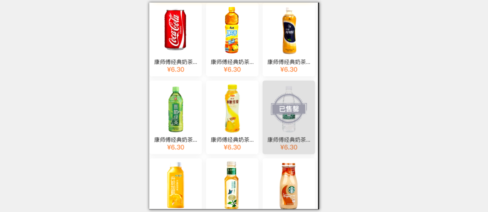

（1）用户选取售货机之后，小程序端扫码后将售货机编号传入到小程序后台接口。

（2）小程序后台接口通过fegin调用售货机服务里的获取设备商品列表的接口来获取数据。

（3）售货机微服务封装方法，实现根据售货机编号查询商品列表的方法。

#### 2.1.2 立可得v1.0代码分析

（1）在`service_common`项目中定义的SkuViewModel是用于需要展示的商品列表中的对象

（2）在小程序后端服务中的`VMController`中添加获取商品列表和商品详情的RESTful接口方法实现

```java
@Autowired
private VMService vmService;
  
/**
     * 获取售货机商品列表
     * @param innerCode
     * @return
     */
@GetMapping("/skuList/{innerCode}")
public List<SkuViewModel> getSkuListByInnercode(@PathVariable String innerCode){
    return vmService.getAllSkuByInnerCode(innerCode);
}
```

（3）服务公共模块service_common的com.lkd.feignService.VMService定义方法

```java
@GetMapping("/vm/skuList/{innerCode}")
List<SkuViewModel> getAllSkuByInnerCode(@PathVariable String innerCode);
```

（4）售货机微服务 VendingMachineService接口定义方法

```java
/**
 * 获取售货机里所有商品
 * @param innerCode
 * @return
 */
List<SkuViewModel> getSkuList(String innerCode);
```

VendingMachineServiceImpl实现此方法

```java
@Override
public List<SkuViewModel> getSkuList(String innerCode) {
    //获取有商品的货道
    List<ChannelEntity> channelList = this.getAllChannel(innerCode)
                                            .stream()
                                            .filter(c->c.getSkuId() > 0 && c.getSku() != null)
                                            .collect(Collectors.toList());
    Map<Long,SkuEntity> skuMap = Maps.newHashMap();
    //将商品列表去重之后计算出最终售价返回
    channelList
            .forEach(c->{
                SkuEntity sku = c.getSku();
                sku.setRealPrice(channelService.getRealPrice(innerCode,c.getSkuId()));
                if(!skuMap.containsKey(sku.getSkuId())) {
                    sku.setCapacity(c.getCurrentCapacity());
                    skuMap.put(sku.getSkuId(), sku);
                }else {
                    SkuEntity value = skuMap.get(sku.getSkuId());
                    value.setCapacity(value.getCapacity()+c.getCurrentCapacity());
                    skuMap.put(sku.getSkuId(),value);
                }
            });
    if(skuMap.values().size() <= 0) return Lists.newArrayList();

    return skuMap
                .values()
                .stream()
                .map(s->{
                    SkuViewModel sku = new SkuViewModel();
                    sku.setCapacity(s.getCapacity());
                    sku.setDiscount(s.isDiscount());
                    sku.setImage(s.getSkuImage());
                    sku.setPrice(s.getPrice());
                    sku.setRealPrice(s.getRealPrice());
                    sku.setSkuId(s.getSkuId());
                    sku.setSkuName(s.getSkuName());
                    sku.setUnit(s.getUnit());
                    return sku;
                })
                .sorted(Comparator.comparing(SkuViewModel::getCapacity).reversed())
                .collect(Collectors.toList());
}
```

#### 2.1.3 代码优化

修改VendingMachineServiceImpl的getSkuList方法

```java
@Override
public List<SkuViewModel> getSkuList(String innerCode) {
    //获取货道列表
    List<ChannelEntity> channelList = this.getAllChannel(innerCode)
            .stream()
            .filter(c -> c.getSkuId() > 0 && c.getSku() != null).collect(Collectors.toList());
    //获取有商品的库存余量
    Map<SkuEntity, Integer> skuMap = channelList
            .stream()
            .collect(Collectors.groupingBy(ChannelEntity::getSku, Collectors.summingInt(ChannelEntity::getCurrentCapacity)));
    //获取有商品的真实价格
    Map<Long, IntSummaryStatistics> skuPrice = channelList.stream().collect(Collectors.groupingBy(ChannelEntity::getSkuId, Collectors.summarizingInt(ChannelEntity::getPrice)));

    return skuMap.entrySet().stream().map( entry->{
        SkuEntity sku = entry.getKey(); //查询商品
        sku.setRealPrice( skuPrice.get(sku.getSkuId()).getMin() );//真实价格
        SkuViewModel skuViewModel = new SkuViewModel();
        BeanUtils.copyProperties( sku,skuViewModel );
        skuViewModel.setImage(sku.getSkuImage());//图片
        skuViewModel.setCapacity( entry.getValue() );
        return  skuViewModel;
    } ).sorted(Comparator.comparing(SkuViewModel::getCapacity).reversed())  //按库存量降序排序
            .collect(Collectors.toList());
}
```

优化后的代码有三个优点：

（1）优雅清晰

（2）代码量少

（3）执行高效：只需要查询数据库一次，其余都在内存进行操作。

### 2.2 商品详情

#### 2.2.1 需求与实现思路

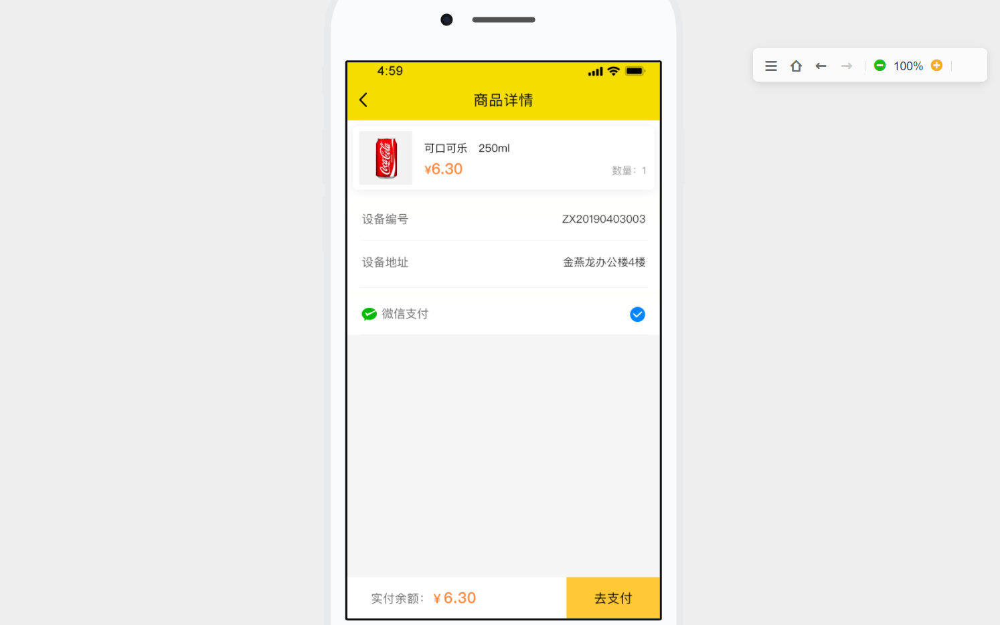

商品详情返回的信息除了包含商品基本信息，还包含设备编号和设备地址

#### 2.2.2 立可得v1.0代码分析

微服务公共模块定义了SkuInfoViewModel用于返回商品详情

```java
@Data
public class SkuInfoViewModel extends SkuViewModel implements Serializable {

    /**
     * 点位地址
     */
    private String addr;

    /**
     * 设备编号
     */
    private String innerCode;
}
```

小程序微服务（lkd_microapp）的VMController有方法实现对售货机商品详情的查询

```java
/**
 * 扫码获取商品详情，用来后续支付
 * @param innerCode
 * @param skuId
 * @return
 */
@GetMapping("/sku/{innerCode}/{skuId}")
public SkuInfoViewModel getSku(@PathVariable String innerCode, @PathVariable String skuId){
    SkuViewModel skuViewModel = vmService.getSku(innerCode,skuId);
    SkuInfoViewModel skuInfo = new SkuInfoViewModel();
    BeanUtils.copyProperties(skuViewModel,skuInfo);
    VendingMachineViewModel vmInfo =vmService.getVMInfo(innerCode);
    if(vmInfo != null){
        skuInfo.setAddr(vmInfo.getNodeAddr());
        skuInfo.setInnerCode(innerCode);
    }
    return skuInfo;
}
```


#### 2.2.3 代码优化

1.0的代码实现，用户点击商品后前端需要再次请求后端，进行商品查询及设备查询。其实这是完全没有必要的，商品详情页中关于商品的信息，在商品列表中都是存在的，直接传递到详情页展示就可以，而设备编号和设备地址，可以在用户扫码时进行一次调用即可。

```java
/**
 * 根据售货机编号获取售货机信息
 * @param innerCode
 * @return
 */
@GetMapping("/innerCode/{innerCode}")
public VendingMachineViewModel getVm(@PathVariable String innerCode){
    return  vmService.getVMInfo(innerCode);
}
```

前端需要在扫描二维码后根据获取的售货机编号查询售货机信息。

## 3.openId

### 3.1 什么是openId

openId是用户在当前公众号（小程序）下的唯一标识（‘身份证’），就是说通过这个openId，就能区分在这个公众号（小程序）下具体是哪个用户。

官方提供了http接口地址为：
https://api.weixin.qq.com/sns/jscode2session?appid=APPID&secret=SECRET&js_code=JSCODE&grant_type=authorization_code

这是一个 HTTPS 接口，开发者服务器使用**登录凭证 code获取 session_key 和 openid。其中 session_key 是对用户数据进行[加密签名](https://www.w3cschool.cn/weixinapp/weixinapp-signature.html)的密钥。为了自身应用安全，**session_key 不应该在网络上传输。

**请求参数：**

| 参数         | 必填   | 说明                     |
| ---------- | ---- | ---------------------- |
| appid      | 是    | 小程序唯一标识                |
| secret     | 是    | 小程序的 app secret        |
| js_code    | 是    | 登录时获取的 code            |
| grant_type | 是    | 填写为 authorization_code |

**返回参数：**

| 参数          | 说明                                       |
| ----------- | ---------------------------------------- |
| openid      | 用户唯一标识                                   |
| session_key | 会话密钥                                     |
| unionid     | 用户在开放平台的唯一标识符。本字段在满足一定条件的情况下才返回。具体参看[UnionID机制说明](https://www.w3cschool.cn/weixinapp/weixinapp-open.html#unionid) |

openid和unionid区别：

- 微信openid和unionid长度是不一样的 openid=28,unionid=29
- openid同一用户同一应用唯一,unionid同一用户不同应用唯一。

**返回说明：**

```json
//正常返回的JSON数据包
{
      "openid": "OPENID",
      "session_key": "SESSIONKEY"
      "unionid":  "UNIONID"
}
//错误时返回JSON数据包(示例为Code无效)
{
    "errcode": 40029,
    "errmsg": "invalid code"
}
```

### 3.2 代码实现

小程序微服务配置中心相关配置

```
wxpay:
  appId: xxxxxxxxxxxxxx #微信支付商户平台里的appId
  appSecret: xxxxxxxxxxxxxxxxx  #微信支付商户平台里的appSecret
```

小程序微服务读取配置类

```java
package com.lkd.config;

import lombok.Data;
import org.springframework.boot.context.properties.ConfigurationProperties;
import org.springframework.stereotype.Component;

@Component
@ConfigurationProperties("wxpay")
@Data
public class WXConfig {
    private String appId;
    private String appSecret;
}
```

小程序微服务接口WXService定义getOpenId方法用于openId

```java
package com.lkd.service;

/**
 * 微信服务接口
 */
public interface WxService {

    /**
     * 通过jsCode获取openId
     * @param jsCode
     * @return
     */
    String getOpenId(String jsCode);
}
```

WxServiceImpl实现类实现方法

```java
package com.lkd.service.impl;
import com.google.common.base.Strings;
import com.lkd.config.WXConfig;
import com.lkd.service.WxService;
import com.lkd.utils.JsonUtil;
import lombok.extern.slf4j.Slf4j;
import org.springframework.beans.factory.annotation.Autowired;
import org.springframework.stereotype.Service;
import org.springframework.web.client.RestTemplate;
@Service
@Slf4j
public class WxServiceImpl implements WxService {

    @Autowired
    private WXConfig wxConfig;

    @Override
    public String getOpenId(String jsCode) {
        String getOpenIdUrl = "https://api.weixin.qq.com/sns/jscode2session?appid="+wxConfig.getAppId()+"&secret="+wxConfig.getAppSecret()+"&js_code="+jsCode+"&grant_type=authorization_code";
        RestTemplate restTemplate = new RestTemplate();
        String respResult = restTemplate.getForObject(getOpenIdUrl,String.class);

        log.info("weixin pay result:"+respResult);
        if( Strings.isNullOrEmpty(respResult)) return "";
        try{
            String errorCode = JsonUtil.getValueByNodeName("errcode",respResult) ;
            if(!Strings.isNullOrEmpty(errorCode)){
                int errorCodeInt = Integer.valueOf(errorCode).intValue();
                if(errorCodeInt != 0) return "";
            }
            return JsonUtil.getValueByNodeName("openid",respResult);
        }catch (Exception ex){
            log.error("获取openId失败",ex);
            return "";
        }
    }
}
```

OrderController调用方法

```java
@RestController
@RequestMapping("/order")
@Slf4j
public class OrderController {

    @Autowired
    private WxService wxService;

    /**
     * 获取openId
     * @param jsCode
     * @return
     */
    @GetMapping("/openid/{jsCode}")
    public String getOpenid(@PathVariable String jsCode){
        return wxService.getOpenId(jsCode);
    }
}
```


## 4. 小程序支付与回调  

### 4.1 需求分析   

当用户想购买某商品时，点击“立即支付”，点击“立即付款”，输入支付密码成功支付后更改订单状态

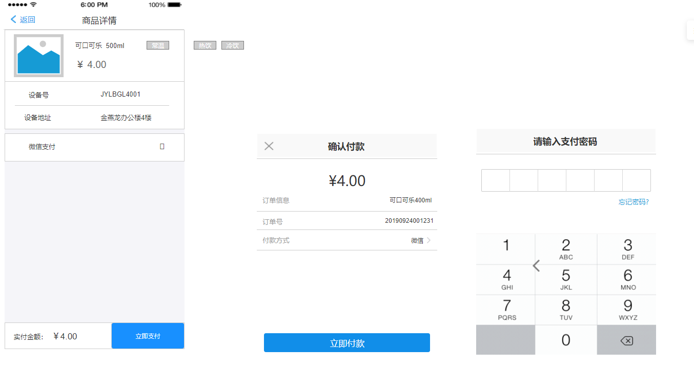

### 4.2 实现思路    

整个业务的时序流程如下：

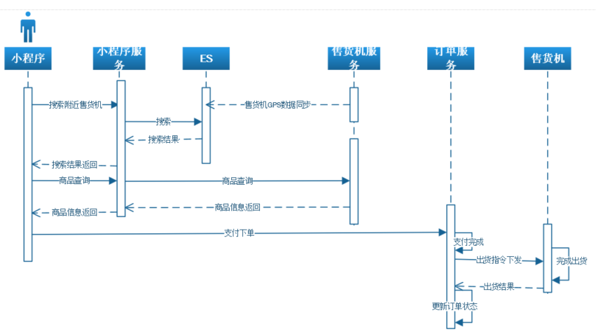

因为我们立可得2.0里采用了微信小程序支付，所以需要和微信支付平台做对接，微信小程序支付流程如下：


从上面的交互图可以看出微信小程序端需要：

（1）调用后台接口请求下单支付

（2）后台在调用微信统一下单接口之前先要获取openId

（3）获取openId时需要客户端调用微信登录接口获取微信端返回的jsCode，并将该code传入后台，后台将该code传入微信端接口从而才能得到openId

（4）后台调用微信统一下单接口将相关数据传入到微信接口，此时微信平台会返回相关数据(其中包括prepay_id，也叫预付单信息)

（5）后台将得到的数据再次签名之后返回到前端(5个参数)

（6）前端根据后台返回的数据向微信端调起鉴权支付请求，如果通过则在小程序内部呼起微信支付

### 4.3 代码实现    

#### 4.3.1 创建订单  

（1）service_common新增视图模型，根据接口文档定义

```java
/**
 * 小程序端支付请求对象
 */
@Data
public class RequestPay implements Serializable {
    /**
     * 售货机编号
     */
    private String innerCode;

    /**
     * 小程序端JsCode
     */
    private String jsCode; 

    /**
     * openId
     */
    private String openId; 

    /**
     * 商品Id
     */
    private String skuId;
}
```

（2）订单微服务lkd_order_service创建WxPayController（微信支付）

```java
@RestController
@RequestMapping("/wxpay")
@Slf4j
public class WxPayController {

    @Autowired
    private OrderService orderService;

    /**
     * 微信小程序支付
     * @param requestPay
     * @return
     */
    @PostMapping("/requestPay")
    public String requestPay(@RequestBody RequestPay requestPay){
        CreateOrder createOrder = new CreateOrder();
        BeanUtils.copyProperties( requestPay,createOrder );
        createOrder.setPayType("2");//支付方式微信支付
        OrderEntity orderEntity = orderService.createOrder(createOrder);//创建订单
        //todo: 发起支付请求
        return "";
    }
}
```

（3）service_common工程com.lkd.feignService包下创建OrderService用于远程调用（FeignClient）

```java
@FeignClient(value = "order-service")
public interface OrderService {
    @PostMapping("/wxpay/requestPay")
    String requestPay(@RequestBody RequestPay requestPay);
}
```

（4）服务降级类  OrderServiceFallbackFactory用于处理远程调用失败

```java
@Component
@Slf4j
public class OrderServiceFallbackFactory implements FallbackFactory<OrderService> {
    @Override
    public OrderService create(Throwable throwable) {
        log.error("订单服务调用失败",throwable);
        return new OrderService() {
            @Override
            public String requestPay(RequestPay requestPay) {
                return null;
            }
        };
    }
}
```

修改OrderService ,  配置服务降级类

```java
@FeignClient(value = "order-service",fallbackFactory = OrderServiceFallbackFactory.class)
public interface OrderService {
    @PostMapping("/wxpay/requestPay")
    String requestPay(@RequestBody RequestPay requestPay);
}
```

（5）修改小程序微服务 lkd_microapp的OrderController，新增请求支付的方法

```java
/**
 * 小程序请求支付
 * @param requestPay
 * @return
 */
@PostMapping("/requestPay")
public String requestPay(@RequestBody RequestPay requestPay){
    requestPay.setOpenId( wxService.getOpenId(requestPay.getJsCode()) );
    String responseData = orderService.requestPay(requestPay);
    if(Strings.isNullOrEmpty(responseData)){
        throw new LogicException("微信支付接口调用失败");
    }
    return responseData;
}
```

**锦上添花：**

修改requestPay方法

```java
/**
 * 小程序请求支付
 * @param requestPay
 * @return
 */
@PostMapping("/requestPay")
public String requestPay(@RequestBody RequestPay requestPay){
    //如果openId为空，则根据jsCode生成
    if(Strings.isNullOrEmpty(requestPay.getOpenId())){
        requestPay.setOpenId( wxService.getOpenId(requestPay.getJsCode()) );
    }
    String responseData = orderService.requestPay(requestPay);
    if(Strings.isNullOrEmpty(responseData)){
        throw new LogicException("微信支付接口调用失败");
    }
    return responseData;
}
```

这样前端直接传openId，就避免了后端再次调用获取openId的方法

#### 4.3.2 对接微信支付    

（1）在订单服务`lkd_order_service`中添加微信支付的相关依赖

```xml
<dependency>
    <groupId>com.github.wxpay</groupId>
    <artifactId>wxpay-sdk</artifactId>
    <version>3.0.9</version>
</dependency>
```

（2）在订单服务中的consul配置中心添加微信支付相关的配置：

```yaml
wxpay:
  appId: xxxxxxxxxxxxxx #微信支付商户平台里的appId
  appSecret: xxxxxxxxxxxxxxxxx  #微信支付商户平台里的appSecret
  mchId: 1234567890 #商户号
  partnerKey: 123456 #商户的key
  notifyUrl: http://******/wxpay/payNotify #微信支付成功之后的回调地址
```

（3）创建微信支付相关配置映射类

```java
package com.lkd.conf;

import lombok.Data;
import org.springframework.boot.context.properties.ConfigurationProperties;
import org.springframework.stereotype.Component;

@Component
@ConfigurationProperties("wxpay")
@Data
public class WXConfig {
    private String appId;
    private String appSecret;
    private String mchId;
    private String partnerKey;
    private String notifyUrl = "";
}
```

（4）添加微信支付sdk需要实现的配置类WxPaySdkConfig

```java
package com.github.wxpay.sdk;

import com.lkd.conf.WXConfig;
import org.springframework.beans.factory.annotation.Autowired;
import org.springframework.stereotype.Component;

import java.io.InputStream;

@Component
public class WxPaySdkConfig extends WXPayConfig {
    @Autowired
    private WXConfig wxConfig;
  
    public String getAppID() {
        return wxConfig.getAppId();
    }

    public String getMchID() {
        return wxConfig.getMchId();
    }

    public String getKey() {
        return wxConfig.getPartnerKey();
    }

    InputStream getCertStream() {
        return null;
    }

     IWXPayDomain getWXPayDomain() {
        return new IWXPayDomain() {
            public void report(String s, long l, Exception e) {

            }

            public DomainInfo getDomain(WXPayConfig wxPayConfig) {
                return new DomainInfo("api.mch.weixin.qq.com",true);
            }
        };
    }
}
```

#### 4.3.3 发起支付请求     

（1）订单微服务lkd_order_service新建WXPayService，定义requestPay方法

```java
/**
 * 微信支付服务接口
 */
public interface WXPayService {

    /**
     * 调用统一下单接口发起支付
     * @param openId
     * @param orderNo
     * @return
     */
    String requestPay(String orderNo);
}
```

创建实现类WXPayServiceImpl实现发起支付方法

```java
package com.lkd.service.impl;

import com.github.wxpay.sdk.WXPayRequest;
import com.github.wxpay.sdk.WXPayUtil;
import com.github.wxpay.sdk.WxPaySdkConfig;
import com.google.common.base.Strings;
import com.google.common.collect.Maps;
import com.lkd.common.VMSystem;
import com.lkd.conf.WXConfig;
import com.lkd.entity.OrderEntity;
import com.lkd.exception.LogicException;
import com.lkd.service.OrderService;
import com.lkd.service.WXPayService;
import com.lkd.utils.JsonUtil;
import lombok.extern.slf4j.Slf4j;
import org.springframework.beans.factory.annotation.Autowired;
import org.springframework.stereotype.Service;
import org.springframework.web.client.RestTemplate;

import java.util.Map;

@Service
@Slf4j
public class WXPayServiceImpl implements WXPayService {
    @Autowired
    private WXConfig wxConfig;

    @Autowired
    private WxPaySdkConfig wxPaySdkConfig;

    @Autowired
    private OrderService orderService;

    @Override
    public String requestPay(String orderNo) {
        OrderEntity orderEntity = orderService.getByOrderNo(orderNo);
        try{
            String nonce_str = WXPayUtil.generateNonceStr();
            //1.封装请求参数
            Map<String,String> map= Maps.newHashMap();
            map.put("appid",wxPaySdkConfig.getAppID());//公众账号ID
            map.put("mch_id",wxPaySdkConfig.getMchID());//商户号
            map.put("nonce_str", nonce_str);//随机字符串
            map.put("body",orderEntity.getSkuName());//商品描述
            map.put("out_trade_no",orderNo);//订单号
            map.put("total_fee",orderEntity.getAmount()+"");//金额
            map.put("spbill_create_ip","127.0.0.1");//终端IP
            map.put("notify_url",wxConfig.getNotifyUrl());//回调地址
            map.put("trade_type","JSAPI");//交易类型
            map.put("openid",orderEntity.getOpenId());//openId
            String xmlParam  = WXPayUtil.generateSignedXml(map, wxPaySdkConfig.getKey());
            System.out.println("参数："+xmlParam);
            //2.发送请求
            WXPayRequest wxPayRequest=new WXPayRequest(wxPaySdkConfig);
            String xmlResult = wxPayRequest.requestWithCert("/pay/unifiedorder", null, xmlParam, false);
            //3.解析返回结果
            Map<String, String> mapResult = WXPayUtil.xmlToMap(xmlResult);
            //返回状态码
            String return_code = mapResult.get("return_code");
            //返回给移动端需要的参数
            Map<String, String> response = Maps.newHashMap();
            if(return_code.equals("SUCCESS")){
                // 业务结果
                String prepay_id = mapResult.get("prepay_id");//返回的预付单信息
                if(Strings.isNullOrEmpty(prepay_id)){
                    log.error("prepay_id is null","当前订单可能已经被支付");
                    throw new LogicException("当前订单可能已经被支付");
                }
                response.put("appId",wxConfig.getAppId());
                response.put("package", "prepay_id=" + prepay_id);
                response.put("signType","MD5");
                response.put("nonceStr", WXPayUtil.generateNonceStr());

                Long timeStamp = System.currentTimeMillis() / 1000;
                response.put("timeStamp", timeStamp + "");//要将返回的时间戳转化成字符串，不然小程序端调用wx.requestPayment方法会报签名错误

                //再次签名，这个签名用于小程序端调用wx.requesetPayment方法
                String sign = WXPayUtil.generateSignature(response,wxConfig.getPartnerKey());
                response.put("paySign", sign);
                response.put("appId","");
                response.put("orderNo",orderNo);
                return JsonUtil.serialize(response);
            }else {
                log.error("调用微信统一下单接口失败",response);
                return null;
            }
        }catch (Exception ex){
            log.error("调用微信统一下单接口失败",ex);
            return "";
        }
    }
}
```

（2）修改订单微服务（lkd_order_service）WxPayController 的requestPay方法

```java
@Autowired
private WXPayService wxPayService;

/**
 * 微信小程序支付
 * @param requestPay
 * @return
 */
@PostMapping("/requestPay")
public String requestPay(@RequestBody RequestPay requestPay){
    CreateOrder createOrder = new CreateOrder();
    BeanUtils.copyProperties( requestPay,createOrder );
    createOrder.setPayType("2");//支付方式微信支付
    OrderEntity orderEntity = orderService.createOrder(createOrder);
    return wxPayService.requestPay(orderEntity.getOrderNo());//调用发起支付请求
}
```

#### 4.3.4 支付回调处理  

（1）订单微服务（lkd_order_service）WXPayService新增方法定义

```java
/**
 * 微信回调之后的处理
 * @param notifyResult
 * @throws Exception
 */
void notify(String notifyResult) throws Exception;
```

WXPayServiceImpl实现方法

```java
@Override
public void notify(String notifyResult) throws Exception {
    //解析
    Map<String, String> map = WXPayUtil.xmlToMap( notifyResult );
    //验签
    boolean signatureValid = WXPayUtil.isSignatureValid(map, wxConfig.getPartnerKey());

    if(signatureValid){
        if("SUCCESS".equals(map.get("result_code"))){
            String orderNo = map.get("out_trade_no");
            OrderEntity orderEntity = orderService.getByOrderNo(orderNo);
            orderEntity.setStatus(VMSystem.ORDER_STATUS_PAYED);
            orderEntity.setPayStatus(VMSystem.PAY_STATUS_PAYED);
            orderService.updateById(orderEntity);
            //todo :支付完成通知出货
        }else {
            log.error("支付回调出错:"+notifyResult);
        }
    }else {
        log.error("支付回调验签失败:"+notifyResult);
    }
}
```

（2）订单微服务（lkd_order_service）WxPayController新增方法

```java
/**
 * 微信支付回调接口
 * @param request
 * @return
 */
@RequestMapping("/payNotify")
@ResponseBody
public void payNotify(HttpServletRequest request, HttpServletResponse response){
    try {
        //输入流转换为xml字符串
        String xml = ConvertUtils.convertToString( request.getInputStream() );
        wxPayService.notify(xml);

        //给微信支付一个成功的响应
        response.setContentType("text/xml");
        String data = "<xml><return_code><![CDATA[SUCCESS]]></return_code><return_msg><![CDATA[OK]]></return_msg></xml>";
        response.getWriter().write(data);

    }catch (Exception e){
        log.error("支付回调处理失败",e);
    }
}
```

### 4.4 前后端代码本地联调 

#### 4.4.1 小程序运行调试 

```
Taro 是一个开放式跨端跨框架解决方案，支持使用 React/Vue/Nerv 等框架来开发 微信 / 京东 / 百度 / 支付宝 / 字节跳动 / QQ 小程序 / H5 等应用。现如今市面上端的形态多种多样，Web、React Native、微信小程序等各种端大行其道，当业务要求同时在不同的端都要求有所表现的时候，针对不同的端去编写多套代码的成本显然非常高，这时候只编写一套代码就能够适配到多端的能力就显得极为需要。
```

（1）打开小程序源码src/config.ts  ，修改baseUrl

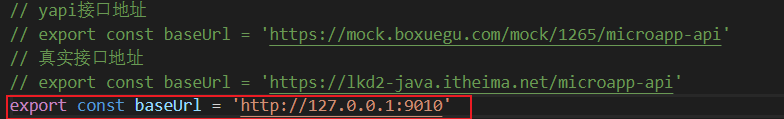

（2）编译代码

```
$ npm i -g @tarojs/cli
$ npm install
$ npm run dev:weapp
```

前两个命令只需运行一次即可，第三个命令在需要重新编译时运行。

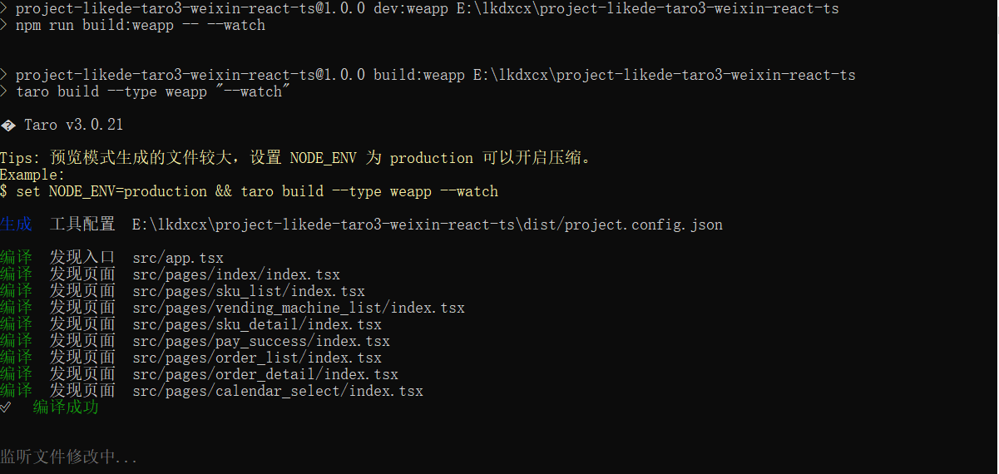

（3）通过微信开发者工具调试

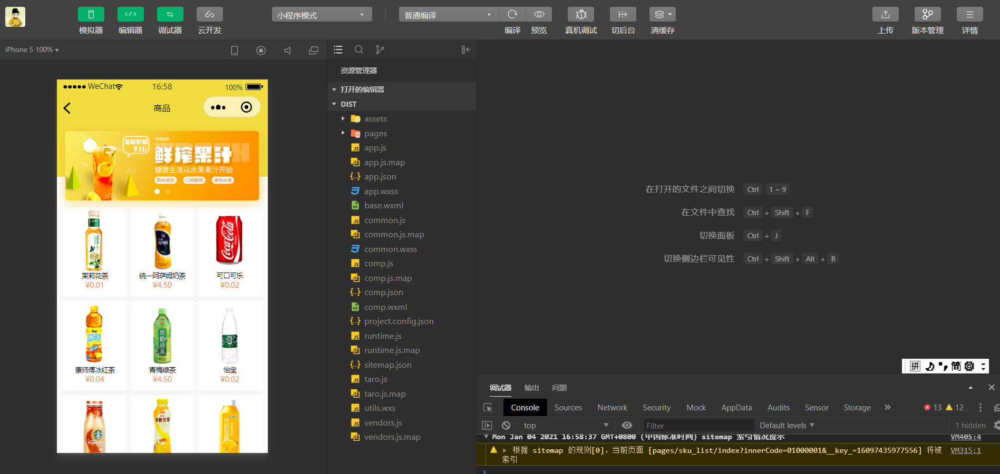


#### 4.4.2 内网穿透测试支付回调

使用内网穿透工具cpolar  (https://www.cpolar.com/)  ，下载cpolar工具（资源提供）

（1）注册账号

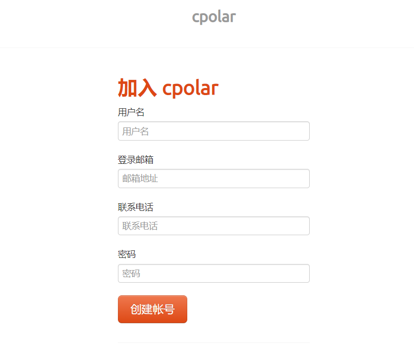

注册后选择免费套餐即可

（2）连接帐户，在命令行模式下输入  

```
cpolar authtoken XXXXXXXXXXXXXXXXXXXXXXXXXXXXXXXX
```

密钥部分登录[cpolar](https://www.cpolar.com/)查看

（3）端口映射，在命令行模式下输入  

```
cpolar http 9008
```

运行效果

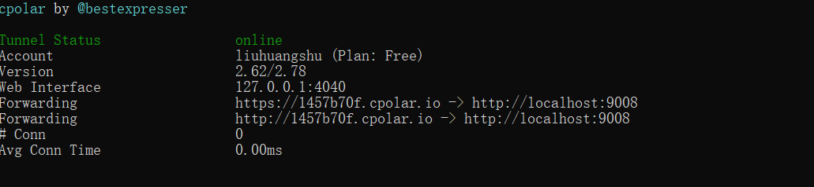

9008为订单微服务的端口

（4）更改订单微服务配置的微信支付回调地址为映射的临时域名地址，重新启动订单微服务


## 5. 售货机出货并发控制

### 5.1 需求分析 

售货机支付出货和传统电商下单流程最大的区别是，售货机是具备实体的、独占式的。当售货机在处理一个用户的出货过程中，是不能同时处理另一个用户的出货的，并且同一时间只能处理一个商品的出货。所以在下单的接口里用分布式锁进行了排他处理，在用户并发请求下单时会请求分布式锁，只有获得锁的用户才会向微信支付平台发起支付请求，没有获得锁的用户会收到售货机忙碌的提示，这样可以避免引发用户支付完成拿不到商品退款的流程，提高了用户体验。

### 5.2 实现思路 

#### 5.2.1 出货流程


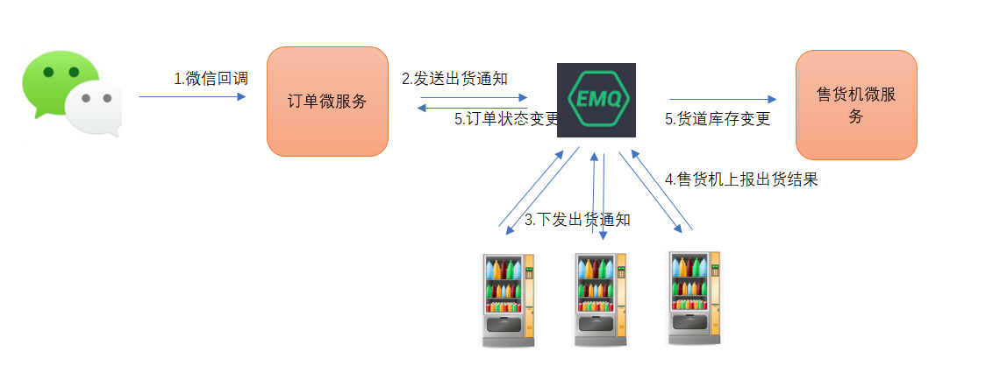

（1）支付成功后微信平台回调订单微服务

（2）订单微服务发送出货通知到emq，主题为vm/售货机编号/vendoutReq

（3）售货机订阅出货通知，收到消息后进行发货

（4）售货机出货成功后上报出货结果到emq ，主题为server/售货机编号/vendoutResp

（5）订单微服务和售货机微服务以群组订阅的方式订阅该主题，分别进行业务处理。订单微服务更改订单状态。售货机微服务更改货道库存。

#### 5.2.2 锁控制

（1）下单时加锁

（2）售货机微服务收到售货机上报的出货消息，更改库存后解锁。

### 5.3 代码实现 

#### 5.3.1 判断库存

（1）售货机微服务VendingMachineService新增方法定义

```java
/**
 * 商品是否还有余量
 * @param skuId
 * @return
 */
Boolean hasCapacity(String innerCode,Long skuId);
```

VendingMachineServiceImpl实现此方法

```java
@Override
public Boolean hasCapacity(String innerCode,Long skuId) {
    var qw = new LambdaQueryWrapper<ChannelEntity>();
    qw
            .eq(ChannelEntity::getInnerCode,innerCode)
            .eq(ChannelEntity::getSkuId,skuId)
            .gt(ChannelEntity::getCurrentCapacity,0);

    return channelService.count(qw) > 0;
}
```

（2）售货机微服务VendingMachineController新增方法

```java
/**
 * 售货机商品是否还有库存
 * @param innerCode
 * @param skuId
 * @return
 */
@GetMapping("/hasCapacity/{innerCode}/{skuId}")
public Boolean hasCapacity(@PathVariable String innerCode,@PathVariable Long skuId){
    return vendingMachineService.hasCapacity(innerCode,skuId);
}
```

（3）service_common的VMService新增方法定义

```java
@GetMapping("/vm/hasCapacity/{innerCode}/{skuId}")
Boolean hasCapacity(@PathVariable String innerCode,@PathVariable Long skuId);
```

（4）修改lkd_microapp的OrderController，添加对库存的判断

```java
@Autowired
private VMService vmService;
    

/**
 * 小程序请求支付
 * @param requestPay
 * @return
 */
@PostMapping("/requestPay")
public String requestPay(@RequestBody RequestPay requestPay){
    if(!vmService.hasCapacity(requestPay.getInnerCode()
            ,Long.valueOf(requestPay.getSkuId()))){
        throw new LogicException("该商品已售空");
    }
    if(Strings.isNullOrEmpty(requestPay.getOpenId())){
        requestPay.setOpenId( wxService.getOpenId(requestPay.getJsCode()) );
    }
    String responseData = orderService.requestPay(requestPay);
    if(Strings.isNullOrEmpty(responseData)){
        throw new LogicException("微信支付接口调用失败");
    }
    return responseData;
}
```

#### 5.3.2 发送出货通知  

（1）OrderService定义payComplete方法，用于微信支付完成的处理

```java
/**
 * 微信支付完成
 * @param orderNo
 * @return
 */
boolean payComplete(String orderNo);
```

OrderServiceImpl实现方法，编写出库逻辑

```java
@Autowired
private MqttProducer mqttProducer;

@Override
public boolean payComplete(String orderNo) {
    sendVendout(orderNo);//发送出货通知
    return true;
}

/**
 * 出货
 * @param orderNo
 */
private void sendVendout(String orderNo){
    OrderEntity orderEntity = this.getByOrderNo(orderNo);

    VendoutReqData reqData = new VendoutReqData();
    reqData.setOrderNo(orderNo);
    reqData.setPayPrice(orderEntity.getAmount());
    reqData.setPayType(Integer.parseInt(orderEntity.getPayType()));
    reqData.setSkuId(orderEntity.getSkuId());
    reqData.setTimeout(60);
    reqData.setRequestTime(LocalDateTime.now().format(DateTimeFormatter.ISO_DATE_TIME));

    VendoutReq req = new VendoutReq();
    req.setVendoutData(reqData);
    req.setSn(System.nanoTime());
    req.setInnerCode(orderEntity.getInnerCode());
    req.setNeedResp(true);
    //向售货机发送出货请求
    try {
        mqttProducer.send(
             TopicConfig.getVendoutTopic(orderEntity.getInnerCode()),2,req);
    } catch (JsonProcessingException e) {
        log.error("send vendout req error.",e);
    }
}
```

（2）修改WXPayServiceImpl的notify方法，调用orderService.payComplete()方法

```java
@Override
public void notify(String notifyResult) throws Exception {
    //解析
    Map<String, String> map = WXPayUtil.xmlToMap( notifyResult );
    //验签
    boolean signatureValid = WXPayUtil.isSignatureValid(map, wxConfig.getPartnerKey());

    if(signatureValid){
        if("SUCCESS".equals(map.get("result_code"))){
            String orderNo = map.get("out_trade_no");
            OrderEntity orderEntity = orderService.getByOrderNo(orderNo);
            orderEntity.setStatus(VMSystem.ORDER_STATUS_PAYED);
            orderEntity.setPayStatus(VMSystem.PAY_STATUS_PAYED);

            orderService.updateById(orderEntity);
            //支付完成通知出货
            orderService.payComplete(orderNo);
        }else {
            log.error("支付回调出错:"+notifyResult);
        }
    }else {
        log.error("支付回调验签失败:"+notifyResult);
    }
}
```

#### 5.3.3 处理出货结果

（1）订单微服务更改订单状态

com.lkd.business包下消息处理类

```java
package com.lkd.business;

import com.lkd.annotations.ProcessType;
import com.lkd.common.VMSystem;
import com.lkd.config.ConsulConfig;
import com.lkd.contract.VendoutResp;
import com.lkd.redis.RedisUtils;
import com.lkd.service.OrderService;
import com.lkd.utils.DistributedLock;
import com.lkd.utils.JsonUtil;
import org.springframework.beans.factory.annotation.Autowired;
import org.springframework.stereotype.Component;
import java.io.IOException;

/**
 * 处理出货结果
 */
@Component
@ProcessType(value = "vendoutResp")
public class VendoutMsgHandler implements MsgHandler{
    @Autowired
    private OrderService orderService;
  
    @Override
    public void process(String jsonMsg) throws IOException {
        VendoutResp vendoutResp = JsonUtil.getByJson(jsonMsg, VendoutResp.class);
        //处理出货结果
        orderService.vendoutResult(vendoutResp);
    }
}
```

orderService.vendoutResult方法是用于更改订单状态

订单微服务以组共享订阅的方式订阅以下主题

```
$share/order/server/+/vendoutResp
```

`+`代表任意一级主题名称，为售货机编号。  ` #`代表任意多级主题名称

（2）售货机微服务更新库存

售货机微服务com.lkd.business.msgHandler包下消息处理类

```java
package com.lkd.business.msgHandler;

import com.google.common.base.Strings;
import com.lkd.annotations.ProcessType;
import com.lkd.business.MsgHandler;
import com.lkd.contract.VendoutResp;
import com.lkd.service.VendingMachineService;
import com.lkd.utils.JsonUtil;
import org.springframework.beans.factory.annotation.Autowired;
import org.springframework.stereotype.Component;

import java.io.IOException;

/**
 * 处理出货结果
 */
@Component
@ProcessType(value = "vendoutResp")
public class VendoutMsgHandler implements MsgHandler{
    @Autowired
    private VendingMachineService vmService;
    @Override
    public void process(String jsonMsg) throws IOException {
        boolean success = JsonUtil.getNodeByName("success",jsonMsg).asBoolean();
        if (!success) return;
        VendoutResp vendoutResp = JsonUtil.getByJson(jsonMsg,VendoutResp.class);
        if(Strings.isNullOrEmpty(vendoutResp.getInnerCode())) return;

        vmService.vendOutResult(vendoutResp);
    }
}
```

vmService.vendOutResult方法是用于记录出货流水数据和减少货道库存

售货机微服务订阅主题

```
$share/vms/server/#
```

**测试：**

（1）启动订单微服务和售货机微服务

（2）在emq中测试发送消息，主题server/01000001/vendoutResp，内容

```json
{"innerCode":"01000001","sn":10101020213,"msgType":"vendoutResp","vendoutResult":{ "success":true, "payType":2, "orderNo":"0100000115744887641500","skuId":1339813834621194242, "channelId":"2-6","price":1  }}
```

（3）观察数据库货道库存是否减少，订单状态是否改变

#### 5.3.4 出货并发控制  

DistributedLock 是分布式锁处理类，是封装了基于consul的分布式锁，getLock用于获取锁，releaseLock用于解锁。

```java
@RunWith(SpringRunner.class)
@SpringBootTest
public class DistributedLockTest {

    @Autowired
    private ConsulConfig consulConfig;

    @Test
    public void testGetLock(){
        DistributedLock lock=new DistributedLock(consulConfig.getConsulRegisterHost(),
                consulConfig.getConsulRegisterPort());

        DistributedLock.LockContext lockContext = lock.getLock("abc", 200);
        System.out.println(lockContext.getSession());
        System.out.println(lockContext.isGetLock());

    }

    @Test
    public void releaseLock(){
        DistributedLock lock=new DistributedLock(consulConfig.getConsulRegisterHost(),
                consulConfig.getConsulRegisterPort());
        lock.releaseLock("17896eb4-d724-2787-9827-e222176052d0");
    }
}
```


**业务实现：**

（1）修改小程序微服务（lkd_microapp）OrderController类的requestPay方法，在调用orderService.requestPay方法前添加加锁的逻辑

```java
@Autowired
private ConsulConfig consulConfig;

@Autowired
private RedisTemplate<String,String> redisTemplate;

/**
 * 小程序请求支付
 * @param requestPay
 * @return
 */
@PostMapping("/requestPay")
public String requestPay(@RequestBody RequestPay requestPay){
    if(!vmService.hasCapacity(requestPay.getInnerCode()
            ,Long.valueOf(requestPay.getSkuId()))){
        throw new LogicException("该商品已售空");
    }
    if(Strings.isNullOrEmpty(requestPay.getOpenId())){
        requestPay.setOpenId( wxService.getOpenId(requestPay.getJsCode()) );
    }

    //分布式锁，机器同一时间只能处理一次出货
    DistributedLock lock = new DistributedLock(
            consulConfig.getConsulRegisterHost(),
            consulConfig.getConsulRegisterPort());
    DistributedLock.LockContext lockContext = lock.getLock(requestPay.getInnerCode(),60);
    if(!lockContext.isGetLock()){
        throw new LogicException("机器出货中请稍后再试");
    }
    //存入redis后是为了释放锁
    redisTemplate.boundValueOps(VMSystem.VM_LOCK_KEY_PREF+requestPay.getInnerCode())
            .set(lockContext.getSession(), Duration.ofSeconds(60));
    
    String responseData = orderService.requestPay(requestPay);
    if(Strings.isNullOrEmpty(responseData)){
        throw new LogicException("微信支付接口调用失败");
    }
    return responseData;
}
```

（2）修改售货机微服务出货结果处理类VendoutMsgHandler，在扣减库存后添加解锁代码

```java
@Autowired
private ConsulConfig consulConfig;

@Autowired
private RedisTemplate<String,String> redisTemplate;

@Override
public void process(String jsonMsg) throws IOException {
    boolean success = JsonUtil.getNodeByName("success",jsonMsg).asBoolean();
    if (!success) return;
    VendoutResp vendoutResp = JsonUtil.getByJson(jsonMsg,VendoutResp.class);
    if(Strings.isNullOrEmpty(vendoutResp.getInnerCode())) return;

    vmService.vendOutResult(vendoutResp);

    //解锁售货机状态
    DistributedLock lock = new DistributedLock(
            consulConfig.getConsulRegisterHost(),
            consulConfig.getConsulRegisterPort());
    String sessionId = redisTemplate.boundValueOps(VMSystem.VM_LOCK_KEY_PREF + vendoutResp.getInnerCode()).get();
    lock.releaseLock(sessionId);

}
```

DistributedLock的releaseLock方法用于解锁

#### 5.3.5 取消订单释放锁  

**业务实现：**

（1）service_common工程feign接口OrderService新增方法定义

```java
@GetMapping("/order/cancel/{orderNo}")
Boolean cancel(@PathVariable String orderNo);
```

服务降级类修改代码略

（2）lkd_microapp的OrderController新增方法，用于取消订单

```java
/**
 * 取消订单
 * @param innerCode
 */
@GetMapping("/cancelPay/{innerCode}/{orderNo}")
public void cancel(@PathVariable String innerCode,@PathVariable String orderNo){
    DistributedLock lock = new DistributedLock(
            consulConfig.getConsulRegisterHost(),
            consulConfig.getConsulRegisterPort());
    String sessionId = redisTemplate.boundValueOps(VMSystem.VM_LOCK_KEY_PREF + innerCode).get();
    if(Strings.isNullOrEmpty(sessionId)) return;
    try {
        lock.releaseLock(sessionId);
        orderService.cancel(orderNo);
    }catch (Exception ex){
        log.error("取消订单出错",ex);
    }
}
```


## 6. 超时订单处理  

### 6.1 需求分析  

立可得智能售货机系统中，当用户在小程序中开启支付之后，因为各种不确定的原因未能完成最终的付款，也未点击关闭支付页面的按钮，此时如果程序不处理的话，该订单就永远处于未支付状态，像这样状态的订单显然是一种未结束的订单状态，系统需要将这类的订单在10分钟之后自动处理掉，将订单的状态置于无效状态。

### 6.2 实现思路 

（1）在订单服务中的创建订单方法里，订单创建完成后，将改订单的信息发送到EMQ里的延迟队列中，延迟处理时间为10分钟。

（2）在订单服务里订阅延迟队列主题下的消息，在收到消息后检查该订单的状态，如果订单还处于创建状态，则将订单置于无效状态。

### 6.3 EMQ延迟消息

（1）选择Modules菜单，开启延迟消息开关

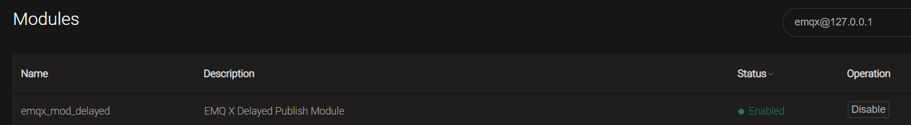

（2）测试延迟消息

在EMQ的Websocket工具中，订阅testtopic 主题

发送消息，主题名`$delayed/10/testtopic`     10为延迟10秒，消息内容随意。发送10秒后收到介绍到消息

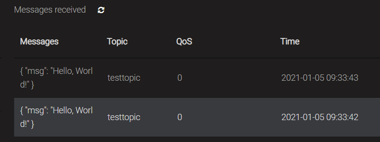


### 6.4 代码实现  

#### 6.4.1 创建订单发送延迟消息 

（1）在`service_common`项目中定义要放入延迟队列中的消息对象：

```java
package com.lkd.contract.server;

import com.lkd.contract.AbstractContract;
import lombok.Data;

import java.io.Serializable;

@Data
public class OrderCheck extends AbstractContract implements Serializable {
    public OrderCheck() {
        this.setMsgType("orderCheck");
    }
    private String orderNo;
}
```

（2）在订单服务项目`lkd_order_service`中的订单服务实现类`OrderServiceImpl`中的创建订单方法中添加向延迟队列发送消息的代码：

```java
//将订单放到延迟队列中，10分钟后检查支付状态！！！！！！！！！！！！！！！！！！
OrderCheck orderCheck = new OrderCheck();
orderCheck.setOrderNo(orderEntity.getOrderNo());
try {
  mqttProducer.send("$delayed/600/"+OrderConfig.ORDER_DELAY_CHECK_TOPIC,2,orderCheck);
} catch (JsonProcessingException e) {
  log.error("send to emq error",e);
}
```

#### 6.4.2 接收消息更改订单状态  

（1）在订单服务的配置中添加订阅主题：

```yaml
$share/g1/order/delayCheck
```

（2）在订单服务项目中实现接收到该消息的处理代码：

```java
package com.lkd.business;

import com.baomidou.mybatisplus.core.conditions.query.QueryWrapper;
import com.baomidou.mybatisplus.core.conditions.update.UpdateWrapper;
import com.google.common.base.Strings;
import com.lkd.annotations.ProcessType;
import com.lkd.common.VMSystem;
import com.lkd.contract.server.OrderCheck;
import com.lkd.entity.OrderEntity;
import com.lkd.service.OrderService;
import com.lkd.utils.JsonUtil;
import org.springframework.beans.factory.annotation.Autowired;
import org.springframework.stereotype.Component;

import java.io.IOException;

@Component
@ProcessType(value = "orderCheck")
public class OrderCheckHandler implements MsgHandler{
    @Autowired
    private OrderService orderService;

    @Override
    public void process(String jsonMsg) throws IOException {
        OrderCheck orderCheck = JsonUtil.getByJson(jsonMsg, OrderCheck.class);
        if(orderCheck == null || Strings.isNullOrEmpty(orderCheck.getOrderNo())) return;

        QueryWrapper<OrderEntity> qw = new QueryWrapper<>();
        qw
                .lambda()
                .eq(OrderEntity::getOrderNo,orderCheck.getOrderNo())
                .eq(OrderEntity::getStatus,VMSystem.ORDER_STATUS_CREATE);

        OrderEntity orderEntity = orderService.getOne(qw);
        if(orderEntity == null || orderEntity.getStatus() != VMSystem.ORDER_STATUS_CREATE) return;

        UpdateWrapper<OrderEntity> uw = new UpdateWrapper<>();
        uw
                .lambda()
                .eq(OrderEntity::getOrderNo,orderCheck.getOrderNo())
                .set(OrderEntity::getStatus, VMSystem.ORDER_STATUS_INVALID);
        orderService.update(uw);
    }
}
```

### 6.5 测试

（1）为了方便测试，将延迟时间暂时修改为60

（2）启动订单微服务、售后机微服务、小程序微服务、小程序网关

（3）创建订单，不支付，观察订单表中新增订单状态是否为0，1分钟后再次查询该订单，验证订单状态是否更改为4

