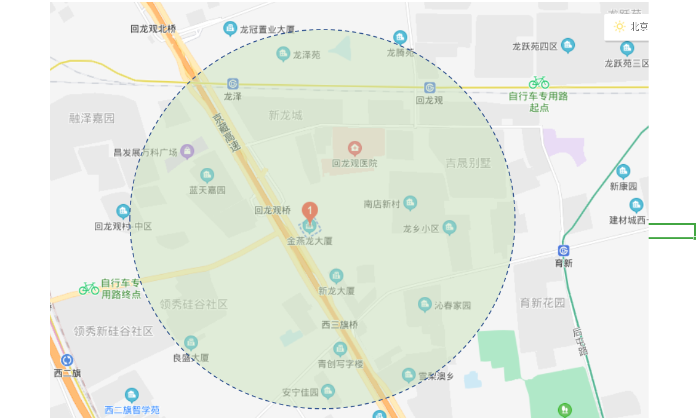
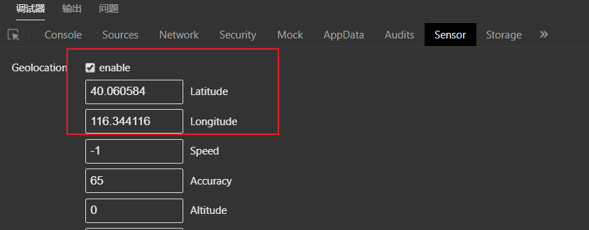
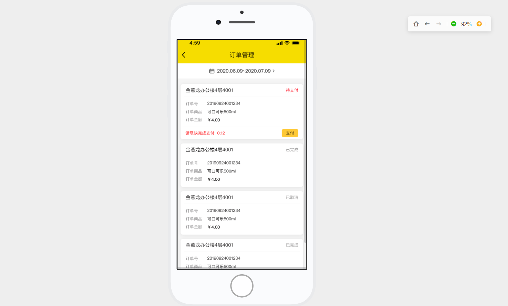
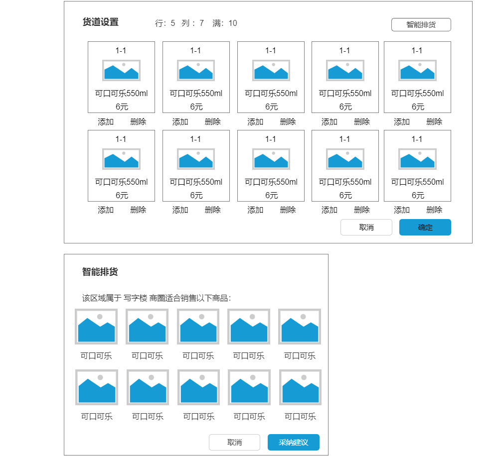

[toc]
# 第6章 新零售制胜之道-LBS与选品

## 1. LBS(基于位置服务)

**基于位置的服务**（Location Based Services，LBS），是利用各类型的定位技术来获取定位设备当前的所在位置，通过移动互联网向定位设备提供信息资源和基础服务。LBS首先读者可利用定位技术确定自身的空间位置，随后读者便可通过移动互联网来获取与位置相关资源和信息。LBS服务中融合了移动通讯、互联网络、空间定位、位置信息、大数据等多种信息技术，利用移动互联网络服务平台进行数据更新和交互，使用户可以通过空间定位来获取相应的服务。

### 1.1 需求分析

- 搜索附近售货机

  用户不在售货机旁边，但是知道我们的售货机产品，曾经使用过我们的小程序，对购物流程比较了解。当用户打开小程序，在小程序首页会有搜索附近售货机的选项，此时用户选择该选项，小程序会获取用户所在位置的经纬度地理位置信息，将该信息传入小程序服务端接口，服务端根据传入的信息进行搜索，如果在距离范围内可以搜索到设备会将展示在小程序内置的地图上，同时会按照由近到远的顺序展示多个售货机列表。


搜索附近售货机的作用主要是用来增加用户的复购率，提高用户的购物体验，让用户方便的找到我们的售货机。


### 1.2 实现思路

如何实现地理位置的搜索呢？主流的技术方案：

（1）Redis GEO（**利用Redis的Geo功能实现查找附近的位置**）（https://blog.51cto.com/u_15367034/3897584）

（2）Elasticsearch GEO

实现步骤：

（1）完成投放工单时，前端采集设备所在位置信息发送给售货机微服务，售货机微服务负责保存设备位置信息到elasticsearch。

（2）在售货机微服务添加搜索附近售货机的方法，利用elasticsearch的GEO搜索实现其功能。

### 1.3 代码实现

#### 1.3.1 索引库设计与创建

索引库需要存储售货机编号、售货机类型、点位名称、地址、经纬度信息，在kibana中执行以下建库语句

```json
PUT /vm
{
    "mappings": {
        "properties": {
            "location": {
                "type": "geo_point"
            },
            "innerCode": {
                "type": "keyword"
            },
            "addr": {
                "type": "keyword"
            },
            "nodeName": {
                "type": "keyword"
            },
            "typeName":  {
                "type": "keyword"
            }
        }
    }
}
```


#### 1.3.2 完成保存设备坐标功能 

（1）在售货机服务项目`lkd_vms_service`里添加和ElasticSearch通信的相关引用，及配置中心里添加对ElasticSearch的相关配置

```xml
<!--es相关依赖-->
<dependency>
    <groupId>org.elasticsearch.client</groupId>
    <artifactId>elasticsearch-rest-high-level-client</artifactId>
    <version>7.7.1</version>
</dependency>
<dependency>
    <groupId>org.elasticsearch</groupId>
    <artifactId>elasticsearch</artifactId>
    <version>7.7.1</version>
</dependency>
<dependency>
    <groupId>org.elasticsearch.client</groupId>
    <artifactId>elasticsearch-rest-client</artifactId>
    <version>7.7.1</version>
</dependency>
<!--es相关依赖结束-->
```

（2）elasticsearch相关配置

```
  elasticsearch:
    rest:
      uris: http://192.168.200.128:9200
```

（3）service_common新建设备位置信息的视图模型类

```java
/**
 * 设备位置信息
 */
@Data
public class VMDistance implements Serializable {
    /**
     * 设备编号
     */
    private String innerCode;
    /**
     * 详细地址(不需要前端传入)
     */
    private String addr;
    /**
     * 点位名称(不需要前端传入)
     */
    private String nodeName;
    /**
     * 纬度
     */
    private Double lat;
    /**
     * 经度
     */
    private Double lon;
}
```

（4）VendingMachineService新建方法定义

```java
/**
 * 设置售货机位置信息
 * @param vmDistance
 * @return
 */
Boolean setVMDistance(VMDistance vmDistance);
```

VendingMachineServiceImpl实现该方法

```java
@Autowired
private RestHighLevelClient esClient;

@Override
public Boolean setVMDistance(VMDistance vmDistance) {
    var vmEntity = this.findByInnerCode(vmDistance.getInnerCode());
    if(vmEntity == null){
        throw new LogicException( "该设备编号不存在:"+vmDistance.getInnerCode());
    }
    IndexRequest request = new IndexRequest("vm");
    request.id(vmDistance.getInnerCode());
    request.source(
            "addr",vmEntity.getNode().getAddr(),
            "innerCode",vmEntity.getInnerCode(),
            "nodeName",vmEntity.getNode().getName(),
            "location",vmDistance.getLat()+","+vmDistance.getLon(),
            "typeName",vmEntity.getType().getName());
    try {
        esClient.index(request, RequestOptions.DEFAULT);
    } catch (IOException e) {
        log.error("添加售货机位置信息失败",e);
        return false;
    }
    //保存到数据库中
    vmEntity.setLatitude(vmDistance.getLat());
    vmEntity.setLongitudes(vmDistance.getLon());
    this.updateById(vmEntity);
    return true;
}
```

（5）修改售货机微服务 TaskCompletedMsgHandler的process方法，添加保存设备坐标的代码

```java
@Override
public void process(String jsonMsg) throws IOException {
    TaskCompleteContract taskCompleteContract= JsonUtil.getByJson(jsonMsg, TaskCompleteContract.class );
    if(taskCompleteContract==null || Strings.isNullOrEmpty(taskCompleteContract.getInnerCode())  ) return;

    //如果是投放工单，将售货机修改为运营状态
    if( taskCompleteContract.getTaskType()== VMSystem.TASK_TYPE_DEPLOY){
        vmService.updateStatus(  taskCompleteContract.getInnerCode(), VMSystem.VM_STATUS_RUNNING   );
        //添加代码：保存设备的坐标（数据库+es）
        var vmDistance=new VMDistance();
        BeanUtils.copyProperties( taskCompleteContract,vmDistance );
        vmService.setVMDistance(vmDistance);
    }

    //如果是撤机工单，将售货机修改为撤机状态
    if( taskCompleteContract.getTaskType()== VMSystem.TASK_TYPE_REVOKE){
        vmService.updateStatus(  taskCompleteContract.getInnerCode(), VMSystem.VM_STATUS_REVOKE  );
    }
}
```

**测试：**

（1）启动售货机微服务、工单微服务、网关

（2）运行测试脚本：创建投放工单、接收工单、完成投放工单

（3）观察es索引库

#### 1.3.3 附近售货机搜索 



（1） 在`service_common`项目中定义根据位置信息搜索需要传入的参数对象

```java
package com.lkd.http.viewModel;

import lombok.Data;

import java.io.Serializable;

@Data
public class VmSearch implements Serializable {
    /**
     * 纬度
     */
    private Double lat;
    /**
     * 经度
     */
    private Double lon;
    /**
     * 搜索半径
     */
    private Integer distance;
}
```

（2）在`service_common`项目中定义需要返回的售货机信息对象

```java
package com.lkd.viewmodel;
import lombok.Data;
import java.io.Serializable;
/**
 * 售货机在es中存储的信息
 */
@Data
public class VmInfoDTO implements Serializable {
    /**
     * 售货机经纬度信息
     */
    private String location;
    /**
     * 售货机编号
     */
    private String innerCode;
    /**
     * 点位名称
     */
    private String nodeName;
    /**
     * 详细地址
     */
    private String addr;
    /**
     * 距离(单位：米)
     */
    private Integer distance;
    /**
     * 售货机类型
     */
    private String typeName;
}
```

（3）在售货机微服务VendingMachineService中定义搜索售货机的接口

```java
/**
 * 根据条件搜索售货机
 * @param searchReq
 @return
 */
List<VmInfoDTO> search(VmSearch searchReq);
```

实现此方法：

```java
@Override
public List<VmInfoDTO> search(VmSearch searchReq) {
    //指定索引
    SearchRequest searchRequest = new SearchRequest("vm");
    SearchSourceBuilder searchSourceBuilder = new SearchSourceBuilder();

    //中心点及半径构建
    GeoDistanceQueryBuilder geoDistanceQueryBuilder = new GeoDistanceQueryBuilder("location");
    geoDistanceQueryBuilder.distance(searchReq.getDistance(), DistanceUnit.KILOMETERS);
    geoDistanceQueryBuilder.point(searchReq.getLat(),searchReq.getLon());

    //从近到远排序规则构建
    GeoDistanceSortBuilder distanceSortBuilder = new GeoDistanceSortBuilder("location",searchReq.getLat(),searchReq.getLon());
    distanceSortBuilder.unit(DistanceUnit.KILOMETERS);
    distanceSortBuilder.order(SortOrder.ASC);
    distanceSortBuilder.geoDistance(GeoDistance.ARC);
            
    BoolQueryBuilder boolQueryBuilder = new BoolQueryBuilder();

    boolQueryBuilder.must(geoDistanceQueryBuilder);
    searchSourceBuilder.query(boolQueryBuilder);
    searchSourceBuilder.sort(distanceSortBuilder);

    searchRequest.source(searchSourceBuilder);
    try {
        SearchResponse searchResponse = esClient.search(searchRequest, RequestOptions.DEFAULT);
        SearchHits hits = searchResponse.getHits();
        if(hits.getTotalHits().value <= 0){
            return Lists.newArrayList();
        }
        List<VmInfoDTO> vmInfoList = Lists.newArrayList();
        Arrays.stream(hits.getHits()).forEach(h->{
            VmInfoDTO vmInfo = null;
            try {
                vmInfo = JsonUtil.getByJson(h.getSourceAsString(), VmInfoDTO.class);
                //将千米转换为米
                BigDecimal geoDis=new BigDecimal((double)h.getSortValues()[0]*1000);
                vmInfo.setDistance(geoDis.intValue());
            } catch (IOException e) {
                log.error("convert vminfo error",e);
            }
            if(vmInfo!=null){
                vmInfoList.add(vmInfo);
            }
        });
        return vmInfoList;
    } catch (IOException e) {
        log.error("search location error",e);
        return Lists.newArrayList();
    }
}
```

（4）在售货机微服务VendingMachineController新增方法

```java
/**
 * 搜索附近售货机
 * @param vmSearch
 * @return
 */
@PostMapping("/search")
public List<VmInfoDTO> search(@RequestBody VmSearch vmSearch){
    return vendingMachineService.search(vmSearch);
}
```

（5）service_common的VMService新增方法

```java
@PostMapping("/vm/search")
List<VmInfoDTO> search(@RequestBody VmSearch vmSearch);
```

降级类VmServiceFallbackFactory代码略

（6）在小程序微服务lkd_microapp中的VMController新增方法

```java
/**
 * 搜索附近售货机
 * @param vmSearch
 * @return
 */
@PostMapping("/search")
public List<VmInfoDTO> search(@RequestBody VmSearch vmSearch){
    return vmService.search(vmSearch);
}
```

**测试：**

（1）启动售货机微服务、小程序微服务、小程序微服务网关

（2）通过测试脚本测试

（3）通过微信开发者工具联调测试

可以在微信开发者工具中设置当前经纬度




## 2. logstash实现订单数据同步 

### 2.1 需求分析 

随着售货机系统的运营时间累积、设备数量的增加、用户购买的数量也随之增长，订单数据如果长期存在mysql中，势必会造成订单表数据的急剧增长，影响后续的查询及检索效率，为了提高订单数据的查询检索效率，我们采用将订单数据同步到ElasticSearch中。

### 2.2 实现思路 

我们采用logstash将订单表里的数据增量更新同步到ElasticSearch中。通过logstash的定期同步的功能来实现。

### 2.3 logstash 介绍 

 Logstash是一个开源的服务器端数据处理管道，可以同时从多个数据源获取数据，并对其进行转换，然后将其发送到你最喜欢的“存储”（当然，我们最喜欢的是Elasticsearch）。

**输入：采集各种样式、大小和来源的数据**

数据往往以各种各样的形式，或分散或集中地存在于很多系统中。Logstash 支持各种输入选择 ，可以在同一时间从众多常用来源捕捉事件。能够以连续的流式传输方式，轻松地从您的日志、指标、Web 应用、数据存储以及各种 AWS 服务采集数据。

 **过滤器：实时解析和转换数据** 

 数据从源传输到存储库的过程中，Logstash 过滤器能够解析各个事件，识别已命名的字段以构建结构，并将它们转换成通用格式，以便更轻松、更快速地分析和实现商业价值。 

 **输出：选择你的存储，导出你的数据** 

尽管 Elasticsearch 是我们的首选输出方向，能够为我们的搜索和分析带来无限可能，但它并非唯一选择。

Logstash 提供众多输出选择，您可以将数据发送到您要指定的地方，并且能够灵活地解锁众多下游用例。

### 2.4 代码实现 

#### 2.4.1 环境搭建

目前我们提供的镜像中，已经安装好了Logstash ，并完成了配置，如果你想自己搭建环境，可以参考一下步骤

（1）将mysql-connector-java-8.0.18.jar拷贝到服务器的/root/common/data/logstash/lib/目录中

（2）在服务器创建docker-compose.yml

```yaml
version: "3"
services:
  logstash:
    image: elastic/logstash:7.7.1
    restart: always
    container_name: logstash
    privileged: true
    environment:
      - TZ=Asia/Shanghai
    volumes:
      - /root/common/data/logstash/pipeline:/usr/share/logstash/pipeline
      - /root/common/data/logstash/log:/var/log/glog/
      - /root/common/data/logstash/lib/mysql-connector-java-8.0.18.jar:/resource/mysql-connector-java-8.0.18.jar
      - /root/common/data/logstash/order/:/usr/share/logstash/last_values/
```

（3）执行docker-compose

```
docker-compose up
```

#### 2.4.2 代码实现

（1）编写ElasticSearch对应订单的mapping，put到ElasticSearch中

```json
PUT order
{
  "mappings": {
    "properties": {
      "sku_name": {
        "type": "keyword"
      },
      "region_name": {
        "type": "keyword"
      },
      "business_name": {
        "type": "keyword"
      },
      "inner_code": {
        "type": "keyword"
      },
      "node_name": {
        "type": "keyword"
      },
      "order_no": {
        "type": "keyword"
      },
      "third_no": {
        "type": "keyword"
      },
      "addr": {
        "type": "text"
      },
      "open_id": {
        "type": "keyword"
      },
      "pay_type": {
        "type": "keyword"
      }
    }
  }
}
```

（2）编写logstash的pipeline文件order.conf ，放到/root/common/data/logstash/pipeline目录下，  用来定期从mysql数据库表中根据最后更新日期列(update_time)来读取增量数据，然后将数据输出写入到ElasticSearch中

```
input {
 stdin { }
    jdbc {
    	#设置jdbc的数据库连接字符串
        jdbc_connection_string => "jdbc:mysql://192.168.200.128:3306/lkd_order?serverTimezone=Asia/Shanghai"
  		#设置数据库的用户名
        jdbc_user => "root"
 		#设置数据库的密码
        jdbc_password => "root123"
 		#设置数据程序的驱动jar包路径
        jdbc_driver_library => "/resource/mysql-connector-java-8.0.18.jar"
 		#设置驱动类
        jdbc_driver_class => "com.mysql.cj.jdbc.Driver"
		#设置数据库的日期时间格式
        jdbc_default_timezone => "Asia/Shanghai"
		#设置记录上次的值
		record_last_run => "true"
        #是否指定追踪的字段  
        use_column_value => true
        #追踪的字段
        tracking_column => "update_time"
        #追踪列的类型
        tracking_column_type => "timestamp"
		last_run_metadata_path => "/usr/share/logstash/last_values/order_info.txt"
		clean_run => "false"
        
        #开启分页查询
        jdbc_paging_enabled => true

        #分页大小
        jdbc_page_size => "5000"
        statement => "SELECT * FROM tb_order where update_time > :sql_last_value order by update_time asc"
        #设置运行周期
        schedule => "*/2 * * * * *"
    }
 }
  
 output {
     stdout {
     	#设置以json的格式输出
        codec => json_lines
    }
    #设置输出到elasticsearch
    elasticsearch {
        hosts => "192.168.200.128:9200"
        #输出到的索引
        index => "order"
        #索引文档的id取采集源中的id列的值
        document_id => "%{id}"
    }
}

#过滤器配置
filter {
  ruby{
  	#转换update_time，这样符合北京时间。通过event.get取出字段update_time中的值加8小时，然后再通过event.set将得到的值设置回update_time字段
	code => "event.set('update_time',event.get('update_time').time.localtime + 8*60*60)"
  }
  ruby{
  	#转换create_time，这样符合北京时间
	code => "event.set('create_time',event.get('create_time').time.localtime + 8*60*60)"
  }
}
```

- input：数据的来源配置，这里是我们的订单表中的数据
- output：输出到的目标，这里是ElasticSearch
- filter：对每条数据的过滤处理，这里我们处理了`update_time`和`create_time`两列数据的值，因为logstash读取和存入ElasticSearch中的时间数据格式是UTC时间，比我们国内正常的时间少8小时，这里特殊处理了下。这里也可以不处理，在后续程序中处理也是一种实现方案。

**测试：**

新增订单，观察两秒以后是否会同步到elasticsearch中。

## 3. 用户订单数据检索

### 3.1 需求分析 

用户在微信小程序中能够根据日期范围检索查询历史订单。



### 3.2 实现思路 

（1）在订单微服务，封装查询逻辑，查询elasticsearch中的订单数据。

（2）微信小程序微服务feign远程调用订单微服务的查询方法。

### 3.3 代码实现 

（1）在订单服务里添加elasticsearch-rest-high-level-client相关依赖，要和我们的ElasticSearch版本一样，这里我们使用的是7.7.1版本

```xml
<!--es相关依赖-->
<dependency>
    <groupId>org.elasticsearch.client</groupId>
    <artifactId>elasticsearch-rest-high-level-client</artifactId>
    <version>7.7.1</version>
</dependency>
<dependency>
    <groupId>org.elasticsearch</groupId>
    <artifactId>elasticsearch</artifactId>
    <version>7.7.1</version>
</dependency>
<dependency>
    <groupId>org.elasticsearch.client</groupId>
    <artifactId>elasticsearch-rest-client</artifactId>
    <version>7.7.1</version>
</dependency>
<!--es相关依赖结束-->
```

（2）在consul配置中心里修改订单服务的配置，在spring节点下添加elasticsearch的配置：

```Yaml
  elasticsearch:
    rest:
      uris: http://192.168.200.128:9200
```

（3）在订单服务项目`lkd_order_service`中，修改订单服务接口`OrderService`，添加搜索订单的方法：

```java
/**
     * 查询订单
     * @param pageIndex
     * @param pageSize
     * @return
     */
Pager<OrderViewModel> search(Integer pageIndex, Integer pageSize, String orderNo, String openId, String startDate, String endDate);
```

并在实现类中实现该接口：

```java
@Autowired
private RestHighLevelClient client;

@Override
public Pager<OrderViewModel> search(Integer pageIndex, Integer pageSize, String orderNo, String openId, String startDate, String endDate) {
    SearchRequest searchRequest = new SearchRequest("order");
    SearchSourceBuilder sourceBuilder = new SearchSourceBuilder();
    BoolQueryBuilder boolQueryBuilder = QueryBuilders.boolQuery();
    //根据订单号查询
    if(!Strings.isNullOrEmpty(orderNo)) {
        boolQueryBuilder.must(QueryBuilders.termQuery("order_no", orderNo));
    }
    //根据openId查询
    if(!Strings.isNullOrEmpty(openId)){
        boolQueryBuilder.must(QueryBuilders.termQuery("open_id",openId));
    }
    //根据时间范围查询
    if(!Strings.isNullOrEmpty(startDate) && !Strings.isNullOrEmpty(endDate)){
        RangeQueryBuilder rangeQueryBuilder = QueryBuilders.rangeQuery("update_time");
        rangeQueryBuilder.gte(startDate);
        rangeQueryBuilder.lte(endDate);
        boolQueryBuilder.must(rangeQueryBuilder);
    }
    //按照最后更新时间由近到远的排序规则排序
    sourceBuilder.from((pageIndex -1)*pageSize);
    sourceBuilder.size(pageSize);
    sourceBuilder.sort("update_time", SortOrder.DESC);
    sourceBuilder.trackTotalHits(true);
    sourceBuilder.query(boolQueryBuilder);
    searchRequest.source(sourceBuilder);
    try {
        SearchResponse searchResponse = client.search(searchRequest, RequestOptions.DEFAULT);
        SearchHits hits = searchResponse.getHits();
        SearchHit[] searchHits = hits.getHits();
        List<OrderViewModel> orderList = Lists.newArrayList();
        for(SearchHit hit : searchHits){
            String hitResult = hit.getSourceAsString();
            OrderViewModel order = new OrderViewModel();
            JsonNode jsonNode = JsonUtil.getTreeNode(hitResult);
            order.setId(jsonNode.findPath("id").asLong());
            order.setStatus(jsonNode.findPath("status").asInt());
            order.setBill(jsonNode.findPath("bill").asInt());
            order.setOwnerId(jsonNode.findPath("owner_id").asInt());
            order.setPayType(jsonNode.findPath("pay_type").asText());
            order.setOrderNo(jsonNode.findPath("order_no").asText());
            order.setInnerCode(jsonNode.findPath("inner_code").asText());
            order.setSkuName(jsonNode.findPath("sku_name").asText());
            order.setSkuId(jsonNode.findPath("sku_id").asLong());
            order.setPayStatus(jsonNode.findPath("pay_status").asInt());
            order.setBusinessName(jsonNode.findPath("business_name").asText());
            order.setBusinessId(jsonNode.findPath("business_id").asInt());
            order.setRegionId(jsonNode.findPath("region_id").asLong());
            order.setRegionName(jsonNode.findPath("region_name").asText());
            order.setPrice(jsonNode.findPath("price").asInt());
            order.setAmount(jsonNode.findPath("amount").asInt());
            order.setAddr(jsonNode.findPath("addr").asText());
            order.setOpenId(jsonNode.findPath("open_id").asText());
            order.setCreateTime(LocalDateTime.parse(jsonNode.findPath("create_time").asText(),DateTimeFormatter.ISO_DATE_TIME));
            order.setUpdateTime(LocalDateTime.parse(jsonNode.findPath("update_time").asText(),DateTimeFormatter.ISO_DATE_TIME));
            orderList.add(order);
        }
        Pager<OrderViewModel> pager = new Pager<>();
        pager.setTotalCount(searchResponse.getHits().getTotalHits().value);

        pager.setPageSize(searchResponse.getHits().getHits().length);
        pager.setCurrentPageRecords(orderList);
        pager.setPageIndex(pageIndex);

        return pager;
    } catch (IOException e) {
        log.error("查询es失败",e);
        return Pager.buildEmpty();
    }
}
```

（4）在订单服务的`OrderController`中添加Rest接口调用服务层方法将数据返回

```java
@GetMapping("/search")
public Pager<OrderViewModel> search(
    @RequestParam(value = "pageIndex",required = false,defaultValue = "1") Integer pageIndex,
    @RequestParam(value = "pageSize",required = false,defaultValue = "10") Integer pageSize,
    @RequestParam(value = "orderNo",required = false,defaultValue = "") String orderNo,
    @RequestParam(value = "openId",required = false,defaultValue = "") String openId,
    @RequestParam(value = "startDate",required = false,defaultValue = "") String startDate,
    @RequestParam(value = "endDate",required = false,defaultValue = "") String endDate){
    return orderService.search(pageIndex,pageSize,orderNo,openId,startDate,endDate);
}
```

（5）在service_common项目中修改订单服务的feign接口`OrderService`，添加查询订单的方法：

```java
@GetMapping("/order/search")
Pager<OrderViewModel> search(
    @RequestParam(value = "pageIndex",required = false,defaultValue = "1") Integer pageIndex,
    @RequestParam(value = "pageSize",required = false,defaultValue = "10") Integer pageSize,
    @RequestParam(value = "orderNo",required = false,defaultValue = "") String orderNo,
    @RequestParam(value = "openId",required = false,defaultValue = "") String openId,
    @RequestParam(value = "startDate",required = false,defaultValue = "") String startDate,
    @RequestParam(value = "endDate",required = false,defaultValue = "") String endDate);
```

服务降级类代码略

（6）在小程序项目`lkd_microapp`中的`OrderController`中，添加搜索订单的方法，将调用feign接口订单数据返回：

```java
/**
     * 订单搜索
     * @param pageIndex
     * @param pageSize
     * @param orderNo
     * @param openId
     * @param startDate
     * @param endDate
     * @return
     */
@GetMapping("/search")
public Pager<OrderViewModel> search(
    @RequestParam(value = "pageIndex",required = false,defaultValue = "1") Integer pageIndex,
    @RequestParam(value = "pageSize",required = false,defaultValue = "10") Integer pageSize,
    @RequestParam(value = "orderNo",required = false,defaultValue = "") String orderNo,
    @RequestParam(value = "openId",required = false,defaultValue = "") String openId,
    @RequestParam(value = "startDate",required = false,defaultValue = "") String startDate,
    @RequestParam(value = "endDate",required = false,defaultValue = "") String endDate){
    return orderService.search(pageIndex,pageSize,orderNo,openId,startDate,endDate);
}
```

## 4. 选品智能推荐 

### 4.1 需求分析 

立可得智能售货机系统平台要实现的功能不仅要帮用户方便管理售货机，更要具备给用户运营售货机提供优秀的指导建议。正因为所有点位都划分出了商圈的概念，我们就能通过售货机的历史售卖数据进行统计分析，得出一些对运营有价值的数据，当用户要在某个商圈下摆放售货机进行售卖运营的时候，我们可以将已经形成的数据得出一些指导建议，建议用户在该商圈下补哪些商品，因为历史数据告诉我们，这些商品在这类商圈下销量比较好。这样就不用用户去自己选品、试错，帮用户节约时间成本，快速盈利，这就是我们系统的价值所在。



简单一句话：当用户要往某商圈下投放售货机时，系统能够通过点位的商圈属性给出同商圈下近3个月内销量最好的前10个商品。

### 4.2 实现思路  

从Elasticsearch中聚合查询3个月范围内，同一商圈下销量前10的商品。

因为我们要实现对订单索引中的商品分组聚合查询，假如在mysql表中，我们只需要类似这样的sql语句就可以得到想要的结果：

```sql
select sku_Id,count(sku_id) as count from order group by sku_Id where ...  limit 0,10
```

那么在Elasticsearch中如何实现分组聚合查询，然后再统计某列的count呢？这时候就需要用到`AggregationBuilders`来实现我们想要的效果了。

根据sku_id进行分组，然后在分组上统计count，最后按照count进行排序取前10

```java
AggregationBuilder orderAgg = AggregationBuilders
                .terms("sku").field("sku_id")
                .subAggregation(AggregationBuilders.count("count").field("sku_id")) //对分组之后的sku_id进行count，取别名为count
                .order(BucketOrder.aggregation("count",false)).size(10); 
```

### 4.3 代码实现  

（1）在订单微服务项目`lkd_order_server`中，修改订单服务接口`OrderService`，添加获取商圈下销量最好的前10商品的方法定义：

```java
/**
 * 获取商圈下销量最好的前10商品
 * @return
 */
List<Long> getTop10Sku(Integer businessId);
```

在接口实现类`OrderServiceImpl`中实现该方法：

```java
@Override
public List<Long> getTop10Sku(Integer businessId) {

    SearchRequest searchRequest=new SearchRequest("order");
    SearchSourceBuilder sourceBuilder=new SearchSourceBuilder();
    //查询条件：最近三个月

    RangeQueryBuilder rangeQueryBuilder = QueryBuilders.rangeQuery("update_time");
    rangeQueryBuilder.gte( LocalDateTime.now().plusMonths(-3).format(  DateTimeFormatter.ISO_DATE_TIME )  );
    rangeQueryBuilder.lte( LocalDateTime.now().format(  DateTimeFormatter.ISO_DATE_TIME )  );

    BoolQueryBuilder boolQueryBuilder=QueryBuilders.boolQuery();
    boolQueryBuilder.must( rangeQueryBuilder );

    boolQueryBuilder.must( QueryBuilders.termQuery("business_id",businessId) );
    sourceBuilder.query(boolQueryBuilder);

    AggregationBuilder orderAgg = AggregationBuilders.terms("sku").field("sku_id")
            .subAggregation(AggregationBuilders.count("count").field("sku_id"))
            .order(BucketOrder.aggregation("count", false))
            .size(10);

    sourceBuilder.aggregation(orderAgg);
    searchRequest.source(sourceBuilder);

    try {
        SearchResponse searchResponse = esClient.search(searchRequest, RequestOptions.DEFAULT);
        Aggregations aggregations = searchResponse.getAggregations();
        if(aggregations==null ) return  Lists.newArrayList();

        var term = (Terms)aggregations.get("sku");
        var buckets = term.getBuckets();

        return buckets.stream().map(  b->   Long.valueOf( b.getKey().toString() ) ).collect(Collectors.toList());

    } catch (IOException e) {
        e.printStackTrace();
        return Lists.newArrayList();
    }

}
```

说明：BucketOrder.aggregation("count",false)，相当于sql中的`order by` 排序，传入`false`是倒序排序

（2）在`OrderController`中定义RESTful接口，方便前端或其他微服务调用：

```java
/**
     * 获取商圈下3个月内销量前10商品
     * @param businessId
     * @return
     */
@GetMapping("/businessTop10/{businessId}")
public List<Long> getBusinessTop10Skus(@PathVariable Integer businessId){
    return orderService.getTop10Sku(businessId);
}
```

## 5.商品热榜


