[toc]
# 第7章 合作商分账结算

## 1.分成金额计算

### 1.1 需求分析

根据订单金额和合作商的分成比例，进行分成金额的计算

### 1.2 实现思路

在创建订单时添加逻辑：

（1）根据售货机所在点位的合作商ID查询合作商信息，其中包括分成比例

（2）将商品的真实价格乘以分成比例 ，商业运算中一般实用BigDecimal的multiply（乘法运算）方法和divide（除法运算）方法。

### 1.3 代码实现

修改订单微服务OrderServiceImpl的createOrder方法，在`this.save(orderEntity);` 之前添加代码

```java
//设置合作商账单分账金额
PartnerViewModel partner = userService.getPartner(vm.getOwnerId());
BigDecimal bg = new BigDecimal(sku.getRealPrice());
//遵循四舍五入的规则
int bill = bg.multiply(new BigDecimal(partner.getRatio())).divide(new BigDecimal(100),0,RoundingMode.HALF_UP).intValue();

orderEntity.setBill(bill);
```

BigDecimal中的divide主要就是用来做除法的运算。

```java
public BigDecimal divide(BigDecimal divisor,int scale, int roundingMode);
```

第一个参数是除数，第二个参数代表保留几位小数，第三个代表的是保留模式:

> RoundingMode.CEILING：取右边最近的整数
>
> RoundingMode.DOWN：去掉小数部分取整，也就是正数取左边，负数取右边，相当于向原点靠近的方向取整
>
> RoundingMode.FLOOR：取左边最近的正数
>
> RoundingMode.HALF_DOWN:五舍六入，负数先取绝对值再五舍六入再负数
>
> **RoundingMode.HALF_UP:四舍五入，负数原理同上**
>
> RoundingMode.HALF_EVEN:这个比较绕，整数位若是奇数则四舍五入，若是偶数则五舍六入


## 2.订单数据定时汇总

### 2.1 需求分析

在立可得管理后台里，管理员要能够根据合作商、日期条件能够查看一定日期范围之内的分成情况：

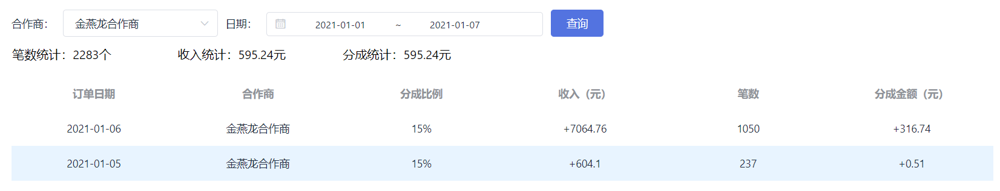

还需要在合作商后台里，合作商能够根据点位和一定时间范围查看自己的分账情况:

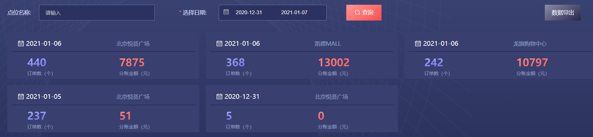


### 2.2 实现思路

如果每次都从订单表汇总统计，必定是查询效率低下。所以我们需要每天定期对数据进行汇总，并将汇总的结果保存到一张订单汇总表中。这样订单汇总表的数据不会过多，再次进行聚合统计时效率也会比较高。

订单库- 订单汇总表  tb_order_collect  ：

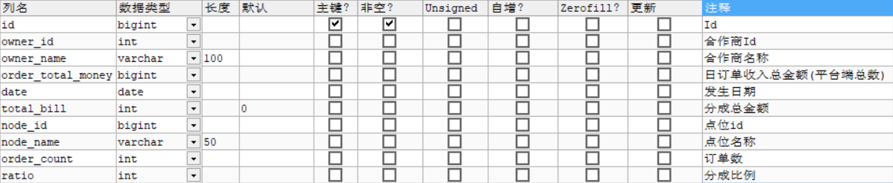

**任务描述：**

（1）完成定时任务类处理订单汇总逻辑，按合作商和点位汇总

（2）通过xxl-job配置任务

### 2.3 代码实现

（1）订单微服务添加xxl-job依赖

```xml
<dependency>
    <groupId>com.xuxueli</groupId>
    <artifactId>xxl-job-core</artifactId>
    <version>2.2.0</version>
</dependency>
```

（2）添加配置

```yaml
xxl:
  job:
    accessToken:
    admin:
      addresses: http://192.168.200.128:8080/xxl-job-admin
    executor:
      appname: order-service
      address:
      ip:
      port: 9982
      logretentiondays: 30
```

（3）创建com.lkd.job包，添加xxl-job的配置类（从售货机微服务拷贝过来）

（4）订单微服务编写任务类，处理订单合并请求

```java
@Component
@RequiredArgsConstructor
@Slf4j
public class OrderCollectJob {

    private final OrderService orderService;
    private final OrderCollectService orderCollectService;
    private final VMService vmService;
    private final UserService userService;

    /**
     * 订单合并
     * @param param
     * @return
     */
    @XxlJob("orderCollectJobHandler")
    public ReturnT<String> collectTask(String param){

        var yesterday = LocalDate.now().plusDays(-1);

        var qw=new QueryWrapper<OrderEntity>();
        qw.select( "owner_id","node_id", "IFNULL(sum(amount),0) as amount ","IFNULL(sum(bill),0) as bill" ,"IFNULL(count(1),0) as price"     )
                .lambda().ge( OrderEntity::getCreateTime,yesterday  )
                .lt( OrderEntity::getCreateTime,LocalDate.now() )
                .eq(OrderEntity::getPayStatus , VMSystem.PAY_STATUS_PAYED)
                .groupBy(OrderEntity::getOwnerId,OrderEntity::getNodeId );


        orderService.list(qw).forEach( order->{
            var orderCollect=new OrderCollectEntity();
            orderCollect.setDate( yesterday );
            orderCollect.setNodeId( order.getNodeId() );
            orderCollect.setNodeName( vmService.getNodeName( order.getNodeId() ) );

            orderCollect.setOwnerId( order.getOwnerId() );
            var partner = userService.getPartner(order.getOwnerId());
            orderCollect.setOwnerName( partner.getName()   );

            orderCollect.setOrderTotalMoney( order.getAmount() );//金额
            orderCollect.setTotalBill( order.getBill() );//分成
            orderCollect.setOrderCount( order.getPrice() );//订单数量（借用了价格字段）
            orderCollect.setRatio( partner.getRatio() );//分成比例
            orderCollectService.save(orderCollect);

        } );
        return ReturnT.SUCCESS;
    }
}
```

代码解释：

Lombok在spring中的特殊注解 @RequiredArgsConstructor  ， 写在类上可以代替@AutoWired注解，需要注意的是在注入时需要用final定义

（5）通过xxl-job配置任务

新增执行器  order-service  （订单微服务）

新增任务  “订单汇总”

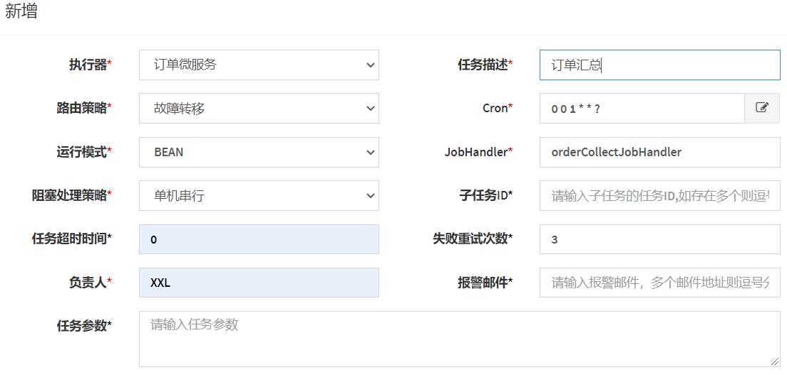


## 3.合作商分账查询

### 3.1 需求分析

在立可得管理后台里，管理员要能够根据合作商、日期条件能够查看一定日期范围之内的分成情况：


### 3.2 实现思路

对订单汇总表  tb_order_collect进行聚合统计

API：管理后台-对账管理-获取一定日期范围之内的合作商分成汇总数据 

### 3.3 代码实现

（1）新建ReportService，并新增方法

```java
/**
 * 获取合作商分账汇总信息
 * @param pageIndex
 * @param pageSize
 * @param name
 * @param start
 * @param end
 * @return
 */
Pager<OrderCollectEntity> getPartnerCollect(Long pageIndex,Long pageSize,String name,LocalDate start, LocalDate end);
```

实现类 ReportServiceImpl

```java
@Override
public Pager<OrderCollectEntity> getPartnerCollect(Long pageIndex, Long pageSize, String name, LocalDate start, LocalDate end) {
    Page<OrderCollectEntity> page = new Page<>(pageIndex,pageSize);
    var qw = new QueryWrapper<OrderCollectEntity>();
    qw.select(
            "IFNULL(sum(order_count),0) as order_count",
            "IFNULL(sum(total_bill),0) as total_bill",
            "IFNULL(sum(order_total_money),0) as order_total_money",
            "IFNULL(min(ratio),0) as ratio",
            "owner_name",
            "date"
    );
    if(!Strings.isNullOrEmpty(name)){
        qw.lambda().like(OrderCollectEntity::getOwnerName,name);
    }
    qw
            .lambda()
            .ge(OrderCollectEntity::getDate,start)
            .le(OrderCollectEntity::getDate,end)
            .groupBy(OrderCollectEntity::getOwnerName,OrderCollectEntity::getDate)
            .orderByDesc(OrderCollectEntity::getDate);

    return Pager.build(orderCollectService.page(page,qw));
}
```

按照日期和合作商对OrderCollect进行聚合统计

（2）订单微服务新建  ReportController  ，并新增方法

```java
/**
 * 获取一定日期范围之内的合作商分成汇总数据
 * @param pageIndex
 * @param pageSize
 * @param partnerName
 * @param start
 * @param end
 * @return
 */
@GetMapping("/partnerCollect")
public Pager<OrderCollectEntity> getPartnerCollect(
        @RequestParam(value = "pageIndex",required = false,defaultValue = "1") Long pageIndex,
        @RequestParam(value = "pageSize",required = false,defaultValue = "10") Long pageSize,
        @RequestParam(value = "partnerName",required = false,defaultValue = "") String partnerName,
        @RequestParam(value = "start",required = true,defaultValue = "") @DateTimeFormat(pattern = "yyyy-MM-dd") LocalDate start,
        @RequestParam(value = "end",required = true,defaultValue = "") @DateTimeFormat(pattern = "yyyy-MM-dd") LocalDate end
){
    return reportService.getPartnerCollect(pageIndex,pageSize,partnerName,start,end);
}
```

## 4.合作商后台-点位分账查询

### 4.1 需求分析 

在合作商工作台页面要展示近期12条分账信息，点击查看更多跳转到对账管理页面。

对账管理页面是对对账详情进行查看，合作商可以分页搜索查看自己的点位下每天的分账情况。

最近12条合作商点位分账信息展示效果： 

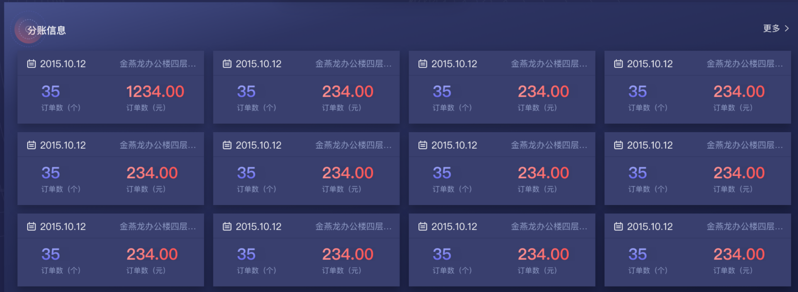

合作商点位分账列表展示：

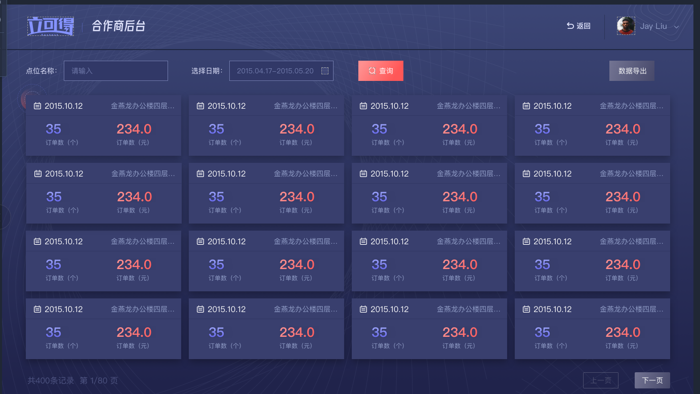


### 4.2 实现思路

对订单汇总表  tb_order_collect进行查询

API： 合作商后台-分账管理- 合作商获分账信息查询 

​           合作商后台-分账管理-合作商获取最近12条分账信息

### 4.3 代码实现 

（1）ReportService新增方法定义

```java
/**
 * 获取合作商前12条点位分账数据
 * @param partnerId
 * @return
 */
List<OrderCollectEntity> getTop12(Integer partnerId);

/**
 * 合作商点位分账搜索
 * @param partnerId
 * @param nodeName
 * @param start
 * @param end
 * @return
 */
Pager<OrderCollectEntity> search(Long pageIndex,Long pageSize,Integer partnerId, String nodeName, LocalDate start, LocalDate end);
```

ReportServiceImpl实现方法

```java
@Override
public List<OrderCollectEntity> getTop12(Integer partnerId) {
    var qw = new LambdaQueryWrapper<OrderCollectEntity>();
    qw   .select(OrderCollectEntity::getDate,OrderCollectEntity::getNodeName,OrderCollectEntity::getOrderCount,OrderCollectEntity::getTotalBill)
            .eq(OrderCollectEntity::getOwnerId,partnerId)
            .orderByDesc(OrderCollectEntity::getDate)
            .last("limit 12");

    return orderCollectService.list(qw);
}

@Override
public Pager<OrderCollectEntity> search(Long pageIndex,Long pageSize,Integer partnerId, String nodeName, LocalDate start, LocalDate end) {
    var qw = new LambdaQueryWrapper<OrderCollectEntity>();
    qw
 .select(OrderCollectEntity::getDate,OrderCollectEntity::getNodeName,OrderCollectEntity::getOrderCount,OrderCollectEntity::getTotalBill)
            .eq(OrderCollectEntity::getOwnerId,partnerId);
    if(!Strings.isNullOrEmpty(nodeName)){
        qw.like(OrderCollectEntity::getNodeName,nodeName);
    }
    if(start !=null && end != null){
        qw
                .ge(OrderCollectEntity::getDate,start)
                .le(OrderCollectEntity::getDate,end);
    }
    qw.orderByDesc(OrderCollectEntity::getDate);
    var page = new Page<OrderCollectEntity>(pageIndex,pageSize);
    return Pager.build(orderCollectService.page(page,qw));
}
```

 （2）ReportController新增方法

```java
/**
 * 获取最近12条分账信息
 * @param partnerId
 * @return
 */
@GetMapping("/top12Collect/{partnerId}")
public List<OrderCollectEntity> getTop12Collect(@PathVariable Integer partnerId){
    return reportService.getTop12(partnerId);
}

/**
 * 合作商搜索分账信息
 * @param partnerId
 * @param pageIndex
 * @param pageSize
 * @param nodeName
 * @param start
 * @param end
 * @return
 */
@GetMapping("/search/{partnerId}")
public Pager<OrderCollectEntity> search(
        @PathVariable Integer partnerId,
        @RequestParam(value = "pageIndex",required = false,defaultValue = "1") Long pageIndex,
        @RequestParam(value = "pageSize",required = false,defaultValue = "10") Long pageSize,
        @RequestParam(value = "nodeName",required = false,defaultValue = "") String nodeName,
        @RequestParam(value = "start",required = true,defaultValue = "") @DateTimeFormat(pattern = "yyyy-MM-dd") LocalDate start,
        @RequestParam(value = "end",required = true,defaultValue = "") @DateTimeFormat(pattern = "yyyy-MM-dd") LocalDate end){
    return reportService.search(
            pageIndex,
            pageSize,
            partnerId,
            nodeName,
            start,
            end);
}
```


## 5 对账数据导出

### 5.1 需求分析

在合作商后台，当合作商根据点位搜索出分账列表之后，还会将数据以Excel报表导出的需求，因为可以根据导出的Excel文件数据，合作商可以非常方便的制作多种纬度的汇总统计图表，从而可以分析出多种纬度的运营数据和方案。

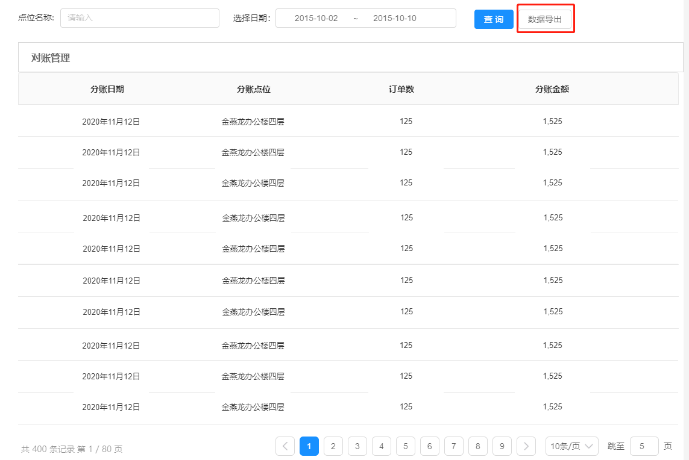

导出的数据格式如下：

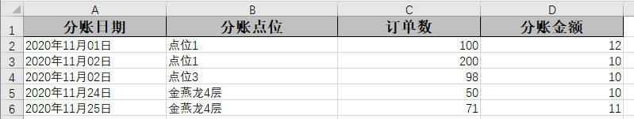

### 5.2 实现思路

（1）根据合作商输入的条件从数据库中查询结果

（2）运用**EasyExcel**将查询到的结果转换成可识别的结构化对象，调用其内部封装好的方法转成Excel文件流。

（3）通过http的方式将文件流response到前端

> 之前我们想到Excel解析一般是使用POI，但POI存在一个严重的问题，就是非常消耗内存。所以阿里人员对它进行了重写从而诞生了`easyexcel`，它解决了过于消耗内存问题，也对它进行了封装让使用者使用更加便利

API  立可得2.0合作商后台-  分账管理- 合作商获分账信息导出 

### 5.3 代码实现

（1）在`service_common`项目中添加解析Excel的依赖程序包，我们这里采用的是阿里提供的**easyexcel**

```xml
<dependency>
    <groupId>com.alibaba</groupId>
    <artifactId>easyexcel</artifactId>
    <version>2.2.6</version>
</dependency>
```

（2） 在`lkd_order_service`项目中定义到导出的数据对象类：

```java
package com.lkd.http.viewModel;

import com.alibaba.excel.annotation.ExcelProperty;
import com.alibaba.excel.annotation.format.DateTimeFormat;
import com.alibaba.excel.annotation.write.style.ColumnWidth;
import com.alibaba.excel.annotation.write.style.ContentRowHeight;
import com.alibaba.excel.annotation.write.style.HeadRowHeight;
import lombok.Data;

import java.util.Date;

/**
 * 账单导出数据对象
 */
@Data
@ContentRowHeight(15)
@HeadRowHeight(20)
@ColumnWidth(25)
public class BillExportDataVO {
    @DateTimeFormat("yyyy年MM月dd日")
    @ExcelProperty(value = "分账日期",index = 0)
    private Date date;
    @ColumnWidth(30)
    @ExcelProperty(value = "分账点位",index = 1)
    private String nodeName;
    @ExcelProperty(value = "订单数",index = 2)
    private Integer orderCount;
    @ExcelProperty(value = "分账金额",index = 3)
    private Integer amount;
}
```

说明：

- `ExcelProperty`注解是用来定义Excel表头数据的，index参数用来定义表头排列的顺序。
- `ColumnWidth`用来定义表头的宽度
- `DateTimeFormat`用来定义日期时间格式数据在Excel中生成的格式

（3）ReportController新增方法

```java
/**
 * 数据导出
 * @param partnerId
 * @param start
 * @param end
 */
@GetMapping("/export/{partnerId}/{start}/{end}")
public void export(
        HttpServletResponse response,
        @PathVariable Integer partnerId,
        @PathVariable @DateTimeFormat(pattern = "yyyy-MM-dd") LocalDate start,
        @PathVariable @DateTimeFormat(pattern = "yyyy-MM-dd") LocalDate end,
        @RequestParam(value = "nodeName",required = false,defaultValue = "") String nodeName) throws IOException {
    var exportData = reportService
            .getList(partnerId,nodeName,start,end)
            .stream()
            .map(item->{
                var vo = new BillExportDataVO();
                vo.setAmount(item.getTotalBill());
                vo.setDate(Date.from(item.getDate().atTime(0,0).atZone(ZoneId.systemDefault()).toInstant()));
                vo.setOrderCount(item.getOrderCount());
                vo.setNodeName(item.getNodeName());
                return vo;
            }).collect(Collectors.toList());
    response.setContentType("application/vnd.ms-excel");
    response.setCharacterEncoding("utf-8");
    // 这里URLEncoder.encode可以防止中文乱码 当然和easyexcel没有关系
    String fileName = null;
    fileName = URLEncoder.encode("bill", "UTF-8");
    response.setHeader("Content-disposition", "attachment;filename=" + fileName + ".xlsx");
    EasyExcel.write(response.getOutputStream(), BillExportDataVO.class).sheet("分账数据").doWrite(exportData);
}
```


## 6. 收益统计趋势图

### 6.1 需求分析

在合作商后台统计一段时间该合作商的收益趋势，前端以曲线图形式展现。

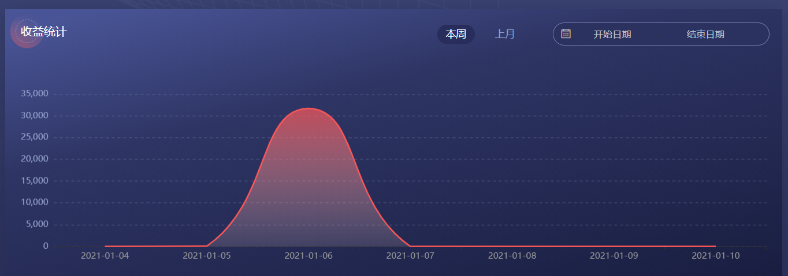

 API：合作商后台-工作台-一定日期之内的营收统计 

### 6.2 代码实现

（1）ReportService新增方法定义

```java
/**
 * 获取一定日期内合作商的收益统计
 * @param partnerId
 * @param start
 * @param end
 * @return
 */
BarCharCollect getCollect(Integer partnerId, LocalDate start, LocalDate end);
```

ReportServiceImpl实现该方法

```java
@Override
public BarCharCollect getCollect(Integer partnerId, LocalDate start, LocalDate end) {
    var qw = new QueryWrapper<OrderCollectEntity>();
    qw
            .select("IFNULL(sum(total_bill),0) as total_bill","date")
            .lambda()
            .ge(OrderCollectEntity::getDate,start)
            .eq(OrderCollectEntity::getOwnerId,partnerId)
            .le(OrderCollectEntity::getDate,end)
            .orderByDesc(OrderCollectEntity::getDate)
            .groupBy(OrderCollectEntity::getDate);
    var mapCollect = orderCollectService
            .list(qw)
            .stream()
 .collect(Collectors.toMap(OrderCollectEntity::getDate,OrderCollectEntity::getTotalBill));
    var result = new BarCharCollect();
    start.datesUntil(end.plusDays(1), Period.ofDays(1))
            .forEach(date->{
                result.getXAxis().add(date.format(DateTimeFormatter.ISO_LOCAL_DATE));
                if(mapCollect.containsKey(date)){
                    result.getSeries().add(mapCollect.get(date));
                }else {
                    result.getSeries().add(0);
                }
            });
    return result;
}
```

（2）ReportController新增方法

```java
/**
 * 获取合作商一定日期范围的收益情况
 * @param partnerId
 * @param start
 * @param end
 * @return
 */
@GetMapping("/collectReport/{partnerId}/{start}/{end}")
public BarCharCollect getCollectReport(@PathVariable Integer partnerId,
                                       @PathVariable  @DateTimeFormat(pattern = "yyyy-MM-dd") LocalDate start,
                                       @PathVariable  @DateTimeFormat(pattern = "yyyy-MM-dd") LocalDate end){
    return reportService.getCollect(partnerId,start,end);
}
```


## 7.收入与订单数统计  

### 7.1 需求分析 

编写方法，按时间段统计订单数、收入金额和分成金额。可选条件：合作商id、售货机id。

### 7.2 实现思路 

通过对elasticsearch实现聚合统计实现上述功能。

（1）编写接口，传递参数：合作商Id（可选）、售货机id（可选）、开始时间、截至时间，返回订单数

（2）编写接口，传递参数：合作商Id（可选）、售货机id（可选）、开始时间、截至时间

如果传递了合作商Id，返回该合作商的分成金额，如果不传递合作商id，返回收入金额

### 7.3 代码实现 

#### 7.3.1 订单数统计  

（1）编写业务逻辑：获取一定时间范围之内的销量

OrderService新增方法定义

```java
/**
 * 获取一定时间范围之内的销量
 * @param partnerId
 * @param start
 * @param end
 * @return
 */
Long getCount(Integer partnerId, String innerCode,LocalDateTime start, LocalDateTime end);
```

OrderServiceImpl实现方法

```java
/**
 * 获取特定合作商时间范围之内的订单总数
 * @param partnerId
 * @param start
 * @param end
 * @return
 */
@Override
public Long getCount(Integer partnerId, String innerCode,LocalDateTime start, LocalDateTime end){
    RangeQueryBuilder rangeQueryBuilder = QueryBuilders.rangeQuery("create_time");
    rangeQueryBuilder.gte(start);
    rangeQueryBuilder.lte(end);
    BoolQueryBuilder boolQueryBuilder = QueryBuilders.boolQuery();
    boolQueryBuilder.must(rangeQueryBuilder);
    if(partnerId != null && partnerId > 0){
        //搜索特定合作商
        boolQueryBuilder.must(QueryBuilders.termQuery("owner_id",partnerId));
    }
    if(!Strings.isNullOrEmpty(innerCode)){
        boolQueryBuilder.filter(QueryBuilders.termQuery("inner_code",innerCode));
    }

    CountRequest countRequest = new CountRequest("order").query(boolQueryBuilder);
    try {
        CountResponse response = esClient.count(countRequest,RequestOptions.DEFAULT);
        return response.getCount();
    } catch (IOException e) {
        log.error("query from es error.",e);
        return 0L;
    }
}
```

（2）ReportController新增方法

```java
private final OrderService orderService;
/**
 * 获取一定时间范围之内的订单总数
 * @param partnerId
 * @return
 */
@GetMapping("/orderCount")
public Long getOrderCount(@RequestParam(value = "partnerId",required = false,defaultValue = "") Integer partnerId,
                          @RequestParam(value = "innerCode",required = false,defaultValue = "") String innerCode,
                          @RequestParam(value = "start") @DateTimeFormat(pattern = "yyyy-MM-dd HH:mm:ss") LocalDateTime start,
                          @RequestParam(value = "end") @DateTimeFormat(pattern = "yyyy-MM-dd HH:mm:ss") LocalDateTime end){
    return reportService.getCount(partnerId,innerCode,start,end);
}
```

#### 7.3.2 收入统计  

（1）编写业务逻辑：获取一定时间范围之内的销售额或（提成额）

OrderService新增方法定义

```java
/**
 * 获取一定时间范围之内的销售额
 * @param partnerId
 * @param start
 * @param end
 * @return
 */
Long getAmount(Integer partnerId, String innerCode,LocalDateTime start, LocalDateTime end);
```

OrderServiceImpl实现方法

```java
/**
 * 获取特定合作商时间范围之内的收入合计
 * @param partnerId
 * @param start
 * @param end
 * @return
 */
@Override
public Long getAmount(Integer partnerId, String innerCode,LocalDateTime start, LocalDateTime end){
    SearchRequest searchRequest = new SearchRequest("order");
    SearchSourceBuilder sourceBuilder = new SearchSourceBuilder();
    //根据最近三个月的时间范围搜索
    RangeQueryBuilder rangeQueryBuilder = QueryBuilders.rangeQuery("create_time");
    rangeQueryBuilder.gte(start);
    rangeQueryBuilder.lte(end);
    BoolQueryBuilder boolQueryBuilder = QueryBuilders.boolQuery();
    boolQueryBuilder.filter(rangeQueryBuilder);
    if(partnerId != null && partnerId > 0){
        //搜索特定合作商
        boolQueryBuilder.filter(QueryBuilders.termQuery("owner_id",partnerId));
    }
    if(!Strings.isNullOrEmpty(innerCode)){
        boolQueryBuilder.filter(QueryBuilders.termQuery("inner_code",innerCode));
    }
    //只对支付成功的订单做统计
    boolQueryBuilder.filter(QueryBuilders.termQuery("pay_status", VMSystem.PAY_STATUS_PAYED));
    sourceBuilder.query(boolQueryBuilder);
    sourceBuilder.size(0);
    
    AggregationBuilder orderAgg = null;
    if(partnerId != null && partnerId > 0) {
        orderAgg = AggregationBuilders.sum("sum").field("bill");
    }else {
        orderAgg = AggregationBuilders.sum("sum").field("amount");
    }
    sourceBuilder.aggregation(orderAgg);
    searchRequest.source(sourceBuilder);
    SearchResponse searchResponse = null;
    try {
        searchResponse = esClient.search(searchRequest, RequestOptions.DEFAULT);
    } catch (IOException e) {
        log.error("检索订单失败",e);
    }
    var aggregations = searchResponse.getAggregations();
    if(aggregations == null) return 0L;
    Double value = ((ParsedSum)aggregations.asList().get(0)).getValue();
    return value.longValue();
}
```

（2）ReportController新增方法

```java
private final OrderService orderService;
/**
 * 获取一定时间范围之内的销售额
 * @param partnerId
 * @return
 */
@GetMapping("/orderAmount")
public Long getCurrentDayAmount(@RequestParam(value = "partnerId",required = false,defaultValue = "") Integer partnerId,
                                @RequestParam(value = "innerCode",required = false,defaultValue = "") String innerCode,
                                @RequestParam(value = "start") @DateTimeFormat(pattern = "yyyy-MM-dd HH:mm:ss") LocalDateTime start,
                                @RequestParam(value = "end") @DateTimeFormat(pattern = "yyyy-MM-dd HH:mm:ss") LocalDateTime end){
    return orderService.getAmount(partnerId,innerCode,start,end);
}
```

## 8.同比增长计算 

### 8.1 需求分析 

在合作商后台统计今日总收入和本周总收入以及同比上周增长百分比

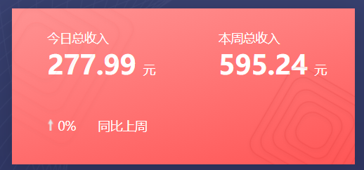

在合作商后台统计今日订单数和本周订单数以及同比上周增长百分比

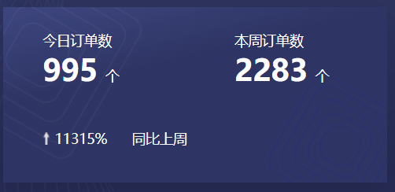

### 8.2 实现思路

API :  合作商后台-工作台-本周/月总收入情况  

​          合作商后台-工作台-获取一定时间范围之内的收入

API :  合作商后台-工作台-本周/月订单数情况  

​          合作商后台-工作台-获取一定时间范围之内的订单总数

### 8.3 代码实现  

#### 8.3.1 收入同比增长 

（1）创建视图模型

```java
/**
 * 销售情况(按周统计)
 */
@Data
public class SalesInfo {
    /**
     * 当时数据
     */
    private Long currentAmount = 0L;
    /**
     * 同比增长
     */
    private Integer percent = 0;
}
```

（2）ReportService新增方法定义

```java
/**
 * 获取总应收情况
 * @param partnerId
 * @return
 */
SalesInfo getAmountInfo(Integer partnerId, LocalDateTime start, LocalDateTime end);
```

ReportServiceImpl实现该方法

```java
@Override
public SalesInfo getAmountInfo(Integer partnerId, LocalDateTime start, LocalDateTime end) {
    var result = new SalesInfo();
    //获取当前时间段内的销售额
    Long currentAmount = getAmount(partnerId,null,start,end);
    if(currentAmount <= 0){
        return result;
    }
    //获取前一段时期内的销售额
    long days = end.until(start, ChronoUnit.DAYS);
    Long lastDaysAmount = this.getAmount(partnerId,null,start.toLocalDate().plusDays(days-1).atTime(0,0),start.plusDays(-1));
    result.setCurrentAmount(currentAmount);
    if(lastDaysAmount <= 0){
        result.setPercent(0);
    }else {
        BigDecimal price = new BigDecimal((currentAmount - lastDaysAmount)*100);
        int percent = price.divide(new BigDecimal(lastDaysAmount),2, RoundingMode.HALF_UP).intValue();
        result.setPercent(percent);
    }
    return result;
}
```

（3）ReportController新增方法

```java
/**
 * 获取时间范围之内的总收入情况
 * @param partnerId
 * @param start
 * @param end
 * @return
 */
@GetMapping("/amountInfo/{partnerId}/{start}/{end}")
public SalesInfo getAmountInfo(@PathVariable Integer partnerId,
                                      @PathVariable  @DateTimeFormat(pattern = "yyyy-MM-dd HH:mm:ss") LocalDateTime start,
                                      @PathVariable  @DateTimeFormat(pattern = "yyyy-MM-dd HH:mm:ss") LocalDateTime end){
    return reportService.getAmountInfo(partnerId,start,end);
}
```


#### 8.3.2 订单数同比增长 

（1）ReportService新增方法定义

```java
/**
 * 获取订单数情况
 * @param partnerId
 * @return
 */
SalesInfo getOrderCountInfo(Integer partnerId, LocalDateTime start, LocalDateTime end);
```

ReportServiceImpl实现该方法

```java
@Override
public SalesInfo getOrderCountInfo(Integer partnerId, LocalDateTime start, LocalDateTime end) {
    var result = new SalesInfo();
    //获取当前时间段内订单数
    Long currentCount = orderService.getCount(partnerId,null,start,end);
    if(currentCount <= 0){
        return result;
    }
    long days = end.until(start, ChronoUnit.DAYS);
    //获取前一段时期内的订单数
    Long lastDaysCount = orderService.getCount(partnerId,null,start.toLocalDate().plusDays(days-1).atTime(0,0),start.plusDays(-1));

    result.setCurrentAmount(currentCount);
    if(lastDaysCount <= 0){
        result.setPercent(0);
    }else {
        BigDecimal price = new BigDecimal((currentCount - lastDaysCount)*100);
        int percent = price.divide(new BigDecimal(lastDaysCount),2, RoundingMode.HALF_UP).intValue();
        result.setPercent(percent);
    }

    return result;
}
```

（2）ReportController新增方法

```java
/**
 * 获取时间范围之内的订单数量情况
 * @param partnerId
 * @param start
 * @param end
 * @return
 */
@GetMapping("/orderCountInfo/{partnerId}/{start}/{end}")
public SalesInfo getOrderCountInfo(
        @PathVariable Integer partnerId,
        @PathVariable  @DateTimeFormat(pattern = "yyyy-MM-dd HH:mm:ss") LocalDateTime start,
        @PathVariable  @DateTimeFormat(pattern = "yyyy-MM-dd HH:mm:ss") LocalDateTime end){
    return reportService.getOrderCountInfo(partnerId,start,end);
}
```


