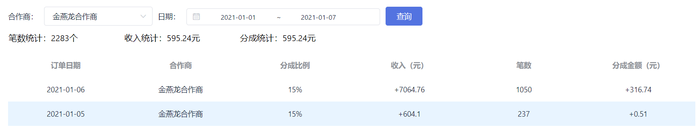
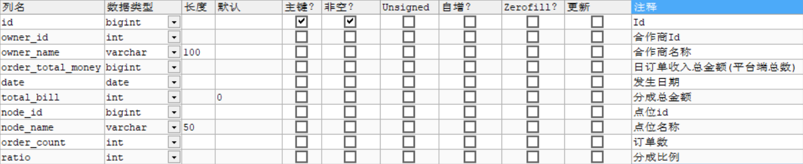
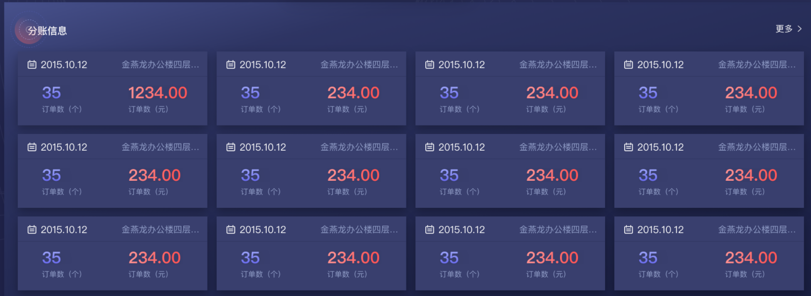
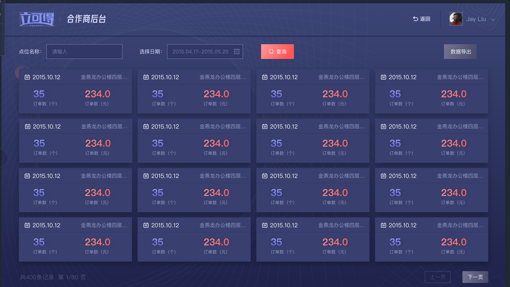
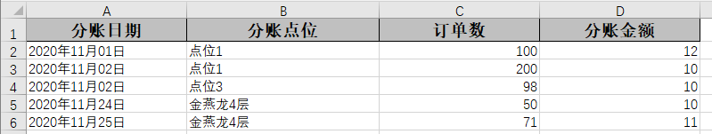

[toc]
# 第7章 合作商分账结算

## 1.分成金额计算

### 1.1 需求分析

根据订单金额和合作商的分成比例，进行分成金额的计算

### 1.2 实现思路

在创建订单时添加逻辑：

（1）根据售货机所在点位的合作商ID查询合作商信息，其中包括分成比例

（2）将商品的真实价格乘以分成比例 ，商业运算中一般实用BigDecimal的multiply（乘法运算）方法和divide（除法运算）方法。

### 1.3 代码实现

修改订单微服务OrderServiceImpl的createOrder方法，在`this.save(orderEntity);` 之前添加代码

```java
//设置合作商账单分账金额
PartnerViewModel partner = userService.getPartner(vm.getOwnerId());
BigDecimal bg = new BigDecimal(sku.getRealPrice());
//遵循四舍五入的规则
int bill = bg.multiply(new BigDecimal(partner.getRatio())).divide(new BigDecimal(100),0,RoundingMode.HALF_UP).intValue();

orderEntity.setBill(bill);
```

BigDecimal中的divide主要就是用来做除法的运算。

```java
public BigDecimal divide(BigDecimal divisor,int scale, int roundingMode);
```

第一个参数是除数，第二个参数代表保留几位小数，第三个代表的是保留模式:

> RoundingMode.CEILING：取右边最近的整数
>
> RoundingMode.DOWN：去掉小数部分取整，也就是正数取左边，负数取右边，相当于向原点靠近的方向取整
>
> RoundingMode.FLOOR：取左边最近的正数
>
> RoundingMode.HALF_DOWN:五舍六入，负数先取绝对值再五舍六入再负数
>
> **RoundingMode.HALF_UP:四舍五入，负数原理同上**
>
> RoundingMode.HALF_EVEN:这个比较绕，整数位若是奇数则四舍五入，若是偶数则五舍六入


## 2.订单数据定时汇总

### 2.1 需求分析

在立可得管理后台里，管理员要能够根据合作商、日期条件能够查看一定日期范围之内的分成情况：



还需要在合作商后台里，合作商能够根据点位和一定时间范围查看自己的分账情况:


### 2.2 实现思路

如果每次都从订单表汇总统计，必定是查询效率低下。所以我们需要每天定期对数据进行汇总，并将汇总的结果保存到一张订单汇总表中。这样订单汇总表的数据不会过多，再次进行聚合统计时效率也会比较高。

订单库- 订单汇总表  tb_order_collect  ：



**任务描述：**

（1）完成定时任务类处理订单汇总逻辑，按合作商和点位汇总

（2）通过xxl-job配置任务

### 2.3 代码实现

（1）订单微服务添加xxl-job依赖

```xml
<dependency>
    <groupId>com.xuxueli</groupId>
    <artifactId>xxl-job-core</artifactId>
    <version>2.2.0</version>
</dependency>
```

（2）添加配置

```yaml
xxl:
  job:
    accessToken:
    admin:
      addresses: http://192.168.200.128:8080/xxl-job-admin
    executor:
      appname: order-service
      address:
      ip:
      port: 9982
      logretentiondays: 30
```

（3）创建com.lkd.job包，添加xxl-job的配置类（从售货机微服务拷贝过来）

（4）订单微服务编写任务类，处理订单合并请求

```java
@Component
@RequiredArgsConstructor
@Slf4j
public class OrderCollectJob {

    private final OrderService orderService;
    private final OrderCollectService orderCollectService;
    private final VMService vmService;
    private final UserService userService;

    /**
     * 订单合并
     * @param param
     * @return
     */
    @XxlJob("orderCollectJobHandler")
    public ReturnT<String> collectTask(String param){

        var yesterday = LocalDate.now().plusDays(-1);

        var qw=new QueryWrapper<OrderEntity>();
        qw.select( "owner_id","node_id", "IFNULL(sum(amount),0) as amount ","IFNULL(sum(bill),0) as bill" ,"IFNULL(count(1),0) as price"     )
                .lambda().ge( OrderEntity::getCreateTime,yesterday  )
                .lt( OrderEntity::getCreateTime,LocalDate.now() )
                .eq(OrderEntity::getPayStatus , VMSystem.PAY_STATUS_PAYED)
                .groupBy(OrderEntity::getOwnerId,OrderEntity::getNodeId );


        orderService.list(qw).forEach( order->{
            var orderCollect=new OrderCollectEntity();
            orderCollect.setDate( yesterday );
            orderCollect.setNodeId( order.getNodeId() );
            orderCollect.setNodeName( vmService.getNodeName( order.getNodeId() ) );

            orderCollect.setOwnerId( order.getOwnerId() );
            var partner = userService.getPartner(order.getOwnerId());
            orderCollect.setOwnerName( partner.getName()   );

            orderCollect.setOrderTotalMoney( order.getAmount() );//金额
            orderCollect.setTotalBill( order.getBill() );//分成
            orderCollect.setOrderCount( order.getPrice() );//订单数量（借用了价格字段）
            orderCollect.setRatio( partner.getRatio() );//分成比例
            orderCollectService.save(orderCollect);

        } );
        return ReturnT.SUCCESS;
    }
}
```

代码解释：

Lombok在spring中的特殊注解 @RequiredArgsConstructor  ， 写在类上可以代替@AutoWired注解，需要注意的是在注入时需要用final定义

（5）通过xxl-job配置任务

新增执行器  order-service  （订单微服务）

新增任务  “订单汇总”


## 3.合作商分账查询

### 3.1 需求分析

在立可得管理后台里，管理员要能够根据合作商、日期条件能够查看一定日期范围之内的分成情况：


### 3.2 实现思路

对订单汇总表  tb_order_collect进行聚合统计

API：管理后台-对账管理-获取一定日期范围之内的合作商分成汇总数据 

### 3.3 代码实现

（1）新建ReportService，并新增方法

```java
/**
 * 获取合作商分账汇总信息
 * @param pageIndex
 * @param pageSize
 * @param name
 * @param start
 * @param end
 * @return
 */
Pager<OrderCollectEntity> getPartnerCollect(Long pageIndex,Long pageSize,String name,LocalDate start, LocalDate end);
```

实现类 ReportServiceImpl

```java
@Override
public Pager<OrderCollectEntity> getPartnerCollect(Long pageIndex, Long pageSize, String name, LocalDate start, LocalDate end) {
    Page<OrderCollectEntity> page = new Page<>(pageIndex,pageSize);
    var qw = new QueryWrapper<OrderCollectEntity>();
    qw.select(
            "IFNULL(sum(order_count),0) as order_count",
            "IFNULL(sum(total_bill),0) as total_bill",
            "IFNULL(sum(order_total_money),0) as order_total_money",
            "IFNULL(min(ratio),0) as ratio",
            "owner_name",
            "date"
    );
    if(!Strings.isNullOrEmpty(name)){
        qw.lambda().like(OrderCollectEntity::getOwnerName,name);
    }
    qw
            .lambda()
            .ge(OrderCollectEntity::getDate,start)
            .le(OrderCollectEntity::getDate,end)
            .groupBy(OrderCollectEntity::getOwnerName,OrderCollectEntity::getDate)
            .orderByDesc(OrderCollectEntity::getDate);

    return Pager.build(orderCollectService.page(page,qw));
}
```

按照日期和合作商对OrderCollect进行聚合统计

（2）订单微服务新建  ReportController  ，并新增方法

```java
/**
 * 获取一定日期范围之内的合作商分成汇总数据
 * @param pageIndex
 * @param pageSize
 * @param partnerName
 * @param start
 * @param end
 * @return
 */
@GetMapping("/partnerCollect")
public Pager<OrderCollectEntity> getPartnerCollect(
        @RequestParam(value = "pageIndex",required = false,defaultValue = "1") Long pageIndex,
        @RequestParam(value = "pageSize",required = false,defaultValue = "10") Long pageSize,
        @RequestParam(value = "partnerName",required = false,defaultValue = "") String partnerName,
        @RequestParam(value = "start",required = true,defaultValue = "") @DateTimeFormat(pattern = "yyyy-MM-dd") LocalDate start,
        @RequestParam(value = "end",required = true,defaultValue = "") @DateTimeFormat(pattern = "yyyy-MM-dd") LocalDate end
){
    return reportService.getPartnerCollect(pageIndex,pageSize,partnerName,start,end);
}
```

## 4.合作商后台-点位分账查询

### 4.1 需求分析 

在合作商工作台页面要展示近期12条分账信息，点击查看更多跳转到对账管理页面。

对账管理页面是对对账详情进行查看，合作商可以分页搜索查看自己的点位下每天的分账情况。

最近12条合作商点位分账信息展示效果： 



合作商点位分账列表展示：




### 4.2 实现思路

对订单汇总表  tb_order_collect进行查询

API： 合作商后台-分账管理- 合作商获分账信息查询 

​           合作商后台-分账管理-合作商获取最近12条分账信息

### 4.3 代码实现 

（1）ReportService新增方法定义

```java
/**
 * 获取合作商前12条点位分账数据
 * @param partnerId
 * @return
 */
List<OrderCollectEntity> getTop12(Integer partnerId);

/**
 * 合作商点位分账搜索
 * @param partnerId
 * @param nodeName
 * @param start
 * @param end
 * @return
 */
Pager<OrderCollectEntity> search(Long pageIndex,Long pageSize,Integer partnerId, String nodeName, LocalDate start, LocalDate end);
```

ReportServiceImpl实现方法

```java
@Override
public List<OrderCollectEntity> getTop12(Integer partnerId) {
    var qw = new LambdaQueryWrapper<OrderCollectEntity>();
    qw   .select(OrderCollectEntity::getDate,OrderCollectEntity::getNodeName,OrderCollectEntity::getOrderCount,OrderCollectEntity::getTotalBill)
            .eq(OrderCollectEntity::getOwnerId,partnerId)
            .orderByDesc(OrderCollectEntity::getDate)
            .last("limit 12");

    return orderCollectService.list(qw);
}

@Override
public Pager<OrderCollectEntity> search(Long pageIndex,Long pageSize,Integer partnerId, String nodeName, LocalDate start, LocalDate end) {
    var qw = new LambdaQueryWrapper<OrderCollectEntity>();
    qw
 .select(OrderCollectEntity::getDate,OrderCollectEntity::getNodeName,OrderCollectEntity::getOrderCount,OrderCollectEntity::getTotalBill)
            .eq(OrderCollectEntity::getOwnerId,partnerId);
    if(!Strings.isNullOrEmpty(nodeName)){
        qw.like(OrderCollectEntity::getNodeName,nodeName);
    }
    if(start !=null && end != null){
        qw
                .ge(OrderCollectEntity::getDate,start)
                .le(OrderCollectEntity::getDate,end);
    }
    qw.orderByDesc(OrderCollectEntity::getDate);
    var page = new Page<OrderCollectEntity>(pageIndex,pageSize);
    return Pager.build(orderCollectService.page(page,qw));
}
```

 （2）ReportController新增方法

```java
/**
 * 获取最近12条分账信息
 * @param partnerId
 * @return
 */
@GetMapping("/top12Collect/{partnerId}")
public List<OrderCollectEntity> getTop12Collect(@PathVariable Integer partnerId){
    return reportService.getTop12(partnerId);
}

/**
 * 合作商搜索分账信息
 * @param partnerId
 * @param pageIndex
 * @param pageSize
 * @param nodeName
 * @param start
 * @param end
 * @return
 */
@GetMapping("/search/{partnerId}")
public Pager<OrderCollectEntity> search(
        @PathVariable Integer partnerId,
        @RequestParam(value = "pageIndex",required = false,defaultValue = "1") Long pageIndex,
        @RequestParam(value = "pageSize",required = false,defaultValue = "10") Long pageSize,
        @RequestParam(value = "nodeName",required = false,defaultValue = "") String nodeName,
        @RequestParam(value = "start",required = true,defaultValue = "") @DateTimeFormat(pattern = "yyyy-MM-dd") LocalDate start,
        @RequestParam(value = "end",required = true,defaultValue = "") @DateTimeFormat(pattern = "yyyy-MM-dd") LocalDate end){
    return reportService.search(
            pageIndex,
            pageSize,
            partnerId,
            nodeName,
            start,
            end);
}
```


## 5.对账数据导出

### 5.1 需求分析

在合作商后台，当合作商根据点位搜索出分账列表之后，还可以将数据以Excel格式导出。


导出的数据格式如下：



### 5.2 实现思路

（1）根据合作商输入的条件从数据库中查询结果（不分页）

（2）运用**EasyExcel**将查询到的结果转换成可识别的结构化对象，调用其内部封装好的方法转成Excel文件流。

（3）通过http的方式将文件流response到前端

> 之前我们想到Excel解析一般是使用POI，但POI存在一个严重的问题，就是非常消耗内存。所以阿里人员对它进行了重写从而诞生了`easyexcel`，它解决了过于消耗内存问题，也对它进行了封装让使用者使用更加便利

### 5.3 代码实现

#### 5.3.1 合作商分账列表查询

（1）ReportService新增方法定义

```java
/**
 * 获取分账数据列表
 * @param partnerId
 * @param nodeName
 * @param start
 * @param end
 * @return
 */
List<OrderCollectEntity> getList(Integer partnerId,String nodeName,LocalDate start, LocalDate end);
```

ReportServiceImpl实现方法

```java
@Override
public List<OrderCollectEntity> getList(Integer partnerId, String nodeName, LocalDate start, LocalDate end) {
    var qw = new LambdaQueryWrapper<OrderCollectEntity>();
    qw
            .eq(OrderCollectEntity::getOwnerId,partnerId)
            .ge(OrderCollectEntity::getDate,start)
            .le(OrderCollectEntity::getDate,end);
    if(!Strings.isNullOrEmpty(nodeName)){
        qw.like(OrderCollectEntity::getNodeName,nodeName);
    }
    return orderCollectService.list(qw);
}
```

#### 5.3.2 EasyExcel实现数据导出

（1）在`service_common`项目中添加解析Excel的依赖程序包，我们这里采用的是阿里提供的**easyexcel**

```xml
<dependency>
    <groupId>com.alibaba</groupId>
    <artifactId>easyexcel</artifactId>
    <version>2.2.6</version>
</dependency>
```

（2） 在`lkd_order_service`项目中定义到导出的数据对象类：

```java
package com.lkd.http.viewModel;

import com.alibaba.excel.annotation.ExcelProperty;
import com.alibaba.excel.annotation.format.DateTimeFormat;
import com.alibaba.excel.annotation.write.style.ColumnWidth;
import com.alibaba.excel.annotation.write.style.ContentRowHeight;
import com.alibaba.excel.annotation.write.style.HeadRowHeight;
import lombok.Data;

import java.util.Date;

/**
 * 账单导出数据对象
 */
@Data
@ContentRowHeight(15)
@HeadRowHeight(20)
@ColumnWidth(25)
public class BillExportDataVO {
    @DateTimeFormat("yyyy年MM月dd日")
    @ExcelProperty(value = "分账日期",index = 0)
    private Date date;
    @ColumnWidth(30)
    @ExcelProperty(value = "分账点位",index = 1)
    private String nodeName;
    @ExcelProperty(value = "订单数",index = 2)
    private Integer orderCount;
    @ExcelProperty(value = "分账金额",index = 3)
    private Integer amount;
}
```

说明：

- `ExcelProperty`注解是用来定义Excel表头数据的，index参数用来定义表头排列的顺序。
- `ColumnWidth`用来定义表头的宽度
- `DateTimeFormat`用来定义日期时间格式数据在Excel中生成的格式

（3）ReportController新增方法，参照API  立可得2.0合作商后台-  分账管理- 合作商获分账信息导出 

```java
/**
 * 数据导出
 * @param partnerId
 * @param start
 * @param end
 */
@GetMapping("/export/{partnerId}/{start}/{end}")
public void export(
        HttpServletResponse response,
        @PathVariable Integer partnerId,
        @PathVariable @DateTimeFormat(pattern = "yyyy-MM-dd") LocalDate start,
        @PathVariable @DateTimeFormat(pattern = "yyyy-MM-dd") LocalDate end,
        @RequestParam(value = "nodeName",required = false,defaultValue = "") String nodeName) throws IOException {
    var exportData = reportService
            .getList(partnerId,nodeName,start,end)
            .stream()
            .map(item->{
                var vo = new BillExportDataVO();
                vo.setAmount(item.getTotalBill());             vo.setDate(Date.from(item.getDate().atTime(0,0).atZone(ZoneId.systemDefault()).toInstant()));//atZone指定时区
                vo.setOrderCount(item.getOrderCount());
                vo.setNodeName(item.getNodeName());
                return vo;
            }).collect(Collectors.toList());
    response.setContentType("application/vnd.ms-excel");
    response.setCharacterEncoding("utf-8");
    response.setHeader("Content-disposition", "attachment;filename=bill.xlsx");
    EasyExcel.write(response.getOutputStream(), BillExportDataVO.class).sheet("分账数据").doWrite(exportData);
}
```

java.time.ZoneId.systemDefault()  获取系统默认时区

测试：

（1）启动订单微服务

（2）打开浏览器，在地址栏输入  http://127.0.0.1:9008/report/export/1/2020-11-01/2021-12-31

## 6. 收益统计趋势图

### 6.1 需求分析

在合作商后台统计一段时间该合作商的收益趋势，前端以曲线图形式展现。


### 6.2 实现思路

前端技术采用EChars图表工具实现。EChars官网：  https://echarts.apache.org/zh/index.html

所以我们需要将查询出来的数据转换为EChars的曲线图所需的数据格式。

实现思路如下：

（1）构建用于封装EChars的曲线图实体类

（2）对订单合并表进行聚合查询，查询每天的收益，转换为EChars的曲线图实体类。

### 6.3 代码实现

#### 6.3.1 折线图（柱状图）实体类构建

通过阅读EChars官网的示例，我们找到前端需要的数据格式。

```json
option = {
    xAxis: {
        type: 'category',
        data: ['Mon', 'Tue', 'Wed', 'Thu', 'Fri', 'Sat', 'Sun']
    },
    yAxis: {
        type: 'value'
    },
    series: [{
        data: [150, 230, 224, 218, 135, 147, 260],
        type: 'line'
    }]
};
```

折线图和柱状图数据格式都是相同的， 我们根据上边的格式定义API ：合作商后台-工作台-一定日期之内的营收统计 


创建实体类BarCharCollect，用于封装折线图和柱状图的图表数据。这里xAxis代表x轴数据。series代表图表的值。

```java
/**
 * 柱状图
 */
@Data
public class BarCharCollect implements Serializable {
    /**
     *  X轴
     */
    private List<String> xAxis = Lists.newArrayList();
    /**
     *   数据
     */
    private List<Integer> series = Lists.newArrayList();
}
```

该实体类用于封装图表数据。

#### 6.3.2 趋势查询

（1）ReportService新增方法定义

```java
/**
 * 获取一定日期内合作商的收益统计
 * @param partnerId
 * @param start
 * @param end
 * @return
 */
BarCharCollect getCollect(Integer partnerId, LocalDate start, LocalDate end);
```

ReportServiceImpl实现该方法

```java
@Override
public BarCharCollect getCollect(Integer partnerId, LocalDate start, LocalDate end) {
    var qw = new QueryWrapper<OrderCollectEntity>();
    qw
            .select("IFNULL(sum(total_bill),0) as total_bill","date")
            .lambda()
            .ge(OrderCollectEntity::getDate,start)            
            .le(OrderCollectEntity::getDate,end)
            .eq(OrderCollectEntity::getOwnerId,partnerId)
            .orderByDesc(OrderCollectEntity::getDate)
            .groupBy(OrderCollectEntity::getDate);
    var mapCollect = orderCollectService
            .list(qw)
            .stream()
 .collect(Collectors.toMap(OrderCollectEntity::getDate,OrderCollectEntity::getTotalBill));
    var result = new BarCharCollect();
    start.datesUntil(end.plusDays(1), Period.ofDays(1))
            .forEach(date->{
                result.getXAxis().add(date.format(DateTimeFormatter.ISO_LOCAL_DATE));
                if(mapCollect.containsKey(date)){
                    result.getSeries().add(mapCollect.get(date));
                }else {
                    result.getSeries().add(0);
                }
            });
    return result;
}
```

LocalDate的datesUntil方法：用户希望返回两个给定端点之间的日期流

（2）ReportController新增方法

```java
/**
 * 获取合作商一定日期范围的收益情况
 * @param partnerId
 * @param start
 * @param end
 * @return
 */
@GetMapping("/collectReport/{partnerId}/{start}/{end}")
public BarCharCollect getCollectReport(@PathVariable Integer partnerId,
         @PathVariable  @DateTimeFormat(pattern = "yyyy-MM-dd") LocalDate start,
         @PathVariable  @DateTimeFormat(pattern = "yyyy-MM-dd") LocalDate end){
    return reportService.getCollect(partnerId,start,end);
}
```


## 7.数据批量导入

### 7.1 需求分析

在系统中除了可以通过商品添加的页面手动单个的添加商品之外，还能通过将商品数据按照Excel表格的固定格式填好之后批量导入到系统中。

Excle里填充得内容如下：


管理人员通过在系统中将该文件上传到后台，后台程序通过识别Excel文件中得内容将里面每行数据解析成商品数据，存到商品表中。

### 7.2 实现思路

- 在系统中开放文件上传的接口用来接收管理员上传的Excel文件
- 使用easyExcel实现对Excel数据的解析，转换成要入库的商品数据
- 为了提高程序的效率，将转换好的商品数据批量导入到数据库中

### 7.3 代码实现

#### 7.3.1 EasyExcel实现商品批量导入

（1）在`lkd_vms_service项目中`添加对应的导入数据格式对象映射类：

```java
package com.lkd.http.viewModel;

import com.alibaba.excel.annotation.ExcelProperty;
import lombok.Data;

import java.io.Serializable;

@Data
public class SkuImport implements Serializable {
    @ExcelProperty("商品名称")
    private String skuName;
    @ExcelProperty("图片url")
    private String skuImage;
    @ExcelProperty("价格")
    private Integer price;
    @ExcelProperty("类别")
    private Integer classId;
    @ExcelProperty("净含量")
    private String unit;
    @ExcelProperty("品牌")
    private String brandName;
}
```

**说明：通过在类字段上加`ExcelProperty`注解，来让类的各个字段匹配Excel表中的表头信息，进行将表头和类字段做映射。**

（2）在`lkd_vms_service项目中`添加ExcelDataListener

```java
@Component
public class ExcelDataListener<E> extends AnalysisEventListener<E> {

    private List<SkuEntity>  list= Lists.newArrayList();

    @Autowired
    private SkuService skuService;

    private static final int BATCH_COUNT=500;//每批存储条数

    /**
     * 提取数据
     * @param e
     * @param analysisContext
     */
    @Override
    public void invoke(E e, AnalysisContext analysisContext) {
        SkuEntity sku=new SkuEntity();
        BeanUtils.copyProperties( e,sku );
        list.add(sku);
        if( list.size()>=BATCH_COUNT ){
            doAfterAllAnalysed(null);
        }
    }


    /**
     * 读取完成
     * @param analysisContext
     */
    @Override
    public void doAfterAllAnalysed(AnalysisContext analysisContext) {

        skuService.saveBatch(list);
        list.clear();
    }
}
```

（3）在`lkd_vms_service`项目的`SkuController`中添加Excel文件接收和处理的方法:

```java
/**
 * 上传商品解析
 * @param file
 * @throws IOException
 */
@PostMapping("/upload")
public void upload(@RequestParam("fileName") MultipartFile file) throws IOException {
    EasyExcel.read(file.getInputStream(), SkuImport.class,excelDataListener).sheet().doRead();
}
```

测试：

我们使用postman进行上传测试


#### 7.3.2 通用数据导入 

上述代码是针对商品数据导入实现的逻辑，如果再有其他的导入数据的要求，还需要重新创建导入监听类。如果我们建立一个通用的导入监听类，岂不是一劳永逸吗？

实现思路：

（1）创建通用的数据监听类，可以处理任何数据的导入

（2）监听类中使用Function封装批量保存的操作。

（3）使用泛型表示具体要操作的实体类类型。

代码：

（1）在`service_common`项目中新建excel程序包，添加解析excel的架构类ExcelDataListener。

```java
package com.lkd.excel;

import com.alibaba.excel.context.AnalysisContext;
import com.alibaba.excel.event.AnalysisEventListener;
import com.google.common.collect.Lists;
import com.lkd.entity.AbstractEntity;
import lombok.extern.slf4j.Slf4j;
import org.springframework.beans.BeanUtils;

import java.util.Collection;
import java.util.List;
import java.util.function.Function;

/**
 * Excel解析批量存储
 * @param <T>
 */
@Slf4j
public class ExcelDataListener<T extends AbstractEntity,E> extends AnalysisEventListener<E> {
    private Class<T> clazz;
    /**
     * 每隔500条存储数据库
     */
    private static final int BATCH_COUNT = 500;
    //存储的具体操作
    private Function<Collection<T>,Boolean> saveFunc;
    //批量存储的数据
    private List<T> list = Lists.newArrayList();

    /**
     * 通过 AnalysisContext 对象还可以获取当前 sheet，当前行等数据
     */
    @Override
    public void invoke(E e, AnalysisContext analysisContext) {
        try {
           T t = clazz.getDeclaredConstructor(null).newInstance();
            BeanUtils.copyProperties(e,t);
            list.add(t);
            if (list.size() >= BATCH_COUNT) {
                this.saveFunc.apply(list);
                // 存储完成清理 list
                list.clear();
            }
        } catch (Exception ex) {
            log.error("create new instance error",ex);
        }


    }

    /**
     * 读取完之后的操作
     */
    @Override
    public void doAfterAllAnalysed(AnalysisContext analysisContext) {
        this.saveFunc.apply(list);
    }

    /**
     *
     * @param saveFunc 持久化数据到数据库的方法
     * @param clazz 对应的实体类类型
     */
    public ExcelDataListener(Function<Collection<T>,Boolean> saveFunc,Class<T> clazz){
        this.saveFunc = saveFunc;
        this.clazz = clazz;
    }
}
```

**说明：**这里该实现类的构造函数里需要传入两个参数，第一个参数saveFunc是最终持久化的方法实现，第二个参数是对应的要持久化的实体对象类型。因为除了商品数据需要导入之外可能还有其他数据需要导入，这里只通过调用EasyExcel解析出数据之后，转化为最终需要持久化的类型，然后在调用持久化方法saveFunc来完成持久化，但是具体的持久化操作不是框架层关心的事，而是具体需要调用方关心的。

（2）接下来我们修改 Excel文件接收和处理的方法:

```java
/**
     * 上传商品解析
     * @param file
     * @throws IOException
     */
@PostMapping("/upload")
public void upload(@RequestParam("fileName") MultipartFile file) throws IOException {
    Function<List<SkuEntity>,Boolean> insertFunc = list-> skuService.saveBatch(list);
    ExcelDataListener<SkuEntity,SkuImport> dataListener = new ExcelDataListener(insertFunc,SkuEntity.class);
    EasyExcel.read(file.getInputStream(), SkuImport.class,dataListener).sheet().doRead();
}
```

可以看到最终在应用的时候，我们只需要new一个`ExcelDataListener`实例，将批量入库的方法`insertFunc`及要写入表的实体类类型两个作为参数传入`ExcelDataListener`的构造函数，然后调用EasyExcel的`read`方法来读取并解析数据就完成了数据的导入工作。


