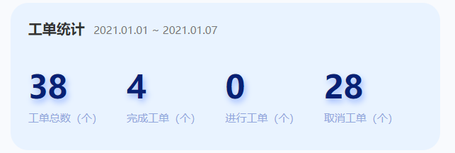
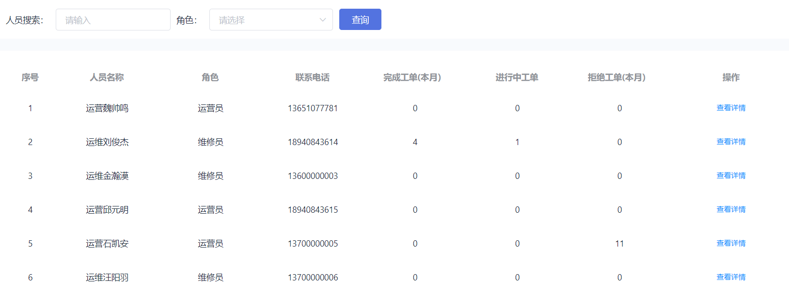
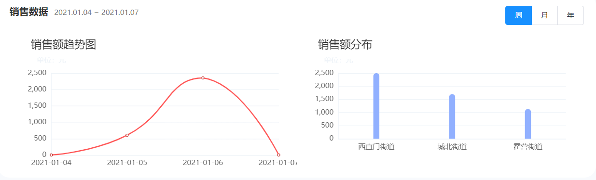

[toc]
# 第8章 统计分析

## 1. 多线程并发异步编程CompletableFuture

### 1.1 需求分析

人员管理-人效统计页，分别统计运营和运维当天的工单数据：


首页有关于工单的统计,是按照一定时间段进行统计的：



这两个功能是通过一个API 实现的。

API文档：   管理后台 - 人员服务 - 获取当时工单汇总信息(人员统计头部信息)

### 1.2 代码实现

（1）定义视图模型（可以定义到工单微服务中）

```java
package com.lkd.http.viewModel;

import lombok.Data;

import java.io.Serializable;

/**
 * 工单基本统计情况
 */
@Data
public class TaskReportInfo implements Serializable {
    /**
     * 工单总数
     */
    private Integer total;
    /**
     * 完成总数
     */
    private Integer completedTotal;
    /**
     * 拒绝总数
     */
    private Integer cancelTotal;

    /**
     * 进行中总数
     */
    private Integer progressTotal;

    /**
     * 工作人数
     */
    private Integer workerCount;

    /**
     * 是否是运维工单统计
     */
    private boolean repair;

    /**
     * 日期
     */
    private String date;
}

```

（2）TaskService方法定义

```java
/**
 * 获取工单的统计情况
 * @return
 */
List<TaskReportInfo> getTaskReportInfo(LocalDateTime start,LocalDateTime end);
```

TaskServiceImpl实现该方法

```java
@Override
public List<TaskReportInfo> getTaskReportInfo(LocalDateTime start, LocalDateTime end) {
    List<TaskReportInfo> result = Lists.newArrayList();
    //运营工单总数total
    var supplyTotalFuture = CompletableFuture.supplyAsync(()->{
        QueryWrapper<TaskEntity> qw = new QueryWrapper<>();
        qw
                .lambda()
                .eq(TaskEntity::getProductTypeId,VMSystem.TASK_TYPE_SUPPLY)
                .ge(TaskEntity::getUpdateTime,start)
                .le(TaskEntity::getUpdateTime,end);
        return this.count(qw);
    });
    //运维工单总数
    var repairTotalFuture = CompletableFuture.supplyAsync(()->{
        QueryWrapper<TaskEntity> qw = new QueryWrapper<>();
        qw
                .lambda()
                .ne(TaskEntity::getProductTypeId,VMSystem.TASK_TYPE_SUPPLY)
                .ge(TaskEntity::getUpdateTime,start)
                .le(TaskEntity::getUpdateTime,end);
        return this.count(qw);
    });
    //完成的运营工单总数
    var completedSupplyFuture = CompletableFuture.supplyAsync(()->{
        QueryWrapper<TaskEntity> qw = new QueryWrapper<>();
        qw
                .lambda()
                .eq(TaskEntity::getProductTypeId,VMSystem.TASK_TYPE_SUPPLY)
                .eq(TaskEntity::getTaskStatus,VMSystem.TASK_STATUS_FINISH)
                .ge(TaskEntity::getUpdateTime,start)
                .le(TaskEntity::getUpdateTime,end);
        return this.count(qw);
    });
    //完成的运维工单总数
    var completedRepairFuture = CompletableFuture.supplyAsync(()->{
        QueryWrapper<TaskEntity> qw = new QueryWrapper<>();
        qw
                .lambda()
                .ne(TaskEntity::getProductTypeId,VMSystem.TASK_TYPE_SUPPLY)
                .eq(TaskEntity::getTaskStatus,VMSystem.TASK_STATUS_FINISH)
                .ge(TaskEntity::getUpdateTime,start)
                .le(TaskEntity::getUpdateTime,end);
        return this.count(qw);
    });
    //拒绝掉的运营工单总数
    var cancelSupplyFuture = CompletableFuture.supplyAsync(()->{
        QueryWrapper<TaskEntity> qw = new QueryWrapper<>();
        qw
                .lambda()
                .eq(TaskEntity::getProductTypeId,VMSystem.TASK_TYPE_SUPPLY)
                .eq(TaskEntity::getTaskStatus,VMSystem.TASK_STATUS_CANCEL)
                .ge(TaskEntity::getUpdateTime,start)
                .le(TaskEntity::getUpdateTime,end);
        return this.count(qw);
    });
    //拒绝掉的运维工单总数
    var cancelRepairFuture = CompletableFuture.supplyAsync(()->{
        QueryWrapper<TaskEntity> qw = new QueryWrapper<>();
        qw
                .lambda()
                .ne(TaskEntity::getProductTypeId,VMSystem.TASK_TYPE_SUPPLY)
                .eq(TaskEntity::getTaskStatus,VMSystem.TASK_STATUS_CANCEL)
                .ge(TaskEntity::getUpdateTime,start)
                .le(TaskEntity::getUpdateTime,end);
        return this.count(qw);
    });
    // 获取运营人员数量
    var operatorCountFuture = CompletableFuture.supplyAsync(()-> userService.getOperatorCount());
    //获取运维人员总数
    var repairerCountFuture = CompletableFuture.supplyAsync(()-> userService.getRepairerCount());
    //并行处理
    CompletableFuture
            .allOf(supplyTotalFuture,
                    repairTotalFuture,
                    completedSupplyFuture,
                    completedRepairFuture,
                    cancelSupplyFuture,
                    cancelRepairFuture,
                    operatorCountFuture,
                    repairerCountFuture)
            .join();
    var supplyTaskInfo = new TaskReportInfo();
    var repairTaskInfo = new TaskReportInfo();

    try {
        supplyTaskInfo.setTotal(supplyTotalFuture.get());
        supplyTaskInfo.setCancelTotal(cancelSupplyFuture.get());
        supplyTaskInfo.setCompletedTotal(completedSupplyFuture.get());
        supplyTaskInfo.setRepair(false);
        supplyTaskInfo.setWorkerCount(operatorCountFuture.get());
        result.add(supplyTaskInfo);

        repairTaskInfo.setTotal(repairTotalFuture.get());
        repairTaskInfo.setCancelTotal(cancelRepairFuture.get());
        repairTaskInfo.setCompletedTotal(completedRepairFuture.get());
        repairTaskInfo.setRepair(true);
        repairTaskInfo.setWorkerCount(repairerCountFuture.get());
        result.add(repairTaskInfo);
    }catch (Exception e){
        log.error("构建工单统计数据失败",e);
    }
    return result;
}
```

（3）工单微服务 TaskController

```java
/**
 * 获取当时工单汇总信息
 * @return
 */
@GetMapping("/taskReportInfo/{start}/{end}")
public List<TaskReportInfo> getTaskReportInfo(@PathVariable @DateTimeFormat(pattern = "yyyy-MM-dd HH:mm:ss") LocalDateTime start,
                                              @PathVariable  @DateTimeFormat(pattern = "yyyy-MM-dd HH:mm:ss") LocalDateTime end){
    return taskService.getTaskReportInfo(start,end);
}
```

## 2.用户工作量查询

### 2.1 用户工作量列表

#### 2.1.1 需求与实现思路

统计每个用户完成工单、进行工单和拒绝工单数



API： 管理后台 - 用户服务-人员工作量列表

#### 2.1.2 代码解析

用户微服务UserController

```java
/**
 * 搜索用户工作量列表
 * @param pageIndex
 * @param pageSize
 * @param userName
 * @param roleId
 * @return
 */
@GetMapping("/searchUserWork")
public Pager<UserWork> searchUserWork(
        @RequestParam(value = "pageIndex",required = false,defaultValue = "1") long pageIndex,
        @RequestParam(value = "pageSize",required = false,defaultValue = "10") long pageSize,
        @RequestParam(value = "userName",required = false,defaultValue = "") String userName,
        @RequestParam(value = "roleId",required = false,defaultValue = "0") Integer roleId,
        @RequestParam(value = "isRepair",required = false,defaultValue = "") Boolean isRepair){
    var userPager = userService.findPage( pageIndex,pageSize,userName,roleId,isRepair);
    var items = userPager
            .getCurrentPageRecords()
            .stream()
            .map(u->{
                LocalDateTime now = LocalDateTime.now();
                LocalDateTime start = LocalDateTime.of(now.getYear(),now.getMonth(),1,0,0);
                UserWork userWork = taskService.getUserWork(u.getId(),
                        start.format(DateTimeFormatter.ofPattern("yyyy-MM-dd HH:mm:ss")),
                        LocalDateTime.now().format(DateTimeFormatter.ofPattern("yyyy-MM-dd HH:mm:ss")));
                userWork.setRoleName(u.getRole().getRoleName());
                userWork.setUserName(u.getUserName());
                userWork.setMobile(u.getMobile());
                return userWork;
            })
            .collect(Collectors.toList());

    Pager<UserWork> result = Pager.buildEmpty();
    result.setPageIndex(userPager.getPageIndex());
    result.setCurrentPageRecords(items);
    result.setPageSize(userPager.getPageSize());
    result.setTotalCount(userPager.getTotalCount());
    result.setTotalPage(userPager.getTotalPage());

    return result;

}
```

分页查询用户，通过用户id远程调用工单微服务查询工单完成情况。


### 2.2 用户工作量详情

#### 2.2.1 需求与实现思路  

上述页面点击”查看详情“


API  ： 管理后台 - 用户服务-获取用户工作量(工单统计) 

#### 2.2.2 代码解析 

（1）TaskService方法定义

```java
/**
 * 获取用户工作量详情
 * @param userId
 * @param start
 * @param end
 * @return
 */
UserWork getUserWork(Integer userId,LocalDateTime start,LocalDateTime end);
```

TaskServiceImpl实现方法

```java
@Override
public UserWork getUserWork(Integer userId, LocalDateTime start, LocalDateTime end) {
    var userWork = new UserWork();
    userWork.setUserId(userId);
    //并行处理提高程序吞吐量
    //获取用户完成工单数
    var workCountFuture = CompletableFuture
            .supplyAsync(()-> this.getFinishCount(userId,VMSystem.TASK_STATUS_FINISH,start.toLocalDate(),end))
            .whenComplete((r,e)->{
                if(e != null){
                    userWork.setWorkCount(0);
                    log.error("user work error",e);
                }else {
                    userWork.setWorkCount(r);
                }
            });
    //获取工单总数
    var totalFuture = CompletableFuture
            .supplyAsync(()->this.getFinishCount(userId,0,start.toLocalDate(),end))
            .whenComplete((r,e)->{
                if(e != null){
                    userWork.setWorkCount(0);
                    log.error("user work error",e);
                }else {
                    userWork.setTotal(r);
                }
            });
    //获取用户拒绝工单数
    var cancelCountFuture = CompletableFuture
            .supplyAsync(()-> this.getFinishCount(userId,VMSystem.TASK_STATUS_CANCEL,start.toLocalDate(),end))
            .whenComplete((r,e)->{
                if(e != null){
                    userWork.setCancelCount(0);
                    log.error("user work error",e);
                }else {
                    userWork.setCancelCount(r);
                }
            });
    //获取进行中得工单数
    var progressTotalFuture = CompletableFuture
            .supplyAsync(()->this.getProgressCount(userId))
            .whenComplete((r,e)->{
                if(e != null){
                    userWork.setProgressTotal(0);
                    log.error("user work error",e);
                }else {
                    userWork.setProgressTotal(r);
                }
            });
 CompletableFuture.allOf(workCountFuture,cancelCountFuture,progressTotalFuture).join();
    return userWork;
}
```

（2）TaskController

```java
/**
 * 获取用户工作量详情
 * @param userId
 * @param start
 * @param end
 * @return
 */
@GetMapping("/userWork")
 public UserWork getUserWork(@RequestParam Integer userId,
                             @RequestParam @DateTimeFormat(pattern = "yyyy-MM-dd HH:mm:ss")  LocalDateTime start,
                             @RequestParam @DateTimeFormat(pattern = "yyyy-MM-dd HH:mm:ss")  LocalDateTime end){

     return taskService.getUserWork(userId,start,end);
 }
```


## 3.工单状态按日统计

### 3.1 定时任务数据汇总

#### 3.1.1 需求分析

在后台系统中要根据一定日期范围展示出每日的不同状态的工单数量图表 ，如果直接对工单表进行聚合统计，效率不高，对数据库也造成较大压力。所以我们需要每日固定时刻将前日工单根据状态分别进行汇总查询，然后存入工单汇总表中。查询时直接查询汇总数据即可。

#### 3.1.2 实现思路

为了提升对工单的统计效率，在

工单库- 工单汇总表  tb_task_collect  ：


**任务描述：**

（1）完成定时任务类处理工单汇总逻辑

（2）通过xxl-job配置任务

#### 3.1.3 代码实现

（1）工单微服务编写任务类，处理工单汇总请求

```java
package com.lkd.job;

import com.baomidou.mybatisplus.core.conditions.query.QueryWrapper;
import com.baomidou.mybatisplus.core.conditions.update.UpdateWrapper;
import com.lkd.common.VMSystem;
import com.lkd.entity.TaskCollectEntity;
import com.lkd.entity.TaskEntity;
import com.lkd.service.TaskCollectService;
import com.lkd.service.TaskService;
import com.xxl.job.core.biz.model.ReturnT;
import com.xxl.job.core.handler.annotation.XxlJob;
import lombok.extern.slf4j.Slf4j;
import org.springframework.beans.factory.annotation.Autowired;
import org.springframework.stereotype.Component;

import java.time.LocalDate;

@Component
@Slf4j
public class TaskCollectJob {
    @Autowired
    private TaskService taskService;
    @Autowired
    private TaskCollectService taskCollectService;
    /**
     * 每日工单数据汇总(汇总昨天数据)
     * @return
     */
    @XxlJob("taskCollectJobHandler")
    public ReturnT<String> collectTask(String param){
        var taskCollectEntity = new TaskCollectEntity();
        LocalDate start = LocalDate.now().plusDays(-1);
        LocalDate end = LocalDate.now();
        QueryWrapper<TaskEntity> qw = new QueryWrapper<>();
        qw
                .lambda()
                .ge(TaskEntity::getUpdateTime,start)
                .le(TaskEntity::getUpdateTime,end)
                .eq(TaskEntity::getTaskStatus, VMSystem.TASK_STATUS_PROGRESS);
        //进行中的工单
        taskCollectEntity.setProgressCount(taskService.count(qw));

        //取消或拒绝的工单
        qw = new QueryWrapper<>();
        qw
                .lambda()
                .ge(TaskEntity::getUpdateTime,start)
                .le(TaskEntity::getUpdateTime,end)
                .eq(TaskEntity::getTaskStatus, VMSystem.TASK_STATUS_CANCEL);
        taskCollectEntity.setCancelCount(taskService.count(qw));
        //完成的工单
        qw = new QueryWrapper<>();
        qw
                .lambda()
                .ge(TaskEntity::getUpdateTime,start)
                .le(TaskEntity::getUpdateTime,end)
                .eq(TaskEntity::getTaskStatus, VMSystem.TASK_STATUS_FINISH);
        taskCollectEntity.setFinishCount(taskService.count(qw));
        taskCollectEntity.setCollectDate(start);
        taskCollectService.save(taskCollectEntity);
        cleanTask();

        return ReturnT.SUCCESS;
    }

    /**
     * 清理无效工单
     */
    private void cleanTask(){
        var uw = new UpdateWrapper<TaskEntity>();
        uw.lambda()
                .le(TaskEntity::getUpdateTime, LocalDate.now())
                .and(w->w.eq(TaskEntity::getTaskStatus, VMSystem.TASK_STATUS_PROGRESS).or().eq(TaskEntity::getTaskStatus,VMSystem.TASK_STATUS_CREATE))
                .set(TaskEntity::getTaskStatus,VMSystem.TASK_STATUS_CANCEL)
                .set(TaskEntity::getDesc,"工单超时");
        taskService.update(uw);
    }
}
```

（2）在XXL-job中进行配置  

### 3.2 工单状态按日统计

#### 3.2.1 需求分析

在后台系统中要根据一定日期范围展示出每日的不同状态的工单数量图表，方便管理人员根据图表进行后续的任务分配工作。具体的产品原型如下：


#### 3.2.2 实现思路

对工单汇总表  tb_task_collect  进行汇总聚合查询

API :  管理后台 - 用户服务-工单状态统计

#### 3.2.3 代码实现

（1）创建TaskCollectService

```java
package com.lkd.service;

import com.baomidou.mybatisplus.extension.service.IService;
import com.lkd.entity.TaskCollectEntity;
import com.lkd.http.viewModel.TaskReportInfo;

import java.time.LocalDate;
import java.util.List;

public interface TaskCollectService extends IService<TaskCollectEntity>{
    /**
     * 获取工单报表
     * @param start
     * @param end
     * @return
     */
    List<TaskCollectEntity> getTaskReport(LocalDate start, LocalDate end);
}
```

实现类TaskCollectServiceImpl

```java
package com.lkd.service.impl;

import com.baomidou.mybatisplus.core.conditions.query.QueryWrapper;
import com.baomidou.mybatisplus.extension.service.impl.ServiceImpl;
import com.lkd.dao.TaskCollectDao;
import com.lkd.entity.TaskCollectEntity;
import com.lkd.service.TaskCollectService;
import org.springframework.stereotype.Service;

import java.time.LocalDate;
import java.util.List;

@Service
public class TaskCollectServiceImpl extends ServiceImpl<TaskCollectDao, TaskCollectEntity> implements TaskCollectService {
    @Override
    public List<TaskCollectEntity> getTaskReport(LocalDate start, LocalDate end) {
        QueryWrapper<TaskCollectEntity> qw = new QueryWrapper<>();
        qw
                .lambda()
                .ge(TaskCollectEntity::getCollectDate,start)
                .le(TaskCollectEntity::getCollectDate,end)
                .orderByAsc(TaskCollectEntity::getCollectDate);

        return this.list(qw);
    }
}
```

（2）TaskController新增方法

```java
/**
 * 获取工单报表
 * @param start
 * @param end
 * @return
 */
@GetMapping("/collectReport/{start}/{end}")
public List<TaskCollectEntity> getTaskCollectReport(@PathVariable String start,@PathVariable String end){
    return taskCollectService.getTaskReport(LocalDate.parse(start, DateTimeFormatter.ISO_LOCAL_DATE),LocalDate.parse(end,DateTimeFormatter.ISO_LOCAL_DATE));
}
```

## 4.人效排名月度统计  

### 4.1 需求分析 

在管理后台要根据根据区域统计出当月工作量(完成工单量)最多的前10名运营人员/运维人员，方便公司对这些排名靠前的员工实施一些激励措施。运行效果如下：


### 4.2 实现思路 

（1）从工单数据库中对应的工单表中根据日期范围及工单类型进行汇总查询

（2）将汇总查询出的结果封装成页面展示所需格式列表交给前端展示

API： 管理后台 - 用户服务-人员排名

### 4.3 代码实现 

（1）TaskService新增方法定义

```java
/**
 * 获取排名前10的工作量
 * @param start
 * @param end
 * @return
 */
List<UserWork> getUserWorkTop10(LocalDate start, LocalDate end, Boolean isRepair,Long regionId);
```

TaskServiceImpl实现方法

```java
@Override
public List<UserWork> getUserWorkTop10(LocalDate start, LocalDate end, Boolean isRepair,Long regionId) {
    var qw = new QueryWrapper<TaskEntity>();
    qw
            .select("count(user_id) as user_id,user_name")
            .lambda()
            .ge(TaskEntity::getUpdateTime,start)
            .le(TaskEntity::getUpdateTime,end)
            .eq(TaskEntity::getTaskStatus,VMSystem.TASK_STATUS_FINISH)
            .groupBy(TaskEntity::getUserName)
            .orderByDesc(TaskEntity::getUserId);
    if(regionId >0){
        qw.lambda().eq(TaskEntity::getRegionId,regionId);
    }
    if(isRepair){
        qw.lambda().ne(TaskEntity::getProductTypeId,VMSystem.TASK_TYPE_SUPPLY);
    }else {
        qw.lambda().eq(TaskEntity::getProductTypeId,VMSystem.TASK_TYPE_SUPPLY);
    }
    var result = this
            .list(qw)
            .stream()
            .map(t->{
                var userWork = new UserWork();
                userWork.setUserName(t.getUserName());
                userWork.setWorkCount(t.getUserId());
                return userWork;
            }).collect(Collectors.toList());
    if(result.size() == 10) return result;
    int count = 10 - result.size();
    List<String> userNameList = result.stream().map(u->u.getUserName()).collect(Collectors.toList());

    var req = new NoWorkUserReq();
    req.setExcludeNames(userNameList);
    req.setExpectCount(count);
    req.setIsRepair(isRepair);
    req.setRegionId(regionId);
    return result;
}
```

（2）TaskController新增方法

```java
/**
 * 获取人员排名
 * @param start
 * @param end
 * @param isRepair
 * @return
 */
@GetMapping("/userWorkTop10/{start}/{end}/{isRepair}/{regionId}")
public List<UserWork> getUserWorkTop10(@PathVariable String start, @PathVariable String end, @PathVariable Boolean isRepair,@PathVariable String regionId){
    return taskService.getUserWorkTop10(
                LocalDate.parse(start,DateTimeFormatter.ISO_LOCAL_DATE),
                LocalDate.parse(end,DateTimeFormatter.ISO_LOCAL_DATE),
                isRepair,
            Long.valueOf(regionId));
}
```


## 5.销售统计分析 

### 5.1 销售额趋势图 

#### 5.1.1 需求与实现思路

在立可得管理后台里要根据周、月、年三个纬度来进行销售额的统计，前端以曲线图的方式进行展示。具体效果如下（左图）：



API:    管理后台-工作台- 获取销售额统计 

#### 5.1.2 代码解析

（1）订单微服务创建视图模型，用于统计图（柱状或曲线）的封装

```java
/**
 * 柱状(曲线)图
 */
@Data
public class BarCharCollect implements Serializable {
    /**
     *  X轴数据
     */
    @JsonProperty(value = "xAxis")
    private List<String> xAxis = Lists.newArrayList();
    /**
     * Y轴数据
     */
    private List<Integer> series = Lists.newArrayList();
}
```

（2）ReportService新增方法

```java
/**
 * 获取一定日期内的销售额统计
 * @param collectType 统计类型 1:按日统计，2:按月统计
 * @param start
 * @param end
 * @return
 */
BarCharCollect getAmountCollect(Integer collectType,LocalDate start,LocalDate end);
```

 ReportServiceImpl实现该方法

```java
@Override
public BarCharCollect getAmountCollect(Integer collectType, LocalDate start, LocalDate end) {
    var qw = new QueryWrapper<OrderCollectEntity>();
    if(collectType == VMSystem.COLLECT_TYPE_DAY){
        //按天汇总
        qw
                .select("IFNULL(min(order_total_money),0) as order_total_money","date")
                .lambda()
                .ge(OrderCollectEntity::getDate,start)
                .groupBy(OrderCollectEntity::getDate)
                .le(OrderCollectEntity::getDate,end)
                .orderByAsc(OrderCollectEntity::getDate);
    }else if(collectType == VMSystem.COLLECT_TYPE_MONTH){
        //按月汇总
        qw
                .select("IFNULL(sum(node_amount),0) as order_total_money","min(date) as date")
                .groupBy("MONTH(date)")
                .orderByAsc("date")
                .lambda()
                .ge(OrderCollectEntity::getDate,start)
                .le(OrderCollectEntity::getDate,end);
    }
    //构建一个key为日期维度，value为销售额的map
    var mapCollect = orderCollectService
            .list(qw)
            .stream()
            .collect(Collectors.toMap(o-> {
                if(collectType == VMSystem.COLLECT_TYPE_DAY){
                    return o.getDate().format(DateTimeFormatter.ISO_LOCAL_DATE);
                }else if(collectType == VMSystem.COLLECT_TYPE_MONTH){
                    return o.getDate().format(DateTimeFormatter.ofPattern("yyyy-MM"));
                }
                return "";
            },OrderCollectEntity::getOrderTotalMoney));
    var result = new BarCharCollect();
    //定义构建X轴日期类型的函数，传入的参数为汇总类型(泛型方法的第一个参数)，传出的参数为具体的日期维度(泛型方法的第二个参数)
    Function<Integer,Period> p = (t)->{
        if(t == VMSystem.COLLECT_TYPE_DAY)
            return Period.ofDays(1);
        else if(t == VMSystem.COLLECT_TYPE_MONTH)
            return Period.ofMonths(1);
        throw new LogicException("统计类型参数错误");
    };

    //以从开始日期到结束日期为范围，日期统计类型为维度构建曲线图数据
    start.datesUntil(end.plusDays(1), p.apply(collectType))
            .forEach(date->{
                String key  = "";
                if(collectType == VMSystem.COLLECT_TYPE_DAY){
                    key = date.format(DateTimeFormatter.ISO_LOCAL_DATE);
                }else if(collectType == VMSystem.COLLECT_TYPE_MONTH){
                    key = date.format(DateTimeFormatter.ofPattern("yyyy-MM"));
                }
                result.getXAxis().add(key);
                if(mapCollect.containsKey(key)){
                    result.getSeries().add(mapCollect.get(key));
                }else {
                    result.getSeries().add(0);
                }
            });

    return result;
}
```

（3）ReportController新增方法

```java
/**
 * 获取销售额统计
 * @param collectType
 * @param start
 * @param end
 * @return
 */
@GetMapping("/amountCollect/{collectType}/{start}/{end}")
public BarCharCollect getAmountCollect(@PathVariable Integer collectType,
                                       @PathVariable @DateTimeFormat(pattern = "yyyy-MM-dd") LocalDate start,
                                       @PathVariable  @DateTimeFormat(pattern = "yyyy-MM-dd") LocalDate end){
    return reportService.getAmountCollect(collectType,start,end);
}
```

### 5.2 销售额分布  

#### 5.2.1 需求与实现思路

在立可得管理后台里要根据周、月、年三个纬度来进行销售额分布的统计，前端以柱状图的方式进行展示。具体效果如下（右图）：


API  ： 管理后台- 工作台- 根据地区汇总销售额数据(销售量分布) 

#### 5.2.2 代码解析

（1）ReportService新增方法

```java
/**
 * 获取地区销量统计
 * @param start
 * @param end
 * @return
 */
BarCharCollect getCollectByRegion(LocalDate start, LocalDate end);
```

 ReportServiceImpl实现该方法

```java
@Override
public BarCharCollect getCollectByRegion(LocalDate start, LocalDate end) {
    SearchRequest searchRequest = new SearchRequest("order");
    SearchSourceBuilder sourceBuilder = new SearchSourceBuilder();
    BoolQueryBuilder boolQueryBuilder = QueryBuilders.boolQuery();
    //根据时间范围搜索    boolQueryBuilder.filter(QueryBuilders.rangeQuery("create_time").gte(start).lte(end));
    boolQueryBuilder.filter(QueryBuilders.termQuery("pay_status", VMSystem.PAY_STATUS_PAYED));
    sourceBuilder.query(boolQueryBuilder);
    sourceBuilder.size(0);
    //根据商品名称分组
    AggregationBuilder regionAgg = AggregationBuilders
            .terms("region")
            .field("region_name")
            .size(100)
            .order(BucketOrder.aggregation("sum",false))
            .subAggregation(AggregationBuilders.sum("sum").field("amount"));

    sourceBuilder.aggregation(regionAgg);
    searchRequest.source(sourceBuilder);
    SearchResponse searchResponse = null;
    try {
        searchResponse = restHighLevelClient.search(searchRequest, RequestOptions.DEFAULT);

    } catch (IOException e) {
        log.error("获取售货机商品销量汇总数据出错",e);
    }

    var results = new BarCharCollect();
    var aggregation = searchResponse.getAggregations();
    if(aggregation == null) return results;
    var term = (ParsedStringTerms)searchResponse.getAggregations().get("region");
    var buckets = term.getBuckets();
    if(buckets.size() <= 0) return results;

    buckets.stream().forEach(b->{
        var sumAgg = (ParsedSum)b.getAggregations().get("sum");
        Double value = sumAgg.getValue();
        results.getXAxis().add(b.getKeyAsString());
        results.getSeries().add(value.intValue());
    });
    return results;
}
```

（2）ReportController新增方法

```java
/**
 * 根据地区汇总销售额数据
 * @param start
 * @param end
 * @return
 */
@GetMapping("/regionCollect/{start}/{end}")
public BarCharCollect getRegionCollect(@PathVariable @DateTimeFormat(pattern = "yyyy-MM-dd") LocalDate start,
                                       @PathVariable  @DateTimeFormat(pattern = "yyyy-MM-dd") LocalDate end){
    return reportService.getCollectByRegion(start,end);
}
```

## 6.合作商点位数Top5

### 6.1 需求分析

在管理后台的工作台页面要以饼图的方式展示出各合作商旗下点位占比分布。具体实现效果如下：


### 6.2 实现思路

API : 管理后台 - 工作台 - 合作商点位汇总统计

​         管理后台 - 工作台 - 获取点位总数

​         管理后台 - 工作台 - 获取合作商总数

### 6.3 代码实现

（1）定义饼图视图模型

```java
/**
 * 饼图
 */
@Data
public class PieChart {
    /**
     * 显示名称
     */
    private String name;
    /**
     * 显示数值
     */
    private Integer value;
}
```

（2）售货机微服务 NodeService新增方法定义

```JAVA
/**
 * 获取点位汇总
 * @return
 */
List<PieChart> getNodeCollect();
```

NodeServiceImpl实现此方法

```java
@Override
public List<PieChart> getNodeCollect() {
    var qw = new QueryWrapper<NodeEntity>();
    qw
            .select("count(id) as business_id","owner_name")
            .lambda()
            .groupBy(NodeEntity::getOwnerName);

    return this
            .list(qw)
            .stream()
            .map(n->{
                PieChart pieChart = new PieChart();
                pieChart.setName(n.getOwnerName());
                pieChart.setValue(n.getBusinessId());
                return pieChart;
            }).collect(Collectors.toList());
}
```

（3）NodeController新增方法

```java
/**
 * 点位汇总
 * @return
 */
@GetMapping("/nodeCollect")
public List<PieChart> getNodeCollect(){
    return nodeService.getNodeCollect();
}
```

获取点位总数和合作商总数代码略

## 7 商品数据导入

### 7.1 需求与实现思路

在系统中除了可以通过商品添加的页面手动单个的添加商品之外，还能通过将商品数据按照Excel表格的固定格式填好之后批量导入到系统中。

Excle里填充得内容如下：


管理人员通过在系统中将该文件上传到后台，后台程序通过识别Excel文件中得内容将里面每行数据解析成商品数据，存到商品表中。

### 7.2 实现思路

- 在系统中开放文件上传的接口用来接收管理员上传的Excel文件
- 通过程序解析Excel中的数据转换成要入库的商品数据
- 为了提高程序的效率，将转换好的商品数据批量导入到数据库中


### 7.3 代码实现

（1）在`lkd_vms_service项目中`添加对应的导入数据格式对象映射类：

```java
package com.lkd.http.viewModel;

import com.alibaba.excel.annotation.ExcelProperty;
import lombok.Data;

import java.io.Serializable;

@Data
public class SkuImport implements Serializable {
    @ExcelProperty("商品名称")
    private String skuName;
    @ExcelProperty("图片url")
    private String skuImage;
    @ExcelProperty("价格")
    private Integer price;
    @ExcelProperty("类别")
    private Integer classId;
    @ExcelProperty("净含量")
    private String unit;
    @ExcelProperty("品牌")
    private String brandName;
}
```

**说明：通过在类字段上加`ExcelProperty`注解，来让类的各个字段匹配Excel表中的表头信息，进行将表头和类字段做映射。**

（2）在`service_common`项目中新建excel程序包，添加解析excel的架构类，只需要继承**easyexcel**中的`AnalysisEventListener`抽象类，实现该抽象类中的`invoke`、`doAfterAllAnalysed`方法即可。

```java
package com.lkd.excel;

import com.alibaba.excel.context.AnalysisContext;
import com.alibaba.excel.event.AnalysisEventListener;
import com.google.common.collect.Lists;
import com.lkd.entity.AbstractEntity;
import lombok.extern.slf4j.Slf4j;
import org.springframework.beans.BeanUtils;

import java.util.Collection;
import java.util.List;
import java.util.function.Function;

/**
 * Excel解析批量存储
 * @param <T>
 */
@Slf4j
public class ExcelDataListener<T extends AbstractEntity,E> extends AnalysisEventListener<E> {
    private Class<T> clazz;
    /**
     * 每隔500条存储数据库
     */
    private static final int BATCH_COUNT = 500;
    //存储的具体操作
    private Function<Collection<T>,Boolean> saveFunc;
    //批量存储的数据
    private List<T> list = Lists.newArrayList();

    /**
     * 通过 AnalysisContext 对象还可以获取当前 sheet，当前行等数据
     */
    @Override
    public void invoke(E e, AnalysisContext analysisContext) {
        try {
           T t = clazz.getDeclaredConstructor(null).newInstance();
            BeanUtils.copyProperties(e,t);
            list.add(t);
            if (list.size() >= BATCH_COUNT) {
                this.saveFunc.apply(list);
                // 存储完成清理 list
                list.clear();
            }
        } catch (Exception ex) {
            log.error("create new instance error",ex);
        }


    }

    /**
     * 读取完之后的操作
     */
    @Override
    public void doAfterAllAnalysed(AnalysisContext analysisContext) {
        this.saveFunc.apply(list);
    }

    /**
     *
     * @param saveFunc 持久化数据到数据库的方法
     * @param clazz 对应的实体类类型
     */
    public ExcelDataListener(Function<Collection<T>,Boolean> saveFunc,Class<T> clazz){
        this.saveFunc = saveFunc;
        this.clazz = clazz;
    }
}
```

**说明：**这里该实现类的构造函数里需要传入两个参数，第一个参数saveFunc是最终持久化的方法实现，第二个参数是对应的要持久化的实体对象类型。因为除了商品数据需要导入之外可能还有其他数据需要导入，这里只通过调用EasyExcel解析出数据之后，转化为最终需要持久化的类型，然后在调用持久化方法saveFunc来完成持久化，但是具体的持久化操作不是框架层关心的事，而是具体需要调用方关心的。

（3）接下来我们就来完成Excel文件数据的接收和入库。在`lkd_vms_service`项目的`SkuController`中添加Excel文件接收和处理的方法:

```java
/**
     * 上传商品解析
     * @param file
     * @throws IOException
     */
@PostMapping("/upload")
public void upload(@RequestParam("fileName") MultipartFile file) throws IOException {
    Function<List<SkuEntity>,Boolean> insertFunc = list-> skuService.saveBatch(list);
    ExcelDataListener<SkuEntity,SkuImport> dataListener = new ExcelDataListener(insertFunc,SkuEntity.class);
    EasyExcel.read(file.getInputStream(), SkuImport.class,dataListener).sheet().doRead();
}
```

可以看到最终在应用的时候，我们只需要new一个`ExcelDataListener`实例，将批量入库的方法`insertFunc`及要写入表的实体类类型两个作为参数传入`ExcelDataListener`的构造函数，然后调用EasyExcel的`read`方法来读取并解析数据就完成了数据的导入工作。


