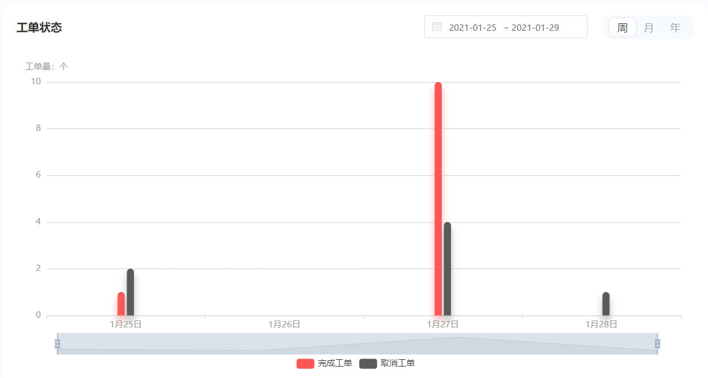
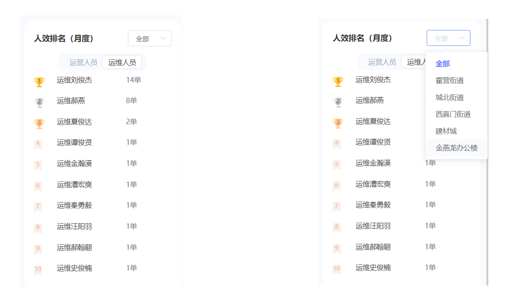

[toc]
# 第8章 统计分析

## 1. 并发异步编程CompletableFuture

### 1.1 需求与解决方案分析

我们现在有这样一个需求----在人员管理-人效统计页，分别统计运营和运维当天的工单数据：


实现这样的功能，我们可以有三种实现方案：

（1）每个数字分别创建一个API，这样实现上面的功能需要8个API，前端分别调用8个API来获取数据。优点：执行效率较高，后端编码简单。缺点：API数量过多，不利于维护，同时也增加了前端代码的复杂度。

（2）只创建一个API ，这个API内依次执行8个结果的查询。优点：只有一个API，前端编程相对简单。缺点：依次执行8个方法，整体响应时间较长，影响用户体验。

（3）使用并发异步编程技术**CompletableFuture**，可以在后端同时执行8个结果的查询。优点：只需要一个API，并且响应时间较短。缺点：代码量比前两个方案稍多。

经过比较，我们选择第3种实现方案。因为用户的体验是最重要的。

### 1.2 CompletableFuture快速入门

代码示例：

```java
    var aFuture = CompletableFuture.supplyAsync(()->{
       //.....
       return xxx;
    });
    var bFuture = CompletableFuture.supplyAsync(()->{
       //.....
       return xxx;
    });
    var cFuture = CompletableFuture.supplyAsync(()->{
       //.....
       return xxx;
    });
    //并行处理
    CompletableFuture
      .allOf(aFuture,
    		bFuture,
    		cFuture)
    .join();
    //取值
    var a= aFuture.get();
    var b= bFuture.get();
    var c= cFuture.get();
```

我们根据以上示例代码编写测试类

```java
@RunWith(SpringRunner.class)
@SpringBootTest
public class CompletableFutureTest {


    @Test
    public  void testFuture() throws ExecutionException, InterruptedException {
        var aFuture = CompletableFuture.supplyAsync(()->{
            //.....
            try {
                Thread.sleep(5000);
            } catch (InterruptedException e) {
                e.printStackTrace();
            }
            return 1;
        });
        var bFuture = CompletableFuture.supplyAsync(()->{
            //.....
            try {
                Thread.sleep(6000);
            } catch (InterruptedException e) {
                e.printStackTrace();
            }
            return 2;
        });
        var cFuture = CompletableFuture.supplyAsync(()->{
            //.....
            try {
                Thread.sleep(7000);
            } catch (InterruptedException e) {
                e.printStackTrace();
            }
            return 3;
        });
        //并行处理
        CompletableFuture
                .allOf(aFuture,
                        bFuture,
                        cFuture)
                .join();
        //取值
        var a= aFuture.get();
        var b= bFuture.get();
        var c= cFuture.get();
        System.out.println( a+"  "+b+ "  "+c );

    }
}
```

通过运行测试方法，我们会发现运行的时间为7秒多。也就是这三个任务中执行时间最长的时间，不是三个任务时间之和。

### 1.3 使用CompletableFuture实现工单数统计

我们现在就使用CompletableFuture统计运营和运维当天的工单数据


API文档：   管理后台 - 人员服务 - 获取当时工单汇总信息(人员统计头部信息)

（1）根据API文档定义视图模型（可以定义到工单微服务中）

```java
package com.lkd.http.viewModel;

import lombok.Data;

import java.io.Serializable;

/**
 * 工单基本统计情况
 */
@Data
public class TaskReportInfo implements Serializable {
    /**
     * 工单总数
     */
    private Integer total;
    /**
     * 完成总数
     */
    private Integer completedTotal;
    /**
     * 拒绝总数
     */
    private Integer cancelTotal;

    /**
     * 进行中总数
     */
    private Integer progressTotal;

    /**
     * 工作人数
     */
    private Integer workerCount;

    /**
     * 是否是运维工单统计
     */
    private boolean repair;

    /**
     * 日期
     */
    private String date;
}
```

（2）TaskService方法定义

```java
/**
 * 获取工单的统计情况
 * @return
 */
List<TaskReportInfo> getTaskReportInfo(LocalDateTime start,LocalDateTime end);
```

TaskServiceImpl编写私有方法用于统计工单数量

```java
/**
 * 统计工单数量
 * @param start
 * @param end
 * @param repair 是否是运维工单
 * @param taskStatus
 * @return
 */
private int taskCount( LocalDateTime start, LocalDateTime end ,Boolean repair ,Integer taskStatus ){
    LambdaQueryWrapper<TaskEntity> qw = new LambdaQueryWrapper<>();
        qw.ge(TaskEntity::getUpdateTime,start)
          .le(TaskEntity::getUpdateTime,end);
        //按工单状态查询
    if(taskStatus!=null){
        qw.eq(TaskEntity::getTaskStatus,taskStatus);
    }
    if(repair){//如果是运维工单
        qw.ne(TaskEntity::getProductTypeId,VMSystem.TASK_TYPE_SUPPLY);   
    }else{
        qw.eq(TaskEntity::getProductTypeId,VMSystem.TASK_TYPE_SUPPLY);
    }
    return this.count(qw);
}
```

TaskServiceImpl实现getTaskReportInfo方法

```java
@Override
public List<TaskReportInfo> getTaskReportInfo(LocalDateTime start, LocalDateTime end) {

    //运营工单总数total
    var supplyTotalFuture = CompletableFuture.supplyAsync(()->this.taskCount( start,end,false, null ));
    //运维工单总数
    var repairTotalFuture = CompletableFuture.supplyAsync(()->this.taskCount( start,end,true, null ));
    //完成的运营工单总数
    var completedSupplyFuture = CompletableFuture.supplyAsync(()->this.taskCount( start,end,false, VMSystem.TASK_STATUS_FINISH ));
    //完成的运维工单总数
    var completedRepairFuture = CompletableFuture.supplyAsync(()-> this.taskCount( start,end,true, VMSystem.TASK_STATUS_FINISH ));
    //拒绝掉的运营工单总数
    var cancelSupplyFuture = CompletableFuture.supplyAsync(()->this.taskCount( start,end,false, VMSystem.TASK_STATUS_CANCEL ));
    //拒绝掉的运维工单总数
    var cancelRepairFuture = CompletableFuture.supplyAsync(()->this.taskCount( start,end,true, VMSystem.TASK_STATUS_CANCEL ));
    // 获取运营人员数量
    var operatorCountFuture = CompletableFuture.supplyAsync(()-> userService.getOperatorCount());
    //获取运维人员总数
    var repairerCountFuture = CompletableFuture.supplyAsync(()-> userService.getRepairerCount());
    //并行处理
    CompletableFuture
            .allOf(supplyTotalFuture,
                    repairTotalFuture,
                    completedSupplyFuture,
                    completedRepairFuture,
                    cancelSupplyFuture,
                    cancelRepairFuture,
                    operatorCountFuture,
                    repairerCountFuture)
            .join();
    
    List<TaskReportInfo> result = Lists.newArrayList();
    var supplyTaskInfo = new TaskReportInfo();
    var repairTaskInfo = new TaskReportInfo();
    try {
        supplyTaskInfo.setTotal(supplyTotalFuture.get());
        supplyTaskInfo.setCancelTotal(cancelSupplyFuture.get());
        supplyTaskInfo.setCompletedTotal(completedSupplyFuture.get());
        supplyTaskInfo.setRepair(false);
        supplyTaskInfo.setWorkerCount(operatorCountFuture.get());
        result.add(supplyTaskInfo);

        repairTaskInfo.setTotal(repairTotalFuture.get());
        repairTaskInfo.setCancelTotal(cancelRepairFuture.get());
        repairTaskInfo.setCompletedTotal(completedRepairFuture.get());
        repairTaskInfo.setRepair(true);
        repairTaskInfo.setWorkerCount(repairerCountFuture.get());
        result.add(repairTaskInfo);
    }catch (Exception e){
        log.error("构建工单统计数据失败",e);
    }
    return result;
}


```

（3）工单微服务 TaskController

```java
/**
 * 获取当时工单汇总信息
 * @return
 */
@GetMapping("/taskReportInfo/{start}/{end}")
public List<TaskReportInfo> getTaskReportInfo(@PathVariable @DateTimeFormat(pattern = "yyyy-MM-dd HH:mm:ss") LocalDateTime start,
                                              @PathVariable  @DateTimeFormat(pattern = "yyyy-MM-dd HH:mm:ss") LocalDateTime end){
    return taskService.getTaskReportInfo(start,end);
}
```

## 2.用户工作量查询

### 2.1 需求分析

统计每个用户完成工单、进行工单和拒绝工单数


点击”查看详情“ 会看到以下页面


### 2.2 实现思路

（1）编写业务逻辑方法，通过用户id，开始和截至时间查询用户工作量信息

（2）用户微服务新增分页查询用户列表，循环用户列表中根据用户id查询上述的业务逻辑，实现本月工作量内容的查询。

### 2.3 代码实现

#### 2.3.1 用户工作量详情查询

API  ： 管理后台 - 用户服务-获取用户工作量(工单统计) 

（1）定义用户工作量视图模型对象UserWork

```java
/**
 * 用户工作量
 */
@Data
public class UserWork implements Serializable {
    /**
     * 用户Id
     */
    private Integer userId;

    /**
     * 完成工单数
     */
    private Integer workCount;

    /**
     * 当日进行中的工单
     */
    private Integer progressTotal;

    /**
     * 拒绝工单数
     */
    private Integer cancelCount;

    /**
     * 总工单数
     */
    private Integer total;
}
```

（2）TaskService方法定义

```java
/**
 * 获取用户工作量详情
 * @param userId
 * @param start
 * @param end
 * @return
 */
UserWork getUserWork(Integer userId,LocalDateTime start,LocalDateTime end);
```

TaskServiceImpl新增私有方法

```java
//根据工单状态，获取用户(当月)工单数
private Integer getCountByUserId(Integer userId,Integer taskStatus,LocalDate start,LocalDateTime end){
    var qw = new LambdaQueryWrapper<TaskEntity>();
    qw
            .ge(TaskEntity::getUpdateTime,start)
            .le(TaskEntity::getUpdateTime,end);
    if(taskStatus != null ){
        qw.eq(TaskEntity::getTaskStatus,taskStatus);
    }
    if(userId != null {
        qw.eq(TaskEntity::getAssignorId,userId);
    }
    return this.count(qw);
}
```

TaskServiceImpl实现方法

```java
@Override
public UserWork getUserWork(Integer userId, LocalDateTime start, LocalDateTime end) {
    var userWork = new UserWork();
    userWork.setUserId(userId);
    //并行处理提高程序吞吐量
    //获取用户完成工单数
    var workCountFuture = CompletableFuture
            .supplyAsync(()-> this.getCountByUserId(userId,VMSystem.TASK_STATUS_FINISH,start.toLocalDate(),end))
            .whenComplete((r,e)->{
                if(e != null){
                    userWork.setWorkCount(0);
                    log.error("user work error",e);
                }else {
                    userWork.setWorkCount(r);
                }
            });
    //获取工单总数
    var totalFuture = CompletableFuture
            .supplyAsync(()->this.getCountByUserId(userId,null,start.toLocalDate(),end))
            .whenComplete((r,e)->{
                if(e != null){
                    userWork.setWorkCount(0);
                    log.error("user work error",e);
                }else {
                    userWork.setTotal(r);
                }
            });
    //获取用户拒绝工单数
    var cancelCountFuture = CompletableFuture
            .supplyAsync(()-> this.getCountByUserId(userId,VMSystem.TASK_STATUS_CANCEL,start.toLocalDate(),end))
            .whenComplete((r,e)->{
                if(e != null){
                    userWork.setCancelCount(0);
                    log.error("user work error",e);
                }else {
                    userWork.setCancelCount(r);
                }
            });
    //获取进行中得工单数
    var progressTotalFuture = CompletableFuture
            .supplyAsync(()->this.getCountByUserId(userId,VMSystem.TASK_STATUS_PROGRESS,start.toLocalDate(),end))
            .whenComplete((r,e)->{
                if(e != null){
                    userWork.setProgressTotal(0);
                    log.error("user work error",e);
                }else {
                    userWork.setProgressTotal(r);
                }
            });
 CompletableFuture.allOf(workCountFuture,cancelCountFuture,progressTotalFuture).join();
    return userWork;
}
```

（2）TaskController

```java
/**
 * 获取用户工作量详情
 * @param userId
 * @param start
 * @param end
 * @return
 */
@GetMapping("/userWork")
 public UserWork getUserWork(@RequestParam Integer userId,
                             @RequestParam @DateTimeFormat(pattern = "yyyy-MM-dd HH:mm:ss")  LocalDateTime start,
                             @RequestParam @DateTimeFormat(pattern = "yyyy-MM-dd HH:mm:ss")  LocalDateTime end){

     return taskService.getUserWork(userId,start,end);
 }
```

#### 2.3.2 用户工作量列表查询

API：   管理后台 - 用户服务-人员工作量列表

（1）UserWork新增属性

```java
/**
* 手机号
*/
private String mobile;

/**
* 用户名
*/
private String userName;

/**
* 用户角色名
*/
private String roleName;
```

（2）service_common的feign接口TaskService新增方法定义

```java
@GetMapping("/task/userWork")
UserWork getUserWork(@RequestParam Integer userId, @RequestParam String start, @RequestParam String end);
```

服务降级类TaskServiceFallbackFactory新增方法

```java
@Override
public UserWork getUserWork(Integer userId, String start, String end) {
    UserWork userWork = new UserWork();
    userWork.setCancelCount(0);
    userWork.setProgressTotal(0);
    userWork.setWorkCount(0);
    userWork.setUserId(userId);
    return userWork;
}
```

（3）UserService新增方法定义

```java

/**
 * 查询工作量列表
 * @param pageIndex
 * @param pageSize
 * @param userName
 * @param roleId
 * @param isRepair
 * @return
 */
Pager<UserWork> searchUserWork( Long pageIndex,Long pageSize,String userName, Integer roleId, Boolean isRepair  );
```

UserServiceImpl实现方法

```java
@Override
public Pager<UserWork> searchUserWork(Long pageIndex, Long pageSize, String userName, Integer roleId, Boolean isRepair) {
    //查询用户分页
    var userPager= this.findPage(pageIndex,pageSize,userName,roleId,isRepair);
    //工作量列表
    var items =userPager.getCurrentPageRecords()
            .stream().map( u->{
                LocalDateTime now = LocalDateTime.now();
                LocalDateTime start=  LocalDateTime.of( now.getYear(),now.getMonth(),1,0,0 ,0);

                UserWork userWork=taskService.getUserWork(u.getId(),
                        start.format(DateTimeFormatter.ofPattern("yyyy-MM-dd HH:mm:ss" )),
                        now.format(DateTimeFormatter.ofPattern("yyyy-MM-dd HH:mm:ss" ))    );
                userWork.setUserName( u.getUserName() );
                userWork.setRoleName( u.getRole().getRoleName() );
                userWork.setMobile( u.getMobile());
                return userWork;
            }  ).collect(Collectors.toList());

    //封装分页对象
    Pager<UserWork> result= Pager.buildEmpty();
    result.setPageIndex( userPager.getPageIndex() );
    result.setPageSize(userPager.getPageSize());
    result.setTotalCount( userPager.getTotalCount());
    result.setTotalPage( userPager.getTotalPage() );
    result.setCurrentPageRecords( items );
    return result;
}
```

（4）用户微服务UserController

```java

/**
 * 获取用户工作量详情
 * @param userId
 * @param start
 * @param end
 * @return
 */
@GetMapping("/userWork")
public UserWork getUserWork(@RequestParam Integer userId,
                            @RequestParam @DateTimeFormat(pattern = "yyyy-MM-dd HH:mm:ss")  LocalDateTime start,
                            @RequestParam @DateTimeFormat(pattern = "yyyy-MM-dd HH:mm:ss")  LocalDateTime end){

    return taskService.getUserWork(userId,start,end);
}
```

分页查询用户，通过用户id远程调用工单微服务查询工单完成情况。

## 3.工单状态按日统计

### 3.1 需求分析

在后台系统中要根据一定日期范围展示出每日的不同状态的工单数量图表，方便管理人员根据图表进行后续的任务分配工作。具体的产品原型如下：



### 3.2 实现思路

在后台系统中要根据一定日期范围展示出每日的不同状态的工单数量图表 ，如果直接对工单表进行聚合统计，效率不高，对数据库也造成较大压力。所以我们需要每日固定时刻将前日工单根据状态分别进行汇总查询，然后存入工单汇总表中。查询时直接查询汇总数据即可。

为了提升对工单的统计效率，在工单库- 工单汇总表  tb_task_collect  ：


**任务描述：**

（1）完成定时任务类处理工单汇总逻辑，包含无效工单的处理

（2）通过xxl-job配置任务

### 3.3 代码实现

#### 3.3.1 工单定时汇总

（1）工单微服务添加xxl-job依赖

```xml
<dependency>
    <groupId>com.xuxueli</groupId>
    <artifactId>xxl-job-core</artifactId>
    <version>2.2.0</version>
</dependency>
```

（2）工单微服务添加xxl-job配置

```yaml
xxl:
  job:
    accessToken:
    admin:
      addresses: http://192.168.200.128:8080/xxl-job-admin
    executor:
      appname: task-service
      address:
      ip:
      port: 9981
      logretentiondays: 30
```

（3）工单微服务新建com.lkd.job包，包下创建配置类XxlJobConfig（可以从售货机微服务拷贝）

（4）工单微服务编写任务类，处理工单汇总请求

```java
@Component
public class TaskCollectJob {
    @Autowired
    private TaskService taskService;
    @Autowired
    private TaskCollectService taskCollectService;

    /**
     * 每日工单数据汇总(汇总昨天数据)
     * @return
     */
    @XxlJob("taskCollectJobHandler")
    public ReturnT<String> collectTask(String param){
        var taskCollectEntity = new TaskCollectEntity();
        LocalDate start = LocalDate.now().plusDays(-1);
        //进行中的工单
        taskCollectEntity.setProgressCount(this.count(start, VMSystem.TASK_STATUS_PROGRESS  ));
        //取消或拒绝的工单
        taskCollectEntity.setCancelCount( this.count(start, VMSystem.TASK_STATUS_CANCEL  ));
        //完成的工单
        taskCollectEntity.setFinishCount(this.count(start, VMSystem.TASK_STATUS_FINISH  ));
        //日期
        taskCollectEntity.setCollectDate(start);
        clearData(start);
        taskCollectService.save(taskCollectEntity);
        return ReturnT.SUCCESS;
    }

    /**
     * 清理某天数据
     * @param start
     */
    private void clearData(LocalDate start){
        var qw = new LambdaQueryWrapper<TaskCollectEntity>();
        qw.eq(TaskCollectEntity::getCollectDate,start);
        taskCollectService.remove(qw);
    }


    /**
     * 按时间和状态进行统计
     * @param start
     * @param taskStatus
     * @return
     */
    private int count(LocalDate start ,Integer taskStatus){
        var qw = new LambdaQueryWrapper<TaskEntity>();
        qw
                .ge(TaskEntity::getUpdateTime,start)
                .lt(TaskEntity::getUpdateTime,start.plusDays(1))
                .eq(TaskEntity::getTaskStatus, taskStatus);
        return taskService.count(qw);
    }
}
```

（5）在XXL-job中进行配置  

创建执行器   task-service  名称为：立可得-工单微服务

创建任务  


#### 3.3.2 无效工单处理

将工单表中日期小于当天，并且状态为创建或进行中的工单（非完成和取消）修改为取消状态。

（1）TaskCollectJob新增私有方法

```java
    /**
     * 清理无效工单
     */
    private void cleanTask(){
        var uw = new UpdateWrapper<TaskEntity>();
        uw.lambda()
                .lt(TaskEntity::getUpdateTime, LocalDate.now())
                .and(w->w.eq(TaskEntity::getTaskStatus, VMSystem.TASK_STATUS_PROGRESS).or().eq(TaskEntity::getTaskStatus,VMSystem.TASK_STATUS_CREATE))
                .set(TaskEntity::getTaskStatus,VMSystem.TASK_STATUS_CANCEL)
                .set(TaskEntity::getDesc,"工单超时");
        taskService.update(uw);
    }
```

（2）collectTask方法追加对该私有方法的调用。


#### 3.3.3 工单状态统计

对工单汇总表  tb_task_collect  进行查询

API :  管理后台 - 用户服务-工单状态统计

（1）创建TaskCollectService

```java
package com.lkd.service;

import com.baomidou.mybatisplus.extension.service.IService;
import com.lkd.entity.TaskCollectEntity;
import com.lkd.http.viewModel.TaskReportInfo;

import java.time.LocalDate;
import java.util.List;

public interface TaskCollectService extends IService<TaskCollectEntity>{
    /**
     * 获取工单报表
     * @param start
     * @param end
     * @return
     */
    List<TaskCollectEntity> getTaskReport(LocalDate start, LocalDate end);
}
```

实现类TaskCollectServiceImpl

```java
package com.lkd.service.impl;

import com.baomidou.mybatisplus.core.conditions.query.QueryWrapper;
import com.baomidou.mybatisplus.extension.service.impl.ServiceImpl;
import com.lkd.dao.TaskCollectDao;
import com.lkd.entity.TaskCollectEntity;
import com.lkd.service.TaskCollectService;
import org.springframework.stereotype.Service;

import java.time.LocalDate;
import java.util.List;

@Service
public class TaskCollectServiceImpl extends ServiceImpl<TaskCollectDao, TaskCollectEntity> implements TaskCollectService {
    @Override
    public List<TaskCollectEntity> getTaskReport(LocalDate start, LocalDate end) {
        QueryWrapper<TaskCollectEntity> qw = new QueryWrapper<>();
        qw
                .lambda()
                .ge(TaskCollectEntity::getCollectDate,start)
                .le(TaskCollectEntity::getCollectDate,end)
                .orderByAsc(TaskCollectEntity::getCollectDate);

        return this.list(qw);
    }
}
```

（2）TaskController新增方法

```java
/**
 * 获取工单报表
 * @param start
 * @param end
 * @return
 */
@GetMapping("/collectReport/{start}/{end}")
public List<TaskCollectEntity> getTaskCollectReport(@PathVariable String start,@PathVariable String end){
    return taskCollectService.getTaskReport(LocalDate.parse(start, DateTimeFormatter.ISO_LOCAL_DATE),LocalDate.parse(end,DateTimeFormatter.ISO_LOCAL_DATE));
}
```

## 4.人效排名月度统计  

### 4.1 需求分析 

在管理后台要根据根据区域统计出当月工作量(完成工单量)最多的前10名运营人员/运维人员，方便公司对这些排名靠前的员工实施一些激励措施。运行效果如下：



### 4.2 实现思路 

（1）从工单数据库中对应的工单表中根据日期范围及工单类型进行汇总查询

（2）将汇总查询出的结果封装成页面展示所需格式列表交给前端展示

API： 管理后台 - 用户服务-人员排名

### 4.3 代码实现 

（1）TaskService新增方法定义

```java
/**
 * 获取排名前10的工作量
 * @param start
 * @param end
 * @return
 */
List<UserWork> getUserWorkTop10(LocalDate start, LocalDate end, Boolean isRepair,Long regionId);
```

TaskServiceImpl实现方法

```java
@Override
public List<UserWork> getUserWorkTop10(LocalDate start, LocalDate end, Boolean isRepair,Long regionId) {
    var qw = new QueryWrapper<TaskEntity>();
    qw
            .select("count(user_id) as user_id,user_name")
            .lambda()
            .ge(TaskEntity::getUpdateTime,start)
            .le(TaskEntity::getUpdateTime,end)
            .eq(TaskEntity::getTaskStatus,VMSystem.TASK_STATUS_FINISH)
            .groupBy(TaskEntity::getUserName)
            .orderByDesc(TaskEntity::getUserId)
            .last("limit 10");
    if(regionId >0){
        qw.lambda().eq(TaskEntity::getRegionId,regionId);
    }
    if(isRepair){
        qw.lambda().ne(TaskEntity::getProductTypeId,VMSystem.TASK_TYPE_SUPPLY);
    }else {
        qw.lambda().eq(TaskEntity::getProductTypeId,VMSystem.TASK_TYPE_SUPPLY);
    }
    var result = this
            .list(qw)
            .stream()
            .map(t->{
                var userWork = new UserWork();
                userWork.setUserName(t.getUserName());
                userWork.setWorkCount(t.getUserId());
                return userWork;
            }).collect(Collectors.toList());
    return result;
}
```

（2）TaskController新增方法

```java
/**
 * 获取人员排名
 * @param start
 * @param end
 * @param isRepair
 * @return
 */
@GetMapping("/userWorkTop10/{start}/{end}/{isRepair}/{regionId}")
public List<UserWork> getUserWorkTop10(@PathVariable String start, @PathVariable String end, @PathVariable Boolean isRepair,@PathVariable String regionId){
    return taskService.getUserWorkTop10(
                LocalDate.parse(start,DateTimeFormatter.ISO_LOCAL_DATE),
                LocalDate.parse(end,DateTimeFormatter.ISO_LOCAL_DATE),
                isRepair,
            Long.valueOf(regionId));
}
```


## 5 销售额趋势图

### 5.1 需求分析

在立可得管理后台里要根据周、月、年三个纬度来进行销售额的统计，前端以曲线图的方式进行展示。具体效果如下（左图）：


### 5.2 实现思路

对订单合并表进行聚合统计，如果用户选择按周或按月统计，展现数据的维度为天，如果用户选择按年统计，展现数据的维度为月。所以前端需要给后端传递的参数包括统计开始和截至日期以及统计的维度（1为按日，2为按月）。

后端根据前端传递过来的参数对订单合并表进行聚合统计，将统计的结果封装为曲线图（柱状图）视图模型类。


### 5.3 代码实现

API:    管理后台-工作台- 获取销售额统计 

（1）ReportService新增方法

```java
/**
 * 获取一定日期内的销售额统计
 * @param start
 * @param end
 * @return
 */

BarCharCollect getAmountCollect(Integer collectType,LocalDate start,LocalDate end);
```

 ReportServiceImpl实现该方法

```java
@Override
public BarCharCollect getAmountCollect(Integer collectType,LocalDate start, LocalDate end) {

    //日期处理格式
    var formatter = collectType==2?DateTimeFormatter.ofPattern("yyyy-MM"):DateTimeFormatter.ISO_LOCAL_DATE ;
    //日期列
    var dateColumn=   collectType==2?"min(date) as date":"date";
    //分组列
    var groupColumn= collectType==2?"MONTH(date)":"date";
    //周期
    var period=  collectType==2?Period.ofMonths(1):Period.ofDays(1);

    var qw = new QueryWrapper<OrderCollectEntity>();
    qw
            .select("IFNULL(sum(order_total_money),0) as order_total_money",dateColumn)
            .groupBy(groupColumn)
            .lambda()
            .ge(OrderCollectEntity::getDate,start)
            .le(OrderCollectEntity::getDate,end)
            .orderByAsc(OrderCollectEntity::getDate);
    //构建一个key为日期维度，value为销售额的map
    var mapCollect = orderCollectService
            .list(qw)
            .stream()
            .collect(Collectors.toMap(o-> o.getDate().format(formatter),OrderCollectEntity::getOrderTotalMoney));
    var result = new BarCharCollect();
    //以从开始日期到结束日期为范围，日期统计类型为维度构建曲线图数据
    start.datesUntil(end.plusDays(1), period)
        .forEach(date->{
            String key  = date.format(formatter);
            result.getXAxis().add(key);
            if(mapCollect.containsKey(key)){
                result.getSeries().add(mapCollect.get(key));
            }else {
                result.getSeries().add(0);
            }
        });
    return result;
}
```

（2）ReportController新增方法

```java
/**
 * 获取销售额统计
 * @param collectType
 * @param start
 * @param end
 * @return
 */
@GetMapping("/amountCollect/{collectType}/{start}/{end}")
public BarCharCollect getAmountCollect(@PathVariable Integer collectType,
                                       @PathVariable @DateTimeFormat(pattern = "yyyy-MM-dd") LocalDate start,
                                       @PathVariable  @DateTimeFormat(pattern = "yyyy-MM-dd") LocalDate end){
    return reportService.getAmountCollect(collectType,start,end);
}
```

## 6 销售额分布

### 6.1 需求分析

在立可得管理后台里要根据周、月、年三个维度来对销售额按运营区域进行分组统计，前端以柱状图的方式进行展示。具体效果如下（右图）：


### 6.2 实现思路

我们的订单汇总表中并没有记录区域名称，所以我们没有办法根据订单汇总表来进行统计了。我们可以从elasticsearch的订单库根据区域名称进行聚合统计。

### 6.3 代码实现

API  ： 管理后台- 工作台- 根据地区汇总销售额数据(销售量分布) 

（1）ReportService新增方法

```java
/**
 * 获取地区销量统计
 * @param start
 * @param end
 * @return
 */
BarCharCollect getCollectByRegion(LocalDate start, LocalDate end);
```

 ReportServiceImpl实现该方法

```java
private final RestHighLevelClient esClient;

@Override
public BarCharCollect getCollectByRegion(LocalDate start, LocalDate end) {
    SearchRequest searchRequest = new SearchRequest("order");
    SearchSourceBuilder sourceBuilder = new SearchSourceBuilder();
    BoolQueryBuilder boolQueryBuilder = QueryBuilders.boolQuery();
    //根据时间范围搜索
    boolQueryBuilder.filter(QueryBuilders.rangeQuery("create_time").gte(start).lte(end));
    boolQueryBuilder.filter(QueryBuilders.termQuery("pay_status", VMSystem.PAY_STATUS_PAYED));
    sourceBuilder.query(boolQueryBuilder);
    sourceBuilder.size(0);
    //根据区域名称分组
    AggregationBuilder regionAgg = AggregationBuilders
            .terms("region")
            .field("region_name")
            .subAggregation(AggregationBuilders.sum("amount_sum").field("amount"))
            .order(BucketOrder.aggregation("amount_sum",false))
            .size(30);
    sourceBuilder.aggregation(regionAgg);
    searchRequest.source(sourceBuilder);

    var results = new BarCharCollect();
    try {
        SearchResponse searchResponse = esClient.search(searchRequest, RequestOptions.DEFAULT);
        var aggregation = searchResponse.getAggregations();
        if(aggregation == null) return results;

        var term = (ParsedStringTerms)aggregation.get("region");
        var buckets = term.getBuckets();
        if(buckets.size() <= 0) return results;

        buckets.stream().forEach(b->{
            results.getXAxis().add(b.getKeyAsString());

            var sumAgg = (ParsedSum) b.getAggregations().get("amount_sum");
            Double value =sumAgg.getValue();
            results.getSeries().add( value.intValue());
        });

    } catch (IOException e) {
        log.error("根据区域汇总数据出错",e);
    }
    return results;
}
```

（2）ReportController新增方法

```java
/**
 * 根据地区汇总销售额数据
 * @param start
 * @param end
 * @return
 */
@GetMapping("/regionCollect/{start}/{end}")
public BarCharCollect getRegionCollect(
        @PathVariable @DateTimeFormat(pattern = "yyyy-MM-dd") LocalDate start,
        @PathVariable @DateTimeFormat(pattern = "yyyy-MM-dd") LocalDate end){
    return reportService.getCollectByRegion(start,end);
}
```


