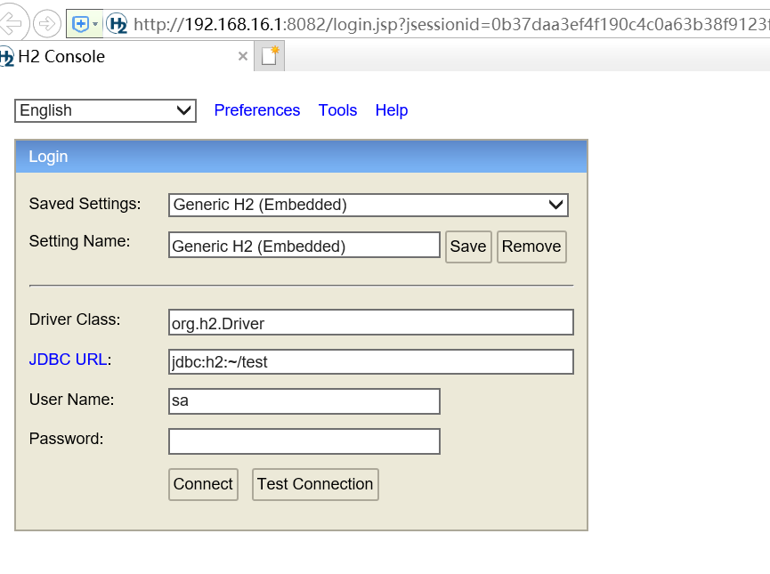

[toc]
# 第9章 售货机“五脏六腑”深度剖析

## 课程目标

+ 理解售货机业务
+ 完成嵌入式数据库h2集成开发
+ 完成售货机emqt集成开发
+ 完成售货机和服务器数据同步，价格变动，出货，补货等业务开发
+ 掌握售货机宕机特殊业务场景处理


## 1.售货机端功能分析

### 1.1 售货机端功能描述

售货机端同样也是一个微服务，部署在每一个**售货机**中。具有如下功能

（1）与服务端进行数据的同步，包括商品数据、货道数据、价格数据。

（2）出货。通过订阅EMQ消息，接收出货指令，更新本地库存数据并调用硬件接口进行出货，成功后向服务器上报出货结果。

（3）补货。通过订阅EMQ消息，接收到补货的消息，更新本地库存。

售货机端只有内核，没有操作界面。

### 1.2 售货机端技术方案

售货机端一般采用安卓系统作为操作系统。

（1）使用SpringBoot作为售货机端的框架

（2）使用Aid Learning 作为安卓系统运行SpringBoot的运行平台。Aid Learning是一个可以运行在安卓系统中的linux系统。

（3）使用嵌入式数据库H2存储售货机的本地数据（商品、货道、出货记录）。

（4）使用paho订阅和发布emq消息。

（5）使用串口实现与硬件设备的交互。

### 1.3 数据库表结构设计

**商品表**   tb_sku

| 字段名        | 字段类型    | 字段长度 | 字段描述   |
| ---------- | ------- | ---- | ------ |
| sku_id     | VARCHAR | 64   | 商品ID   |
| sku_name   | VARCHAR | 64   | 商品名称   |
| image      | VARCHAR | 64   | 图片地址   |
| price      | int     | 11   | 商品原价   |
| real_price | int     | 11   | 商品真实售价 |
| class_id   | int     | 11   | 商品类别Id |
| class_name | VARCHAR | 64   | 商品类别名称 |
| discount   | int     | 1    | 是否打折   |
| unit       | VARCHAR | 32   | 商品净含量  |
| index      | int     | 11   | 商品排序索引 |

**货道表**  tb_channel

| 字段名        | 字段类型    | 字段长度 | 字段描述 |
| ---------- | ------- | ---- | ---- |
| channel_id | VARCHAR | 64   | 货道id |
| sku_id     | VARCHAR | 64   | 商品id |
| capacity   | int     | 11   | 库存   |

**版本信息表**  tb_version

| 字段名               | 字段类型 | 字段长度 | 字段描述   |
| ----------------- | ---- | ---- | ------ |
| version_id        | int  | 11   | 版本ID   |
| channel_version   | int  | 11   | 货道版本   |
| sku_version       | int  | 11   | 商品版本   |
| sku_price_version | int  | 11   | 商品价格版本 |

**出货记录表**  tb_vendout_order

| 字段名         | 字段类型      | 字段长度 | 字段含义    |
| ----------- | --------- | ---- | ------- |
| order_no    | VARCHAR   | 64   | 出货订单号   |
| pay_type    | int       | 11   | 支付方式    |
| channel_id  | VARCHAR   | 64   | 货道id    |
| sku_id      | VARCHAR   | 64   | 商品id    |
| pay_price   | int       | 11   | 价格      |
| out_time    | TIMESTAMP |      | 售货机出货时间 |
| result_code | int       | 11   | 出货结果编号  |

出货结果编号  0-成功,1-货道售空,2-设备故障,3-机器出货中,4-连续支付,5-服务器超时

## 2. EMQ安全解决方案-ACL

### 2.1 ACL概述 

#### 2.1.1 什么是ACL 

在真实的生产环境中，EMQ是可以公网访问连接的。如果不进行访问控制，任何设备或终端都可以连接EMQ进行通讯，那必然会有很大的安全隐患。

*ACL* 即访问控制列表（(Access Control Lists），是EMQ提供的安全解决方案。通过开启ACL插件，可以实现连接的认证、超级用户的判断以及对发布订阅控制。

EMQ X 支持使用配置文件、外部主流数据库和自定义 HTTP API 作为 ACL 数据源。

连接数据源、进行访问控制功能是通过插件实现的，使用前需要启用相应的插件。

客户端订阅主题、发布消息时插件通过检查目标主题（Topic）是否在指定数据源允许/禁止列表内来实现对客户端的发布、订阅权限管理。

**配置文件**

- 内置 ACL

使用配置文件提供认证数据源，适用于变动较小的 ACL 管理。

**外部数据库**

- MySQL ACL
- PostgreSQL ACL
- Redis ACL
- MongoDB ACL

外部数据库可以存储大量数据、动态管理 ACL，方便与外部设备管理系统集成。

**其他**

- HTTP ACL

HTTP ACL 能够实现复杂的 ACL 管理。ACL 功能包含在认证鉴权插件中，更改插件配置后需要**重启插件**才能生效，在EMQ中找到emqx_auth_http  插件将其开启


#### 2.1.2 ACL鉴权链

当同时启用多个 ACL 插件时，EMQ X 将按照插件开启先后顺序进行链式鉴权：

- 一通过授权，终止链并允许客户端通过验证
- 一旦授权失败，终止链并禁止客户端通过验证
- 直到最后一个 ACL 插件仍未通过，根据**默认授权**配置判定默认授权为允许时，允许客户端通过验证默认授权为禁止时，禁止客户端通过验证


#### 2.1.3 ACL 缓存 

 ACL 缓存允许客户端在命中某条 ACL 规则后，便将其缓存至内存中，以便下次直接使用，客户端发布、订阅频率较高的情况下开启 ACL 缓存可以提高 ACL 检查性能。  在 `etc/emqx.conf` 可以配置 ACL 缓存大小与缓存时间： 

```
## 是否启用
enable_acl_cache = on

## 单个客户端最大缓存规则数量
acl_cache_max_size = 32

## 缓存失效时间，超时后缓存将被清除
acl_cache_ttl = 1m
```


### 2.2 ACL代码实现

#### 2.2.1 连接认证

（1）在 lkd_vms_service 工程com.lkd.http.controller 包下新建AclController

```java
package com.lkd.http.controller;

import com.baomidou.mybatisplus.core.conditions.query.LambdaQueryWrapper;
import com.lkd.entity.VendingMachineEntity;
import com.lkd.feignService.StatusService;
import com.lkd.service.VendingMachineService;
import lombok.RequiredArgsConstructor;
import lombok.extern.slf4j.Slf4j;
import org.elasticsearch.common.Strings;
import org.springframework.http.HttpStatus;
import org.springframework.http.ResponseEntity;
import org.springframework.web.bind.annotation.*;

@RestController
@RequestMapping("/acl")
@RequiredArgsConstructor
@Slf4j
public class AclController {
    private final VendingMachineService vmService;
    
    /**
     * 连接控制
     * @param username
     * @param password
     * @param clientid
     * @return
     */
    @PostMapping("/auth")
    public ResponseEntity<?> auth(@RequestParam(value = "username",required = false,defaultValue = "") String username,
                                  @RequestParam(value = "password",required = false,defaultValue = "") String password,
                                  @RequestParam(value = "clientid",required = false,defaultValue = "") String clientid){

        if(Strings.isNullOrEmpty(clientid)){
            return new ResponseEntity<>(null, HttpStatus.BAD_REQUEST);
        }
        if(clientid.startsWith("mqtt")){
            return new ResponseEntity<>(null, HttpStatus.OK);
        }
        log.info("client request connect,clientId:"+clientid);
        //服务器端连接
        if(clientid.startsWith("monitor")){
            return new ResponseEntity<>(null, HttpStatus.OK);
        }
        var qw = new LambdaQueryWrapper<VendingMachineEntity>();
        qw.eq(VendingMachineEntity::getClientId,clientid);
        var vm = vmService.getOne(qw);
        if(vm == null){
            return new ResponseEntity<>(null, HttpStatus.BAD_REQUEST);
        }
        return new ResponseEntity<>(null, HttpStatus.OK);
    }
}
```

（2）etc/plugins/emqx_auth_http.conf 文件中修改

```json
##
## Value: HTTP认证接口的URL
auth.http.auth_req = http://192.168.200.1:9007/vm-service/acl/auth

## HTTP 请求方法
## Value: post | get | put
auth.http.auth_req.method = post

## 请求参数
auth.http.auth_req.params = clientid=%c,username=%u,password=%P
```

说明：
HTTP 请求方法为 GET 时，请求参数将以 URL 查询字符串的形式传递；POST、PUT 请求则将请求参数以普通表单形式提交（content-type 为 x-www-form-urlencoded）。 

 我们可以在认证请求中使用以下占位符，请求时 EMQ X 将自动填充为客户端信息： 

- %u：用户名
- %c：Client ID
- %a：客户端 IP 地址
- %r：客户端接入协议
- %P：明文密码
- %p：客户端端口
- %C：TLS 证书公用名（证书的域名或子域名），仅当 TLS 连接时有效
- %d：TLS 证书 subject，仅当 TLS 连接时有效

（3）网关的配置中添加对以下地址的放行

```
/vm-service/acl/auth
```


#### 2.2.2 超级用户判断

客户端可拥有“超级用户”身份，超级用户拥有最高权限不受 ACL 限制。 

- 认证鉴权插件启用超级用户功能后，发布订阅时 EMQ X 将优先检查客户端超级用户身份
- 客户端为超级用户时，通过授权并跳过后续 ACL 检查

（1）AclController新增方法

```java
/**
 * 判断是否是超级用户
 * @param clientid
 * @param username
 * @return
 */
@PostMapping("/superuser")
public ResponseEntity<?> superuser(@RequestParam String clientid,@RequestParam String username){
    log.info("超级用户认证");
    if(clientid.startsWith("monitor")){
        log.info(clientid+"是超级用户!!!!");
        return new ResponseEntity<>(null, HttpStatus.OK);
    }
    if(clientid.startsWith("mqtt")){
        log.info(clientid+"是超级用户!!!!");
        return new ResponseEntity<>(null, HttpStatus.OK);
    }
    log.info(clientid+"不是超级用户!!!!");
    return new ResponseEntity<>(null, HttpStatus.BAD_REQUEST);
}
```

（2）etc/plugins/emqx_auth_http.conf 文件中修改

```json
## Value: 超级用户认证的URL
auth.http.super_req = http://192.168.200.1:9007/vm-service/acl/superuser

## HTTP 请求方法
## Value: post | get | put
auth.http.super_req.method = post

## 请求参数
auth.http.super_req.params = clientid=%c,username=%u
```

（3）网关的配置中添加对以下地址的放行

```
/vm-service/acl/superuser
```

#### 2.2.3 发布订阅控制

（1）AclController新增方法

```java
/**
 * 发布订阅控制
 * @param clientid
 * @param topic
 * @param access 动作2：publish、1：subscribe
 * @param username
 * @return
 */
@PostMapping("/pubsub")
public ResponseEntity<?> pubsub(@RequestParam String clientid,
                             @RequestParam String topic,
                             @RequestParam int access,
                             @RequestParam String username,
                             @RequestParam String ipaddr,
                             @RequestParam String mountpoint){
    System.out.println("acl clientid:"+clientid+" username:"+username+" ipaddr:"+ipaddr+" topic:"+topic+" access:"+access+" mountpoint:"+mountpoint);
 log.info("pubsub!!!!!!!!!!!!!!!!!!!!!!!!!!!!!!!!!!!!!!!!!!!!!!!!!!!!!!!!!!!!!!!!!!!!!!");
    if(Strings.isNullOrEmpty(clientid)){
        return new ResponseEntity<>(null, HttpStatus.BAD_REQUEST);
    }
    var qw = new LambdaQueryWrapper<VendingMachineEntity>();
    qw.eq(VendingMachineEntity::getClientId,clientid);
    var vm = vmService.getOne(qw);
    if(vm == null){
        return new ResponseEntity<>(null, HttpStatus.BAD_REQUEST);
    }
    if(access == 2 && topic.equals("server/"+vm.getInnerCode())){
        return new ResponseEntity<>(null, HttpStatus.OK);
    }
    if(access == 1 && topic.equals("vm/"+vm.getInnerCode())){
        return new ResponseEntity<>(null, HttpStatus.OK);
    }
    log.info(clientid+"不能发布或订阅消息!!!!");
    return new ResponseEntity<>(null, HttpStatus.BAD_REQUEST);
}
```

（2）etc/plugins/emqx_auth_http.conf 文件中修改

```json
## Value: 发布订阅控制的URL
auth.http.acl_req = http://192.168.200.1:9007/vm-service/acl/pubsub

## HTTP 请求方法
## Value: post | get | put
auth.http.acl_req.method = post

## 请求参数
auth.http.acl_req.params = access=%A,username=%u,clientid=%c,ipaddr=%a,topic=%t,mountpoint=%m
```

（3）网关的配置中添加对以下地址的放行

```
acl/pubsub
```


## 3. 嵌入式数据库H2

### 3.1 嵌入式数据库H2简介


​     我们采用H2，这是一个短小精干的嵌入式数据库引擎，采用java编写，主要的特性包括：

- 免费、开源、快速，java编写，不受平台的限制

- h2只有一个jar文件，短小精干的软件，1M左右，十分适合作为嵌入式数据库，也可作为内存数据库使用

- 提供JDBC、ODBC访问接口，提供基于浏览器的控制台管理程序

  控制台如下

  


### 3.2 安装与运行

h2安装使用    资源库中 h2-2019-10-14.zip

```java
h2
　|---bin
　|    |---h2-1.4.200.jar　　//H2数据库的jar包（驱动也在里面）
　|    |---h2.bat　　//Windows控制台启动脚本
　|    |---h2.sh　　//Linux控制台启动脚本
　|    |---h2w.bat　　//Windows控制台启动脚本（不带黑屏窗口）
　|---docs　　//H2数据库的帮助文档（内有H2数据库的使用手册）
　|---service　　//通过wrapper包装成服务。
　|---src　　//H2数据库的源代码
　|---build.bat　　//windows构建脚本
　|---build.sh　　//linux构建脚本
```

运行  hw2.bat   会弹出登录页面



连接H2数据库有以下方式

- 服务式 （Server）
- 嵌入式（Embedded）
- 内存（Memory）

服务式的话，就跟MySQL、Oracle这种数据库差不多，服务器单独运行，可以多个客户端同时连接。
嵌入式的话，就是这个H2数据库只能给一个应用使用，连接是有排他机制的。当一个应用用嵌入式连接方式连接了以后，其他的应用就不能再连接了。
内存方式，顾名思义，数据仅保持在内存中，一旦关机数据会丢失

上面例子中给的是嵌入式的

- 服务式 （Server）
  `jdbc:h2:tcp://localhost/~/test`

- 嵌入式（Embedded）
  `jdbc:h2:~/test`

- 内存式（Memory）
  `jdbc:h2:tcp://localhost/mem:test`

  连接后


### 3.3 快速入门

#### 3.3.1 JDBC方式操作 h2

java工程操作h2  导入h2工程

（1）pom.xml工程中

```xml
  <dependency>
          <groupId>com.h2database</groupId>
          <artifactId>h2</artifactId>
          <version>1.4.199</version>
      </dependency>
```

（2）测试类

```java
package  com.itheima.h2;
import java.sql.*;
public class TestH2 {

    public static void main(String[] args) {
        Connection conn=null;
        try {
            Class.forName("org.h2.Driver");
            //服务器模式
             conn = DriverManager.
                    getConnection("jdbc:h2:tcp://localhost/~/test", "sa", "");
            //嵌入模式，只能一个客户端
//            conn = DriverManager.
//                    getConnection("jdbc:h2:~/test", "sa", "");
            Statement stmt = conn.createStatement();
            stmt.executeUpdate("DROP TABLE IF EXISTS TEST_H2;");
            stmt.executeUpdate("CREATE TABLE TEST_H2(ID INT PRIMARY KEY,NAME VARCHAR(255));");
            stmt.executeUpdate("INSERT INTO TEST_H2 VALUES(1, 'Hello_Mem');");
            ResultSet rs = stmt.executeQuery("SELECT * FROM TEST_H2");
            while(rs.next()) {
                System.out.println(rs.getInt("ID")+","+rs.getString("NAME"));
            }
        } catch (Exception e) {
            e.printStackTrace();
        }finally {
            if(conn!=null){
                try {
                    conn.close();
                } catch (SQLException throwables) {
                    throwables.printStackTrace();
                }
            }
        }
    }
}
```

运行完后 通过控制台


如果嵌入式，只能一个客户端连接

```
conn = DriverManager.
                    getConnection("jdbc:h2:~/test", "sa", "");
```


退出当前客户端即可

嵌入式文件会保存在当前用户

‪C:\Users\当前用户\test.mv.db

#### 3.3.2 mybatisPlus 方式操作h2

（1）pom.xml

```xml
<dependency>
    <groupId>org.springframework.boot</groupId>
    <artifactId>spring-boot-starter-web</artifactId>
</dependency>

<dependency>
    <groupId>org.springframework.boot</groupId>
    <artifactId>spring-boot-configuration-processor</artifactId>
    <optional>true</optional>
</dependency>
<dependency>
    <groupId>org.springframework.boot</groupId>
    <artifactId>spring-boot-starter-test</artifactId>
    <scope>test</scope>
</dependency>


<dependency>
    <groupId>org.projectlombok</groupId>
    <artifactId>lombok</artifactId>
    <optional>true</optional>
</dependency>

<dependency>
    <groupId>com.baomidou</groupId>
    <artifactId>mybatis-plus-boot-starter</artifactId>
    <version>3.4.1</version>
</dependency>

<dependency>
    <groupId>com.h2database</groupId>
    <artifactId>h2</artifactId>
    <scope>compile</scope>
</dependency>

<dependency>
    <groupId>com.alibaba</groupId>
    <artifactId>fastjson</artifactId>
    <version>1.2.72</version>
</dependency>
```

（2）启动类

```java
@SpringBootApplication
@MapperScan("com.lkd.client.mapper")
public class LkdClientApplication{

    public static void main(String[] args) {
        SpringApplication.run(LkdClientApplication.class, args);
    }
}
```

（3）application.yml

```yaml
spring:
  application:
    name: h2_mybatisplus_demo
  datasource:
    url: jdbc:h2:~/lkd
    driver-class-name: org.h2.Driver
    schema: classpath:db/schema-h2.sql
    username: root
    password: test
  h2:
    console:
      path: /h2-console  #h2嵌入式数据库控制台
      enabled: true
mybatis-plus:
  configuration:
    log-impl: org.apache.ibatis.logging.stdout.StdOutImpl
#web 访问端口
server:
  port: 9093
```

（4）resources下db/schema-h2.sql

```sql
DROP TABLE IF EXISTS tb_sku;
CREATE TABLE tb_sku
(
	sku_id VARCHAR(64) NOT NULL COMMENT '商品ID',
	sku_name VARCHAR(64) NOT NULL  COMMENT '商品名称',
	image VARCHAR(255) NULL DEFAULT NULL COMMENT '图片地址',
	price INT(11) NULL DEFAULT NULL COMMENT '商品原价',
	real_price INT(11) NULL DEFAULT NULL COMMENT '商品真实售价',
	class_id VARCHAR(64) NULL DEFAULT NULL  COMMENT '商品类别Id',
	class_name VARCHAR(64) NULL DEFAULT NULL  COMMENT '商品类别Id',
    discount INT(1) NULL DEFAULT NULL COMMENT '是否打折',
    unit VARCHAR(32) NULL DEFAULT NULL  COMMENT '商品净含量',
    index INT(11) NULL DEFAULT NULL  COMMENT '商品排序索引',
	PRIMARY KEY (sku_id)
);
```

（5）实体类

```java
@Data
@TableName("tb_sku")
public class Sku {
    @TableId(type = IdType.ASSIGN_UUID)
    private String skuId;
    private String skuName;
    private String image;
    private Integer price;  //当前售价(以分为单位)
    private Integer realPrice; //商品原价(以分为单位)
    private String classId; //商品类别Id
    private String className; //类别名称
    private Boolean discount; //是否打折
    private String unit; //商品净含量
    private Integer index;  //商品排序索引
}
```

（6）mapper

```java
/**
 * 商品mapper
 */
public interface SkuMapper extends BaseMapper<Sku> {

}
```

启动工程，进入控制台，会发现表被自动创建。

单元测试

```java
@SpringBootTest
@RunWith(SpringRunner.class)
public class TestSku {

    @Autowired
    private SkuMapper skuMapper;

    @Test
    public void testAdd(){
        Sku sku=new Sku();
        sku.setSkuName("毛巾");
        sku.setSkuId("1111");


        skuMapper.insert(sku);

        List<Sku> skus = skuMapper.selectList(null);
        System.out.println(JSON.toJSON(sku)  );
    }

}
```


#### 3.3.3 ScriptUtils解决重启后数据丢失问题

（1）修改application.yml

 去掉schema: classpath:db/schema-h2.sql，否则每次重启售货机会从新初始化数据

```yaml
spring:
  application:
    name: lkd-client
  datasource:
    url: jdbc:h2:~/lkd
    driver-class-name: org.h2.Driver
    #schema: classpath:db/schema-h2.sql
    username: root
    password: test
```

（2）新增ApplicationContextRegister 监听springboot启动，获取ApplicationContext，然后通过Resource对象获取schema-h2.sql

```java
package com.lkd.client.config;

import org.springframework.beans.BeansException;
import org.springframework.context.ApplicationContext;
import org.springframework.context.ApplicationContextAware;
import org.springframework.core.io.Resource;
import org.springframework.stereotype.Component;

@Component
public class ApplicationContextRegister implements ApplicationContextAware {

    private ApplicationContext applicationContext = null;

    @Override
    public void setApplicationContext(ApplicationContext applicationContext) throws BeansException {
       this.applicationContext=applicationContext;
    }

    public Resource getResource(String url){
        return this.applicationContext.getResource(url);
    }
}
```

（3）InitService

```java
package com.lkd.client;

import com.alibaba.fastjson.JSON;
import com.lkd.client.config.ApplicationContextRegister;
import com.lkd.client.config.EmqConfig;
import com.lkd.client.config.MsgType;
import com.lkd.client.emq.msg.VersionReq;
import com.lkd.client.mapper.VersionMapper;
import com.lkd.client.pojo.Version;
import lombok.extern.slf4j.Slf4j;
import org.springframework.beans.factory.annotation.Autowired;
import org.springframework.boot.autoconfigure.AutoConfigureAfter;
import org.springframework.core.io.Resource;
import org.springframework.jdbc.datasource.init.ScriptUtils;
import org.springframework.stereotype.Service;

import javax.annotation.PostConstruct;
import javax.sql.DataSource;
import java.io.File;
/**
 *  客户端采用嵌入式数据库h2
 */
@Slf4j
@Service
@AutoConfigureAfter(DataSource.class) //DataSource创建完后才初始化此类
public class InitService {

    //初始化sql
    private static final String schema="classpath:db/schema-h2.sql";

    @Autowired
    DataSource dataSource;

    @Autowired
    ApplicationContextRegister applicationContext;

    @PostConstruct
    public  void init() throws Exception {
        //初始化本地数据库
        String userHome= System.getProperty("user.home");//获取系统用户目录
        File f = new File(userHome+File.separator+"lkd.lock");
        if(!f.exists()){
            log.info("--------------初始化h2数据----------------------");
            f.createNewFile();
            Resource resource= (Resource) applicationContext.getResource(schema);
            ScriptUtils.executeSqlScript(dataSource.getConnection(),resource);
        }
    }
}
```

（4）测试发现第一次启动在系统目录会出现 lkd.lock，同时数据库会初始化


​      第二次启动，数据库不会初始化

## 4.售货机端工程搭建

### 4.1 基础工程创建

（1）复制h2_mybatisplus_demo工程，修改工程名称为lkd_client

（2）修改schema-h2.sql

```sql
DROP TABLE IF EXISTS tb_channel;

CREATE TABLE tb_channel
(
	channel_id VARCHAR(64) NOT NULL COMMENT '货道ID',
	sku_id VARCHAR(64) NOT NULL  COMMENT '商品id',
	capacity INT(11) NULL DEFAULT NULL COMMENT 'capacity',
	PRIMARY KEY (channel_id)
);

DROP TABLE IF EXISTS tb_sku;
CREATE TABLE tb_sku
(
	sku_id VARCHAR(64) NOT NULL COMMENT '商品ID',
	sku_name VARCHAR(64) NOT NULL  COMMENT '商品名称',
	image VARCHAR(255) NULL DEFAULT NULL COMMENT '图片地址',
	price INT(11) NULL DEFAULT NULL COMMENT '商品原价',
	real_price INT(11) NULL DEFAULT NULL COMMENT '商品真实售价',
	class_id VARCHAR(64) NULL DEFAULT NULL  COMMENT '商品类别Id',
	class_name VARCHAR(64) NULL DEFAULT NULL  COMMENT '商品类别Id',
    discount INT(1) NULL DEFAULT NULL COMMENT '是否打折',
    unit VARCHAR(32) NULL DEFAULT NULL  COMMENT '商品净含量',
    index INT(11) NULL DEFAULT NULL  COMMENT '商品排序索引',
	PRIMARY KEY (sku_id)
);

DROP TABLE IF EXISTS tb_version;
CREATE TABLE tb_version
(
	version_id INT(11) NOT NULL COMMENT '版本ID',
	channel_version INT(11) NOT NULL DEFAULT 0 COMMENT '货道版本',
	sku_version INT(11) NULL DEFAULT 0 COMMENT '商品版本',
	sku_price_version INT(11) NULL DEFAULT 0 COMMENT '商品价格版本',
	PRIMARY KEY (version_id)
);

INSERT INTO tb_version (version_id, channel_version, sku_version, sku_price_version) VALUES
(1, 0, 0, 0);


/**
出货信息表
 */
DROP TABLE IF EXISTS tb_vendout_order;
CREATE TABLE tb_vendout_order
(
	order_no VARCHAR(64) NOT NULL COMMENT '出货订单号',
	pay_type INT(11) NOT NULL DEFAULT 0 COMMENT '支付方式',
	channel_id VARCHAR(64) NOT NULL DEFAULT '' COMMENT '货道id',
	sku_id VARCHAR(64) NOT NULL DEFAULT '' COMMENT '商品id',
    pay_price INT(11) NOT NULL DEFAULT 0 COMMENT '价格',
	out_time TIMESTAMP NOT NULL DEFAULT CURRENT_TIMESTAMP COMMENT '售货机出货时间',
	result_code INT(11) NULL DEFAULT 0 COMMENT '出货结果编号，0-成功,1-货道售空,2-设备故障,3-机器出货中,4-连续支付,5-服务器超时',
	PRIMARY KEY (order_no)
);
```

（3）导入 pojo 对象  Channel.java  Sku.java  Version.java VendoutOrder.java

（4）导入 mapper对象  ChannelMapper.java  SkuMapper.java  VersionMapper.java VendoutOrderMapper.java

（5）删除lkd.lock。启动工程，会看到有四个表已经生成

### 4.2 集成EMQ X 

（1）在lkd_client工程pom.xml 加入

```xml
       <dependency>
            <groupId>org.springframework.boot</groupId>
            <artifactId>spring-boot-configuration-processor</artifactId>
            <optional>true</optional>
        </dependency>

     <!--emq 客户端包-->
      <dependency>
            <groupId>org.eclipse.paho</groupId>
            <artifactId>org.eclipse.paho.client.mqttv3</artifactId>
            <version>1.2.2</version>
      </dependency>

      <dependency>
            <groupId>commons-io</groupId>
            <artifactId>commons-io</artifactId>
            <version>2.8.0</version>
        </dependency>

       <dependency>
            <groupId>org.apache.commons</groupId>
            <artifactId>commons-lang3</artifactId>
            <version>3.11</version>
        </dependency>
```

（2）在lkd_client 的application.yml中添加

```yaml
#emq 访问端口
emq:
  mqttServerUrl: tcp://192.168.200.128:1883
  mqttPassword: 123456
  innerCode: "01000001"  #当前设备编号
  publisTopicPrefix: server/${emq.innerCode}/  #发送消息消息
  clientId: 1234501000001
  subscribeTopic: vm/tovm/${emq.innerCode}   #监听服务器通知队列
```

（3）com.lkd.client.config包下新建EmqConfig 类

```java
package com.lkd.client.config;

import lombok.Data;
import org.springframework.boot.context.properties.ConfigurationProperties;
import org.springframework.context.annotation.Configuration;

@Data
@Configuration
@ConfigurationProperties("emq")
public class EmqConfig {
    private String mqttServerUrl;
    private String mqttPassword;
    private String innerCode;
    private String publisTopicPrefix;
    private String clientId;
    private String subscribeTopic;

}
```

（4）com.lkd.client.emq下新建EmqClient

```java
package com.lkd.client.emq;

import com.lkd.client.config.EmqConfig;
import lombok.extern.slf4j.Slf4j;
import org.eclipse.paho.client.mqttv3.*;
import org.eclipse.paho.client.mqttv3.persist.MemoryPersistence;
import org.springframework.beans.factory.annotation.Autowired;
import org.springframework.scheduling.annotation.Async;
import org.springframework.stereotype.Component;

@Component
@Slf4j
public class EmqClient {
    @Autowired
    private EmqConfig emqConfig;

    private MqttClient mqttClient;
    
    
    /**
     * 连接mqtt borker
     */
    public void connect(MqttCallback callback){
        MemoryPersistence persistence = new MemoryPersistence();
        try {
            mqttClient = new MqttClient(emqConfig.getMqttServerUrl(),emqConfig.getClientId(),persistence);
        } catch (MqttException e) {
            log.error("mqtt creat error",e);
        }
        MqttConnectOptions connOpts = new MqttConnectOptions();
        connOpts.setAutomaticReconnect(false);
        connOpts.setUserName("monitor");
        connOpts.setPassword(emqConfig.getMqttPassword().toCharArray());
        connOpts.setCleanSession(false);
        try {
            mqttClient.setCallback(callback);
            mqttClient.connect(connOpts);
        } catch (MqttException e) {
            log.error("mqtt creat error",e);
        }
    }

  /**
     * 订阅及回调方法
     * @param topicFilter
     * @throws MqttException
     */
    public void subscribe(String topicFilter,MqttCallback callBack) throws MqttException     {
        log.info("subscribe----------- {}",topicFilter);
        mqttClient.subscribe(topicFilter,2);
        mqttClient.setCallback(callBack);
    }


   /**
     * 发布消息
     * @param msgType
     * @param msg
     */
    @Async
    public void publish(String msgType,String msg){
        try {
            MqttMessage mqttMessage = new MqttMessage(msg.getBytes());
            mqttMessage.setQos(0);
            mqttMessage.setRetained(false);
            log.info("publish topic {}",emqConfig.getPublisTopicPrefix()+msgType);
            mqttClient.getTopic(emqConfig.getPublisTopicPrefix()+msgType).publish(mqttMessage);
        } catch (MqttException e) {
            log.error("mqtt publish msg error",e);
        }
    }

}
```

（5）新建回调处理类EmqMsgCallback

```java
package com.lkd.client.emq;

import com.alibaba.fastjson.JSON;
import com.alibaba.fastjson.JSONPath;
import com.lkd.client.config.EmqConfig;
import com.lkd.client.config.MsgType;
import com.lkd.client.emq.msg.*;
import com.lkd.client.mapper.VersionMapper;
import com.lkd.client.pojo.Version;
import com.lkd.client.service.DataProcessService;
import lombok.extern.slf4j.Slf4j;
import org.eclipse.paho.client.mqttv3.*;
import org.springframework.beans.factory.annotation.Autowired;
import org.springframework.stereotype.Component;

import java.util.concurrent.CompletableFuture;
import java.util.concurrent.TimeUnit;

/**
 * emq回调类
 */
@Component
@Slf4j
public class EmqMsgCallback implements MqttCallbackExtended {
    @Autowired
    private EmqClient emqClient;

    @Autowired
    private  EmqConfig config;


    @Override
    public void connectionLost(Throwable throwable) {
        log.info("emq connect lost",throwable);
        try {
           TimeUnit.SECONDS.sleep(10);
           //连接中断，从新建立连接
           emqClient.connect(this);
           //订阅服务器通知topic
            emqClient.subscribe(config.getSubscribeTopic(),this);
        } catch (Exception e) {
          log.info("订阅失败",e);
        }
    }

    //接受服务器通知
    @Override
    public void messageArrived(String topic, MqttMessage mqttMessage) throws Exception {
       CompletableFuture.runAsync(()->{
            System.out.println(topic);
            String payload = new String(mqttMessage.getPayload());

            String msgType = (String) JSONPath.read(payload, "$.msgType");
            log.info("************msgType {} payload {}*************", msgType,payload);
        });

    }

  

    //发送消息完成后本地回调方法
    @Override
    public void deliveryComplete(IMqttDeliveryToken iMqttDeliveryToken) {
      
    }

    //连接服务器成功后本地回调方法
    @Override
    public void connectComplete(boolean connectComplete, String s) {
        if(!connectComplete){
            return;
        }
        //连接成功后，订阅服务器topic
        try {
            log.info("connectComplete subscribe {} ",config.getSubscribeTopic());
            emqClient.subscribe(config.getSubscribeTopic(),this);
        } catch (MqttException e) {
            log.info("connectComplete",e);
        }
    }
    
    
}
```

（6）建立EmqInitServcie 初始化程序

```java
package com.lkd.client.emq;

import com.alibaba.fastjson.JSON;
import com.lkd.client.config.ApplicationContextRegister;
import com.lkd.client.config.EmqConfig;
import com.lkd.client.emq.msg.VersionReq;
import com.lkd.client.mapper.VersionMapper;
import com.lkd.client.pojo.Version;
import lombok.extern.slf4j.Slf4j;
import org.springframework.beans.factory.annotation.Autowired;
import org.springframework.boot.autoconfigure.AutoConfigureAfter;
import org.springframework.core.io.Resource;
import org.springframework.jdbc.datasource.init.ScriptUtils;
import org.springframework.stereotype.Service;

import javax.annotation.PostConstruct;


@Slf4j
@Service
public class EmqInitServcie {
  
    @Autowired
    private EmqMsgCallback emqMsgCallback;

    @Autowired
    private EmqClient emqClient;


    @PostConstruct
    public void init() throws Exception {
        //建立mqtt连接
        emqClient.connect(emqMsgCallback);
    }
}
```

（7）测试

使用测试工具发布消息  主题  vm/tovm/01000001  客户端工具输入 

可以监听到服务器返回信息

### 4.3 消息协议封装

（1）封装了各种协议的枚举对象

```java
package com.lkd.client.config;
import lombok.Getter;

@Getter
public enum MsgType {
    versionCfg("versionCfg","同步基础信息"),
    channelCfg("channelCfg","同步货道信息"),
    skuCfg("skuCfgResp","同步商品信息"),
    skuPrice("skuPrice","价格变动"),
    supplyResp("supplyResp","价格变动"),
    vendoutReq("vendoutReq","出货通知"),
    vendoutResp("vendoutResp","出货上报");

    private String type;
    private String desc;

    MsgType(String type, String desc) {
        this.type = type;
        this.desc = desc;
    }
}
```

（2）各种协议的数据封装对象，从emq/msg包下拷贝所有类

BaseData是父类

```java
package com.lkd.client.emq.msg;

import lombok.Data;

import java.io.Serializable;

@Data
public class BaseData implements Serializable{
    /**
     * 消息类型
     */
    private String msgType;
    /**
     * sn码 唯一标识
     */
    private long sn;
    /**
     * 售货机编码
     */
    private String innerCode;
    /**
     * 是否需要回传确认
     */
    private boolean needResp;

    private long versionId; 
}
```

其他类继承自BaseData

## 5. 售货机数据同步 

### 5.1 商品与货道数据同步 

#### 5.1.1 需求分析  

​    售货机启动时候根据当前售货机记录的版本信息，请求服务器端，服务器会最新货道，商品信息信息发送给售货机，请求协议格式如下

```json
//消息传输方向：client->server
{
"msgType":"versionCfg",
"sn":342424343,
"innerCode":"01000001",
"needResp":false,
"data":
  {
    "skucfgVersion":0,
    "channelCfg":0
  }
}
```

返回数据协议

商品信息

```json
//消息传输方向：server->client
{
"msgType":"skuCfg",
"sn":342424343,
"vmId":"01000001",
"needResp":true,
"versionId":1,//商品配置信息版本号
"skus":
		[{
			"skuId":123,
			"skuName":"可口可乐",
			"image":"http://a.jpg",
			"price":500,//商品原价（分为单位）
			"realPrice":400,//商品真实售价
			"classId":1,//商品类别Id
			"className":"饮料",
			"discount":false,//是否打折促销
			"unit":"330ml",//商品净含量
			"index":1,//商品排序索引
			
		},...]
}
```
货道信息
```json
//传输方向：server->client
{
"msgType":"channelCfg",
"sn":342424343,
"vmId":"01012121",
"needResp":true,
"versionId":1,//货道配置版本号
"channels":
		[{
			"channelId":"1-1",
			"skuId":1,
			"capacity":10,//货道容量
		}...]
}
```


#### 5.1.2 实现思路 

（1）当工程启动连接到emq服务器成功后，读取售货机本机tb_version信息发送信息给 服务器

（2）售货机在EmqMsgCallback的messageArrived方法中监听服务器返回信息

（3）售货机同步货道信息时候直接删除原有tb_channel信息，再插入最新的货道信息，然后修改tb_version中货道版本信息

（4）售货机同步商品信息直接删除原有tb_sku信息，插入最新的商品信息，然后修改tb_version中商品版本信息

#### 5.1.3 代码实现 

##### 5.1.3.1 向服务器发送版本信息

```json
//消息传输方向：client->server
{
"msgType":"versionCfg",
"sn":342424343,
"innerCode":"01000001",
"needResp":false,
"data":
  {
    "skucfgVersion":0,
    "channelCfg":0
  }
}
```

售货机请求服务器同步对象 VersionReq

```java
package com.lkd.client.emq.msg;

import lombok.Data;

@Data
public class VersionReq extends BaseData {
    public VersionReq() {
        this.setMsgType(MsgType.versionCfg.getType());
    }
    private VersionReqData data =new VersionReqData();
}
```

内部对象
```java
package com.lkd.client.emq.msg;

import lombok.Data;

@Data
public class VersionReqData {
    private  long skucfgVersion=0;
    private  long channelCfg=0;
}
```

修改EmqMsgCallback连接成功方法中添加

```java
  @Override
    public void connectComplete(boolean connectComplete, String s) {
        //订阅服务器topic,及回调处理方法
        try {
            log.info("connectComplete subscribe {} ",config.getSubscribeTopic());
            emqClient.subscribe(config.getSubscribeTopic(),this);
            //发布同步消息
            Version verson= versionMapper.selectById(1);
            VersionReq versionReq=new VersionReq();
            versionReq.setInnerCode(config.getInnerCode());
            versionReq.setSn(System.nanoTime());
            versionReq.getData().setChannelCfg(verson.getChannelVersion());
            versionReq.getData().setSkucfgVersion(verson.getSkuVersion());
            String msg=JSON.toJSONString(versionReq);
            log.info("msg"+msg);
            emqClient.publish(MsgType.versionCfg.getType(), JSON.toJSONString(versionReq));
        } catch (MqttException e) {
            log.info("connectComplete",e);
        }
    }
```

##### 5.1.3.2 接收和保存服务器的商品货道信息

SkuResp是服务器返回的商品数据

ChannelResp是服务器返回的货道数据

（1）新建接口DataProcessService

```java
package com.lkd.client.service;

import com.lkd.client.emq.msg.*;

public interface DataProcessService {

    /**
     * 处理服务器同步商品信息通知
     * @param skuResp
     */
    public void syncSkus(SkuResp skuResp);


    /**
     * 处理服务器同步货道通知
     * @param channelResp
     */
    public void syncChannel(ChannelResp channelResp);
 }
```

（2）新建DataProcessServcieIml 处理具体业务

```java
package com.lkd.client.service.impl;

import com.baomidou.mybatisplus.core.conditions.query.QueryWrapper;
import com.baomidou.mybatisplus.core.conditions.update.UpdateWrapper;
import com.lkd.client.emq.msg.*;
import com.lkd.client.mapper.ChannelMapper;
import com.lkd.client.mapper.SkuMapper;
import com.lkd.client.mapper.VersionMapper;
import com.lkd.client.pojo.Channel;
import com.lkd.client.pojo.Sku;
import com.lkd.client.pojo.Version;
import com.lkd.client.service.DataProcessService;
import lombok.extern.slf4j.Slf4j;
import org.springframework.beans.BeanUtils;
import org.springframework.beans.factory.annotation.Autowired;
import org.springframework.stereotype.Service;
import org.springframework.transaction.annotation.Transactional;

import java.time.LocalDateTime;
import java.util.List;

@Service
@Slf4j
@Transactional //所有方法支持事物回滚
public class DataProcessServcieIml implements DataProcessService {

    @Autowired
    private ChannelMapper channelMapper;

    @Autowired
    private SkuMapper skuMapper;

    @Autowired
    private VersionMapper versionMapper;


    @Override
    public void syncSkus(SkuResp skuReq) {
        if(skuReq.getSkus()!=null&&!skuReq.getSkus().isEmpty()){
            skuMapper.deleteAllSkus();
            skuReq.getSkus().forEach(skuReqData -> {
                Sku sku=new Sku();
                BeanUtils.copyProperties(skuReqData,sku);
                skuMapper.insert(sku);
            });
            Version version= versionMapper.selectById(1);
            version.setSkuVersion(skuReq.getVersionId());
            versionMapper.updateById(version);
        }
    }

    @Override
    public void syncChannel(ChannelResp channelResp) {
        if(channelResp.getChannels()!=null&&!channelResp.getChannels().isEmpty()) {
            channelMapper.deleteAllChannels();
            channelResp.getChannels().forEach(channelRespData -> {
                Channel channel1=new Channel();
                BeanUtils.copyProperties(channelRespData,channel1);
                channelMapper.insert(channel1);
            });
            Version version = versionMapper.selectById(1);
            version.setChannelVersion(channelResp.getVersionId());
            versionMapper.updateById(version);
        }
    }
}
```

（3）在EmqMsgCallback 监听服务器同步信息

```java
   @Override
    public void messageArrived(String topic, MqttMessage mqttMessage) throws Exception {
        //异步处理
        CompletableFuture.runAsync(()->{
          
            String payload = new String(mqttMessage.getPayload());

            String msgType = (String) JSONPath.read(payload, "$.msgType");
            log.info("msgType {} payload {}", msgType,payload);
            if(MsgType.skuCfg.getType().equalsIgnoreCase(msgType)){
                SkuResp skuResp= JSON.parseObject(payload, SkuResp.class);
                log.info("skuCfgResp {}", skuResp);
                dataProcessService.syncSkus(skuResp);
            }
            //货架同步
            if(MsgType.channelCfg.getType().equalsIgnoreCase(msgType)){
                ChannelResp channelResp= JSON.parseObject(payload, ChannelResp.class);
                log.info("channelCfg {}",channelResp);
                dataProcessService.syncChannel(channelResp);
            }
        });

    }
```

##### 5.1.3.3 售货机端与服务端联调

（1）启动售货机微服务

（2）启动售货机端

测试结果如下


### 5.2 商品价格同步 

#### 5.2.1 需求分析 

 当服务器端商品价格变动时，会通知售货机价格变动，协议格式如下

```json
//传输方向：server->client
{
"msgType":"skuPrice",
"sn":342424343,
"innerCode":"01012121",
"needResp":true,
"versionId":1,//商品价格配置版本号
"skuPrice"
		[{
			"skuId":1,
			"price":500,//原价(以分为单位)
			"realPrice":400,//真实售价(以分为单位)
			"discount":true,//是否打折促销
		},...]
}
```

#### 5.2.2 实现思路 

EmqMsgCallback 中添加msgType=skuPrice 类型监控，收到价格变动通知后，修改tb_sku 中价格信息，同时修改tb_version中skuPriceVersion 版本信息

#### 5.2.3 代码实现 

商品价格协议封装类

```java
@Data
public class SkuPriceData {
    private String skuId;
    private Integer price;  //原价(以分为单位)
    private Integer realPrice; //真实售价(以分为单位)
    private boolean discount;  //是否折扣
}
```

```java
@Data
public class SkuPriceResp extends BaseData {
    private List<SkuPriceData> skuPrice;
}
```

（1）DataProcessService中添加

```java
   /**
     * 处理服务器价格同步通知
     * @param skuPriceResp
     */
    public void syncSkuPrices(SkuPriceResp skuPriceResp);
```

（2）DataProcessServiceIml中实现

```java
  @Override
    public void syncSkuPrices(SkuPriceResp skuPriceResp) {
        if(skuPriceResp.getSkuPrice()!=null&&!skuPriceResp.getSkuPrice().isEmpty()){
            skuPriceResp.getSkuPrice().forEach(skuPriceData -> {
                UpdateWrapper<Sku> ew = new UpdateWrapper<>();
                ew.lambda().set(Sku::getRealPrice,skuPriceData.getRealPrice())
                        .set(Sku::getPrice,skuPriceData.getPrice())
                        .set(Sku::getDiscount, skuPriceData.isDiscount())
                        .eq(Sku::getSkuId,skuPriceData.getSkuId());
                this.skuMapper.update(null, ew);
            });
            Version version = versionMapper.selectById(1);
            version.setSkuPriceVersion(skuPriceResp.getVersionId());
            versionMapper.updateById(version);
        }

    }
```

（3）EmqMsgCallback中添加

```java
     //商品价格变动通知
     if(MsgType.skuPrice.getType().equalsIgnoreCase(msgType)){
                SkuPriceResp skuPriceResp= JSON.parseObject(payload, SkuPriceResp.class);
                log.info("skuPriceResp {}",skuPriceResp);
                dataProcessService.syncSkuPrices(skuPriceResp);
      }
```

## 6. 售货机出货业务

### 6.1 需求分析 

出货流程

（1）扫描售货机二维码


（2）选择商品


（3）下单调用硬件出货（由于没有硬件设备，省略）

（4）出货完毕会记录出货信息，上报服务器

出货协议如下

```json
//传输方向：server->client
{
"msgType":"vendoutReq",
"sn":342424343,
"innerCode":"01012121",
"needResp":true,
"vendoutData":
			{
				"skuId":1,
				"requestTime":"2019-07-01T10:29:01",//出货请求时间，客户端根据此时间做判断，超过timeout时间做失败处理
				"orderNO":"324234234242",//出货订单号
				"timeout":30,//出货请求超时时间，单位：秒
				"payPrice":500,//支付价格
				"payType":123,//支付方式类型编号
			}
}
```
上报协议
```json
json传输方向:client->server
{
"msgType":"vendoutResp",
"sn":111111,
"innerCode":"01012121",
"needResp":true,
"vendoutResult":
			{
					"success":true
					"payType":123,//支付方式
					"orderNO":"324234234242",//出货订单号
					"price":500,//商品售价
					"skuId":1,
					"channelId":"1-1",//货道编号
					"outTime":"2019-05-01T12:01:01",//售货机出货时间
					"resultCode":0,//出货结果编号，0-成功,1-货道售空,2-设备故障,3-机器出货中,4-连续支付,5-服务器超时
				}
}
```

### 6.2 实现思路

（1）整个流程对于售货机，接受服务器出货通知，调用硬件出货（省略）,然后记录出货信息，上报服务器

（2）记录出货信息目的在于防止售货机宕机还没来及上报，这样售货机和服务器数据就不一致了

（3）出货时候，一个商品可能存在多个货道，可以随机获取一个货道或者从最多商品货道出货即可，出货需要对 tb_channel的capacity字段-1

### 6.3 代码实现 

#### 6.3.1 出货通知

用于封装出货通知的emq对象

```java
package com.lkd.client.emq.msg;

import lombok.Data;

@Data
public class VendoutReq extends BaseData {

    private VendoutReqData vendoutData;
}
```

```java
package com.lkd.client.emq.msg;

import lombok.Data;

@Data
public class VendoutReqData {

    private String skuId;
    private String requestTime;
    private String orderNo;
    private Integer timeout;
    private Integer payPrice;
    private Integer payType;
    private boolean success;
}
```

（1）DataProcessService中添加

```java
   /**
     * 处理服务器出货通知
     * @param vendoutReq
     */
    public void vendoutReq(VendoutReq vendoutReq);
```

（2）DataProcessServiceIml中实现

```java
 @Override
    public void vendoutReq(VendoutReq vendoutResp) {
        if(vendoutResp.getVendoutData()!=null){
            VendoutOrder vendoutOrder=new VendoutOrder();
            String skuId= vendoutResp.getVendoutData().getSkuId();
            vendoutOrder.setSkuId(skuId);
            BeanUtils.copyProperties(vendoutResp.getVendoutData(),vendoutOrder);
            vendoutOrder.setOutTime(LocalDateTime.now());
            try {
                //硬件出完货 本地数据库修改库存记录
                QueryWrapper<Channel> channelQueryWrapper=new QueryWrapper<Channel>();
                //查询还存在该商品货道信息，并且按照容量降序
                channelQueryWrapper.lambda().eq(Channel::getSkuId,skuId).ge(Channel::getCapacity,1).
                        orderByDesc(Channel::getCapacity);
                List<Channel> channelList= channelMapper.selectList(channelQueryWrapper);
                if(channelList==null||channelList.isEmpty()){
                    //货道没有商品，出货失败
                    vendoutOrder.setResultCode(1); //货道为空
                    vendoutOrder.setSuccess(false);
                    vendoutOrderMapper.insert(vendoutOrder);
                    return;
                }
                //出货前先把货道容量-1
                Channel channel= channelList.get(0);
                channel.setCapacity(channel.getCapacity()-1);
                channelMapper.updateById(channel);
                //todo :调用串口进行出货。
                log.info("vendoutOrder {} ",vendoutOrder);
                //出货成功
                vendoutOrder.setResultCode(0);
                vendoutOrder.setChannelId(channel.getChannelId());
                vendoutOrder.setSuccess(true);

            } catch (Exception e) {
                log.info("出货失败",e);
                vendoutOrder.setResultCode(2);  //硬件错误
                vendoutOrder.setSuccess(false);
                
            }
            vendoutOrderMapper.insert(vendoutOrder);
        }
    }
```

（3）EmqMsgCallback 的messageArrived 中添加

```java
   			 //出货通知
            if(MsgType.vendoutReq.getType().equalsIgnoreCase(msgType)){
                VendoutReq vendoutResp= JSON.parseObject(payload, VendoutReq.class);
                log.info("出货通知 vendoutReq {}",vendoutResp);
                try {
                    dataProcessService.vendoutReq(vendoutResp);
                }catch (Exception ex){
                    log.info("出货异常",ex);
                } finally {
                    //todo 出货完毕上报服务器
                }
            }
```

扫码支付测试，出完货后会有信息记录在tb_vendout_order中


#### 6.3.2 出货上报 

上报协议

```json
json传输方向:client->server
{
"msgType":"vendoutResp",
"sn":111111,
"innerCode":"01012121",
"needResp":true,
"vendoutResult":
			{
					"success":true
					"payType":123,//支付方式
					"orderNO":"324234234242",//出货订单号
					"price":500,//商品售价
					"skuId":1,
					"channelId":"1-1",//货道编号
					"outTime":"2019-05-01T12:01:01",//售货机出货时间
					"resultCode":0,//出货结果编号，0-成功,1-货道售空,2-设备故障,3-机器出货中,4-连续支付,5-服务器超时
				}
}
```

上报协议封装类VendoutResult

```java
package com.lkd.client.emq.msg;


import com.lkd.client.config.MsgType;
import com.lkd.client.pojo.VendoutOrder;
import lombok.Data;

@Data
public class VendoutResult extends BaseData{
    public VendoutResult() {
        this.setMsgType(MsgType.vendoutResp.getType());
    }
    private VendoutOrder vendoutResult;
}
```

（1）DataProcessService中添加

```java
   /**
     * 出货上报
     * @param  orderNo
     */
    public void vendoutResp(String orderNo);
```

（2）DataProcessServcieIml中添加

```java
    @Override
    public void vendoutResp(String orderNo) {
        VendoutOrder vendoutOrder= vendoutOrderMapper.selectById(orderNo);
        if(vendoutOrder!=null){
            VendoutResult vendoutResult=new VendoutResult();
            vendoutResult.setInnerCode(config.getInnerCode());
            vendoutResult.setSn(System.nanoTime());
            vendoutResult.setNeedResp(true);
            if(vendoutOrder.getResultCode()==0){
                vendoutOrder.setSuccess(true);
            }
            vendoutResult.setVendoutResult(vendoutOrder);
            emqClient.publish(vendoutResult.getMsgType(), JSON.toJSONString(vendoutResult));
        }
    }
```

（3）EmqMsgCallback 的messageArrived 中补充上报服务器

```java
//出货通知
if(MsgType.vendoutReq.getType().equalsIgnoreCase(msgType)){
  VendoutReq vendoutResp= JSON.parseObject(payload, VendoutReq.class);
  log.info("出货通知 vendoutReq {}",vendoutResp);
  try {
    dataProcessService.vendoutReq(vendoutResp);
  }catch (Exception ex){
    log.info("出货异常",ex);
  } finally {
    //上报服务器
    dataProcessService.vendoutResp(vendoutResp.getVendoutData().getOrderNo());
  }
}
```

（4）上报后需要将售货机记录删除

dataProcessService 中添加

```java

    /**
     * 出货上报完成后逻辑
     * @param  orderNo
     */
    public void vendoutComplete(String orderNo);
```

DataProcessServcieIml  中实现


```java
  @Override
    public void vendoutComplete(String orderNo) {
        log.info("-------------vendoutComplete-------------{}",orderNo);
        vendoutOrderMapper.deleteById(orderNo);
   }
```

EmqMsgCallback 送达完成的方法调用删除出货记录逻辑

```java
   @Override
    public void deliveryComplete(IMqttDeliveryToken iMqttDeliveryToken) {
        CompletableFuture.runAsync(()->{
            try {
                MqttMessage mqttMessage= iMqttDeliveryToken.getMessage();
                String payload = new String(mqttMessage.getPayload());
                String msgType = (String) JSONPath.read(payload, "$.msgType");
                log.info("-------------deliveryComplete-------------{},{}",msgType,payload);
                if(MsgType.vendoutResp.getType().equalsIgnoreCase(msgType)){
                    String orderNo = (String) JSONPath.read(payload, "$.vendoutResult.orderNo");
                    dataProcessService.vendoutComplete(orderNo);
                }
            } catch (Exception e) {
                log.info("deliveryComplete",e);
            }
        });
    }
```

测试，上报完成后数据库数据被删除

#### 6.3.3 补偿处理

上报过程中如果突然宕机或者网络抖动，上报会出现各种异常，这样服务器端和售货机端数据会不一致，可以在售货机启动时候扫描tb_vendout_order，从新上报，做补偿处理

（1）DataProcessService中添加

```java
   /**
     * 售货机启动时候检查是否未上报信息
     */
    public void checkVendoutOrder();
```

（2）DataProcessServiceIml中添加

```java
@Override
    public void checkVendoutOrder() {
        List<VendoutOrder> vendoutOrderList= vendoutOrderMapper.selectList(null);
        for (VendoutOrder vendoutOrder : vendoutOrderList) {
            VendoutResult vendoutResult=new VendoutResult();
            vendoutResult.setInnerCode(config.getInnerCode());
            vendoutResult.setSn(System.nanoTime());
            vendoutResult.setNeedResp(true);
            if(vendoutOrder.getResultCode()==0){
                vendoutOrder.setSuccess(true);
            }
            vendoutResult.setVendoutResult(vendoutOrder);
            emqClient.publish(vendoutResult.getMsgType(), JSON.toJSONString(vendoutResult));
        }
    }
```

（3）在EmqMsgCallback的connectComplete 连接emq 成功后添加

```java
    @Override
    public void connectComplete(boolean connectComplete, String s) {
        //订阅服务器topic,及回调处理方法
        try {
            //....代码略  .....
          
          
            //检查是否未同步的出货信息
            dataProcessService.checkVendoutOrder();
        } catch (MqttException e) {
            log.info("connectComplete",e);
        }
    }
```

## 7. 售货机补货业务 

### 7.1 需求分析 

售货机服务端一旦添加商品会有相关补货通知

补货协议

```json
传输方向：server->client
{
"msgType":"supplyReq",
"sn":342424343,
"innerCode":"01012121",
"needResp":true,
"versionId":1,
"supplyData":
                        [{
                                "channelId":"1-1",
                                "skuId":112,
                                "capacity":5,//补货后总数量
                        },...]
}
```

### 7.2 实现思路 

补货逻辑对于售货机端就是修改 tb_channel表

### 7.3 代码实现 

补货对象SupplyReq

```java
@Data
public class SupplyReq extends BaseData {

    private List<ChannelRespData> supplyData;
}
```

（1）DataProcessServcie中添加

```java
  /**
     * 处理服务器补单通知
     * @param  supplyReq
     */
    public void supplyReq(SupplyReq supplyReq);
```

（2）DataProcessServcieIml中实现

```java
    @Override
    public void supplyReq(SupplyReq supplyReq) {
           if(supplyReq.getSupplyData()!=null&&!supplyReq.getSupplyData().isEmpty()){
               supplyReq.getSupplyData().forEach(channelRespData -> {
                   Channel channel1=new Channel();
                   BeanUtils.copyProperties(channelRespData,channel1);
                   channelMapper.updateById(channel1);
               });
               Version version = versionMapper.selectById(1);
               version.setChannelVersion(supplyReq.getVersionId());
               versionMapper.updateById(version);
           }
    }
```

（3）EmqMsgCallback 的messageArrived 中添加

```java
    //补货通知
 if(MsgType.supplyReq.getType().equalsIgnoreCase(msgType)){
      SupplyReq supplyReq= JSON.parseObject(payload, SupplyReq.class);
      dataProcessService.supplyReq(supplyReq);
 }
```

 